# Load Balancer with Backend Pool on Azure

This example demonstrates how to deploy an Azure Load Balancer that distributes HTTP traffic across multiple backend web servers. The load balancer includes health monitoring and automatic traffic routing.

## Architecture Overview

```mermaid
graph LR
    subgraph Internet["Internet"]
        Users["👥 Users/Clients"]
    end

    subgraph Azure["Azure Region: westus2"]
        subgraph RG["Resource Group"]
            PubIP["📍 Public IP<br/>Static IP Address<br/>Allocated to LB"]

            subgraph FrontendNet["Frontend Subnet<br/>(10.0.1.0/24)"]
                LB["⚖️ Load Balancer<br/>- Listens on port 80<br/>- Routes to backends<br/>- Health monitoring"]

                Probe["🏥 Health Probe<br/>- HTTP on port 80<br/>- Path: /<br/>- Interval: 15s<br/>- Threshold: 2"]
            end

            subgraph BackendNet["Backend Subnet<br/>(10.0.2.0/24)"]
                NSG["🔒 Network Security Group<br/>- Allow HTTP from Frontend<br/>- Allow HTTPS from Frontend<br/>- Allow SSH for management"]

                Pool["Backend Pool<br/>3 Servers"]

                Pool --> VM1["🖥️ Web Server 1<br/>10.0.2.x<br/>Apache 2"]
                Pool --> VM2["🖥️ Web Server 2<br/>10.0.2.y<br/>Apache 2"]
                Pool --> VM3["🖥️ Web Server 3<br/>10.0.2.z<br/>Apache 2"]
            end
        end
    end

    Users -->|HTTP Port 80| PubIP
    PubIP --> LB
    LB -->|Health Check| Probe
    Probe -->|Monitor Health| Pool
    LB -->|Route Traffic| Pool
    NSG ---|Filter Traffic| Pool

    style Users fill:#e3f2fd
    style PubIP fill:#ffebee,stroke:#c62828,stroke-width:2px
    style LB fill:#f3e5f5,stroke:#6a1b9a,stroke-width:2px
    style Probe fill:#fff3e0,stroke:#e65100,stroke-width:2px
    style Pool fill:#e8f5e9,stroke:#00695c,stroke-width:2px
    style VM1 fill:#c8e6c9
    style VM2 fill:#c8e6c9
    style VM3 fill:#c8e6c9
    style NSG fill:#ffccbc
```



## Traffic Flow Diagram

```mermaid
sequenceDiagram
    participant Client as Client<br/>203.0.113.1
    participant PublicIP as Public IP<br/>1.2.3.4
    participant LB as Load Balancer<br/>Port 80
    participant Probe as Health Probe<br/>Port 80
    participant VM1 as Backend VM 1<br/>10.0.2.10
    participant VM2 as Backend VM 2<br/>10.0.2.11
    participant VM3 as Backend VM 3<br/>10.0.2.12

    rect rgb(220, 220, 255)
        Note over Probe,VM3: Health Check Phase (Every 15s)
        Probe->>VM1: HTTP GET / (Health Check)
        VM1-->>Probe: 200 OK ✓
        Probe->>VM2: HTTP GET / (Health Check)
        VM2-->>Probe: 200 OK ✓
        Probe->>VM3: HTTP GET / (Health Check)
        VM3-->>Probe: 200 OK ✓
        Note over Probe: All 3 backends healthy
    end

    rect rgb(220, 255, 220)
        Note over Client,VM3: First User Request
        Client->>PublicIP: HTTP GET /
        PublicIP->>LB: Forward request
        LB->>VM1: Hash(203.0.113.1:xxxxx) → Route to VM1
        VM1-->>LB: Response (Apache)
        LB-->>Client: Send response
        Note over LB: 5-tuple hash = consistent routing
    end

    rect rgb(220, 255, 220)
        Note over Client,VM3: Different User Request
        Client->>PublicIP: HTTP GET /
        PublicIP->>LB: Forward request
        LB->>VM2: Hash(203.0.113.2:yyyyy) → Route to VM2
        VM2-->>LB: Response (Apache)
        LB-->>Client: Send response
    end

    rect rgb(255, 220, 220)
        Note over Client,VM3: Backend Failure Detected
        Probe->>VM3: HTTP GET / (Health Check)
        VM3--xProbe: No Response (Timeout)
        Note over Probe: Failed threshold exceeded
        Probe-->>LB: VM3 UNHEALTHY ✗
    end

    rect rgb(220, 255, 220)
        Note over Client,VM3: Recovery Request (Only VM1 & VM2)
        Client->>PublicIP: HTTP GET /
        PublicIP->>LB: Forward request
        LB->>VM1: Route to available backend
        VM1-->>LB: Response
        LB-->>Client: Send response
        Note over LB: VM3 excluded from pool
    end
```



## Load Balancing Algorithm

The load balancer uses **5-tuple hash-based load balancing**:

```mermaid
graph TD
    A["Client Request<br/>203.0.113.1:52000"] --> B["5-Tuple Hash"]

    B --> C["Hash Components:<br/>1. Source IP: 203.0.113.1<br/>2. Source Port: 52000<br/>3. Dest IP: 1.2.3.4<br/>4. Dest Port: 80<br/>5. Protocol: TCP"]

    C --> D["Hash Function"]

    D --> E{Result}

    E -->|Hash % 3 = 0| F["🖥️ Route to VM1<br/>10.0.2.10:80"]
    E -->|Hash % 3 = 1| G["🖥️ Route to VM2<br/>10.0.2.11:80"]
    E -->|Hash % 3 = 2| H["🖥️ Route to VM3<br/>10.0.2.12:80"]

    style B fill:#fff9c4
    style C fill:#f0f4c3
    style D fill:#fff3e0
    style E fill:#f3e5f5
    style F fill:#c8e6c9
    style G fill:#c8e6c9
    style H fill:#c8e6c9
```



**Benefits of 5-tuple hash:**
- ✅ Session persistence (same client → same backend)
- ✅ No session replication needed
- ✅ Stateful applications work correctly
- ✅ Predictable routing

## Health Probe Mechanism


## Key Components

| Component | Purpose | Details |
|-----------|---------|---------|
| **Public IP** | Entry Point | Static IP for external access |
| **Load Balancer** | Traffic Distribution | Receives and routes traffic |
| **Frontend Config** | Listener | Listens on port 80 |
| **Backend Pool** | Target Group | Container for backend VMs |
| **Health Probe** | VM Monitoring | Checks server responsiveness |
| **NSG** | Security | Firewall for backend servers |
| **Backend VMs** | Compute | Apache web servers |

## File Structure

```
load-balancer-azure/
├── main.tf                 # Infrastructure definition
├── variables.tf            # Variable declarations
├── outputs.tf              # Output values
├── terraform.tfvars.example # Example configuration
└── README.md              # This file
```

## Deployment Instructions

### 1. Prerequisites

```bash
# Verify Terraform
terraform --version  # >= 1.0.0

# Verify Azure CLI
az --version

# Login to Azure
az login

# Verify subscription
az account show
```

### 2. Configure Variables

```bash
# Copy example file
cp terraform.tfvars.example terraform.tfvars

# Edit configuration
nano terraform.tfvars
```

**Required Variables:**
```hcl
azure_client_id       = "your-client-id"
azure_client_secret   = "your-client-secret"
azure_subscription_id = "your-subscription-id"
azure_tenant_id       = "your-tenant-id"
admin_password        = "SecurePassword123!"  # Min 8 chars
```

**Optional Variables:**
```hcl
resource_group_name    = "rg-load-balancer"
location               = "westus2"
environment            = "production"
backend_vm_count       = 3
vm_size                = "Standard_B2s"
```

### 3. Initialize Terraform

```bash
terraform init
```

Output:
```
✓ Terraform initialized
✓ Providers downloaded
✓ Backend configured
```

### 4. Review Deployment Plan

```bash
terraform plan
```

You should see:
- 1 Resource Group
- 2 Virtual Networks (Frontend & Backend)
- 1 Load Balancer
- 1 Backend Address Pool
- 3 Network Interfaces
- 3 Virtual Machines
- 1 Health Probe
- 1 NSG & Association

### 5. Deploy Infrastructure

```bash
terraform apply
```

After ~10-15 minutes:
- ✅ Resource Group created
- ✅ VNets & Subnets configured
- ✅ Load Balancer deployed
- ✅ Backend VMs created
- ✅ Apache installed on all VMs
- ✅ Health probes starting

### 6. View Outputs

```bash
# Show all outputs
terraform output

# Get load balancer IP
terraform output load_balancer_public_ip

# Get backend IPs
terraform output backend_private_ips

# Access URL
terraform output load_balancer_access_url
```

## Testing the Load Balancer

### Test 1: Basic Connectivity

```bash
# Get public IP
LB_IP=$(terraform output -raw load_balancer_public_ip)

# Test basic connectivity
curl http://$LB_IP

# Expected response:
# <h1>Backend Server 1</h1>
# <p>Hostname: backend-1</p>
# <p>Private IP: 10.0.2.x</p>
```

### Test 2: Load Distribution

```bash
# Run multiple requests
for i in {1..10}; do
  echo "Request $i:"
  curl http://$LB_IP | grep "Backend Server"
  echo ""
done

# Expected: Mix of Server 1, Server 2, Server 3
```

### Test 3: Health Check Simulation

```bash
# Connect to a VM
BACKEND_IP=$(terraform output -raw -json backend_private_ips | jq -r '.[0]')
ssh -i key.pem azureuser@$BACKEND_IP

# Stop Apache on one VM
sudo systemctl stop apache2

# Load balancer should detect failure in 30 seconds
# and route traffic to other servers

# Monitor in Azure Portal:
# Load Balancer → Backend Pools → Health status
```

### Test 4: Monitor via Azure CLI

```bash
# Get resource group
RG=$(terraform output -raw resource_group_name)

# Check backend pool status
az network lb address-pool list \
  --resource-group $RG \
  --lb-name $(terraform output -raw load_balancer_id | xargs basename) \
  -o table

# View health probe status
az network lb probe list \
  --resource-group $RG \
  --output table
```

## Connecting to Backend Servers

### Save SSH Key from Terraform

```bash
# Extract public key
terraform output ssh_public_key > public_key.pub

# Note: Private key is not saved (use password for this example)
```

### Connect via SSH

```bash
# Get backend server IP
BACKEND_IP=$(terraform output -raw -json backend_private_ips | jq -r '.[0]')

# Connect
ssh azureuser@$BACKEND_IP

# Commands on server
curl http://localhost  # Test local web server
sudo systemctl status apache2  # Check Apache
sudo tail -f /var/log/apache2/access.log  # View HTTP logs
```

## Understanding Network Security


**Key Security Points:**
1. ✅ Backend VMs have no public IPs
2. ✅ Direct internet access blocked by NSG
3. ✅ Traffic only through load balancer
4. ✅ SSH restricted by NSG rules
5. ✅ HTTPS can be added with certificate

## Cost Optimization

### Monthly Cost Estimate (3 Backend VMs)

| Resource | Unit | Cost |
|----------|------|------|
| Load Balancer | 1 | $12.96 |
| Public IP | 1 | $2.93 |
| VM Instances (B2s) | 3 × $30 | $90.00 |
| Data Transfer | ~100GB | $8.00 |
| **Total** | | **$113.89** |

### Cost Reduction Tips

1. **Reduce backend_vm_count**: Use 2 instead of 3
2. **Use smaller VMs**: B1s instead of B2s
3. **Hourly schedule**: Auto-scale down at night
4. **Reserved instances**: 1-year discount (~30-40%)

## Cleanup

Remove all resources:

```bash
# Destroy infrastructure
terraform destroy

# Confirm with 'yes'

# Verify deletion
az group list -o table
```

## Troubleshooting

### Load Balancer Not Responding

```bash
# Check load balancer exists
terraform state show azurerm_lb.main

# Verify backend pool
terraform state show azurerm_lb_backend_address_pool.main

# Check health of backends
# Azure Portal → Load Balancer → Backend Pools → Health Status
```

### SSH Connection Fails

```bash
# Verify security group allows SSH
terraform state show azurerm_network_security_group.backend

# Check network interface is associated
terraform state show azurerm_network_interface_backend_address_pool_association.backend
```

### Health Probe Failures

```bash
# Verify Apache is running on VM
ssh azureuser@<backend_ip>
sudo systemctl status apache2

# Check logs
sudo tail -f /var/log/apache2/access.log
sudo tail -f /var/log/apache2/error.log
```

### High Costs

- Reduce `backend_vm_count`
- Use `Standard_B1s` instead of `Standard_B2s`
- Delete unused resources with `terraform destroy`

## Advanced Configuration

### Enable HTTPS

To add HTTPS support:

1. Obtain SSL certificate
2. Update Load Balancer rules (port 443)
3. Add backend HTTPS listeners
4. Configure certificate binding

### Add Custom Health Check Path

Modify the health probe:

```hcl
resource "azurerm_lb_probe" "http" {
  request_path = "/health"  # Custom health endpoint
  port         = 80
}
```

### Enable Session Persistence

Load balancer uses 5-tuple hash (already provides session affinity).

For sticky sessions timeout, see Azure documentation.

## Additional Resources

- [Azure Load Balancer Docs](https://docs.microsoft.com/en-us/azure/load-balancer/)
- [Health Probes](https://docs.microsoft.com/en-us/azure/load-balancer/load-balancer-custom-probe-overview)
- [Terraform Azure Provider](https://registry.terraform.io/providers/hashicorp/azurerm/latest/docs)
- [Azure Well-Architected Framework](https://learn.microsoft.com/en-us/azure/well-architected/)

---

✅ Load Balancer deployed and running!
📊 Monitor health: Azure Portal → Load Balancer → Backend Pools
🔍 Troubleshoot: Check NSG rules and Health Probe status
🧹 Cleanup: `terraform destroy`

Created with Terraform • Deployed on Azure
