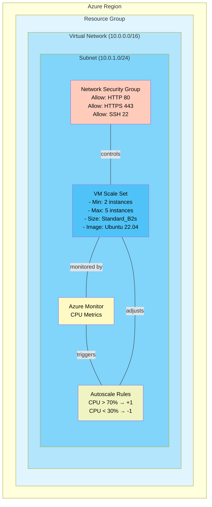
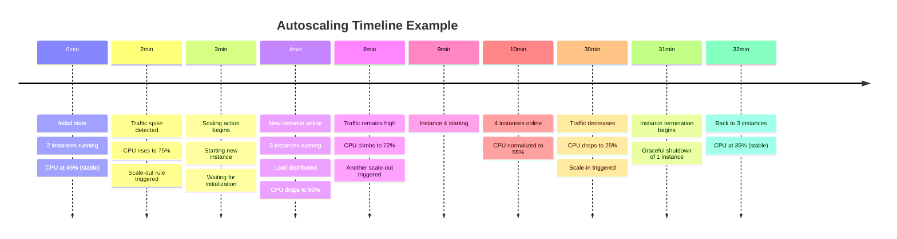

# Web Server Cluster with Auto-Scaling on Azure

This example demonstrates how to deploy a scalable web server cluster using Azure Virtual Machine Scale Sets (VMSS) with automatic scaling based on CPU usage.

## Architecture Overview



## Key Components

| Component | Purpose | Configuration |
|-----------|---------|----------------|
| **Virtual Network** | Network isolation | `10.0.0.0/16` address space |
| **Subnet** | Resource grouping | `10.0.1.0/24` (256 addresses) |
| **NSG** | Security firewall | Allow HTTP(80), HTTPS(443), SSH(22) |
| **VMSS** | Compute resource | 2-5 instances, Standard_B2s, Ubuntu 22.04 |
| **Health Monitoring** | Resource tracking | CPU usage monitoring |
| **Autoscaling** | Elasticity | CPU-based scaling rules |

## How Autoscaling Works

```mermaid
stateDiagram-v2
    [*] --> Running2

    Running2: Running 2 Instances
    Running3: Running 3 Instances
    Running4: Running 4 Instances
    Running5: Running 5 Instances

    Running2 -->|CPU > 70%| Running3: Add Instance
    Running3 -->|CPU > 70%| Running4: Add Instance
    Running4 -->|CPU > 70%| Running5: Add Instance

    Running3 -->|CPU < 30%| Running2: Remove Instance
    Running4 -->|CPU < 30%| Running3: Remove Instance
    Running5 -->|CPU < 30%| Running4: Remove Instance

    Running2 -->|CPU 30-70%| Running2: Stable
    Running3 -->|CPU 30-70%| Running3: Stable
    Running4 -->|CPU 30-70%| Running4: Stable
    Running5 -->|CPU 30-70%| Running5: Stable
```

## Autoscaling Timeline



## File Structure

```
web-server-cluster-azure/
├── main.tf                 # Main infrastructure definition
├── variables.tf            # Variable declarations
├── outputs.tf              # Output definitions
├── terraform.tfvars.example # Example variables file
└── README.md              # This file
```

## Configuration Details

### Network Configuration

```hcl
# Virtual Network
vnet_address_space = "10.0.0.0/16"  # 65,536 addresses

# Subnet
subnet_address_prefixes = "10.0.1.0/24"  # 256 addresses
```

### Compute Configuration

```hcl
# VM Scale Set
vm_size = "Standard_B2s"     # 2 vCPUs, 4GB RAM
instance_count = 2            # Initial instances
max_instance_count = 5        # Maximum instances
```

### Autoscaling Configuration

```hcl
# Scale Out Threshold
operator = "GreaterThan"
threshold = 70               # CPU %

# Scale In Threshold
operator = "LessThan"
threshold = 30               # CPU %

# Adjustment
value = "1"                  # Add/remove 1 instance
cooldown = "PT1M"            # Wait 1 minute between actions
```

## Deployment Instructions

### 1. Prerequisites

```bash
# Verify Terraform installation
terraform --version

# Login to Azure
az login

# List available subscriptions
az account list -o table
```

### 2. Configure Variables

```bash
# Copy example variables file
cp terraform.tfvars.example terraform.tfvars

# Edit with your values
nano terraform.tfvars
```

Required variables:
- `azure_client_id` - Azure Service Principal Client ID
- `azure_client_secret` - Azure Service Principal Client Secret
- `azure_subscription_id` - Your subscription ID
- `azure_tenant_id` - Your tenant ID

### 3. Initialize Terraform

```bash
terraform init
```

This will:
- Download required providers
- Initialize the working directory
- Create `.terraform/` directory

### 4. Plan Deployment

```bash
terraform plan
```

Review the execution plan and verify:
- Resources to be created
- Configuration details
- No errors reported

### 5. Deploy Infrastructure

```bash
terraform apply
```

After ~5-10 minutes, all resources will be deployed:
- Resource Group
- Virtual Network & Subnet
- Network Security Group
- VMSS with 2 instances
- Autoscaling configuration

### 6. View Outputs

```bash
# Show all outputs
terraform output

# Show specific output
terraform output vmss_name
```

Important outputs:
- `vmss_id` - Scale set resource ID
- `vmss_name` - Scale set name
- `vnet_id` - Virtual network ID
- `ssh_private_key` - Private key for VM access

## Testing Autoscaling

### Method 1: Stress Test with SSH

```bash
# Connect to an instance
PRIVATE_IP=$(terraform output -json | jq -r '.backend_private_ips[0]')
ssh -i private_key azureuser@$PRIVATE_IP

# Run CPU stress test
sudo apt-get install -y stress
stress --cpu 2 --timeout 300s

# Monitor Azure Portal for instance scaling
```

### Method 2: Monitor via Azure Portal

1. Open Azure Portal
2. Go to Resource Group
3. Select VMSS
4. Navigate to "Instances" tab
5. Monitor instance creation in real-time

### Method 3: Monitor via Azure CLI

```bash
# Check current instance count
az vmss list-instances \
  --resource-group <rg-name> \
  --vmss-name <vmss-name> \
  --output table

# Monitor scaling operations
az monitor metrics list \
  --resource /subscriptions/<sub-id>/resourceGroups/<rg>/providers/Microsoft.Compute/virtualMachineScaleSets/<vmss>
```

## Connecting to Instances

### Save Private Key

```bash
# Extract and save the SSH private key
terraform output -raw ssh_private_key > private_key.pem
chmod 600 private_key.pem
```

### Connect via SSH

```bash
# Get instance private IP
INSTANCE_IP=$(terraform output -json vmss_id | ...)

# Connect to instance
ssh -i private_key.pem azureuser@<instance_ip>

# Example commands on the instance
curl http://localhost  # Test web server
sudo systemctl status apache2  # Check Apache status
```

## Cost Considerations

### Estimated Monthly Costs (USD)

| Resource | Quantity | Cost/Month |
|----------|----------|-----------|
| Compute (VMs) | 2-5 @ $30/month | $60-150 |
| Storage (OS Disks) | 5 @ $5/month | $25 |
| Network | Included | $0 |
| **Total** | | **$85-175** |

### Cost Optimization

1. **Reduce max_instance_count** if autoscaling is too aggressive
2. **Use lower VM size** (Standard_B1s) for lighter workloads
3. **Increase scale-in threshold** to keep instances longer
4. **Schedule scaling** (scale down nights/weekends)

## Cleanup

To avoid charges, destroy all resources:

```bash
terraform destroy

# Confirm destruction
# Type 'yes' when prompted

# Verify resources are deleted
az group list -o table
```

## Important Notes

1. **SSH Key Management**
   - Save the private key securely
   - Never commit to version control
   - Use separate keys for different environments

2. **Autoscaling Behavior**
   - Minimum 1-minute cooldown between scaling actions
   - Health checks run every 15 seconds
   - New instances take ~2-3 minutes to initialize

3. **Monitoring**
   - CPU metrics are sampled every 1 minute
   - Scaling decisions based on 5-minute averages
   - Check Azure Monitor for detailed metrics

4. **Security**
   - NSG rules allow all IPs to SSH (restrict in production)
   - Backend servers have no public IPs
   - Use Azure Bastion for secure access

## Troubleshooting

### VMs Not Scaling

Check:
1. Autoscale setting is enabled
2. Metrics are being collected
3. Scale rules are properly configured
4. CPU actually exceeds thresholds

```bash
# Verify autoscale setting
terraform output autoscale_setting_id
```

### High Costs

Reduce:
1. `max_instance_count` - Lower scaling limit
2. `instance_count` - Start with fewer instances
3. `vm_size` - Use smaller SKU
4. Scale-out threshold - Increase from 70% to 80%

### Instances Not Healthy

Check:
1. NSG allows HTTP/HTTPS
2. Apache installation completed
3. Network connectivity between load balancer and instances

## Additional Resources

- [Azure VMSS Documentation](https://docs.microsoft.com/azure/virtual-machine-scale-sets/)
- [Autoscaling Best Practices](https://docs.microsoft.com/azure/virtual-machine-scale-sets/virtual-machine-scale-sets-autoscale-overview)
- [Terraform Azure Provider](https://registry.terraform.io/providers/hashicorp/azurerm/latest/docs)

---

Created with Terraform • Deployed on Azure
