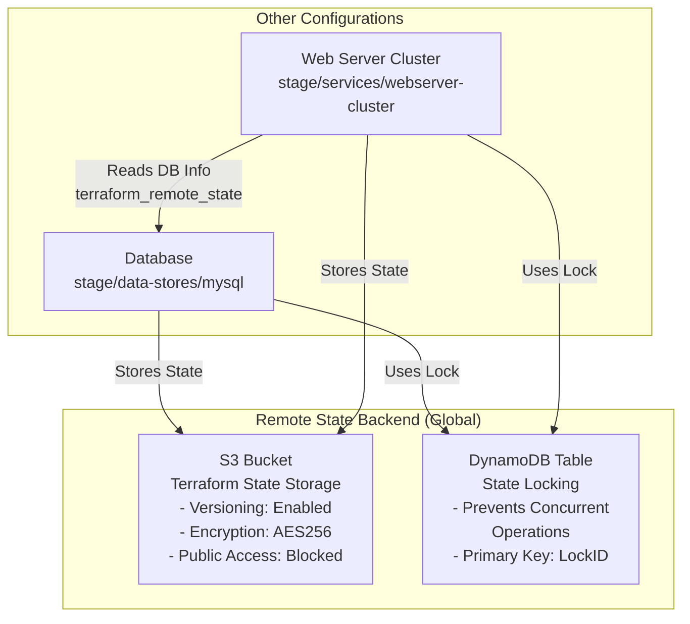

# S3 Remote State Backend

This folder contains Terraform configuration that creates the foundational infrastructure for managing Terraform state securely and collaboratively:

- **[S3](https://aws.amazon.com/s3/) Bucket**: Stores Terraform state files with versioning and encryption enabled
- **[DynamoDB](https://aws.amazon.com/dynamodb/) Table**: Implements state locking to prevent concurrent modifications and corruption

This remote backend is used by other Terraform configurations (database, web server cluster) to centralize state management, enabling team collaboration and disaster recovery.

For more info, please see Chapter 3, "How to Manage Terraform State", of
*[Terraform: Up and Running](http://www.terraformupandrunning.com)*.

## Architecture Diagram



### Components Overview

1. **S3 Bucket Configuration**
   - Stores all Terraform state files
   - Versioning: Maintains complete history of changes
   - Encryption: Protects sensitive data at rest (AES256)
   - Public Access Block: Prevents unauthorized access

2. **DynamoDB Lock Table**
   - Enforces exclusive access to state during operations
   - Prevents race conditions and state corruption
   - Uses LockID as primary key

## Why Remote State Backend is Critical

### The Problem with Local State

When you run `terraform apply` without a remote backend, Terraform stores the state file locally (`terraform.tfstate`). This creates several issues:

1. **Team Collaboration Issues**
   - Multiple team members running Terraform can overwrite each other's changes
   - No way to know who made changes and when
   - State files can become inconsistent

2. **Race Conditions**
   - Two people running `terraform apply` simultaneously can both modify infrastructure
   - One person's changes might be lost
   - Infrastructure state can become corrupted

3. **Security Risks**
   - State files contain sensitive data (database passwords, private keys, API tokens)
   - Storing locally makes them vulnerable to unauthorized access
   - No audit trail of who accessed the state

4. **Disaster Recovery**
   - Local state files can be lost due to hardware failure
   - No backup or versioning
   - Recovering from accidental destruction is impossible

### The Solution: Remote State with Locking

This configuration solves all these problems by:

1. **Centralized Storage (S3)**
   - Single source of truth for state
   - Accessible to entire team
   - Integrated with AWS security controls

2. **State Locking (DynamoDB)**
   - Prevents concurrent modifications
   - Only one Terraform operation at a time
   - Automatic lock expiration prevents deadlocks

3. **Versioning & Encryption**
   - Complete history of all changes
   - Recovery from accidental modifications
   - Sensitive data encrypted at rest

4. **Audit Trail**
   - S3 access logs show who accessed state
   - Terraform logs show what operations were performed
   - Full compliance with security policies

## State File Structure

When deployed, the S3 bucket will contain state files organized like this:

```bash
terraform-state-bucket/
├── global/s3/terraform.tfstate              # This S3 config state
├── stage/data-stores/mysql/terraform.tfstate  # Database state
├── stage/services/webserver-cluster/terraform.tfstate  # Web cluster state
└── ... (other configurations)
```

Each path contains:

- **terraform.tfstate**: The current state file
- **terraform.tfstate.backup**: Previous state (auto-created)
- **terraform.tfstate.HASH**: Version history (if versioning enabled)

## How State Locking Works

```text
Terraform Operation Timeline:

1. User runs: terraform apply
   ↓
2. Terraform tries to acquire lock in DynamoDB
   ↓
3. Lock acquired? → Continue
   └─ Lock exists? → Wait (with timeout)
   └─ Timeout? → Fail with error
   ↓
4. Read current state from S3
   ↓
5. Plan changes
   ↓
6. Apply changes
   ↓
7. Write new state to S3
   ↓
8. Release lock from DynamoDB
```

### Lock Structure in DynamoDB

Each lock entry in DynamoDB contains:

- **LockID**: Unique identifier (usually a hash of the state path)
- **Digest**: Checksum of the state file
- **Operation**: Type of operation (plan, apply, etc.)
- **Info**: Metadata (username, timestamp, etc.)
- **Path**: Path to the state file in S3

## Security Best Practices

### 1. S3 Bucket Security

- ✅ **Enabled**: Versioning (recover from accidents)
- ✅ **Enabled**: Server-side encryption (AES256)
- ✅ **Enabled**: Block all public access (critical!)
- ⚠️ **Consider**: Enable S3 access logging
- ⚠️ **Consider**: Enable bucket replication for disaster recovery
- ⚠️ **Consider**: Enable MFA delete protection

### 2. DynamoDB Security

- ✅ **Enabled**: On-demand billing (no over-provisioning)
- ✅ **Enabled**: Point-in-time recovery (PITR)
- ⚠️ **Consider**: Enable encryption with KMS (instead of AWS managed keys)
- ⚠️ **Consider**: Enable TTL for automatic lock cleanup

### 3. IAM Access Control

Only grant `terraform` user access to:

- `s3:GetObject` - Read state
- `s3:PutObject` - Write state
- `s3:DeleteObject` - Delete old versions (for cleanup)
- `dynamodb:PutItem` - Create locks
- `dynamodb:GetItem` - Check locks
- `dynamodb:DeleteItem` - Release locks

### 4. Sensitive Data in State

State files will contain:

- Database passwords
- API keys and tokens
- Private SSH keys
- Security group IDs
- Other infrastructure details

**Never commit state files to version control!**

## Common Issues and Troubleshooting

### Issue: "Error acquiring the state lock"

**Cause**: Another Terraform operation is in progress or locked.

**Solution**:

1. Wait for the other operation to complete
2. Check if there's a stuck lock: `aws dynamodb scan --table-name <lock-table>`
3. To force unlock (use carefully): `terraform force-unlock <LOCK_ID>`

### Issue: "State too large" or "S3 RequestLimitExceeded"

**Cause**: Very large state files or too many Terraform operations.

**Solution**:

1. Split infrastructure into smaller modules
2. Use separate state files for different environments
3. Increase DynamoDB provisioning if needed

### Issue: "Permission denied" accessing state

**Cause**: IAM user doesn't have required permissions.

**Solution**:

1. Verify IAM policy allows S3 and DynamoDB access
2. Check AWS credentials are correct: `aws sts get-caller-identity`
3. Ensure bucket policy allows the IAM user

## State File Inspection and Recovery

### View Current State

```bash
terraform state list          # List all resources in state
terraform state show          # Show specific resource
terraform state pull          # Download current state locally
```

### Backup and Recovery

```bash
# Download state from S3 manually
aws s3 cp s3://bucket-name/path/terraform.tfstate ./terraform.tfstate.backup

# List state versions (if versioning is enabled)
aws s3api list-object-versions --bucket bucket-name --prefix "path/"

# Restore from previous version
aws s3api get-object \
  --bucket bucket-name \
  --key path/terraform.tfstate \
  --version-id <VERSION_ID> \
  ./restored-terraform.tfstate
```

### Emergency: Local State Recovery

If S3 is inaccessible but you have a backup:

```bash
# Copy backup to local state
cp terraform.tfstate.backup terraform.tfstate

# Run plan to verify
terraform plan

# If needed, push to S3 from local
terraform init
```

## Performance Optimization

### For Large States (>50MB)

1. **Split into modules**: Each module = separate state file
2. **Use data sources**: Reference other states instead of importing
3. **Enable S3 Transfer Acceleration**: Faster uploads for large files
4. **Increase DynamoDB capacity**: For high-frequency operations

### State Size Best Practices

- ✅ Use `terraform_remote_state` to reference other states
- ✅ Move sensitive data to separate encrypted files
- ✅ Remove unused resources regularly
- ❌ Don't store large files in state (use S3/secrets manager)
- ❌ Don't import entire infrastructure at once

## Pre-requisites

- You must have [Terraform](https://www.terraform.io/) installed on your computer.
- You must have an [Amazon Web Services (AWS) account](http://aws.amazon.com/).
- You must have AWS CLI configured with appropriate credentials

Please note that this code was written for Terraform 1.x.

## Quick start

**Please note that this example will deploy real resources into your AWS account. We have made every effort to ensure
all the resources qualify for the [AWS Free Tier](https://aws.amazon.com/free/), but we are not responsible for any
charges you may incur.**

Configure your [AWS access
keys](http://docs.aws.amazon.com/general/latest/gr/aws-sec-cred-types.html#access-keys-and-secret-access-keys) as
environment variables:

```bash
export AWS_ACCESS_KEY_ID=(your access key id)
export AWS_SECRET_ACCESS_KEY=(your secret access key)
```

Specify a name for the S3 bucket and DynamoDB table in `variables.tf` using the `default` parameter:

```hcl
variable "bucket_name" {
  description = "The name of the S3 bucket. Must be globally unique."
  type        = string
  default     = "<YOUR BUCKET NAME>"
}

variable "table_name" {
  description = "The name of the DynamoDB table. Must be unique in this AWS account."
  type        = string
  default     = "<YOUR TABLE NAME>"
}
```

Deploy the code:

```bash
terraform init
terraform apply
```

### Important: Destruction Protection

The S3 bucket is protected with `lifecycle { prevent_destroy = true }` to prevent accidental deletion of critical state data. This means **`terraform destroy` will fail with an error**.

If you want to destroy this infrastructure:

1. **For testing only**: Edit `main.tf` and uncomment `force_destroy = true`, then run:

```bash
terraform destroy
```

1. **For production**: First remove the protection, then destroy:

```bash
# Edit main.tf and comment out the lifecycle block
# Then run:
terraform init -reconfigure
terraform destroy
```

**⚠️ WARNING:** Once you destroy the S3 bucket, you lose all state history and cannot manage your infrastructure with Terraform!

Clean up when you're completely done:

```bash
terraform destroy
```

## Configuring the S3 Backend

To configure Terraform to store state in your S3 bucket (with encryption and locking), you need to add a backend configuration to your Terraform code. This configuration resides within a `terraform` block and tells Terraform where to store the remote state.

### Backend Configuration Syntax

```hcl
terraform {
  backend "<BACKEND_TYPE>" {
    [CONFIGURATION_OPTIONS...]
  }
}
```

### S3 Backend Configuration

Here's the complete S3 backend configuration:

```hcl
terraform {
  backend "s3" {
    # Replace this with your bucket name!
    bucket = "terraform-up-and-running-state"

    # The path where the state file will be stored within the bucket
    key = "global/s3/terraform.tfstate"

    # AWS region where the S3 bucket is located
    region = "us-east-2"

    # Replace this with your DynamoDB table name
    dynamodb_table = "terraform-up-and-running-locks"

    # Enable encryption of the state file (second layer of protection)
    encrypt = true
  }
}
```

### Configuration Parameters Explained

- **bucket**: The name of the S3 bucket to use. Must be globally unique across all AWS accounts.
- **key**: The path within the S3 bucket where the state file will be stored. This enables multiple configurations to use the same bucket without conflicts.
- **region**: The AWS region where the S3 bucket is located. Must match the region where you created the bucket.
- **dynamodb_table**: The DynamoDB table name for state locking. Prevents concurrent modifications.
- **encrypt**: Setting to `true` ensures state files are encrypted at rest using AES256. This adds a second layer of encryption on top of S3's default encryption.

### Using the Backend Configuration

Once you've added the backend configuration to your Terraform code, use the `terraform init` command to configure it:

```bash
terraform init
```

Terraform will detect that you already have a local state file and ask if you want to copy it to the S3 backend:

```text
Initializing the backend...
Acquiring state lock. This may take a few moments...
Do you want to copy existing state to the new backend?
```

Type `yes` to migrate your state:

```text
Successfully configured the backend "s3"! Terraform will
automatically use this backend unless the backend configuration changes.
```

### Verifying the Backend Configuration

After running `terraform init`, verify that:

1. **State file is in S3**: Check the S3 Management Console and look for your state file at the `key` path
2. **Versioning is working**: Run `terraform apply` and check S3 for multiple versions of the state file
3. **Locking is active**: Observe the "Acquiring state lock" messages during Terraform operations

### State File Versions in S3

Once configured, every `terraform apply` creates a new version of your state file. You can see this in the S3 console:

```text
terraform-up-and-running-state/
└── global/s3/
    ├── terraform.tfstate (current version)
    ├── terraform.tfstate (previous version 1)
    ├── terraform.tfstate (previous version 2)
    └── ... (more historical versions)
```

This versioning allows you to:

- Inspect what changed in infrastructure at each deployment
- Rollback to a previous version if something goes wrong
- Track the complete history of your infrastructure

### Backend Operations Flow

Here's what happens when you run a Terraform command with the S3 backend configured:

```text
1. terraform apply
     ↓
2. Acquire lock from DynamoDB (wait if locked)
     ↓
3. Download current state from S3
     ↓
4. Compare desired state with actual state (plan)
     ↓
5. Create/modify/delete AWS resources
     ↓
6. Upload new state to S3
     ↓
7. Release lock from DynamoDB
```

### Example: Outputs for Backend Verification

Add these output variables to display backend information:

```hcl
output "s3_bucket_arn" {
  value       = aws_s3_bucket.terraform_state.arn
  description = "The ARN of the S3 bucket storing Terraform state"
}

output "s3_bucket_name" {
  value       = aws_s3_bucket.terraform_state.id
  description = "The name of the S3 bucket storing Terraform state"
}

output "dynamodb_table_name" {
  value       = aws_dynamodb_table.terraform_locks.name
  description = "The name of the DynamoDB table for state locking"
}
```

Run `terraform apply` to see the backend resources:

```bash
terraform apply
```

Output:

```text
Outputs:

dynamodb_table_name = "terraform-up-and-running-locks"
s3_bucket_arn = "arn:aws:s3:::terraform-up-and-running-state"
s3_bucket_name = "terraform-up-and-running-state"
```

Notice the "Acquiring state lock" and "Releasing state lock" messages - this confirms locking is working!

### Common Backend Configuration Scenarios

#### Multiple Environments (Dev, Staging, Prod)

Use different `key` paths to store state separately for each environment:

```hcl
terraform {
  backend "s3" {
    bucket         = "terraform-state"
    key            = "dev/terraform.tfstate"      # Dev environment
    region         = "us-east-1"
    dynamodb_table = "terraform-locks"
    encrypt        = true
  }
}
```

Change the `key` path when deploying to different environments.

#### Team Collaboration

With S3 backend configured:

- Multiple team members can run Terraform safely (DynamoDB prevents conflicts)
- State is automatically synced (pull from S3 before operations, push after)
- Everyone sees the same infrastructure state

#### CI/CD Integration

For automated deployments:

- Use AWS IAM roles instead of hardcoded credentials
- Terraform automatically uses credentials from the environment
- All deployments update the same state in S3

## Using This S3 Backend in Other Modules

Once you've created the S3 bucket and DynamoDB table in this `global/s3` module, other Terraform configurations (like database and web server cluster) need to be configured to use this backend.

### Backend Configuration for Other Modules

In `stage/data-stores/mysql/main.tf`, add:

```hcl
terraform {
  backend "s3" {
    bucket         = "terraform-up-and-running-state"
    key            = "stage/data-stores/mysql/terraform.tfstate"
    region         = "us-east-2"
    dynamodb_table = "terraform-up-and-running-locks"
    encrypt        = true
  }
}
```

In `stage/services/webserver-cluster/main.tf`, add:

```hcl
terraform {
  backend "s3" {
    bucket         = "terraform-up-and-running-state"
    key            = "stage/services/webserver-cluster/terraform.tfstate"
    region         = "us-east-2"
    dynamodb_table = "terraform-up-and-running-locks"
    encrypt        = true
  }
}
```

### Key Differences from Local Backend

The backend configuration is added to the `terraform` block alongside other configuration:

```hcl
terraform {
  required_version = ">= 1.0.0, < 2.0.0"

  required_providers {
    aws = {
      source  = "hashicorp/aws"
      version = "~> 4.0"
    }
  }

  # Add this backend configuration
  backend "s3" {
    bucket         = "terraform-up-and-running-state"
    key            = "stage/data-stores/mysql/terraform.tfstate"
    region         = "us-east-2"
    dynamodb_table = "terraform-up-and-running-locks"
    encrypt        = true
  }
}
```

### Important: Backend Configuration Rules

When configuring the S3 backend, remember these rules:

- **No Terraform interpolation in backend blocks**: You cannot use variables or functions in the backend configuration
- **Use different `key` paths**: Each module must have a unique `key` to avoid state file conflicts
- **Keep bucket and table names consistent**: All modules should reference the same S3 bucket and DynamoDB table
- **Region must match**: The region in backend config must match where you created the S3 bucket

### Testing the Backend Configuration

After adding the backend config to a module, initialize it:

```bash
cd stage/data-stores/mysql
terraform init
```

When prompted, confirm that you want to copy the local state to the S3 backend:

```
Initializing the backend...
Do you want to copy existing state to the new backend?
```

Type `yes` and verify that:

1. State file appears in S3 at `stage/data-stores/mysql/terraform.tfstate`
2. Lock entry appears in DynamoDB when running `terraform plan`
3. Multiple team members can safely run Terraform operations

### Centralized State Management

With all modules using the same S3 backend, you get:

- **Single source of truth**: All infrastructure state in one place
- **Cross-module references**: Use `terraform_remote_state` to read outputs from other modules
- **Unified locking**: DynamoDB prevents any concurrent modifications
- **Team collaboration**: Everyone accesses the same infrastructure state
- **Audit trail**: S3 versioning and access logs track all changes

### State File Organization

After configuring all modules with the S3 backend, your bucket will look like:

```text
terraform-up-and-running-state/
├── global/s3/terraform.tfstate                    # This module's state
├── stage/data-stores/mysql/terraform.tfstate      # Database state
├── stage/services/webserver-cluster/terraform.tfstate  # Web cluster state
└── (versioning keeps history of all changes)
```

Each path is independent with its own state file, lock entry, and version history.

### Troubleshooting Backend Issues

#### Problem: "Backend initialization failed"

Solution: Verify the bucket and table names match exactly:

```bash
# Check S3 bucket exists
aws s3 ls | grep terraform-up-and-running-state

# Check DynamoDB table exists
aws dynamodb list-tables --region us-east-2
```

#### Problem: "AccessDenied" when initializing backend

Solution: Ensure your AWS credentials have permissions for S3 and DynamoDB:

```bash
# Verify credentials are loaded
aws sts get-caller-identity

# Check S3 bucket access
aws s3 ls s3://terraform-up-and-running-state/

# Check DynamoDB access
aws dynamodb scan --table-name terraform-up-and-running-locks
```

#### Problem: "Error acquiring state lock"

Solution: Another Terraform operation might be running. Wait a moment and try again, or force unlock:

```bash
# List locks
aws dynamodb scan --table-name terraform-up-and-running-locks

# Force unlock (use carefully!)
terraform force-unlock <LOCK_ID>
```

## The Problem: Copy-Paste Configuration

When you configure the S3 backend for multiple modules, you face a significant problem: **copy-paste duplication**. Each module needs the same backend configuration (bucket, region, DynamoDB table), but a unique `key` value.

### Why This Is Problematic

This approach creates several issues:

- **Duplication**: Repeating bucket name, region, and table name in every module
- **Error-prone**: Easy to make typos or miss updating bucket names if they change
- **Maintenance nightmare**: If you need to change the bucket name, you must update every module
- **Manual effort**: Requires careful manual work to set unique keys for each module

### The Wrong Way: Using Variables

You might think to solve this with variables:

```hcl
# This will NOT work! Variables aren't allowed in backend blocks
terraform {
  backend "s3" {
    bucket         = var.bucket_name
    region         = var.aws_region
    dynamodb_table = var.table_name
    key            = "example/terraform.tfstate"
    encrypt        = true
  }
}
```

**This fails because Terraform backend blocks do not support variable interpolation.** Backend configuration must use hardcoded values only.

## Solution 1: Partial Backend Configurations

To reduce copy-paste, use partial configurations with the `-backend-config` flag.

### Step 1: Create a backend.hcl File

Create a shared `backend.hcl` file in your root directory:

```hcl
# backend.hcl
# Shared backend configuration for all modules
bucket         = "terraform-up-and-running-state"
region         = "us-east-2"
dynamodb_table = "terraform-up-and-running-locks"
encrypt        = true
```

### Step 2: Partial Configuration in Each Module

In each module (database, web server, etc.), add only the `key`:

```hcl
# stage/data-stores/mysql/main.tf
terraform {
  backend "s3" {
    # The other settings (bucket, region, dynamodb_table, encrypt)
    # are passed in from backend.hcl via -backend-config argument
    key = "stage/data-stores/mysql/terraform.tfstate"
  }
}
```

```hcl
# stage/services/webserver-cluster/main.tf
terraform {
  backend "s3" {
    # The other settings (bucket, region, dynamodb_table, encrypt)
    # are passed in from backend.hcl via -backend-config argument
    key = "stage/services/webserver-cluster/terraform.tfstate"
  }
}
```

### Step 3: Initialize with -backend-config

When initializing a module, merge the partial configurations:

```bash
cd stage/data-stores/mysql
terraform init -backend-config=../../backend.hcl
```

Terraform merges `backend.hcl` with the partial configuration in `main.tf`, creating the complete backend configuration.

### Benefits

- **Reduced duplication**: Common settings in one file
- **Easy to change**: Update bucket/region in one place
- **Module-specific**: Each module still has unique `key`
- **Simple to remember**: Always pass the same `-backend-config` argument

### Drawbacks

- **Manual key management**: Still need to set unique keys in each module
- **Extra command**: Must remember the `-backend-config` flag for every `terraform init`
- **File organization**: Requires careful management of backend.hcl location

## Solution 2: Using Terragrunt (Advanced)

Terragrunt is an open-source tool that fills gaps in Terraform and automates backend configuration management.

### What is Terragrunt?

Terragrunt is a thin wrapper around Terraform that:

- **Keeps backend config DRY**: Define settings once, use everywhere
- **Automatically sets the key**: Based on folder structure
- **Manages multiple environments**: Separate prod/staging/dev configurations
- **Enforces best practices**: Validates configurations, prevents errors

### Terragrunt Configuration Example

Instead of managing multiple `terraform` blocks, create a single `terragrunt.hcl` at the root:

```hcl
# terragrunt.hcl (root)
remote_state {
  backend = "s3"
  config = {
    bucket         = "terraform-up-and-running-state"
    region         = "us-east-2"
    dynamodb_table = "terraform-up-and-running-locks"
    encrypt        = true
    key            = "${path_relative_to_include()}/terraform.tfstate"
  }
}
```

### How Terragrunt Works

Folder structure:

```text
infrastructure/
├── terragrunt.hcl                    # Root configuration
├── stage/
│   ├── data-stores/
│   │   └── mysql/
│   │       └── main.tf              # No backend configuration needed!
│   └── services/
│       └── webserver-cluster/
│           └── main.tf              # No backend configuration needed!
└── prod/
    ├── data-stores/
    │   └── mysql/
    │       └── main.tf
    └── services/
        └── webserver-cluster/
            └── main.tf
```

Terragrunt automatically generates the correct `key` based on the folder path. For example:

- `stage/data-stores/mysql` → `stage/data-stores/mysql/terraform.tfstate`
- `prod/services/webserver-cluster` → `prod/services/webserver-cluster/terraform.tfstate`

### Using Terragrunt

Instead of `terraform init`, use `terragrunt`:

```bash
cd stage/data-stores/mysql
terragrunt init
terragrunt plan
terragrunt apply
```

### Benefits of Terragrunt

- **Zero copy-paste**: One configuration for all modules
- **Automatic key generation**: Based on folder structure
- **DRY principle**: Don't Repeat Yourself
- **Environment isolation**: Separate configs for prod/staging/dev
- **Consistency**: Enforces same backend settings everywhere
- **Easy updates**: Change bucket once, applies everywhere

### Drawbacks of Terragrunt

- **Extra tool**: Requires learning Terragrunt in addition to Terraform
- **Lock-in**: Adds dependency on external tool
- **Debugging**: Extra layer can make troubleshooting harder
- **Compatibility**: May lag behind Terraform releases

### Recommended Approach

For this project:

1. **Start simple**: Use hardcoded backend configurations in each module while learning
2. **Grow to partial configs**: Once you have many modules, migrate to `backend.hcl` approach
3. **Scale with Terragrunt**: When managing many environments, consider Terragrunt

### Choosing Your Approach

| Approach | Best For | Complexity | Learning Curve |
|----------|----------|-----------|-----------------|
| **Hardcoded** | Small projects, learning | Low | Minimal |
| **Partial configs** | Medium projects | Medium | Moderate |
| **Terragrunt** | Large projects, many environments | High | Steep |

For now, we recommend using **hardcoded configurations** with a **clear naming convention** for keys (e.g., `<environment>/<module-type>/<module-name>/terraform.tfstate`). Once your infrastructure grows, migrate to one of the other approaches.
