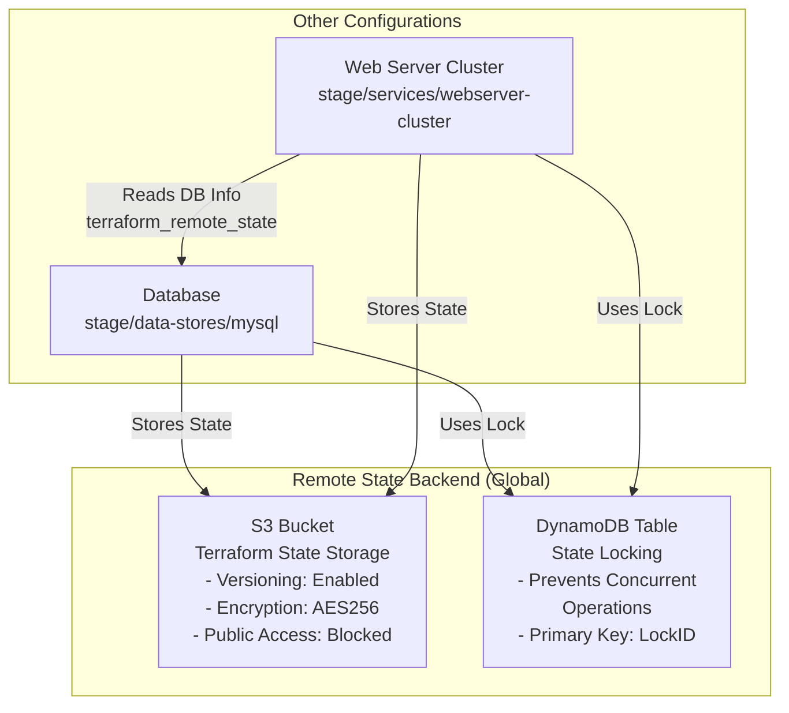

# S3 Remote State Backend

This folder contains Terraform configuration that creates the foundational infrastructure for managing Terraform state securely and collaboratively:

- **[S3](https://aws.amazon.com/s3/) Bucket**: Stores Terraform state files with versioning and encryption enabled
- **[DynamoDB](https://aws.amazon.com/dynamodb/) Table**: Implements state locking to prevent concurrent modifications and corruption

This remote backend is used by other Terraform configurations (database, web server cluster) to centralize state management, enabling team collaboration and disaster recovery.

For more info, please see Chapter 3, "How to Manage Terraform State", of
*[Terraform: Up and Running](http://www.terraformupandrunning.com)*.

## Architecture Diagram



### Components Overview

1. **S3 Bucket Configuration**
   - Stores all Terraform state files
   - Versioning: Maintains complete history of changes
   - Encryption: Protects sensitive data at rest (AES256)
   - Public Access Block: Prevents unauthorized access

2. **DynamoDB Lock Table**
   - Enforces exclusive access to state during operations
   - Prevents race conditions and state corruption
   - Uses LockID as primary key

## Why Remote State Backend is Critical

### The Problem with Local State

When you run `terraform apply` without a remote backend, Terraform stores the state file locally (`terraform.tfstate`). This creates several issues:

1. **Team Collaboration Issues**
   - Multiple team members running Terraform can overwrite each other's changes
   - No way to know who made changes and when
   - State files can become inconsistent

2. **Race Conditions**
   - Two people running `terraform apply` simultaneously can both modify infrastructure
   - One person's changes might be lost
   - Infrastructure state can become corrupted

3. **Security Risks**
   - State files contain sensitive data (database passwords, private keys, API tokens)
   - Storing locally makes them vulnerable to unauthorized access
   - No audit trail of who accessed the state

4. **Disaster Recovery**
   - Local state files can be lost due to hardware failure
   - No backup or versioning
   - Recovering from accidental destruction is impossible

### The Solution: Remote State with Locking

This configuration solves all these problems by:

1. **Centralized Storage (S3)**
   - Single source of truth for state
   - Accessible to entire team
   - Integrated with AWS security controls

2. **State Locking (DynamoDB)**
   - Prevents concurrent modifications
   - Only one Terraform operation at a time
   - Automatic lock expiration prevents deadlocks

3. **Versioning & Encryption**
   - Complete history of all changes
   - Recovery from accidental modifications
   - Sensitive data encrypted at rest

4. **Audit Trail**
   - S3 access logs show who accessed state
   - Terraform logs show what operations were performed
   - Full compliance with security policies

## State File Structure

When deployed, the S3 bucket will contain state files organized like this:

```bash
terraform-state-bucket/
├── global/s3/terraform.tfstate              # This S3 config state
├── stage/data-stores/mysql/terraform.tfstate  # Database state
├── stage/services/webserver-cluster/terraform.tfstate  # Web cluster state
└── ... (other configurations)
```

Each path contains:

- **terraform.tfstate**: The current state file
- **terraform.tfstate.backup**: Previous state (auto-created)
- **terraform.tfstate.HASH**: Version history (if versioning enabled)

## How State Locking Works

```text
Terraform Operation Timeline:

1. User runs: terraform apply
   ↓
2. Terraform tries to acquire lock in DynamoDB
   ↓
3. Lock acquired? → Continue
   └─ Lock exists? → Wait (with timeout)
   └─ Timeout? → Fail with error
   ↓
4. Read current state from S3
   ↓
5. Plan changes
   ↓
6. Apply changes
   ↓
7. Write new state to S3
   ↓
8. Release lock from DynamoDB
```

### Lock Structure in DynamoDB

Each lock entry in DynamoDB contains:

- **LockID**: Unique identifier (usually a hash of the state path)
- **Digest**: Checksum of the state file
- **Operation**: Type of operation (plan, apply, etc.)
- **Info**: Metadata (username, timestamp, etc.)
- **Path**: Path to the state file in S3

## Security Best Practices

### 1. S3 Bucket Security

- ✅ **Enabled**: Versioning (recover from accidents)
- ✅ **Enabled**: Server-side encryption (AES256)
- ✅ **Enabled**: Block all public access (critical!)
- ⚠️ **Consider**: Enable S3 access logging
- ⚠️ **Consider**: Enable bucket replication for disaster recovery
- ⚠️ **Consider**: Enable MFA delete protection

### 2. DynamoDB Security

- ✅ **Enabled**: On-demand billing (no over-provisioning)
- ✅ **Enabled**: Point-in-time recovery (PITR)
- ⚠️ **Consider**: Enable encryption with KMS (instead of AWS managed keys)
- ⚠️ **Consider**: Enable TTL for automatic lock cleanup

### 3. IAM Access Control

Only grant `terraform` user access to:

- `s3:GetObject` - Read state
- `s3:PutObject` - Write state
- `s3:DeleteObject` - Delete old versions (for cleanup)
- `dynamodb:PutItem` - Create locks
- `dynamodb:GetItem` - Check locks
- `dynamodb:DeleteItem` - Release locks

### 4. Sensitive Data in State

State files will contain:

- Database passwords
- API keys and tokens
- Private SSH keys
- Security group IDs
- Other infrastructure details

**Never commit state files to version control!**

## Common Issues and Troubleshooting

### Issue: "Error acquiring the state lock"

**Cause**: Another Terraform operation is in progress or locked.

**Solution**:

1. Wait for the other operation to complete
2. Check if there's a stuck lock: `aws dynamodb scan --table-name <lock-table>`
3. To force unlock (use carefully): `terraform force-unlock <LOCK_ID>`

### Issue: "State too large" or "S3 RequestLimitExceeded"

**Cause**: Very large state files or too many Terraform operations.

**Solution**:

1. Split infrastructure into smaller modules
2. Use separate state files for different environments
3. Increase DynamoDB provisioning if needed

### Issue: "Permission denied" accessing state

**Cause**: IAM user doesn't have required permissions.

**Solution**:

1. Verify IAM policy allows S3 and DynamoDB access
2. Check AWS credentials are correct: `aws sts get-caller-identity`
3. Ensure bucket policy allows the IAM user

## State File Inspection and Recovery

### View Current State

```bash
terraform state list          # List all resources in state
terraform state show          # Show specific resource
terraform state pull          # Download current state locally
```

### Backup and Recovery

```bash
# Download state from S3 manually
aws s3 cp s3://bucket-name/path/terraform.tfstate ./terraform.tfstate.backup

# List state versions (if versioning is enabled)
aws s3api list-object-versions --bucket bucket-name --prefix "path/"

# Restore from previous version
aws s3api get-object \
  --bucket bucket-name \
  --key path/terraform.tfstate \
  --version-id <VERSION_ID> \
  ./restored-terraform.tfstate
```

### Emergency: Local State Recovery

If S3 is inaccessible but you have a backup:

```bash
# Copy backup to local state
cp terraform.tfstate.backup terraform.tfstate

# Run plan to verify
terraform plan

# If needed, push to S3 from local
terraform init
```

## Performance Optimization

### For Large States (>50MB)

1. **Split into modules**: Each module = separate state file
2. **Use data sources**: Reference other states instead of importing
3. **Enable S3 Transfer Acceleration**: Faster uploads for large files
4. **Increase DynamoDB capacity**: For high-frequency operations

### State Size Best Practices

- ✅ Use `terraform_remote_state` to reference other states
- ✅ Move sensitive data to separate encrypted files
- ✅ Remove unused resources regularly
- ❌ Don't store large files in state (use S3/secrets manager)
- ❌ Don't import entire infrastructure at once

## Pre-requisites

- You must have [Terraform](https://www.terraform.io/) installed on your computer.
- You must have an [Amazon Web Services (AWS) account](http://aws.amazon.com/).
- You must have AWS CLI configured with appropriate credentials

Please note that this code was written for Terraform 1.x.

## Quick start

**Please note that this example will deploy real resources into your AWS account. We have made every effort to ensure 
all the resources qualify for the [AWS Free Tier](https://aws.amazon.com/free/), but we are not responsible for any
charges you may incur.** 

Configure your [AWS access 
keys](http://docs.aws.amazon.com/general/latest/gr/aws-sec-cred-types.html#access-keys-and-secret-access-keys) as 
environment variables:

```
export AWS_ACCESS_KEY_ID=(your access key id)
export AWS_SECRET_ACCESS_KEY=(your secret access key)
```

Specify a name for the S3 bucket and DynamoDB table in `variables.tf` using the `default` parameter:

```hcl
variable "bucket_name" {
  description = "The name of the S3 bucket. Must be globally unique."
  type        = string
  default     = "<YOUR BUCKET NAME>"
}

variable "table_name" {
  description = "The name of the DynamoDB table. Must be unique in this AWS account."
  type        = string
  default     = "<YOUR TABLE NAME>"
}
```

Deploy the code:

```
terraform init
terraform apply
```

Clean up when you're done:

```
terraform destroy
```