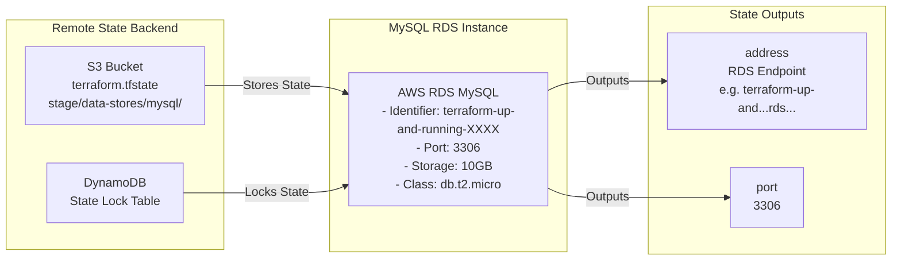

# MySQL RDS Database

This folder contains Terraform configuration that deploys a managed MySQL database using [AWS RDS](https://aws.amazon.com/rds/). The database is configured with:

- **Engine**: MySQL
- **Instance Class**: db.t2.micro (AWS free tier eligible)
- **Storage**: 10 GB
- **Remote State**: Stored in S3 bucket (configured in `backend "s3"` block in `main.tf`)
- **State Locking**: Enabled via DynamoDB table to prevent concurrent modifications

The database outputs (address and port) are automatically exported and can be read by other Terraform configurations using the `terraform_remote_state` data source.

For more info, please see Chapter 3, "How to Manage Terraform State", of
*[Terraform: Up and Running](http://www.terraformupandrunning.com)*.

## Architecture Diagram



### Data Flow

1. **Terraform Apply**: Creates RDS instance
2. **State Storage**: Instance details stored in S3 with versioning
3. **State Locking**: DynamoDB prevents concurrent access
4. **Output Generation**: Database address and port exported to state
5. **Remote Reference**: Web server cluster reads these outputs via `terraform_remote_state`

### Key Security Features

- **Encrypted State**: State file stored in S3 with AES256 encryption
- **Version Control**: S3 versioning enabled for state file history
- **Concurrent Access Prevention**: DynamoDB locks prevent race conditions
- **Secure Credentials**: Database username and password from environment variables

## Database Configuration Details

### RDS Instance Specifications

- **Engine**: MySQL 8.0 (AWS managed)
- **Instance Class**: db.t2.micro (1 vCPU, 1 GB RAM)
- **Storage**: 10 GB SSD, auto-scaling enabled
- **Backup**: Automated daily backups (7-day retention by default)
- **Maintenance**: AWS managed patches (configurable window)
- **High Availability**: Single-AZ (not multi-AZ in this example)

### Database Outputs

The state file exports these values for other configurations:

```hcl
output "address" {
  # RDS endpoint DNS name
  # Example: terraform-up-and-running-abc123.c9akciq32.us-east-2.rds.amazonaws.com
}

output "port" {
  # Database port (default: 3306 for MySQL)
}

output "database" {
  # Database name created: var.db_name
}
```

## Production Considerations

### What's Different in Production

This example is simplified for learning. Production databases need:

1. **High Availability**
   - Multi-AZ deployment (automatic failover)
   - Read replicas for read scaling
   - Cross-region replication for disaster recovery

2. **Security Hardening**
   - VPC security groups (restrict access)
   - Parameter encryption in transit (SSL/TLS)
   - Encrypted backups
   - AWS Secrets Manager for credentials

3. **Monitoring and Alerts**
   - CloudWatch metrics (CPU, memory, connections)
   - Database logs to CloudWatch Logs
   - SNS alerts for critical events
   - Enhanced Monitoring with RDS Performance Insights

4. **Backup Strategy**
   - Automated backups with longer retention
   - Manual snapshots before major changes
   - Cross-region snapshot copies
   - Regular restore testing

5. **Cost Optimization**
   - Reserved Instances for predictable workloads
   - Auto-scaling for variable workloads
   - Storage optimization (compression, partitioning)

## Accessing the Database

### From EC2 Instances (Web Server Cluster)

The database is automatically accessible from instances in the same VPC because:

1. Default security group allows traffic between resources
2. Database endpoint is in the state file
3. EC2 instances read endpoint from `terraform_remote_state.db`

### From Your Local Machine

To connect locally for testing/administration:

```bash
# Get database details from state
terraform output -module=stage.services.webserver-cluster

# Or from S3 state
aws s3 cp s3://bucket-name/stage/data-stores/mysql/terraform.tfstate .
cat terraform.tfstate | jq '.outputs'

# Connect with MySQL client
mysql -h <address> -u <username> -p<password> -D <database_name>
```

### Required Network Access

For local access, you need:

1. EC2 instance as bastion/jump host
2. VPN connection to VPC
3. Security group modification (not recommended for prod)

## Backup and Disaster Recovery

### Automated Backups

```bash
# List available backups
aws rds describe-db-snapshots \
  --db-instance-identifier terraform-up-and-running-*

# Create manual snapshot before changes
aws rds create-db-snapshot \
  --db-instance-identifier terraform-up-and-running-* \
  --db-snapshot-identifier backup-$(date +%Y%m%d)

# Restore from snapshot
aws rds restore-db-instance-from-db-snapshot \
  --db-instance-identifier new-instance-name \
  --db-snapshot-identifier backup-20240101
```

### Point-in-Time Recovery (PITR)

```bash
# Restore to specific point in time
aws rds restore-db-instance-to-point-in-time \
  --source-db-instance-identifier terraform-up-and-running-* \
  --target-db-instance-identifier restored-db \
  --restore-time 2024-01-15T14:30:00Z
```

## Performance Tuning

### Common Bottlenecks

1. **CPU**: Increase instance class (t2.micro → t2.small → t3.medium)
2. **Memory**: Instance class determines RAM (t2.micro = 1GB)
3. **Storage I/O**: RDS throttles IOPS based on storage size
4. **Connections**: Default max_connections limited by instance class

### Parameter Group Customization

```hcl
resource "aws_db_parameter_group" "custom" {
  family = "mysql8.0"

  # Buffer pool size (adjust based on instance RAM)
  parameter {
    name  = "innodb_buffer_pool_size"
    value = "786432000"  # 750MB for t2.micro
  }

  # Max connections
  parameter {
    name  = "max_connections"
    value = "100"
  }
}
```

## Monitoring and Logging

### CloudWatch Metrics

```bash
# View CPU utilization
aws cloudwatch get-metric-statistics \
  --namespace AWS/RDS \
  --metric-name CPUUtilization \
  --dimensions Name=DBInstanceIdentifier,Value=terraform-up-and-running-* \
  --start-time 2024-01-01T00:00:00Z \
  --end-time 2024-01-02T00:00:00Z \
  --period 300 \
  --statistics Average
```

### Enable Enhanced Monitoring

```hcl
resource "aws_db_instance" "example" {
  # ... other config ...

  enabled_cloudwatch_logs_exports = ["error", "general", "slowquery"]
  monitoring_interval             = 60
  monitoring_role_arn            = aws_iam_role.rds_monitoring.arn
}
```

## Cost Estimation

### db.t2.micro Costs (US-East-2)

- **On-Demand**: ~$0.017/hour (~$12/month)
- **Storage**: $0.23/GB-month (~$2.30/month for 10GB)
- **Backup storage**: Additional cost after 7 days retention
- **Data transfer**: Free within same region

### Cost Optimization Tips

1. Use on-demand for development/testing
2. Use Reserved Instances for production
3. Stop instances when not needed (development)
4. Set appropriate backup retention
5. Monitor slow query logs for optimization

## Pre-requisites

- You must have [Terraform](https://www.terraform.io/) installed on your computer.
- You must have an [Amazon Web Services (AWS) account](http://aws.amazon.com/).
- AWS credentials configured in environment or `~/.aws/credentials`

Please note that this code was written for Terraform 1.x.

## Quick start

**Please note that this example will deploy real resources into your AWS account. We have made every effort to ensure 
all the resources qualify for the [AWS Free Tier](https://aws.amazon.com/free/), but we are not responsible for any
charges you may incur.** 

Configure your [AWS access 
keys](http://docs.aws.amazon.com/general/latest/gr/aws-sec-cred-types.html#access-keys-and-secret-access-keys) as 
environment variables:

```
export AWS_ACCESS_KEY_ID=(your access key id)
export AWS_SECRET_ACCESS_KEY=(your secret access key)
```

Configure the database credentials as environment variables:

```
export TF_VAR_db_username=(desired database username)
export TF_VAR_db_password=(desired database password)
```

Open `main.tf`, uncomment the `backend` configuration, and fill in the name of your S3 bucket, DynamoDB table, and
the path to use for the Terraform state file.

Deploy the code:

```
terraform init
terraform apply
```

Clean up when you're done:

```
terraform destroy
```