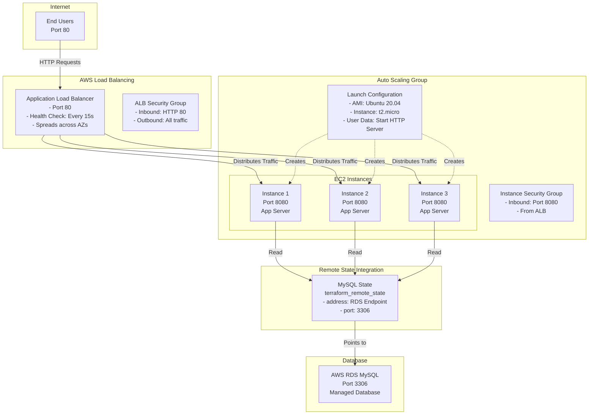
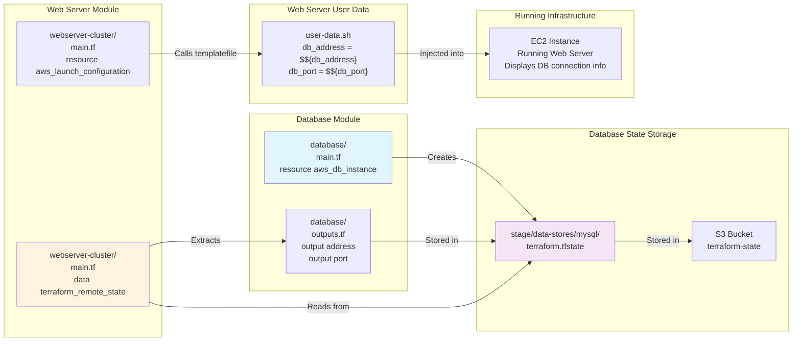

# Web Server Cluster with Auto Scaling and Load Balancer

This folder contains Terraform configuration that deploys a highly available web server cluster with the following components:

- **Auto Scaling Group**: Manages 2-10 EC2 instances automatically based on demand
- **Application Load Balancer (ALB)**: Distributes incoming HTTP traffic across instances
- **Launch Configuration**: Defines EC2 instance template (AMI, instance type, security groups)
- **Health Checks**: Ensures only healthy instances receive traffic
- **Remote State Integration**: Reads database connection details from the MySQL RDS state file

The web servers display a simple "Hello, World" message along with database connection information retrieved from the RDS instance deployed in `../data-stores/mysql/`.

For more info, please see Chapter 3, "How to Manage Terraform State", of
*[Terraform: Up and Running](http://www.terraformupandrunning.com)*.

## Architecture Diagram



## Cross-Module Dependencies: terraform_remote_state Pattern

### How Web Server Cluster Reads Database Configuration

The web server cluster doesn't directly connect to the database. Instead, it reads the database endpoint and port from the **database's Terraform state file** using the `terraform_remote_state` data source.

This architecture pattern is crucial for:
- **Decoupling modules**: Database team manages their own configuration
- **Configuration management**: Database details are automatically updated
- **Avoiding hardcoding**: No need to manually copy/paste database endpoints

### Architecture: Remote State Data Flow



### Data Source Configuration

The `terraform_remote_state` data source in the web server cluster's `main.tf`:

```hcl
data "terraform_remote_state" "db" {
  # Backend type must match where database stores its state
  backend = "s3"

  config = {
    # S3 bucket name (same bucket as database state)
    bucket = var.db_remote_state_bucket

    # Path to database's state file within bucket
    # Must match the key used by database configuration
    key = var.db_remote_state_key

    # AWS region where S3 bucket is located
    region = "us-east-2"
  }
}
```

### Accessing Remote State Outputs

Once the remote state is loaded, you can access any output from the database configuration:

```hcl
# Access database endpoint
data.terraform_remote_state.db.outputs.address

# Access database port
data.terraform_remote_state.db.outputs.port
```

### Real-World Example: Injecting Database Details into User Data

The web server's `user-data.sh` script uses `templatefile()` to inject database connection details:

```bash
#!/bin/bash
cat > index.html <<EOF
<h1>Hello, World</h1>
<p>Database Address: ${db_address}</p>
<p>Database Port: ${db_port}</p>
<p>Server Port: ${server_port}</p>
EOF

nohup busybox httpd -f -p ${server_port} &
EOF
```

Terraform's `main.tf` calls this template with variables from the remote state:

```hcl
resource "aws_launch_configuration" "example" {
  # ... other configuration ...

  # Render user data script as template
  user_data = templatefile("user-data.sh", {
    server_port = var.server_port

    # Read from database's remote state
    db_address = data.terraform_remote_state.db.outputs.address
    db_port    = data.terraform_remote_state.db.outputs.port
  })
}
```

### Why This Pattern is Powerful

1. **Automatic Updates**: If database endpoint changes, web servers automatically get new address
2. **No Copy-Paste**: No manual copying of database details between configurations
3. **Clear Dependencies**: Code explicitly shows web server depends on database
4. **Separation of Concerns**: Database team manages database, web team manages web servers
5. **Testable**: Can swap implementations without changing web server code

### Important: State File is Read-Only

The `terraform_remote_state` data source is **read-only**:

```
✅ Web server cluster CAN read database details
❌ Web server cluster CANNOT modify database state
```

This means:
- No risk of accidentally corrupting database state from web server code
- Database state is a reliable source of truth
- Changes must be made in database configuration, not web server configuration

### Prerequisites for This Pattern

1. **Database must be deployed first**
   ```bash
   cd stage/data-stores/mysql
   terraform apply
   ```

2. **Database must have outputs defined** (`stage/data-stores/mysql/outputs.tf`)
   ```hcl
   output "address" {
     value = aws_db_instance.example.address
   }

   output "port" {
     value = aws_db_instance.example.port
   }
   ```

3. **Web server variables must reference correct state file location**
   ```hcl
   variable "db_remote_state_bucket" {
     default = "terraform-smyha"
   }

   variable "db_remote_state_key" {
     default = "stage/data-stores/mysql/terraform.tfstate"
   }
   ```

### Component Details

#### 1. Application Load Balancer
- **Port**: 80 (HTTP)
- **Type**: Application (Layer 7)
- **Health Checks**:
  - Path: `/`
  - Interval: 15 seconds
  - Healthy Threshold: 2 consecutive successes
  - Unhealthy Threshold: 2 consecutive failures

#### 2. Auto Scaling Group
- **Minimum Size**: 2 instances
- **Maximum Size**: 10 instances
- **Launch Template**: Uses launch configuration
- **Health Check Type**: ELB (checks load balancer health)
- **Spread**: Across all subnets in default VPC

#### 3. EC2 Instances
- **AMI**: Ubuntu 20.04 LTS
- **Instance Type**: t2.micro (AWS free tier eligible)
- **Port**: 8080 (web server port)
- **Startup**: User Data script runs busybox HTTP server

#### 4. Remote State Integration
- **Data Source**: `terraform_remote_state` reads MySQL state
- **Backend**: S3 bucket (configured in variables)
- **Outputs Read**:
  - `address`: RDS endpoint for database connections
  - `port`: RDS port (usually 3306)

### Deployment Sequence

```
1. Remote State Available
   └─> terraform_remote_state reads database details from S3

2. Launch Configuration Created
   └─> Includes user-data script with database connection info

3. Target Group Created
   └─> Defines health check settings

4. Load Balancer Created
   └─> Listens on port 80

5. Auto Scaling Group Created
   └─> Launches minimum 2 instances with load balancer registration

6. Traffic Flow
   └─> HTTP 80 → ALB → Healthy Instances → Port 8080 → Response with DB Info
```

### User Data Script Flow

The `user-data.sh` script runs on each instance launch:
1. Creates `index.html` with database connection details
2. Starts busybox HTTP server on the specified port
3. Server responds with "Hello, World" + DB connection info

Variables injected by Terraform:
- `${db_address}`: From RDS outputs (remote state)
- `${db_port}`: From RDS outputs (remote state)
- `${server_port}`: From variables.tf

## Load Balancer Configuration

### Application Load Balancer (ALB) Details

The ALB provides:

- **Layer 7 (Application) Routing**: Can route based on hostnames, paths, HTTP headers
- **Health Checks**: Validates instance health every 15 seconds
- **Sticky Sessions**: Can be enabled for session persistence
- **SSL/TLS Termination**: Can decrypt HTTPS traffic (not in this example)
- **Logging**: Can log to S3 for audit and analytics

### Current Configuration

```
ALB Listener: Port 80 (HTTP)
  └─ Default Action: Return 404 (not matched)
  └─ Rule 100: Match all paths (/*) → Forward to target group

Target Group:
  └─ Port: 8080 (web server port)
  └─ Health Check: GET / every 15s
  └─ Min healthy targets: 2
  └─ Deregistration delay: 30s
```

### Accessing the Web Server

```bash
# Get ALB DNS name from outputs
terraform output alb_dns_name

# Test the endpoint
curl http://<alb_dns_name>/

# Should return HTML with database connection info
```

## Auto Scaling Configuration

### Scaling Policies (Current)

This example uses static sizing:
- **Min instances**: 2 (minimum for high availability)
- **Max instances**: 10 (cost control limit)
- **Desired**: Not specified (uses min_size)

### Adding Dynamic Scaling

To auto-scale based on demand:

```hcl
resource "aws_autoscaling_policy" "scale_up" {
  name                   = "scale_up"
  scaling_adjustment     = 1
  adjustment_type        = "ChangeInCapacity"
  cooldown               = 300
  autoscaling_group_name = aws_autoscaling_group.example.name
}

resource "aws_cloudwatch_metric_alarm" "high_cpu" {
  alarm_name          = "asg-high-cpu"
  comparison_operator = "GreaterThanThreshold"
  evaluation_periods  = "2"
  metric_name         = "CPUUtilization"
  namespace           = "AWS/EC2"
  period              = "60"
  statistic           = "Average"
  threshold           = "70"
  alarm_actions       = [aws_autoscaling_policy.scale_up.arn]
}
```

### Lifecycle Management

When ASG scales:

1. **Scale Up**: New instance launches from launch configuration
2. **User Data Runs**: Database endpoint injected via templatefile
3. **Health Check Starts**: ALB checks instance every 15s
4. **Traffic Sent**: After 2 consecutive healthy checks
5. **Scale Down**: Old instances deregistered with 30s connection drain
6. **Termination**: Instance shut down after grace period

## Security Considerations

### Current Configuration

⚠️ **Not Production Ready**:

- Instance security group allows HTTP from anywhere (0.0.0.0/0)
- No HTTPS/TLS encryption
- No secrets management
- No network segmentation

### Production Hardening

```hcl
# Restrict to ALB only
ingress {
  from_port       = var.server_port
  to_port         = var.server_port
  protocol        = "tcp"
  security_groups = [aws_security_group.alb.id]
}

# Add egress rules (deny by default)
egress {
  from_port   = 3306
  to_port     = 3306
  protocol    = "tcp"
  cidr_blocks = [aws_security_group.db.id]
}
```

### HTTPS Configuration

```hcl
# Add HTTPS listener
resource "aws_lb_listener" "https" {
  load_balancer_arn = aws_lb.example.arn
  port              = "443"
  protocol          = "HTTPS"
  ssl_policy        = "ELBSecurityPolicy-TLS-1-2-2017-01"
  certificate_arn   = aws_acm_certificate.example.arn

  default_action {
    type             = "forward"
    target_group_arn = aws_lb_target_group.asg.arn
  }
}

# Redirect HTTP to HTTPS
resource "aws_lb_listener" "http_redirect" {
  load_balancer_arn = aws_lb.example.arn
  port              = "80"
  protocol          = "HTTP"

  default_action {
    type = "redirect"
    redirect {
      port        = "443"
      protocol    = "HTTPS"
      status_code = "HTTP_301"
    }
  }
}
```

## Monitoring and Troubleshooting

### CloudWatch Metrics

```bash
# View ALB request count
aws cloudwatch get-metric-statistics \
  --namespace AWS/ApplicationELB \
  --metric-name RequestCount \
  --dimensions Name=LoadBalancer,Value=<alb-name> \
  --start-time 2024-01-01T00:00:00Z \
  --end-time 2024-01-02T00:00:00Z \
  --period 300 \
  --statistics Sum

# View unhealthy host count
aws cloudwatch get-metric-statistics \
  --namespace AWS/ApplicationELB \
  --metric-name UnHealthyHostCount \
  --dimensions Name=LoadBalancer,Value=<alb-name>
```

### Common Issues

#### Issue: "Unhealthy Instances"

**Symptoms**: ALB shows targets as unhealthy

**Diagnosis**:
```bash
# Check target group health
aws elbv2 describe-target-health \
  --target-group-arn <target-group-arn>

# SSH into instance and test
curl localhost:8080

# Check user data logs
tail -f /var/log/cloud-init-output.log
```

**Solutions**:
1. Verify user-data.sh executes correctly
2. Check security groups allow traffic
3. Verify database is accessible
4. Check instance has internet access

#### Issue: "502 Bad Gateway"

**Cause**: ALB can't reach healthy targets

**Fix**:
1. Ensure min 2 instances are healthy
2. Check target group health check settings
3. Verify security group rules
4. Check application logs on instances

#### Issue: "High Latency"

**Causes**:
1. Database queries are slow
2. Instances are overloaded (CPU/Memory)
3. Network congestion

**Fixes**:
1. Add database indexes
2. Scale up instance type
3. Enable database caching
4. Use CloudFront for static content

## Performance Optimization

### Instance Selection

Current: `t2.micro` (1 vCPU, 1GB RAM)

Better options by workload:

| Use Case | Instance Type | vCPU | RAM |
|----------|---|---|---|
| Development | t2.micro | 1 | 1 GB |
| Small production | t2.small | 1 | 2 GB |
| Medium production | t2.medium | 2 | 4 GB |
| High traffic | t3.large | 2 | 8 GB |
| Very high traffic | c5.xlarge | 4 | 8 GB |

### Caching Strategies

1. **Application Level**: Cache database results in app
2. **Load Balancer Level**: Enable sticky sessions
3. **CloudFront CDN**: Cache static content at edge
4. **ElastiCache**: Redis/Memcached for session store

### Database Connection Pooling

```bash
# In user-data.sh or application config
# Use connection pooling instead of creating new connections each request

# Example with connection pooling
max_pool_size=10  # Adjust based on instance type
```

## Cost Analysis

### Monthly Cost Breakdown (On-Demand)

| Resource | Quantity | Unit Cost | Monthly |
|----------|----------|-----------|---------|
| ALB | 1 | $16.00 | $16.00 |
| NAT Gateway | 1 | $32.00 | $32.00 |
| EC2 t2.micro | 2-10 | $0.017/hr | $25-125 |
| Data transfer | Variable | $0.02/GB | $5-50 |
| **Total** | | | **$78-223** |

### Cost Optimization

1. **Use Reserved Instances**: 40-60% savings
2. **Use Spot Instances**: 70-90% savings (but interruptible)
3. **Right-size instances**: Start small, scale as needed
4. **Enable auto-scaling**: Don't overprovision

## Pre-requisites

- You must have [Terraform](https://www.terraform.io/) installed on your computer.
- You must have an [Amazon Web Services (AWS) account](http://aws.amazon.com/).
- You must deploy the MySQL database in [data-stores/mysql](../../data-stores/mysql) BEFORE deploying the configuration in this folder.
- AWS credentials configured in environment or `~/.aws/credentials`
- SSH key pair for EC2 access (optional, for debugging)

Please note that this code was written for Terraform 1.x.

## Quick start

**Please note that this example will deploy real resources into your AWS account. We have made every effort to ensure 
all the resources qualify for the [AWS Free Tier](https://aws.amazon.com/free/), but we are not responsible for any
charges you may incur.** 

Configure your [AWS access 
keys](http://docs.aws.amazon.com/general/latest/gr/aws-sec-cred-types.html#access-keys-and-secret-access-keys) as 
environment variables:

```
export AWS_ACCESS_KEY_ID=(your access key id)
export AWS_SECRET_ACCESS_KEY=(your secret access key)
```

In `variables.tf`, fill in the name of the S3 bucket and key where the remote state is stored for the MySQL database
(you must deploy the configuration in [data-stores/mysql](../../data-stores/mysql) first):

```hcl
variable "db_remote_state_bucket" {
  description = "The name of the S3 bucket used for the database's remote state storage"
  type        = string
  default     = "<YOUR BUCKET NAME>"
}

variable "db_remote_state_key" {
  description = "The name of the key in the S3 bucket used for the database's remote state storage"
  type        = string
  default     = "<YOUR STATE PATH>"
}
```

Deploy the code:

```
terraform init
terraform apply
```

When the `apply` command completes, it will output the DNS name of the load balancer. To test the load balancer:

```
curl http://<alb_dns_name>/
```

Clean up when you're done:

```
terraform destroy
```