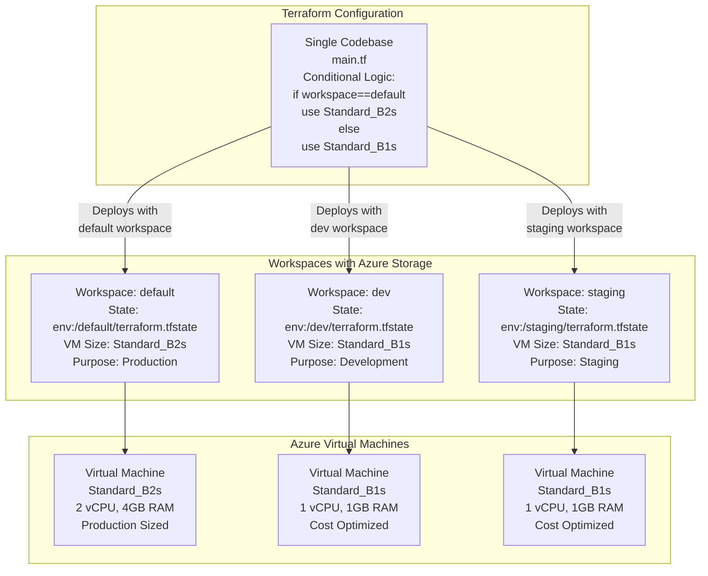

# Terraform Workspaces Example - Azure

This folder contains an example [Terraform](https://www.terraform.io/) configuration that demonstrates **Terraform Workspaces** for managing multiple environments (development, staging, production) from a single codebase on Microsoft Azure.

## Key Differences: Azure vs AWS

### State Backend Architecture

The major difference between Azure and AWS for Terraform state management:

| Feature | AWS | Azure |
|---------|-----|-------|
| **State Storage** | S3 Bucket | Blob Container |
| **State Locking** | DynamoDB Table | Azure Blob Lease (Native) |
| **Number of Resources** | 2 (S3 + DynamoDB) | 1 (Storage Account) |
| **Locking Mechanism** | External database | Native blob locking |
| **Complexity** | Medium | Low |
| **Cost** | Low (S3 + DynamoDB) | Very low |

### Why Azure is Simpler

Azure Blob Storage has **native locking capabilities** using "Leases":

```
When Terraform modifies state:
1. Acquires a lease on the blob file (automatic lock)
2. Makes the changes
3. Releases the lease (automatic unlock)

No need for a separate DynamoDB table!
```

## What Are Terraform Workspaces?

Workspaces allow you to manage **multiple state files** within a single Terraform configuration:

```bash
# Create and switch between workspaces
terraform workspace new dev
terraform workspace new staging
terraform workspace select dev       # Now in dev workspace
terraform apply                      # Applies to dev state only
```

### How Workspaces Work in Azure

All state files stored in same Blob Container:

```
Storage Account: "mytfstate"
└── Container: "tfstate"
    └── env:/
        ├── default/terraform.tfstate
        ├── dev/terraform.tfstate
        └── staging/terraform.tfstate
```

When you run `terraform workspace select staging`, Terraform automatically uses the `env:/staging/terraform.tfstate` file.

## Azure-Specific Isolation: Logical Isolation with Native Locking

Understanding how Azure implements workspace isolation helps you appreciate its simplicity compared to AWS.

### Concept

Azure provides **logical isolation** using **single Terraform configuration** with automatic state management. Unlike AWS, Azure's native blob locking eliminates the need for separate external databases (DynamoDB).

### Mechanism: How Azure Handles Workspace Isolation

```bash
# Workspace selection triggers automatic path changes
terraform workspace select prod
terraform apply
  → Uses: env:/prod/terraform.tfstate
  → Locking: Azure Blob Lease (built-in, automatic)
  → Storage Account: Same for all workspaces

terraform workspace select dev
terraform apply
  → Uses: env:/dev/terraform.tfstate
  → Locking: Azure Blob Lease (built-in, automatic)
  → Storage Account: SAME as prod (shared!)
```

### Azure Backend Behavior with Workspaces

```
Backend: Azure Storage Account with workspaces
Storage Account: terraform-state (ONE account for all)
Container: tfstate/

Workspace "default":
  State file: env:/default/terraform.tfstate
  Locking: Automatic Blob Lease
  Credentials: Storage Account Key (shared)

Workspace "dev":
  State file: env:/dev/terraform.tfstate
  Locking: Automatic Blob Lease
  Credentials: Storage Account Key (shared)

Workspace "prod":
  State file: env:/prod/terraform.tfstate
  Locking: Automatic Blob Lease
  Credentials: Storage Account Key (shared)

⚠️ Key Points:
  - ONE Storage Account for all workspaces
  - ONE Storage Account Key (shared credentials)
  - Locking is AUTOMATIC (no DynamoDB equivalent needed!)
  - Magic paths: env:/workspace_name/terraform.tfstate
```

### Key Differences: Azure vs AWS Isolation

| Aspect | AWS Workspaces | Azure Workspaces |
|--------|---|---|
| **State Storage** | S3 bucket (shared) | Storage Account container (shared) |
| **Locking** | DynamoDB table (external) | Azure Blob Lease (built-in) |
| **Magic Paths** | env:/workspace_name/terraform.tfstate | env:/workspace_name/terraform.tfstate |
| **Shared Credentials** | AWS_ACCESS_KEY_ID + AWS_SECRET_ACCESS_KEY | Storage Account Key + Access Key |
| **Workspace Visibility** | Invisible (hidden in state) | Invisible (hidden in state) |
| **Setup Complexity** | 2 resources (S3 + DynamoDB) | 1 resource (Storage Account) |
| **Cost** | ~$2-5/month | ~$1-5/month |
| **Security Model** | Identical to AWS workspaces | Identical to AWS workspaces |

### Azure Locking Advantages

Azure's **native Blob Lease locking** is simpler than AWS DynamoDB:

```
AWS Approach:
1. Terraform acquires lock in DynamoDB table
2. Modifies S3 state file
3. Releases lock in DynamoDB
↑ Requires external database

Azure Approach:
1. Terraform acquires lease on blob file
2. Modifies blob
3. Releases lease
↑ Built into Storage Account (no external service!)
```

**Benefits**:
- ✅ No DynamoDB table to create and manage
- ✅ No separate service for locking
- ✅ Lower cost (locking is free)
- ✅ Simpler infrastructure
- ✅ Built-in encryption in transit

### Advantages of Azure Workspace Isolation

- ✅ **Simpler infrastructure**: One Storage Account, no DynamoDB
- ✅ **Lower cost**: ~$1-5/month (no DynamoDB charges)
- ✅ **Native locking**: Automatic Blob Leases (no external database)
- ✅ **Same code reuse**: Single main.tf for all environments
- ✅ **Rapid testing**: Create/destroy test workspaces quickly

### Disadvantages of Azure Workspace Isolation

**Same as AWS workspaces** (Azure's locking advantage doesn't change this):

- ❌ **Shared credentials**: All workspaces accessible with one Storage Account Key
- ❌ **Invisible workspace selection**: No indication of which workspace you're in
- ❌ **Human error risk**: Easy to forget workspace before `terraform destroy`
- ❌ **No RBAC separation**: Can't assign different permissions per workspace
- ❌ **Dirty code**: Conditional logic scattered throughout configuration

### Real-World Risk: Same as AWS

```bash
# Developer in Azure
$ terraform workspace list
  default
* prod
$ terraform destroy
# ❌ DISASTER: Destroyed production VM!

# Why it happened:
# 1. Forgot which workspace was selected
# 2. No file system indication
# 3. Same Storage Account Key for all workspaces
# 4. No access control to prevent destruction
```

### Comparison: Azure Workspaces vs Azure File Layout

| Aspect | Azure Workspaces (Logical) | Azure File Layout (Physical) |
|--------|---|---|
| **Storage Accounts** | One shared | Multiple (or clear separation) |
| **State Files** | env:/workspace_name/ (magic paths) | Explicit keys per component |
| **Locking** | Shared Blob Lease | Independent per Storage Account |
| **Credentials** | Shared | Can be different per environment |
| **Visibility** | Invisible (workspace names hidden) | Visible (folder structure) |
| **Error Risk** | High (forgot workspace) | Low (must navigate folder) |
| **Use Case** | Ephemeral/testing | Production/persistent |

---

## Architecture Diagram



## Workspace Management Commands

### View Workspaces

```bash
# List all workspaces
terraform workspace list

# Example output:
# default
# * dev
#   staging
#   prod

# The asterisk (*) shows the current active workspace
```

### Create Workspaces

```bash
# Create a new workspace
terraform workspace new dev

# Create multiple workspaces
terraform workspace new staging
terraform workspace new prod
```

### Switch Workspaces

```bash
# Switch to a different workspace
terraform workspace select dev

# Verify you're in the right workspace
terraform workspace show
# Output: dev
```

### Delete Workspaces

```bash
# First, destroy resources in the workspace
terraform workspace select dev
terraform destroy

# Then delete the workspace
terraform workspace delete dev
```

## State File Organization

When using Azure Blob Storage backend with workspaces, the directory structure is:

```bash
Storage Account: mytfstate
└── Container: tfstate
    └── env:/
        ├── default/terraform.tfstate        # Production state
        ├── dev/terraform.tfstate            # Development state
        └── staging/terraform.tfstate        # Staging state
```

Each workspace has:

- **Separate state file**: No risk of cross-contamination
- **Azure Lease locking**: Automatic blob locking (built-in!)
- **Soft-delete history**: Version history if enabled
- **Encryption**: Encryption in transit and at rest (configurable)

## Workspace-Based Configuration

### Using terraform.workspace in Resources

The `terraform.workspace` built-in variable allows conditional resource configuration:

```hcl
# Example: VM Size by environment
vm_size = terraform.workspace == "default" ? "Standard_B2s" : "Standard_B1s"

# Example: Resource naming with workspace
name = "${var.app_name}-vm-${terraform.workspace}"

# Example: Tags by environment
tags = {
  Environment = terraform.workspace
  CostCenter  = terraform.workspace == "default" ? "production" : "development"
}
```

### Using Variables with Workspaces

You can also use `.tfvars` files per workspace:

```bash
# Create workspace-specific variable files
terraform.dev.tfvars
terraform.staging.tfvars
terraform.prod.tfvars
```

Then apply with:

```bash
terraform workspace select dev
terraform apply -var-file="terraform.dev.tfvars"
```

## Advantages of This Example

### 1. Simplicity

Azure's native locking eliminates complexity:

```
AWS Approach:
- Create S3 bucket ✓
- Create DynamoDB table ✓
- Configure bucket versioning ✓
- Configure bucket encryption ✓
- Set up state lock ✓

Azure Approach:
- Create Storage Account ✓
- Done! (Locking is automatic)
```

### 2. Cost Efficiency

```
Monthly Cost Estimate:
Storage: ~$1-5 (very cheap)
Locking: Free (native feature)
Total: ~$1-5/month

Compare to AWS:
S3: ~$0.50
DynamoDB: ~$2-5
Total: ~$2.50-5.50/month
```

### 3. Environment Isolation

Each workspace gets its own VM:

```bash
terraform workspace select dev && terraform apply
# Creates dev VM (Standard_B1s, cheap)

terraform workspace select prod && terraform apply
# Creates prod VM (Standard_B2s, larger)

# Both isolated, separate state files
# But managed from single configuration!
```

### 4. Cost Management

```hcl
# Dev workspace: Small, cheap
vm_size = "Standard_B1s"  # ~$10/month

# Production workspace: Larger, more capable
vm_size = "Standard_B2s"  # ~$50/month

# Savings by using appropriate sizes per environment!
```

## Limitations and Considerations

### When NOT to Use Workspaces

❌ **Not recommended for:**

- Production environment isolation (use file layout instead)
- Multi-team setups with different access controls
- Compliance-sensitive environments (PCI, HIPAA, SOC 2)
- When teams shouldn't access each other's infrastructure
- When significantly different infrastructure per environment

### Best Practices

✅ **Do:**

- Use for small, similar environments
- Keep workspace names simple: dev, staging, prod
- Document workspace-specific configuration
- Enable soft-delete on storage account for history
- Use consistent naming conventions

❌ **Don't:**

- Create too many workspaces (harder to manage)
- Use for CI/CD without automation
- Store secrets in workspace-specific code
- Mix workspaces with different subscriptions/credentials
- Forget which workspace you're in before running destroy!

## Azure Setup Prerequisites

### 1. Install Azure CLI

```bash
# macOS
brew install azure-cli

# Windows (PowerShell)
choco install azure-cli

# Ubuntu/Debian
curl -sL https://aka.ms/InstallAzureCLIDeb | sudo bash
```

### 2. Authenticate with Azure

```bash
# Login to Azure
az login

# If you have multiple subscriptions, select the correct one
az account set --subscription <subscription-id>

# Verify you're in the right subscription
az account show
```

### 3. Create Azure Storage Account

```bash
# Variables
RG_NAME="terraform-state-rg"
STORAGE_ACCOUNT="mytfstate$(date +%s)"  # Must be unique
CONTAINER_NAME="tfstate"
LOCATION="eastus"

# Create resource group
az group create \
  --name $RG_NAME \
  --location $LOCATION

# Create storage account
az storage account create \
  --resource-group $RG_NAME \
  --name $STORAGE_ACCOUNT \
  --sku Standard_LRS \
  --encryption-services blob

# Create container
az storage container create \
  --name $CONTAINER_NAME \
  --account-name $STORAGE_ACCOUNT

# Get storage account key
az storage account keys list \
  --resource-group $RG_NAME \
  --account-name $STORAGE_ACCOUNT
```

### 4. Export Azure Credentials

```bash
# Get your subscription ID
export ARM_SUBSCRIPTION_ID=$(az account show --query id -o tsv)

# Get storage account key
export ARM_ACCESS_KEY=$(az storage account keys list \
  --resource-group terraform-state-rg \
  --account-name $STORAGE_ACCOUNT \
  --query '[0].value' -o tsv)

# Verify
echo $ARM_SUBSCRIPTION_ID
echo $ARM_ACCESS_KEY
```

## Quick Start

### Step 1: Set Your Subscription ID

```bash
# Find your subscription ID
az account show --query id

# Set it in environment or update variables.tf
export TF_VAR_azure_subscription_id="your-subscription-id"
```

### Step 2: Initialize Terraform

```bash
terraform init
```

This creates the initial `default` workspace.

### Step 3: Deploy to Default Workspace (Production)

```bash
terraform workspace select default
terraform plan
terraform apply
```

This deploys a **Standard_B2s** VM (larger, production-sized).

### Step 4: Create Dev Workspace

```bash
terraform workspace new dev
terraform plan -var-file="dev.tfvars"
terraform apply -var-file="dev.tfvars"
```

This creates a **Standard_B1s** VM (smaller, cost-effective).

### Step 5: Create Staging Workspace

```bash
terraform workspace new staging
terraform plan -var-file="staging.tfvars"
terraform apply -var-file="staging.tfvars"
```

### Step 6: View All Workspaces and Resources

```bash
# List all workspaces
terraform workspace list

# Switch between workspaces to view resources
terraform workspace select default
terraform state list

terraform workspace select dev
terraform state list
```

### Step 7: Clean Up

```bash
# Destroy resources in current workspace
terraform destroy

# Delete workspace
terraform workspace delete <workspace-name>

# Switch to default and destroy
terraform workspace select default
terraform destroy
```

## Accessing the Virtual Machine

### If You Enabled Public IP

```bash
# Get the public IP
RESOURCE_GROUP=$(terraform output -raw resource_group_name)
VM_NAME=$(terraform output -raw vm_name)

PUBLIC_IP=$(az vm show --resource-group $RESOURCE_GROUP \
  --name $VM_NAME --show-details --query publicIps -o tsv)

# SSH into the VM
ssh -i private_key.pem azureuser@$PUBLIC_IP
```

### Getting SSH Key

```bash
# If auto-generated, retrieve from Terraform
terraform output -raw ssh_public_key > vm_key.pub

# Export the private key for SSH (store securely!)
terraform state show azurerm_linux_virtual_machine.example
```

## Troubleshooting

### Issue: "Subscription ID not found"

```bash
# Solution: Set your Azure subscription ID
export TF_VAR_azure_subscription_id=$(az account show --query id -o tsv)
```

### Issue: "Storage Account authentication failed"

```bash
# Solution: Ensure you're logged in and have the right credentials
az login
az account show

# Set storage account credentials
export ARM_STORAGE_ACCOUNT_NAME="your-storage-account"
export ARM_STORAGE_ACCOUNT_KEY=$(az storage account keys list \
  --account-name $ARM_STORAGE_ACCOUNT_NAME \
  --query '[0].value' -o tsv)
```

### Issue: "Workspace not found"

```bash
# Create the workspace if it doesn't exist
terraform workspace new workspace-name

# Or list available workspaces
terraform workspace list
```

### Issue: "Resource group already exists"

```bash
# Azure resource groups are globally unique
# Use a different name in variables.tf or import existing group
az group create --name my-rg --location eastus
```

## Important Notes

### Cost Management

Azure VMs incur charges when running:

```
Standard_B1s: ~$10/month
Standard_B2s: ~$50/month

⚠️ Ensure you destroy unused workspaces!
```

### Workspace Names and Azure Naming

Azure has strict naming rules:

- Resource Group names: 1-90 characters
- VM names: 1-64 characters, alphanumeric and hyphens
- Storage Account: 3-24 characters, lowercase only

Terraform uses `terraform.workspace` in resource names, so keep workspace names short and alphanumeric.

### SSH Keys

For production:

1. Generate your own SSH key: `ssh-keygen -t rsa -b 4096`
2. Pass via `var.ssh_public_key`
3. Never commit private keys to version control

For this example, Terraform auto-generates keys (NOT for production!).

## Comparing to AWS Workspaces

The AWS version uses:

```hcl
# AWS (needs external lock)
terraform {
  backend "s3" {
    bucket         = "my-bucket"
    dynamodb_table = "terraform-locks"  # Extra resource!
  }
}
```

Azure version is simpler:

```hcl
# Azure (built-in locking)
terraform {
  backend "azurerm" {
    storage_account_name = "mystfstate"
    container_name       = "tfstate"
    # Locking is automatic! No DynamoDB needed
  }
}
```

This makes Azure workspaces **simpler and cheaper** for state management!

## Next Steps: File Layout

This workspaces example is great for learning, but for production infrastructure, use **file layout** instead:

- Clear code organization
- Better isolation
- Separate backends per environment
- Different access controls

See `../file-layout-example-azure/` for the production-ready approach.

## Prerequisites Summary

```bash
# Required
- Terraform >= 1.0
- Azure CLI
- Azure Subscription
- Azure Storage Account (for state)

# Recommended
- SSH key pair for VM access
- Azure CLI authenticated and configured
```

## Pre-requisites

- You must have [Terraform](https://www.terraform.io/) installed on your computer.
- You must have a [Microsoft Azure account](https://azure.microsoft.com/).
- Azure CLI configured with appropriate credentials
- Storage Account created in Azure for Terraform state

Please note that this code was written for Terraform 1.x and Azure Provider 3.x.
