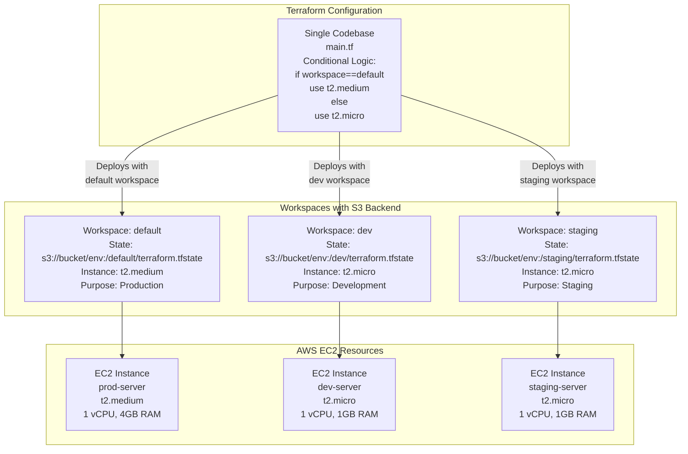

# Terraform Workspaces Example

This folder contains an example [Terraform](https://www.terraform.io/) configuration that demonstrates **Terraform Workspaces** for managing multiple environments (development, staging, production) from a single codebase.

## What are Terraform Workspaces?

Workspaces allow you to manage multiple **state files** and **variable sets** within the same Terraform configuration:

- **Multiple Environments**: Deploy the same infrastructure code to dev, staging, and production
- **Separate State Files**: Each workspace maintains its own state, preventing accidental modifications
- **Environment-Specific Configuration**: Use conditional logic to vary resources by environment
- **Simplified Management**: No need to duplicate code across directories

## How This Example Works

The configuration in `main.tf` deploys a single EC2 instance with **workspace-aware sizing**:

```
Workspace: default  → Instance Type: t2.medium (production)
Workspace: dev      → Instance Type: t2.micro  (development)
Workspace: staging  → Instance Type: t2.micro  (staging)
```

The decision logic uses Terraform's conditional expression:

```hcl
instance_type = terraform.workspace == "default" ? "t2.medium" : "t2.micro"
```

For more info, please see Chapter 3, "How to Manage Terraform State", of
*[Terraform: Up and Running](http://www.terraformupandrunning.com)*.

## Architecture Diagram



## Workspace Management Commands

### View Workspaces

```bash
# List all workspaces
terraform workspace list

# Example output:
# default
# * dev
#   staging
#   prod

# The asterisk (*) shows the current active workspace
```

### Create Workspaces

```bash
# Create a new workspace
terraform workspace new dev

# Create multiple workspaces
terraform workspace new staging
terraform workspace new prod
```

### Switch Workspaces

```bash
# Switch to a different workspace
terraform workspace select dev

# Verify you're in the right workspace
terraform workspace show
# Output: dev
```

### Delete Workspaces

```bash
# First, destroy resources in the workspace
terraform workspace select dev
terraform destroy

# Then delete the workspace
terraform workspace delete dev
```

## State File Organization

When using S3 backend with workspaces, the directory structure is:

```bash
s3://terraform-state-bucket/
├── env:/
│   ├── default/
│   │   └── terraform.tfstate        # Production state
│   ├── dev/
│   │   └── terraform.tfstate        # Development state
│   ├── staging/
│   │   └── terraform.tfstate        # Staging state
│   └── prod/
│       └── terraform.tfstate        # Production state
```

Each workspace has:
- **Separate state file**: No risk of cross-contamination
- **Version history**: S3 versioning tracks all changes
- **State locking**: DynamoDB prevents concurrent operations
- **Encryption**: AES256 protects sensitive data

## Workspace-Based Configuration

### Using terraform.workspace in Resources

The `terraform.workspace` built-in variable allows conditional resource configuration:

```hcl
# Example 1: Instance type by environment
instance_type = terraform.workspace == "default" ? "t2.large" : "t2.micro"

# Example 2: Replica count by environment
desired_capacity = terraform.workspace == "prod" ? 10 : 2

# Example 3: Backup retention by environment
backup_retention = terraform.workspace == "prod" ? 30 : 7

# Example 4: Logging level by environment
log_level = terraform.workspace == "dev" ? "DEBUG" : "INFO"
```

### Using Variables with Workspaces

You can also use `.tfvars` files per workspace:

```bash
# Create workspace-specific variable files
terraform.dev.tfvars
terraform.staging.tfvars
terraform.prod.tfvars
```

Then apply with:

```bash
terraform workspace select dev
terraform apply -var-file="terraform.dev.tfvars"
```

## Advantages of Workspaces

### 1. Code Reusability
- Write configuration once
- Deploy to multiple environments
- Reduce code duplication

### 2. Environment Isolation
- Each workspace has its own state
- Destroy dev without affecting prod
- Safe testing and experimentation

### 3. Cost Management
- Use smaller instances in dev/staging
- Use larger instances in production
- Scale based on environment needs

### 4. Consistency
- Same infrastructure code everywhere
- Reduces configuration drift
- Easier to reproduce issues

## Limitations and Considerations

### When NOT to Use Workspaces

❌ **Not recommended for**:
- Complex multi-environment setups (use separate directories instead)
- Significant regional differences (use different providers)
- Different cloud providers per environment
- Completely different infrastructure

### Best Practices

✅ **Do**:
- Use for small environment variations
- Keep workspace names simple: dev, staging, prod
- Document workspace-specific configuration
- Use state locking (DynamoDB)
- Enable versioning (S3)

❌ **Don't**:
- Create too many workspaces (harder to manage)
- Use for CI/CD without automation
- Store secrets in state files
- Mix workspaces with -var-file without careful management

## Advanced: Using Workspaces with Modules

When using modules with workspaces:

```hcl
module "web_server" {
  source = "../modules/web-server"

  instance_type = terraform.workspace == "prod" ? "c5.xlarge" : "t2.micro"
  environment   = terraform.workspace

  # Use workspace name as a tag
  tags = {
    Environment = terraform.workspace
    ManagedBy   = "Terraform"
  }
}

output "server_info" {
  value = "Created ${terraform.workspace} server: ${module.web_server.instance_id}"
}
```

## Cost Comparison

### Monthly Cost (On-Demand, us-east-2)

| Workspace | Instance | vCPU | RAM | Cost/Hour | Cost/Month |
|-----------|----------|------|-----|-----------|------------|
| default (prod) | t2.medium | 2 | 4 GB | $0.0464 | $33.41 |
| dev | t2.micro | 1 | 1 GB | $0.0116 | $8.35 |
| staging | t2.micro | 1 | 1 GB | $0.0116 | $8.35 |
| **Total (3 workspaces)** | | | | | **$50.11** |

## Real-World Example: Multi-Environment Deployment

```bash
# 1. Initialize Terraform
terraform init

# 2. Create development environment
terraform workspace new dev
terraform apply -auto-approve

# 3. Create staging environment
terraform workspace new staging
terraform apply -auto-approve

# 4. Create production environment
terraform workspace new prod
terraform apply

# 5. Verify all environments
terraform workspace list

# 6. Check production instance size
terraform workspace select prod
terraform show

# 7. Clean up development environment
terraform workspace select dev
terraform destroy -auto-approve
terraform workspace delete dev
```

## Troubleshooting

### Issue: "Workspace not found"

```bash
# Create the workspace if it doesn't exist
terraform workspace new workspace-name

# Or list available workspaces
terraform workspace list
```

### Issue: "Resource already exists"

This typically happens when:
1. Workspace state is not properly isolated
2. Resource names conflict across workspaces

Solution:
```bash
# Use workspace name in resource naming
name = "${terraform.workspace}-resource"
```

### Issue: "State lock error"

```bash
# Check locked workspaces
aws dynamodb scan --table-name terraform_locks

# Force unlock (use carefully!)
terraform force-unlock <LOCK_ID>
```

## Pre-requisites

- You must have [Terraform](https://www.terraform.io/) installed on your computer.
- You must have an [Amazon Web Services (AWS) account](http://aws.amazon.com/).
- AWS credentials configured in environment or `~/.aws/credentials`
- S3 bucket and DynamoDB table for remote state (from global/s3 example)

Please note that this code was written for Terraform 1.x.

## Quick start

**Please note that this example will deploy real resources into your AWS account. We have made every effort to ensure
all the resources qualify for the [AWS Free Tier](https://aws.amazon.com/free/), but we are not responsible for any
charges you may incur.**

Configure your [AWS access
keys](http://docs.aws.amazon.com/general/latest/gr/aws-sec-cred-types.html#access-keys-and-secret-access-keys) as
environment variables:

```bash
export AWS_ACCESS_KEY_ID=(your access key id)
export AWS_SECRET_ACCESS_KEY=(your secret access key)
```

### Step 1: Initialize Terraform

```bash
terraform init
```

This creates the initial `default` workspace.

### Step 2: Deploy to Default Workspace (Production)

```bash
terraform apply
```

This deploys a **t2.medium** instance to production.

### Step 3: Create and Deploy to Dev Workspace

```bash
terraform workspace new dev
terraform apply
```

This creates a **t2.micro** instance in the dev workspace, keeping prod separate.

### Step 4: Create Additional Workspaces

```bash
terraform workspace new staging
terraform workspace select staging
terraform apply
```

### Step 5: View All Workspaces and Their Resources

```bash
# List all workspaces
terraform workspace list

# Switch between workspaces to view resources
terraform workspace select prod
terraform state list

terraform workspace select dev
terraform state list
```

### Step 6: Clean Up

```bash
# Destroy resources in current workspace
terraform destroy

# Delete workspace
terraform workspace delete <workspace-name>

# Switch to default and destroy
terraform workspace select default
terraform destroy
```

### Step 7: Clean Everything

```bash
# Delete all workspaces except default
terraform workspace delete dev
terraform workspace delete staging
terraform workspace delete prod

# Delete default workspace resources
terraform workspace select default
terraform destroy
```
