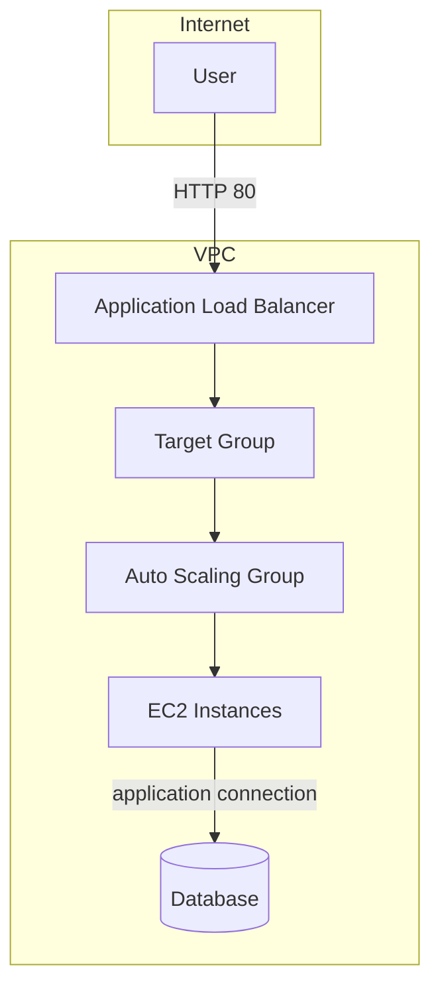
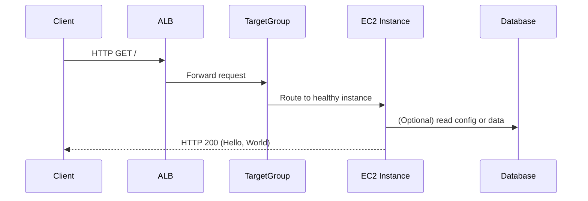

## Webserver Cluster Architecture

This file provides simple diagrams and step-by-step flow for the
`webserver-cluster` module. Use these diagrams to understand how traffic
flows and how resources relate.

### Component diagram (Mermaid)

### Request flow (sequence)

### Notes

- The module uses a small `user-data` script that writes a single `index.html`
  and starts `busybox httpd`. It's a pedagogical example, not a production
  webserver setup.
- The module obtains DB address/port by reading a remote Terraform state.
- Security groups are open to the internet in this example to keep the
  configuration small and easy to run. Always restrict SGs for production.

### Recommended extensions

- Add `vpc_id` and `subnet_ids` inputs to avoid depending on the default VPC.
- Replace the launch configuration with a launch template and consider
  using an AMI parameter or data source to locate up-to-date AMIs.
