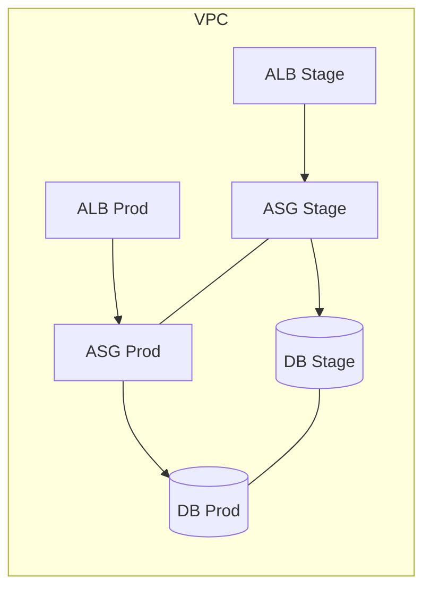
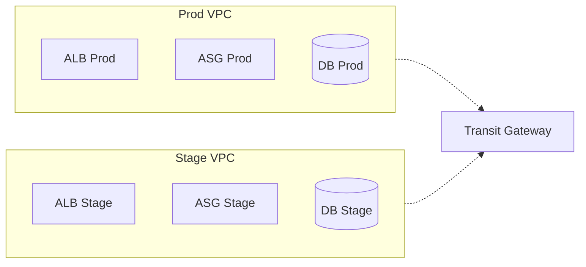
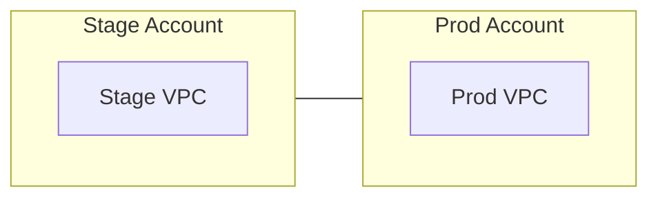

# Network Isolation — Notes, Diagrams & Solutions

This document explains network isolation risks in the example module, shows
diagrams (Mermaid), gives practical use-cases and proposes mitigation
patterns and Terraform-level implementation ideas.

---

## Problem summary

The example code used in this chapter intentionally places every example
environment into the same AWS VPC to keep the examples small and easy to
run. That means staging and production are separated in Terraform code and
resources (different ALBs, ASGs and DBs) but are not isolated at the
network level: servers in staging can reach production servers and vice
versa.

Risks:

- Operational accidents: a mistaken route table change or misapplied
  security rule in staging can affect production networking.
- Blast radius for compromise: an attacker who gains access to staging can
  pivot to production resources.

The original example text (preserved):

> The examples in this chapter create two environments that are isolated in
> your Terraform code, as well as isolated in terms of having separate load
> balancers, servers, and databases, but they are not isolated at the network
> level. To keep all the examples in this book simple, all of the resources
> deploy into the same VPC. This means that a server in the staging
> environment can communicate with a server in the production environment,
> and vice versa.

---

## High-level countermeasures (summary)

- Run each environment in a separate VPC (recommended for safety).
- For stronger separation, run each environment in a separate AWS account
  (or OU) with separate IAM boundaries.
- Use Transit Gateway, VPC Peering, or AWS PrivateLink to provide controlled
  inter-VPC connectivity if needed.
- Use least-privilege Security Groups and NACLs to limit lateral movement.
- Harden access paths: bastion hosts, session manager, private-only
  management networks and strict IAM policies.
- Add monitoring and alerting (flow logs, GuardDuty, VPC Reachability tests).

---

## Mermaid diagrams

### Same-VPC (current simple example)



### Separate VPCs per environment (recommended)



### Multi-account isolation



---

## Use-cases and recommended patterns

1) Quick experiments / learning / local development

- Accept single-VPC simplicity. Keep tests safe and use small scopes.
- Use temporary resources and tear them down after testing.

2) Shared tooling, integrated QA environments

- Use separate VPCs per environment. If teams need cross-env access,
  implement explicit peering or Transit Gateway connections.

3) Production-grade isolation

- Use separate AWS accounts per environment. Use AWS Organizations to manage
  accounts and SCPs (Service Control Policies) to enforce guardrails.
- Implement centralized logging, monitoring and a cross-account
  observability pipeline (Flow Logs -> S3 -> SIEM).

---

## Practical Terraform approaches (patterns)

Below are short solutions and hints for implementing the above in Terraform.

- Separate-VPC pattern

  - Create a VPC module that accepts environment-specific inputs (cidr, tags).
  - Each environment wrapper (prod/stage) calls the VPC module to create a
    separate VPC and subnets.
  - The `modules/services/webserver-cluster` should accept `vpc_id` and
    `subnet_ids` as inputs instead of using the default VPC data sources.

  Example (wrapper):

  ```hcl
  module "vpc" {
    source = "../../modules/networking/vpc"
    env    = "stage"
    cidr   = "10.1.0.0/16"
  }

  module "webserver_cluster" {
    source     = "../../modules/services/webserver-cluster"
    vpc_id     = module.vpc.id
    subnet_ids = module.vpc.public_subnet_ids
    # other inputs...
  }
  ```

- Multi-account pattern

  - Provision VPCs in separate accounts using separate state backends.
  - Use a central networking account for Transit Gateway, peering, or
    centralized firewalls.

- Controlled connectivity

  - Use Transit Gateway to centralize routing. Attach VPCs and use route
    tables to control allowed flows.
  - Use AWS PrivateLink for narrow, service-oriented connectivity between
    VPCs (avoids full VPC peering).

- Security Group hardening

  - Prefer security-group-to-security-group rules (source_security_group_id)
    instead of open `0.0.0.0/0` where possible.
  - Example: allow web servers to accept traffic only from the ALB's SG:

  ```hcl
  resource "aws_security_group_rule" "allow_from_alb" {
    type                     = "ingress"
    security_group_id        = aws_security_group.instance.id
    source_security_group_id = aws_security_group.alb.id
    from_port                = var.server_port
    to_port                  = var.server_port
    protocol                 = "tcp"
  }
  ```

---

## Additional hardening & observability

- VPC Flow Logs (to S3 / CloudWatch) for traffic analysis.
- AWS GuardDuty and Security Hub for threat detection and posture.
- Use Amazon Macie / encryption for sensitive data in S3.
- Centralize logs and metrics into a monitoring account.

---

## Quick checklist for migrating examples to isolated environments

1. Add a `vpc` module and have wrappers call it with environment CIDRs.
2. Change the webserver module to accept `vpc_id` and `subnet_ids` inputs.
3. Move database stacks to their own VPCs (and possibly accounts).
4. Restrict security groups to use SG-to-SG rules, avoid 0.0.0.0/0.
5. Add flow logs, GuardDuty and cross-account logging.

---

If you want, I can:
- Convert the current module to accept `vpc_id`/`subnet_ids` inputs and
  update `prod` and `stage` wrappers to create VPCs via a `vpc` module.
- Add example Terraform code for Transit Gateway or VPC Peering patterns.
