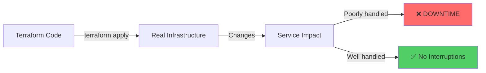
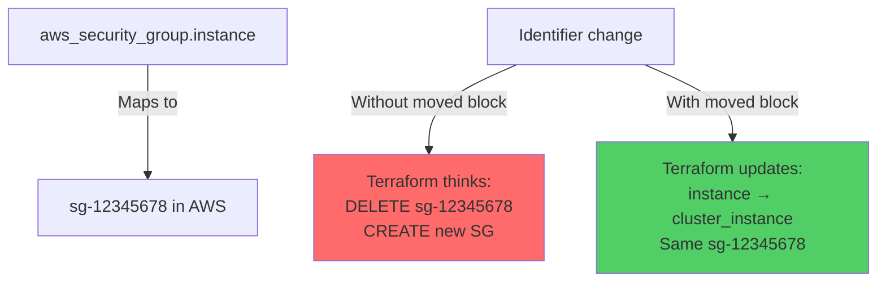
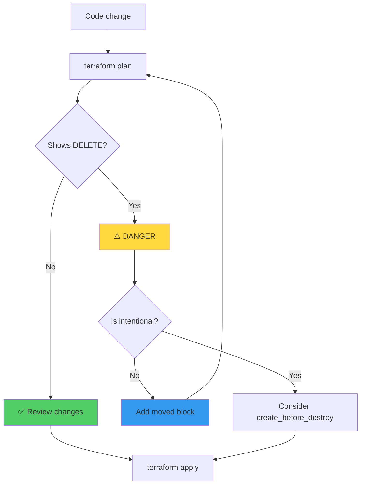
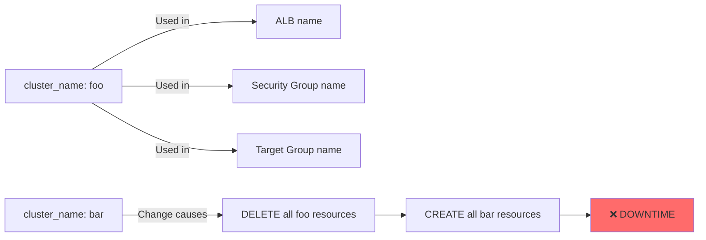
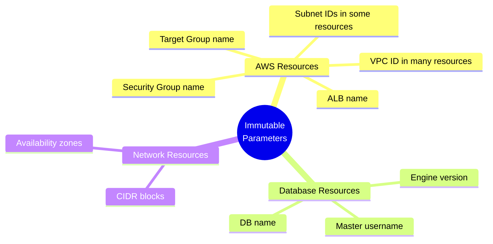
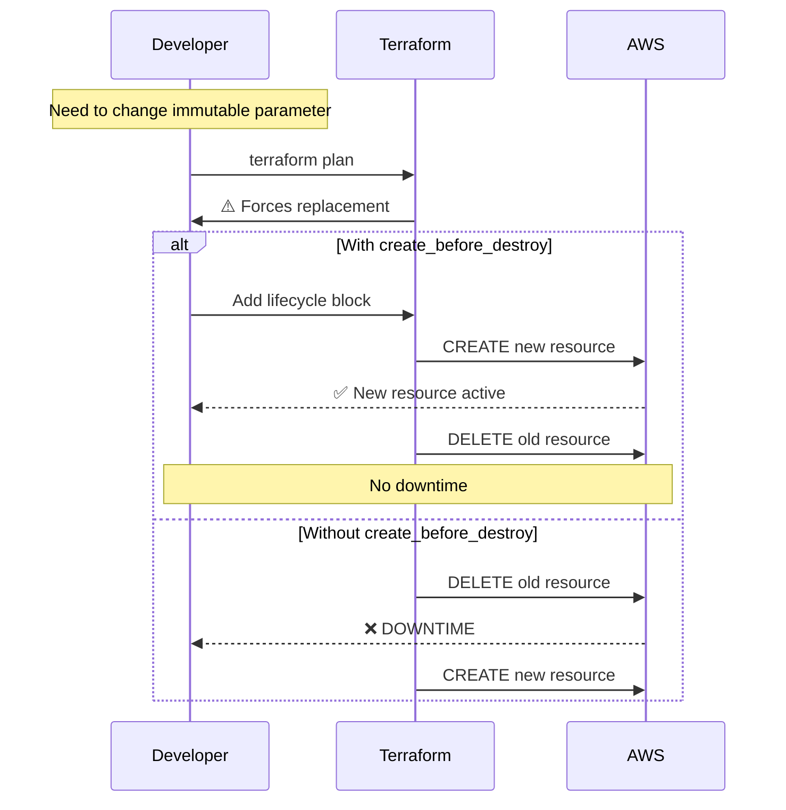
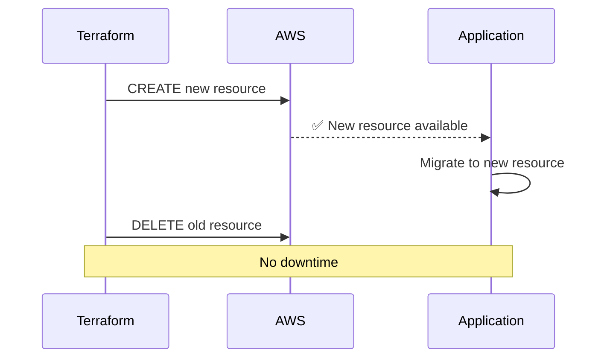
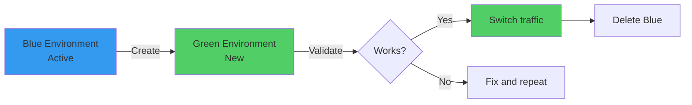
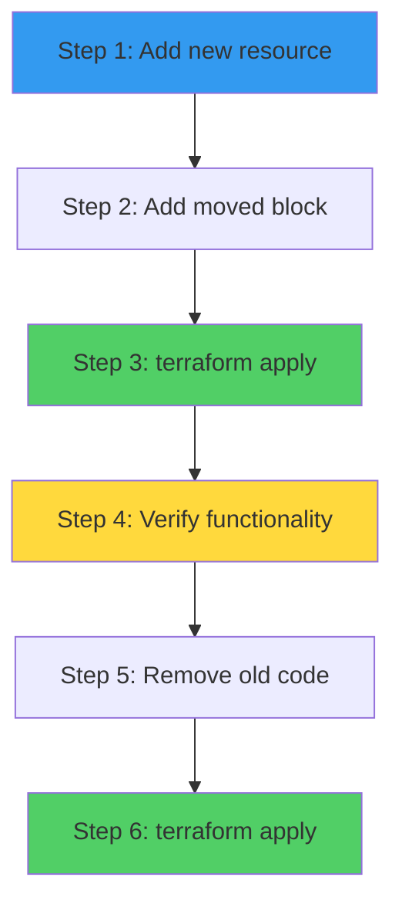
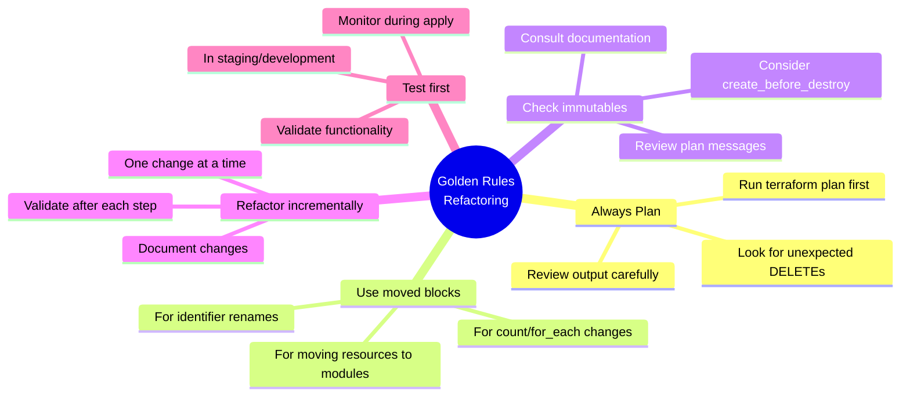

# Best Practices: Safe Refactoring in Terraform

## Table of Contents

1. [Fundamental Principles](#fundamental-principles)
2. [Refactoring Checklist](#refactoring-checklist)
3. [Common Cases and Solutions](#common-cases-and-solutions)
4. [Immutable Parameters](#immutable-parameters)
5. [Deployment Strategies](#deployment-strategies)

## Fundamental Principles

### 1. Terraform is Declarative, but Changes Have Real Consequences



**Golden rule:** Every code change can result in real infrastructure changes. Always validate before applying.

### 2. Identifiers Are Identities

Terraform associates each resource identifier with a cloud provider ID:



### 3. Always Use `terraform plan`



## Refactoring Checklist

### Before Refactoring

- [ ] **Run `terraform plan`** to see current state
- [ ] **Document the reason** for refactoring
- [ ] **Identify critical resources** that might be affected
- [ ] **Review dependencies** between resources
- [ ] **Check immutable parameters** in documentation

### During Refactoring

- [ ] **Make incremental changes** (not all at once)
- [ ] **Add `moved` blocks** for identifier renames
- [ ] **Run `terraform plan`** after each change
- [ ] **Verify no unexpected DELETEs**
- [ ] **Document changes** with code comments

### After Refactoring

- [ ] **Run final `terraform plan`** to confirm
- [ ] **Apply in staging first** if possible
- [ ] **Monitor during apply** in production
- [ ] **Verify services work** after the change
- [ ] **Update documentation** if necessary

## Common Cases and Solutions

### Case 1: Rename Resource Variable

**Problem:**
```hcl
# Before
variable "cluster_name" {
  default = "foo"
}

# After
variable "cluster_name" {
  default = "bar"  # ⚠️ DANGER
}
```

**Impact:**


**Solution:**
- Don't change the value after initial deployment
- If necessary, create new resources first
- Migrate gradually

### Case 2: Rename Resource Identifier

**Problem:**
```hcl
# Before
resource "aws_security_group" "instance" { }

# After
resource "aws_security_group" "cluster_instance" { }
```

**Solution:**
```hcl
resource "aws_security_group" "cluster_instance" { }

moved {
  from = aws_security_group.instance
  to   = aws_security_group.cluster_instance
}
```

### Case 3: Move Resource to Module

**Problem:**
```hcl
# Before: Resource in root
resource "aws_security_group" "instance" { }

# After: Resource in module
module "cluster" {
  source = "./modules/cluster"
}
```

**Solution:**
```hcl
module "cluster" {
  source = "./modules/cluster"
}

moved {
  from = aws_security_group.instance
  to   = module.cluster.aws_security_group.instance
}
```

### Case 4: Change from `count` to `for_each`

**Problem:**
```hcl
# Before
resource "aws_instance" "example" {
  count = 3
}

# After
resource "aws_instance" "example" {
  for_each = toset(["instance-1", "instance-2", "instance-3"])
}
```

**Solution:**
```hcl
resource "aws_instance" "example" {
  for_each = toset(["instance-1", "instance-2", "instance-3"])
}

moved {
  from = aws_instance.example[0]
  to   = aws_instance.example["instance-1"]
}

moved {
  from = aws_instance.example[1]
  to   = aws_instance.example["instance-2"]
}

moved {
  from = aws_instance.example[2]
  to   = aws_instance.example["instance-3"]
}
```

### Case 5: Add `count` or `for_each` to Existing Resource

**Problem:**
```hcl
# Before
resource "aws_security_group" "instance" { }

# After
resource "aws_security_group" "instance" {
  count = 2  # ⚠️ DANGER
}
```

**Impact:** Terraform will interpret this as deleting the single resource and creating multiple resources.

**Solution:**
```hcl
# Option 1: Rename first, then add count
resource "aws_security_group" "instances" {
  count = 2
}

moved {
  from = aws_security_group.instance
  to   = aws_security_group.instances[0]
}

# Option 2: Create new resources and delete old one after
```

## Immutable Parameters

### Common Resources with Immutable Parameters



### How to Identify Immutable Parameters

1. **Check official documentation** for the resource
2. **Run `terraform plan`** - will show if recreation is required
3. **Review Terraform error messages**

### Strategy for Changing Immutable Parameters



## Deployment Strategies

### 1. Create Before Destroy

**When to use:**
- Critical resources that cannot be offline
- Resources referenced by other active resources
- Load balancers, security groups, databases

**Example:**
```hcl
resource "aws_security_group" "instance" {
  # ...
  
  lifecycle {
    create_before_destroy = true
  }
}
```

**Flow:**


### 2. Blue-Green Deployment

For major changes, consider creating a completely new environment:



### 3. Incremental Refactoring



## Summary: Golden Rules



## Conclusion

Refactoring in Terraform requires:

1. ✅ **Knowledge** of how Terraform handles state
2. ✅ **Care** when making seemingly simple changes
3. ✅ **Tools** like `moved` blocks and `create_before_destroy`
4. ✅ **Validation** constantly with `terraform plan`
5. ✅ **Documentation** of changes and decisions

**Remember:** In Terraform, a "simple" code change can have real consequences on infrastructure. Always validate before applying.
