# Refactoring in Terraform: Complete Documentation

## 📚 Available Documents

This directory contains complete documentation on safe refactoring in Terraform:

### 1. [REFACTORING_TERRAFORM.md](./REFACTORING_TERRAFORM.md)
**Main document** with complete explanation of the problem, solutions, and Mermaid diagrams.

**Content:**
- The problem of dangerous refactoring
- Safe refactoring flow
- Solutions: `moved` blocks and `terraform state mv`
- Method comparison
- Best practices
- Safe refactoring checklist

### 2. [BEST_PRACTICES_REFACTORING.md](./BEST_PRACTICES_REFACTORING.md)
**Best practices guide** with common cases and deployment strategies.

**Content:**
- Fundamental principles
- Complete refactoring checklist
- Common cases and solutions
- Immutable parameters
- Deployment strategies (create_before_destroy, blue-green, incremental)

### 3. [zero-downtime-deployment/live/global/moved-example/REFACTORING_GUIDE.md](./zero-downtime-deployment/live/global/moved-example/REFACTORING_GUIDE.md)
**Specific guide** for the practical example with `moved` blocks.

**Content:**
- Step-by-step example
- Visual method comparison
- Common use cases
- Specific checklist

## 🎯 Key Concepts

### The Main Problem

```mermaid
graph LR
    A[Refactoring<br/>in code] -->|Without care| B[❌ DOWNTIME]
    A -->|With moved blocks| C[✅ No changes]
    
    style B fill:#ff6b6b
    style C fill:#51cf66
```



### Recommended Solution

```hcl
# Rename resource identifier
resource "aws_security_group" "cluster_instance" {
  name = var.security_group_name
}

# moved block to automatically update state
moved {
  from = aws_security_group.instance
  to   = aws_security_group.cluster_instance
}
```

## 📖 Documentation Structure

```
05-tips-and-tricks/
├── REFACTORING_TERRAFORM.md                    # Main document
├── BEST_PRACTICES_REFACTORING.md               # Best practices
├── README_REFACTORING.md                       # This file
└── zero-downtime-deployment/
    └── live/
        └── global/
            └── moved-example/
                ├── main.tf                     # Code with comments
                ├── variables.tf                # Variables with comments
                └── REFACTORING_GUIDE.md        # Example guide
```

## 🔍 Commented Code

All code files in this directory have been updated with detailed comments explaining:

- ⚠️ **Refactoring dangers** in each critical resource
- 📝 **Explanations** of why certain changes are dangerous
- ✅ **Solutions** and best practices
- 🔗 **References** between resources

### Files with Added Comments

1. `zero-downtime-deployment/live/global/moved-example/main.tf`
   - Complete explanation of the `moved` blocks example
   - Comments about the problem and solution

2. `zero-downtime-deployment/modules/services/webserver-cluster/main.tf`
   - Comments on critical resources (ALB, Security Groups, Target Groups)
   - Explanation of `create_before_destroy`
   - Warnings about immutable parameters

3. `zero-downtime-deployment/modules/services/webserver-cluster/variables.tf`
   - Warnings about `cluster_name` and its use in multiple resources
   - Explanation of why changing this variable is dangerous

## 🚀 Quick Start

### To Understand the Problem

1. Read [REFACTORING_TERRAFORM.md](./REFACTORING_TERRAFORM.md)
2. Review the Mermaid diagrams explaining the flow
3. Understand why refactoring can cause downtime

### To Learn the Solution

1. Read [zero-downtime-deployment/live/global/moved-example/REFACTORING_GUIDE.md](./zero-downtime-deployment/live/global/moved-example/REFACTORING_GUIDE.md)
2. Review the code in `moved-example/main.tf`
3. Run the example following the instructions

### To Apply Best Practices

1. Read [BEST_PRACTICES_REFACTORING.md](./BEST_PRACTICES_REFACTORING.md)
2. Use the checklist before each refactoring
3. Consult common cases when encountering similar problems

## 📊 Included Diagrams

All documents include Mermaid diagrams that visualize:

- ✅ Dangerous vs safe refactoring flows
- ✅ Method comparisons
- ✅ Operation sequences
- ✅ Decisions and checklists
- ✅ Resource structures and dependencies

## 🎓 Recommended Learning

### Basic Level
1. Understand what refactoring is in Terraform
2. Know the basic dangers
3. Learn to use `terraform plan` correctly

### Intermediate Level
1. Master the use of `moved` blocks
2. Understand `create_before_destroy`
3. Identify immutable parameters

### Advanced Level
1. Complex deployment strategies
2. Refactoring large modules
3. Migrating from `count` to `for_each`

## 🔗 References

- [Terraform: Up and Running, 3rd Edition](http://www.terraformupandrunning.com)
- [Terraform Documentation: moved blocks](https://www.terraform.io/docs/language/modules/develop/refactoring.html)
- [Terraform Documentation: state mv](https://www.terraform.io/docs/cli/commands/state/mv.html)

## ⚠️ Important Reminders

1. **Always run `terraform plan` before applying changes**
2. **Use `moved` blocks for identifier renames**
3. **Check immutable parameters in documentation**
4. **Consider `create_before_destroy` for critical resources**
5. **Refactor incrementally, not all at once**

---

**Last updated:** Documentation created with examples from "Terraform: Up and Running, 3rd Edition"
