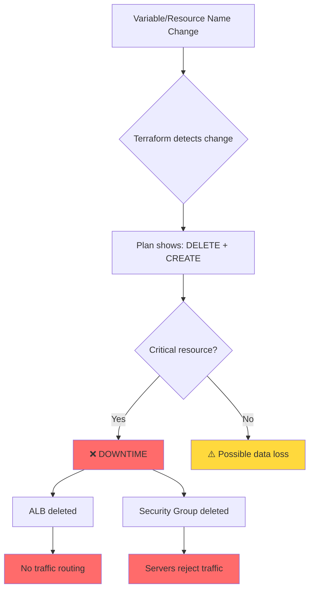
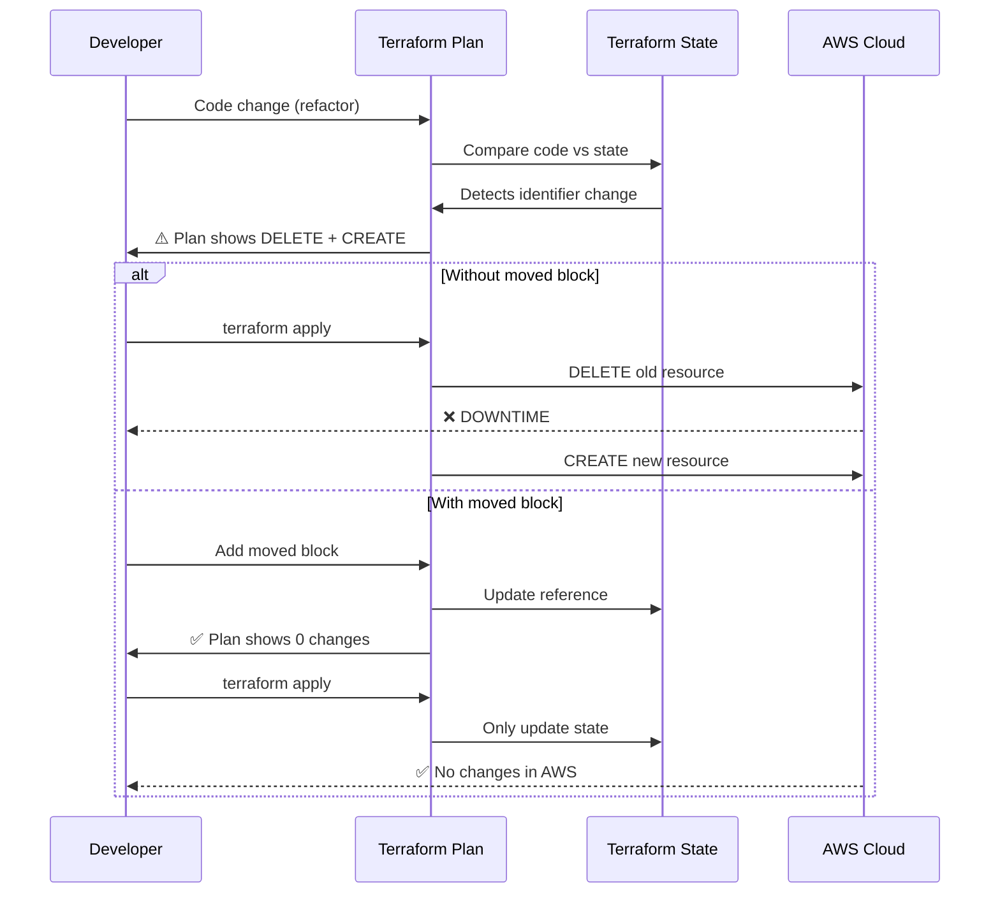
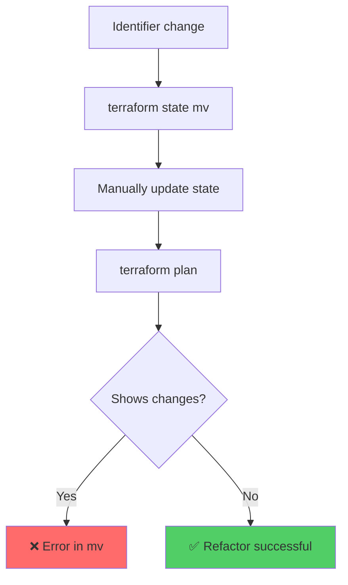
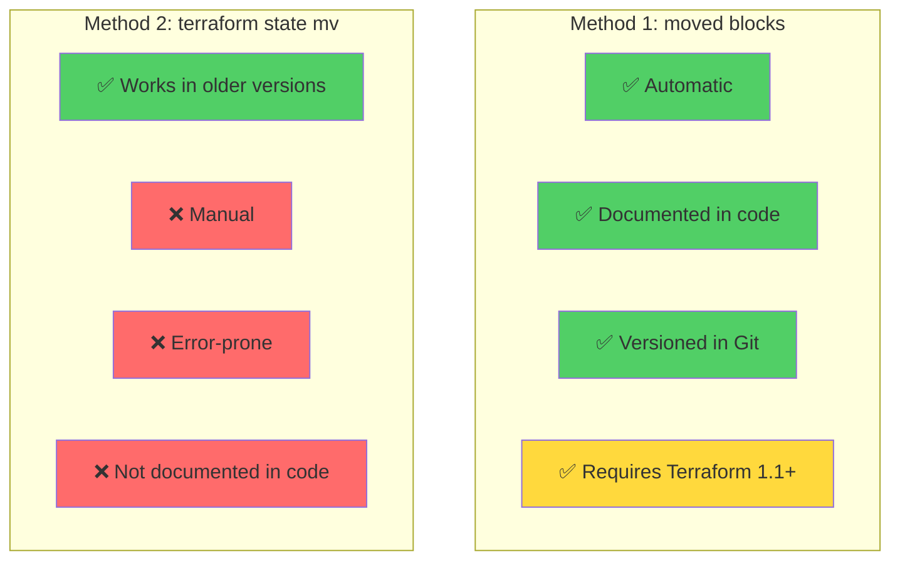
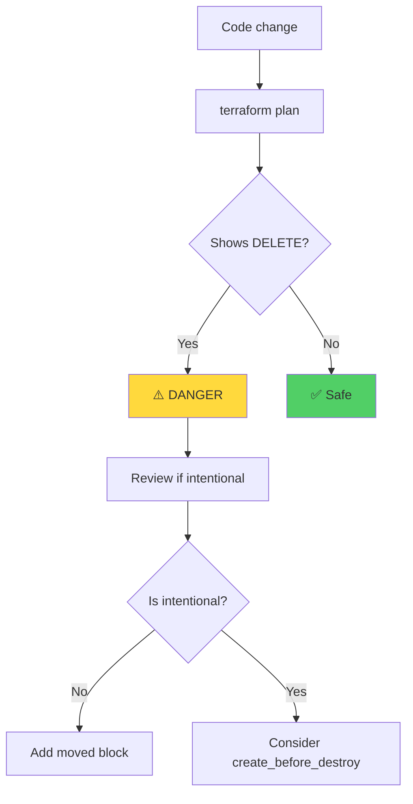
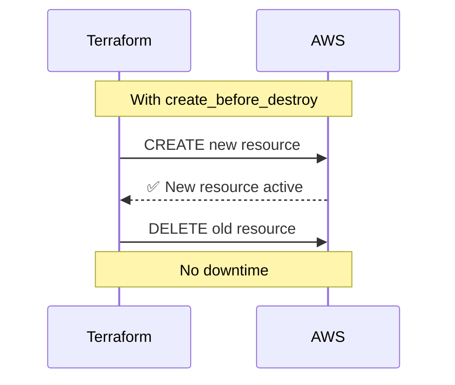
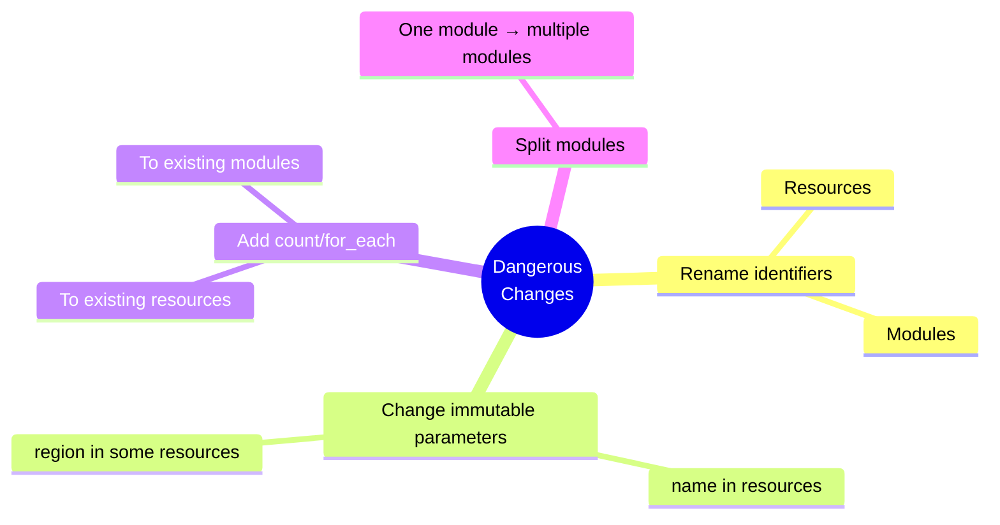
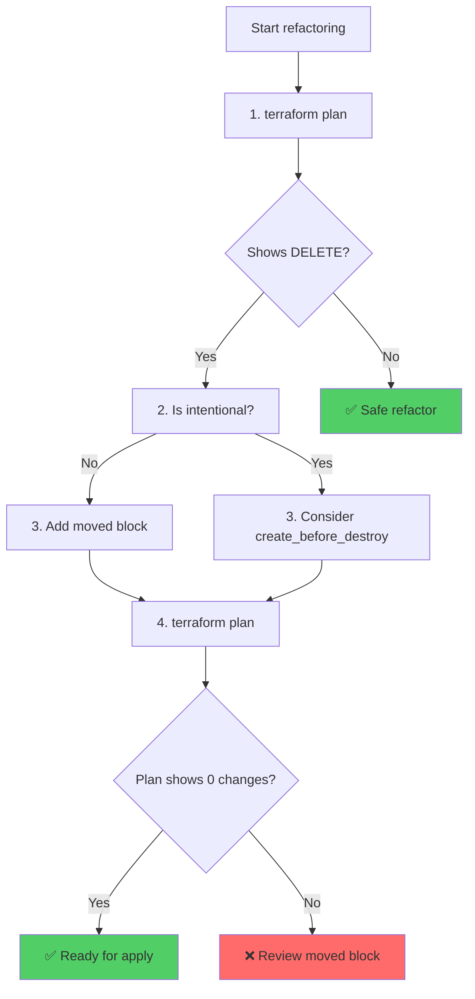

# Refactoring in Terraform: Dangers and Solutions

## Introduction

Refactoring in Terraform requires special care. Unlike traditional programming languages where renaming variables or functions is trivial, in Terraform these changes can cause **downtime** and **resource loss**.

## The Problem: Dangerous Refactoring

### Problem Diagram



### Common Cases of Dangerous Refactoring

#### 1. Renaming Resource Variables

**Problematic Example:**

```hcl
# BEFORE: variable cluster_name = "foo"
# AFTER: variable cluster_name = "bar"

resource "aws_lb" "example" {
  name = var.cluster_name  # Changes from "foo" to "bar"
  # ...
}
```

**Consequence:** Terraform deletes the ALB "foo" and creates a new one "bar", causing downtime.

#### 2. Renaming Resource Identifiers

**Problematic Example:**

```hcl
# BEFORE
resource "aws_security_group" "instance" {
  # ...
}

# AFTER
resource "aws_security_group" "cluster_instance" {
  # ...
}
```

**Consequence:** Terraform interprets this as deleting `instance` and creating `cluster_instance`, causing downtime.

#### 3. Changing Immutable Parameters

Many resources have immutable parameters. If you change them, Terraform must delete and recreate the resource.

## Safe Refactoring Flow



## Solutions

### 1. Use `moved` Blocks (Terraform 1.1+)

**Advantage:** Automatic, documented in code, versioned.


**Example:**

```hcl
# Renamed resource
resource "aws_security_group" "cluster_instance" {
  name = var.security_group_name
}

# moved block to automatically update state
moved {
  from = aws_security_group.instance
  to   = aws_security_group.cluster_instance
}
```

### 2. Use `terraform state mv` (Manual)

**Advantage:** Works in versions prior to Terraform 1.1.

**Disadvantage:** Requires manual execution, error-prone.



**Command:**

```bash
terraform state mv \
  aws_security_group.instance \
  aws_security_group.cluster_instance
```

## Method Comparison



## Best Practices

### 1. Always Use `terraform plan`



### 2. Use `create_before_destroy` When Necessary

If you really need to replace a resource, use `create_before_destroy`:

```hcl
lifecycle {
  create_before_destroy = true
}
```

**Flow:**



### 3. Check Resource Documentation

Many parameters are immutable. Always check the documentation before changing parameters.

### 4. Refactor in Steps


## Special Cases

### Changes Requiring Special Attention



## Summary: Safe Refactoring Checklist



## Conclusion

Refactoring in Terraform requires:

1. ✅ **Always use `terraform plan`** before applying changes
2. ✅ **Use `moved` blocks** for identifier refactoring
3. ✅ **Check documentation** for immutable parameters
4. ✅ **Consider `create_before_destroy`** when necessary to replace resources
5. ✅ **Refactor in steps** to minimize risks

Remember: **Terraform is declarative, but code changes can have real consequences on infrastructure.**
