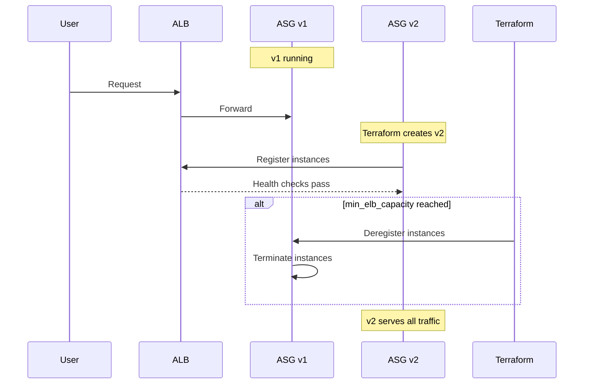

# Architecture — Zero-Downtime Deployment

This document contains diagrams that illustrate the zero-downtime deployment
strategies implemented in this example repository.

## Blue-Green replacement (create_before_destroy)



## Instance Refresh (in-place rolling)

```mermaid
flowchart LR
  User --> ALB
  ALB --> ASG[ASG (instance_refresh)]
  subgraph Refresh
    ASG --> Batch1
    ASG --> Batch2
    ASG --> Batch3
  end
  Batch1 --> ALB
  Batch2 --> ALB
  Batch3 --> ALB
```

## Notes

- `min_elb_capacity` ensures Terraform waits until a minimum number of
  instances in the new ASG are healthy before deleting the old ASG.
- `instance_refresh` performs the replacement inside the same ASG and is
  controlled using `min_healthy_percentage`.
