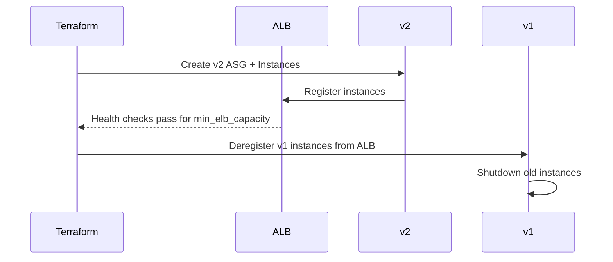
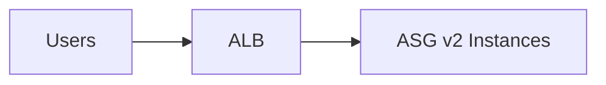

# Zero-Downtime Deployment — Example

This example demonstrates two common strategies for performing zero-downtime
deployments with Auto Scaling Groups (ASGs) and an Application Load Balancer
(ALB) on AWS:

- Create-before-destroy replacement using `create_before_destroy` on the
  launch configuration + ASG (blue-green style replacement).
- In-place rolling replacement using AWS `instance_refresh` on the ASG.

The code in this folder shows both approaches so you can experiment:

- `modules/services/webserver-cluster` — blue-green style: Terraform
  replaces the ASG by creating a new ASG (v2), waits for instances to
  register in the ALB, then removes the old ASG (v1).
- `modules/services/webserver-cluster-instance-refresh` — instance-refresh
  style: Terraform triggers an AWS Instance Refresh to roll instances in
  place with a controlled healthy percentage.

This README explains the high-level flow (Figures 5-3 → 5-6), expected
behaviour during deployment, and provides a small curl loop demo to observe
zero-downtime behavior.

## High-level flow (blue-green replacement)

Figure 5-3: New ASG (v2) boots instances, registers them in the ALB, and
starts serving traffic.

```mermaid
flowchart LR
  subgraph v2 [New ASG (v2)]
    v2i1[Instance v2-1]
    v2i2[Instance v2-2]
  end
  subgraph ALB[ALB]
    TG[Target Group]
  end
  v2i1 --> TG
  v2i2 --> TG
  TG --> Users[Users]
```

Figure 5-4: After `min_elb_capacity` instances from v2 are healthy, Terraform
starts to deregister instances in the old ASG (v1). Those instances are
deregistered and then shut down.



Figure 5-5: Eventually all v1 instances are terminated and only v2 remains.



## Observing the deployment (curl loop demo)

The example module exposes a `server_text` variable. While performing a
deployment you can change `server_text` from "New server text" to
"foo bar" and re-run `terraform apply` to see the rollout happen without
downtime.

On Linux/macOS you can run this one-liner to poll the ALB once per second
and watch the response alternate while both v1 and v2 are registered:

```bash
while true; do curl -s http://<load_balancer_url>/ | sed -n 's/.*<h1>\(.*\)<\/h1>.*/\1/p'; sleep 1; done
```

Expected behavior:
- For the first minute you'll see the original response (`New server text`).
- As v2 instances register you will see responses alternate between the
  old and new text (`New server text` and `foo bar`).
- After the old ASG is torn down you will only see the new text.

## Safe deployment and rollback behavior

- The blue-green replacement uses `create_before_destroy` and the
  `min_elb_capacity` setting on the ASG to ensure Terraform waits for the
  new ASG to be healthy before destroying the old one. If the new ASG
  fails to reach healthy capacity, Terraform treats the change as failed
  and leaves the old ASG running.
- The instance-refresh approach uses AWS native `instance_refresh` which
  performs a rolling replacement in-place and respects the configured
  `min_healthy_percentage`. If the refresh fails, the refresh aborts and
  existing instances remain serving traffic.

## Where to find the code

- Blue-green example: `modules/services/webserver-cluster`
- Instance refresh example: `modules/services/webserver-cluster-instance-refresh`
- Wrapper examples (stage/prod): `live/*/services/webserver-cluster*`

## Next steps

- Try the curl loop demo while changing `server_text` in a wrapper.
- Compare the two strategies and observe the difference in how AWS and
  Terraform coordinate instance lifecycle.
