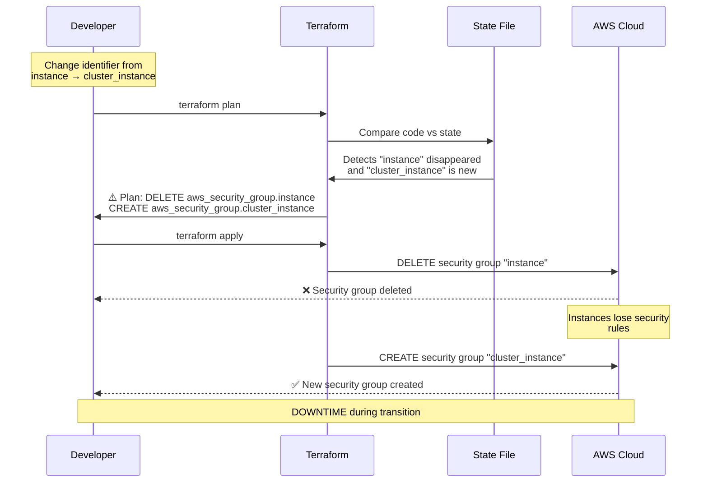
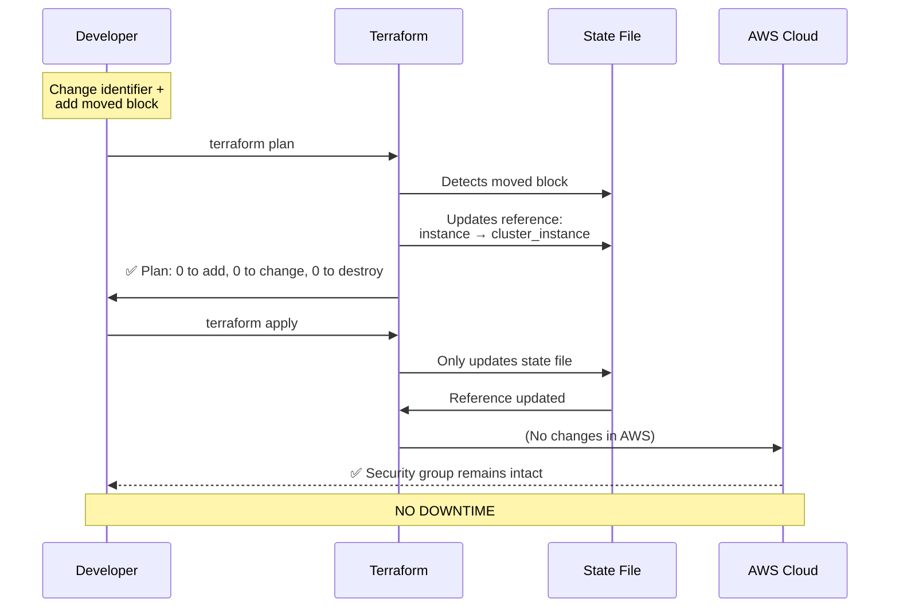
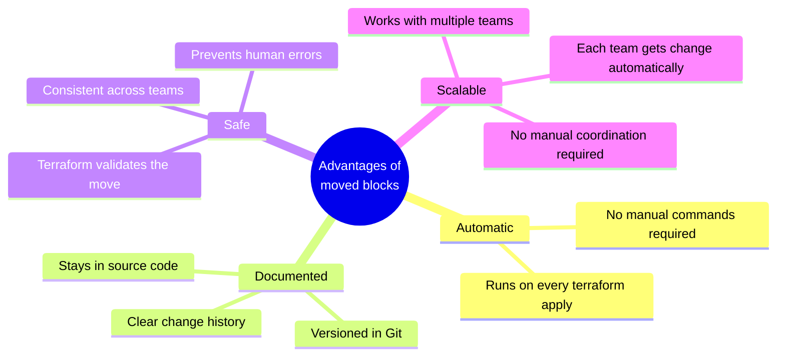
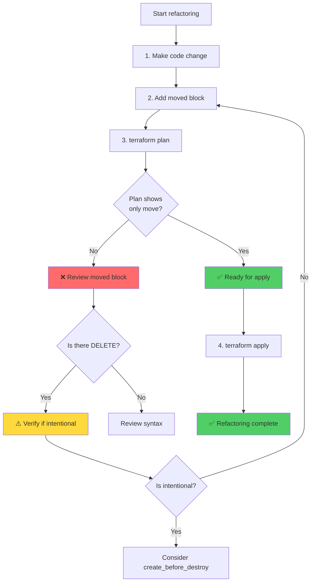

# Refactoring Guide: Example with `moved` Blocks

## Summary

This example demonstrates how to safely refactor Terraform code using `moved` blocks to avoid downtime when renaming resource identifiers.

## The Problem

### Initial Scenario

Imagine you have a security group with the identifier `instance`:

```hcl
resource "aws_security_group" "instance" {
  name = var.security_group_name
}
```

### The Desired Change

You want to rename it to `cluster_instance` for greater clarity:

```hcl
resource "aws_security_group" "cluster_instance" {
  name = var.security_group_name
}
```

### What Would Happen Without `moved` Block?



**Consequences:**
- ❌ The old security group is deleted first
- ❌ EC2 instances lose their security rules temporarily
- ❌ Network traffic is rejected until the new security group is created
- ❌ Possible service downtime

## The Solution: `moved` Blocks

### Correct Code

```hcl
# New identifier after refactoring
resource "aws_security_group" "cluster_instance" {
  name = var.security_group_name
}

# moved block: tells Terraform the resource was renamed
moved {
  from = aws_security_group.instance
  to   = aws_security_group.cluster_instance
}
```

### What Happens With `moved` Block?



**Result:**
- ✅ Terraform automatically updates the state file
- ✅ The security group in AWS remains intact
- ✅ No changes to real infrastructure
- ✅ No downtime

## Visual Comparison

```mermaid
graph TB
    subgraph "Without moved block"
        A1[Identifier change] --> A2[terraform plan]
        A2 --> A3[⚠️ DELETE + CREATE]
        A3 --> A4[terraform apply]
        A4 --> A5[❌ DOWNTIME]
    end
    
    subgraph "With moved block"
        B1[Identifier change] --> B2[Add moved block]
        B2 --> B3[terraform plan]
        B3 --> B4[✅ Only state update]
        B4 --> B5[terraform apply]
        B5 --> B6[✅ No changes in AWS]
    end
    
    style A5 fill:#ff6b6b
    style B6 fill:#51cf66
    style A3 fill:#ffd93d
    style B4 fill:#51cf66
```



## Steps to Refactor Correctly

### Step 1: Initial State

```hcl
resource "aws_security_group" "instance" {
  name = var.security_group_name
}
```

### Step 2: Add New Resource and `moved` Block

```hcl
# New identifier
resource "aws_security_group" "cluster_instance" {
  name = var.security_group_name
}

# moved block to automatically update state
moved {
  from = aws_security_group.instance
  to   = aws_security_group.cluster_instance
}
```

### Step 3: Verify with `terraform plan`

```bash
$ terraform plan

# aws_security_group.instance has moved to
# aws_security_group.cluster_instance
  # aws_security_group.cluster_instance will be updated in-place
  ~ resource "aws_security_group" "cluster_instance" {
      ~ id   = "sg-12345678" -> (known after apply)
        name = "moved-example-security-group"
        tags = {}
        # (8 unchanged attributes hidden)
    }

Plan: 0 to add, 0 to change, 0 to destroy.
```

### Step 4: Apply Changes

```bash
$ terraform apply
```

Terraform will update the state file without making changes in AWS.

### Step 5: (Optional) Remove Old Code

Once the state is updated, you can remove any references to the old identifier if no longer needed.

## Advantages of `moved` Blocks



## Comparison: `moved` vs `terraform state mv`

### Method 1: `moved` Blocks (Recommended)

**Advantages:**
- ✅ Automatic
- ✅ Documented in code
- ✅ Versioned in Git
- ✅ Consistent across teams
- ✅ Validated by Terraform

**Disadvantages:**
- ❌ Requires Terraform >= 1.1

**Example:**
```hcl
moved {
  from = aws_security_group.instance
  to   = aws_security_group.cluster_instance
}
```

### Method 2: `terraform state mv` (Manual)

**Advantages:**
- ✅ Works in older Terraform versions

**Disadvantages:**
- ❌ Requires manual execution
- ❌ Error-prone
- ❌ Not documented in code
- ❌ Each team must run it manually
- ❌ Easy to forget

**Example:**
```bash
terraform state mv \
  aws_security_group.instance \
  aws_security_group.cluster_instance
```

## Common Use Cases

### 1. Rename Resource Identifier

```hcl
# Before
resource "aws_security_group" "instance" { }

# After
resource "aws_security_group" "cluster_instance" { }

moved {
  from = aws_security_group.instance
  to   = aws_security_group.cluster_instance
}
```

### 2. Move Resource to Module

```hcl
# Before: Resource in root
# resource "aws_security_group" "instance" { }

# After: Resource in module
module "cluster" {
  source = "./modules/cluster"
}

moved {
  from = aws_security_group.instance
  to   = module.cluster.aws_security_group.instance
}
```

### 3. Change from `count` to `for_each`

```hcl
# Before
resource "aws_instance" "example" {
  count = 3
  # ...
}

# After
resource "aws_instance" "example" {
  for_each = toset(["instance-1", "instance-2", "instance-3"])
  # ...
}

moved {
  from = aws_instance.example[0]
  to   = aws_instance.example["instance-1"]
}

moved {
  from = aws_instance.example[1]
  to   = aws_instance.example["instance-2"]
}

moved {
  from = aws_instance.example[2]
  to   = aws_instance.example["instance-3"]
}
```

## Safe Refactoring Checklist



## Best Practices

1. **Always use `terraform plan` first**
   - Verify the move is correct
   - Confirm no unexpected changes

2. **Document the reason for the change**
   - Add comments explaining why it was renamed
   - Facilitates future maintenance

3. **Keep `moved` blocks temporarily**
   - Don't delete them immediately after the change
   - Allows other teams to update their state

4. **Use Terraform versions >= 1.1**
   - Ensures full support for `moved` blocks

5. **Validate in staging environments first**
   - Test refactoring in staging before production

## Conclusion

`moved` blocks are the modern and recommended way to handle refactoring in Terraform. They provide:

- ✅ Automatic safety
- ✅ Code documentation
- ✅ Consistency across teams
- ✅ Downtime prevention

**Golden rule:** Always add a `moved` block when renaming resource identifiers, modules, or changing `count`/`for_each` structure.
