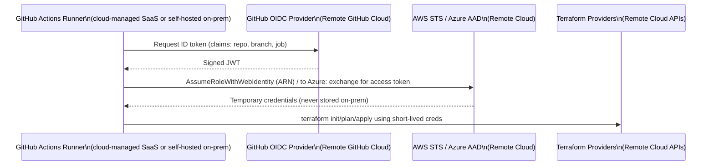
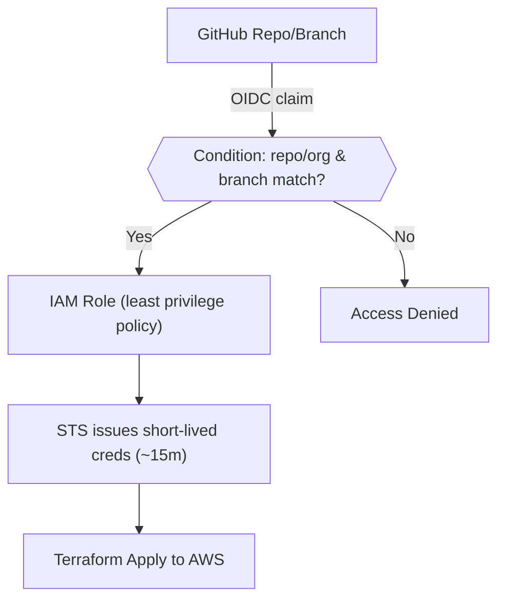
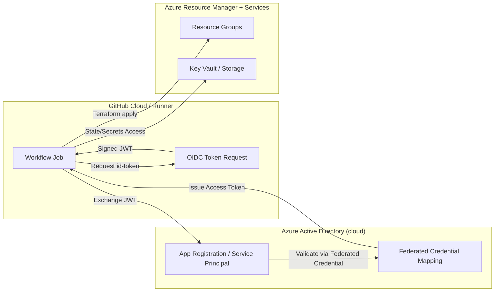
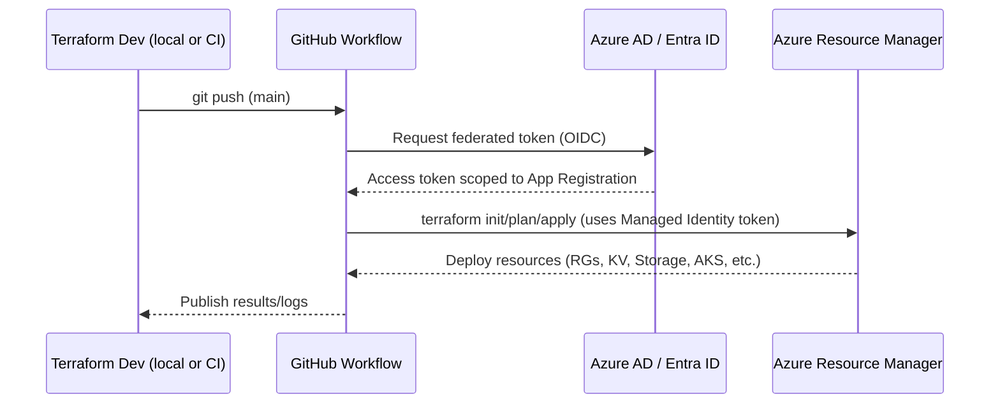
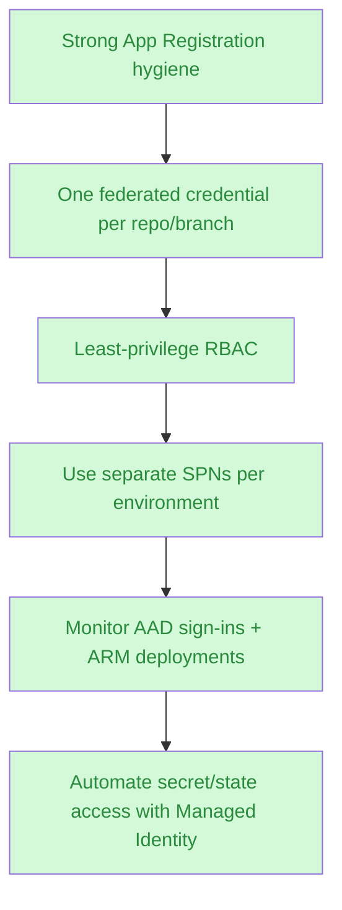
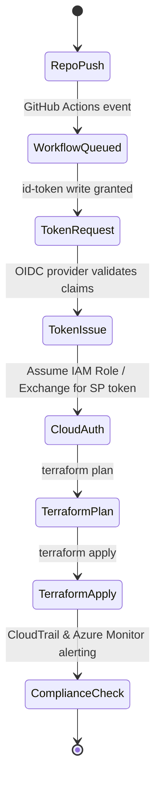
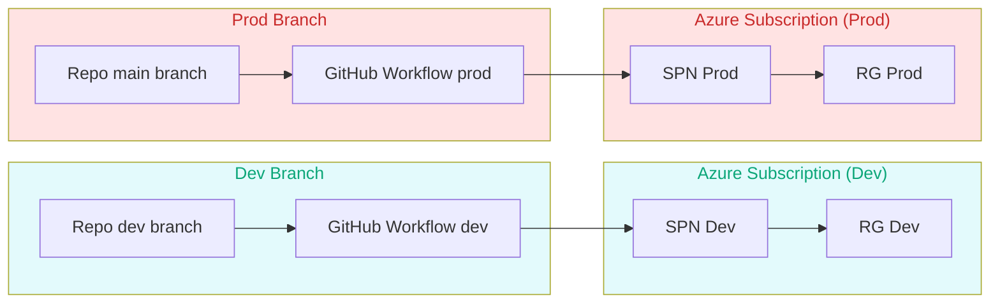

# GitHub Actions CI with OIDC (AWS & Azure)

GitHub Actions can authenticate directly to cloud providers via OpenID Connect (OIDC), removing the need to store static cloud credentials in repository secrets. This approach delivers short-lived, per-run tokens, reduces blast radius, and aligns with Terraform’s best practices for machine users (Table 6-2).

---

## 1. High-Level Flow



Benefits:

- No long-lived cloud keys in GitHub Secrets.
- Fine-grained scoping by repository + branch.
- Automatic key rotation (every workflow run gets new credentials).

---

## 2. Sample GitHub Workflow (Terraform)

```yaml
name: Terraform Apply

on:
  push:
    branches:
      - main

permissions:
  id-token: write      # required for OIDC
  contents: read

jobs:
  TerraformApply:
    runs-on: ubuntu-latest
    steps:
      - uses: actions/checkout@v3
      - uses: hashicorp/setup-terraform@v2
        with:
          terraform_version: 1.6.6
          terraform_wrapper: false

      # Authenticate to AWS via OIDC
      - uses: aws-actions/configure-aws-credentials@v4
        with:
          role-to-assume: arn:aws:iam::123456789012:role/github-terraform
          aws-region: us-east-2

      - name: Terraform Apply
        run: |
          terraform init
          terraform apply -auto-approve
```

For Azure, you would swap the AWS step for `azure/login@v1` with federated credentials (see section 5).

---

## 3. AWS Setup (Terraform code from `github-actions-oidc/main.tf`)

```hcl
# 1. Create an IAM OIDC identity provider for GitHub
resource "aws_iam_openid_connect_provider" "github_actions" {
  url             = "https://token.actions.githubusercontent.com"
  client_id_list  = ["sts.amazonaws.com"]
  thumbprint_list = [
    data.tls_certificate.github.certificates[0].sha1_fingerprint
  ]
}

data "tls_certificate" "github" {
  url = "https://token.actions.githubusercontent.com"
}

# 2. IAM role trusted by the provider
resource "aws_iam_role" "github_terraform" {
  name_prefix        = var.name
  assume_role_policy = data.aws_iam_policy_document.assume_role_policy.json
}

data "aws_iam_policy_document" "assume_role_policy" {
  statement {
    actions = ["sts:AssumeRoleWithWebIdentity"]
    effect  = "Allow"

    principals {
      type        = "Federated"
      identifiers = [aws_iam_openid_connect_provider.github_actions.arn]
    }

    condition {
      test     = "StringEquals"
      variable = "token.actions.githubusercontent.com:sub"
      values = [
        for a in var.allowed_repos_branches :
        "repo:${a.org}/${a.repo}:ref:refs/heads/${a.branch}"
      ]
    }
  }
}
```

**Key inputs:**

```hcl
variable "allowed_repos_branches" {
  type = list(object({
    org    = string
    repo   = string
    branch = string
  }))

  description = <<EOT
List of GitHub repositories and branches that may assume this IAM role.
Example:
allowed_repos_branches = [
  {
    org    = "brikis98"
    repo   = "terraform-up-and-running-code"
    branch = "main"
  }
]
EOT
}
```

Attach least-privilege policies to `aws_iam_role.github_terraform` (e.g., EC2 admin, Terraform state access).

---

## 4. Security Considerations (AWS)



- **Scope claims:** Include branch (`ref:refs/heads/main`) and optionally audience (`aud`), repository owner, or workflow name to avoid letting forks/PRs assume the role. Treat `allowed_repos_branches` as a contract; keep it synchronized with your `.github/workflows` to avoid build failures or privilege gaps.
- **Rotate thumbprints:** Monitor GitHub’s OIDC certificates for rotation.
- **Separate roles per environment:** e.g., `github-terraform-staging`, `github-terraform-prod`.
- **Avoid wildcard values:** Never set `values = ["repo:*"]`.

---

## 5. Azure Setup with OIDC

Azure calls this “federated credentials” for service principals.

### Steps



1. **Create an Azure AD App Registration** (service principal) dedicated to Terraform CI (one per environment recommended).
1. **Add a Federated Credential** to the App Registration:
   - Entity type: GitHub Actions.
   - Scope to a specific repository and branch (`main`, `release/*`, etc.).
   - Audience: `api://AzureADTokenExchange`.
   - Name the credential descriptively: `gh-terraform-main`.
1. **Assign RBAC roles** via Azure Portal, CLI, or Terraform:
   - Minimum required scope (e.g., Resource Group Contributor, Storage Blob Data Contributor for backend access).
   - Avoid `Owner` unless absolutely necessary.
1. **Configure GitHub Secrets** with static identifiers (no secrets):
   - `AZURE_CLIENT_ID` (App Registration).
   - `AZURE_TENANT_ID`.
   - `AZURE_SUBSCRIPTION_ID`.
1. **GitHub Workflow Step:** authenticate using `azure/login@v1` (or `azure/login@v2`).

```yaml
- uses: azure/login@v1
  with:
    client-id: ${{ secrets.AZURE_CLIENT_ID }}
    tenant-id: ${{ secrets.AZURE_TENANT_ID }}
    subscription-id: ${{ secrets.AZURE_SUBSCRIPTION_ID }}
```

The action detects the federated credential and exchanges the OIDC token for an Azure access token without client secrets.

1. **Run Terraform with AzureRM provider** (environment variables are set automatically: `ARM_CLIENT_ID`, `ARM_TENANT_ID`, `ARM_SUBSCRIPTION_ID`, `ARM_ACCESS_TOKEN`).

### Full Terraform Procedure (Azure)



Detailed steps:

1. Runner boots with GitHub-provided identity.
2. `azure/login` requests a federated token using the workflow’s OIDC JWT.
3. Azure AD validates repo + branch from the federated credential.
4. Access token (typically 1h) is returned for the service principal.
5. Terraform commands use the Azure CLI credential chain to authenticate to ARM, Key Vault, Storage, etc.

### Azure Services Involved

- **Azure Active Directory (Microsoft Entra ID):** Hosts the App Registration, federated credentials, and issues access tokens (remote cloud control plane).
- **Azure Resource Manager (ARM):** Accepts the access token to deploy infrastructure (remote cloud API).
- **azure/login GitHub Action:** Uses the GitHub-hosted runner (cloud) or self-hosted runner (on-prem) to request tokens.
- **(Optional) Azure Key Vault / Storage / State Backend:** Where Terraform state or secrets may live; ensure the federated identity has tailored access.
- **Azure Monitor / Activity Logs:** Track token exchanges and deployments for auditing.
- **Azure Policy:** Enforce conditional access or resource tagging requirements triggered by CI deployments.

### Terraform Example (conceptual)

```hcl
provider "azurerm" {
  features {}
}

resource "azurerm_resource_group" "example" {
  name     = "rg-terraform-gh"
  location = "eastus"
}
```

### Azure Use Cases

| Scenario | How OIDC Helps |
|----------|----------------|
| Deploying to multiple subscriptions | Create separate App Registrations per subscription (`sp-terraform-dev`, `sp-terraform-prod`) and reference different role IDs per environment. |
| Accessing Key Vault secrets during plan | Give the federated identity `Key Vault Secrets User` on the specific vault; no secrets stored in GitHub. |
| Managing Terraform state in Azure Storage | Grant `Storage Blob Data Contributor` on the backend account so Terraform can read/write state securely. |
| Hybrid pipelines (self-hosted runners) | Runners on-prem still use OIDC; ensure outbound HTTPS to `login.microsoftonline.com`. |

### Azure Best Practices



1. **One SPN per blast radius.** Dev/stage/prod should not share the same App Registration.
2. **Lock RBAC scope.** Assign at resource group or subscription level only as needed.
3. **Enable Conditional Access (if possible).** Require compliant device or IP restrictions for self-hosted runners.
4. **Monitor federated sign-ins.** Azure AD sign-in logs show the repository, branch, and workflow; alert on unknown repos.
5. **Cache provider plugins securely.** Use Terraform Cloud or Azure Cache to reduce runtime without storing secrets.
6. **Document fallback path.** If OIDC fails, define a break-glass service principal with secrets stored in Azure Key Vault guarded by access policies.

### Azure CLI / Terraform Procedure (Hands-on)

```bash
# 1. Create Service Principal (App Registration) without password
az ad sp create-for-rbac \
  --name "sp-terraform-gh-prod" \
  --role Contributor \
  --scopes /subscriptions/<SUB_ID>/resourceGroups/<RG_NAME> \
  --years 1 \
  --only-show-errors

# 2. Add federated credential (GitHub repo/branch)
az ad app federated-credential create \
  --id <APP_OBJECT_ID> \
  --parameters '{
        "name": "gh-main",
        "issuer": "https://token.actions.githubusercontent.com",
        "subject": "repo:ORG/REPO:ref:refs/heads/main",
        "audiences": ["api://AzureADTokenExchange"]
  }'

# 3. Store identifiers (no secrets) in GitHub repo secrets
gh secret set AZURE_CLIENT_ID --body "<APP_CLIENT_ID>"
gh secret set AZURE_TENANT_ID --body "<TENANT_ID>"
gh secret set AZURE_SUBSCRIPTION_ID --body "<SUB_ID>"
```

**Terraform backend example (Azure Storage):**

```hcl
terraform {
  backend "azurerm" {
    resource_group_name  = "rg-terraform-backend"
    storage_account_name = "stterraformprod"
    container_name       = "tfstate"
    key                  = "prod/terraform.tfstate"
  }
}
```

Grant `Storage Blob Data Contributor` to `sp-terraform-gh-prod` on the storage account to allow backend read/write.

### Troubleshooting Azure OIDC

| Symptom | Likely Cause | Fix |
|---------|--------------|-----|
| `AADSTS7000218: The request body must contain client_id` | `azure/login` not supplied with client ID/tenant ID/subscription ID | Ensure secrets exist and workflow references them. |
| `invalid_grant: 700027` when exchanging token | Federated credential subject mismatch (repo or branch) | Verify `subject` matches `repo:ORG/REPO:ref:refs/heads/<branch>`; update federated credential accordingly. |
| Terraform cannot access backend or KV | Missing RBAC role (Blob Data Contributor, Key Vault Secrets User) | Assign required roles at correct scope (resource, RG, subscription); re-run. |
| Self-hosted runner blocked | No outbound HTTPS to `login.microsoftonline.com` or `token.actions.githubusercontent.com` | Open firewall/proxy; ensure TLS inspection doesn’t break token signing cert. |
| Over-permissive deployments | Same SPN used for dev + prod | Split App Registrations; enforce branch-based access (main vs dev). |



### Additional Azure Deployment Patterns



---

## 6. Comparing AWS vs Azure OIDC Auth

| Feature | AWS OIDC | Azure Federated Credential |
|---------|----------|----------------------------|
| Identity target | IAM Role ARN | Service Principal (App Registration) |
| Claim scoping | `sub = repo:org/repo:ref:refs/heads/<branch>` | Repo + branch configured in federated credential |
| GH workflow requirements | `id-token: write` + `aws-actions/configure-aws-credentials` | `id-token: write` + `azure/login` |
| Token lifetime | STS default 15 min (configurable) | Access token (typically 1 hour) |
| Multi-account support | Use different role ARNs per account | Use separate SPNs per subscription/tenant |

---

## 7. Checklist for Secure GitHub Actions + OIDC

1. **Define allowed repositories & branches explicitly** (Terraform variable `allowed_repos_branches` / Azure federated credential entries).
2. **Grant minimal IAM/RBAC permissions** to the assumed role/service principal.
3. **Store only static identifiers** (ARN, tenant ID) in GitHub secrets; avoid long-lived keys.
4. **Enable `id-token: write` & `contents: read` only for jobs that need cloud access.
5. **Audit CloudTrail / Azure AD logs** for unexpected STS/AAD token exchanges.
6. **Use separate roles per environment** (dev/stage/prod) and rotate policies when repos change.
7. **Combine with Terraform state protections** (KMS, Key Vault, backend IAM).

By leveraging GitHub Actions OIDC flows, you can run Terraform in a fully managed CI/CD pipeline without ever copying cloud credentials into GitHub, drastically reducing the attack surface while keeping workflows reproducible.
