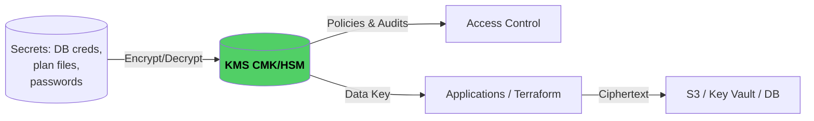
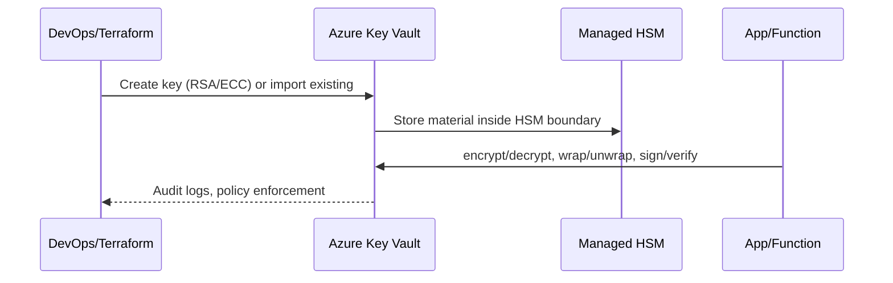
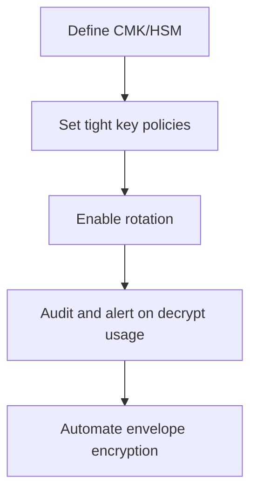

# AWS & Azure KMS Overview

Key Management Services (KMS) provide centrally managed, hardware-backed encryption keys so you can encrypt secrets, plan/state files, databases, and application data without embedding raw keys inside your codebase.

---

## 1. Why Use KMS?



- **Centralized control:** Key rotation, access policies, and audit trails live in one place.
- **Envelope encryption:** KMS issues short-lived data keys so plaintext keys never leave secure memory.
- **Least privilege:** IAM/Azure AD policies define *who* can encrypt/decrypt (developers, CI/CD, services).
- **Compliance ready:** Hardware security modules (HSMs) and audit logs satisfy regulatory requirements.

---

## 2. AWS KMS Basics

### Terminology

| Term | Description |
|------|-------------|
| **Customer Managed Key (CMK)** | A key you control (encryption context, rotation, policies). |
| **Alias** | Friendly name that points to the CMK (`alias/example-key`). |
| **Grant/Key Policy** | Fine-grained access rules for principals (IAM users, roles, services). |

### Terraform Workflow (from `kms-cmk/main.tf`)

```hcl
resource "aws_kms_key" "cmk" {
  policy                  = data.aws_iam_policy_document.cmk_admin_policy.json
  deletion_window_in_days = 7
}

resource "aws_kms_alias" "cmk" {
  name          = "alias/${var.alias}"
  target_key_id = aws_kms_key.cmk.id
}
```

**Key steps:**
1. Create a CMK with a strong policy (limit `kms:*` to trusted admins).
2. Add an alias so other modules reference `alias/my-secrets`.
3. Use the CMK to encrypt artifacts (e.g., `mysql-kms/db-creds.yml.encrypted`).
4. Decrypt on-the-fly via `aws_kms_secrets` or service-integrated KMS APIs (S3 SSE-KMS, DynamoDB, RDS, etc.).

### AWS Use Cases

| Use Case | How KMS Helps |
|----------|---------------|
| **Encrypt plan/state files** | Enable S3 SSE-KMS + DynamoDB KMS with CMK limited to CI/CD role. |
| **Protect application secrets** | Encrypt YAML/JSON blobs offline, commit ciphertext, decrypt in Terraform. |
| **Envelope encryption for services** | AWS services auto-use KMS when you enable SSE or HSM-backed keys. |

---

## 3. Azure KMS (Key Vault + Managed HSM)

Azure combines **Key Vault** (for secrets/certs) with **Managed HSM** (for FIPS 140-2 Level 3 hardware).



### Core Concepts

| Component | Purpose |
|-----------|---------|
| **Key Vault** | REST + RBAC interface to store secrets, keys, certs. |
| **Managed HSM** | Dedicated hardware cluster for high-assurance keys. |
| **Access Policies / RBAC** | Control which users/apps can access encryption operations. |
| **Managed Identities** | Let Azure services authenticate without storing secrets. |

### Terraform CLI Flow (conceptual)

1. `azurerm_key_vault` to create the vault, define SKU (standard or premium).
2. `azurerm_key_vault_key` to create or import keys; optionally replicate to multiple regions.
3. `azurerm_key_vault_secret` to store encrypted values (or use KMS to wrap data keys).
4. Consume the key/secret from VMs, Functions, or Terraform data sources using Managed Identity.

---

## 4. Best Practices (AWS & Azure)



1. **Shortest trust path:** Limit `kms:Decrypt` to specific roles (CI, Terraform, deployments). Use separate CMKs per environment.
2. **Rotate often:** Enable automatic rotation (AWS) or scheduled rollover (Azure). Document how apps fetch new key IDs.
3. **Encrypt at multiple layers:**  
   - Use KMS for S3 bucket SSE, DynamoDB tables, SNS/SQS topics.  
   - Use KMS to wrap secrets that live in Git (encrypted files) or config stores.
4. **Protect plan/state files:** Store them in KMS-encrypted storage; treat access as sensitive as root credentials.
5. **Log & monitor:** CloudTrail / Azure Monitor should alert on unexpected decrypt calls or alias changes.
6. **Don’t leak plaintext:** Keep decrypted files in tmpfs or memory; sanitize shell history and CI logs.

---

## 5. When to Choose AWS KMS vs Azure Key Vault/HSM

| Scenario | Recommended Platform |
|----------|----------------------|
| Workloads fully in AWS | AWS KMS (integrates with every AWS service, cost-effective). |
| Multi-cloud / hybrid with Azure workloads | Use each cloud’s native KMS to minimize cross-cloud IAM complexity. |
| Extremely sensitive workloads requiring dedicated hardware | Azure Managed HSM or AWS CloudHSM (more costly, more control). |

---

## 6. Quick Reference

- **Encrypting Terraform secrets (AWS):**
  1. `aws_kms_key` + alias per environment.
  2. `encrypt.sh` (OpenSSL + KMS data keys) or `aws kms encrypt`.
  3. Commit `*.encrypted` files, never plaintext.
  4. Use `aws_kms_secrets` data source to decrypt at apply time.

- **Encrypting Terraform secrets (Azure):**
  1. Provision Key Vault/Managed HSM.
  2. `az keyvault secret set --vault-name ... --file secret.json`.
  3. Retrive via `azurerm_key_vault_secret` data source or Managed Identity at runtime.
  4. Use Vault RBAC to isolate dev/stage/prod.

By standardizing on KMS-backed workflows, your teams avoid manual key juggling, keep secrets out of version control, and gain the auditability needed for compliance and security reviews.***

