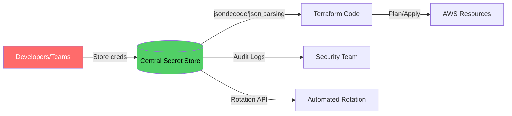
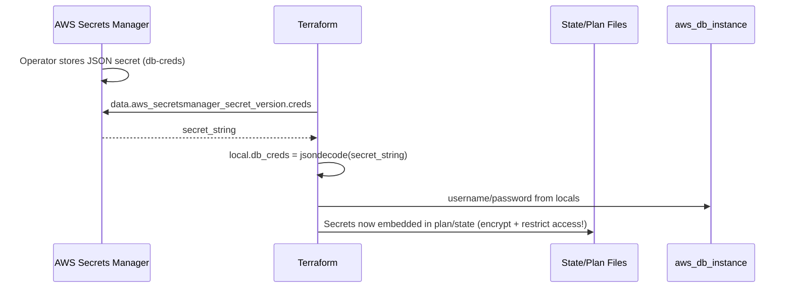
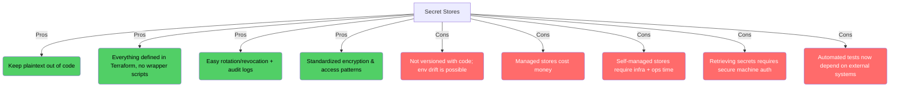
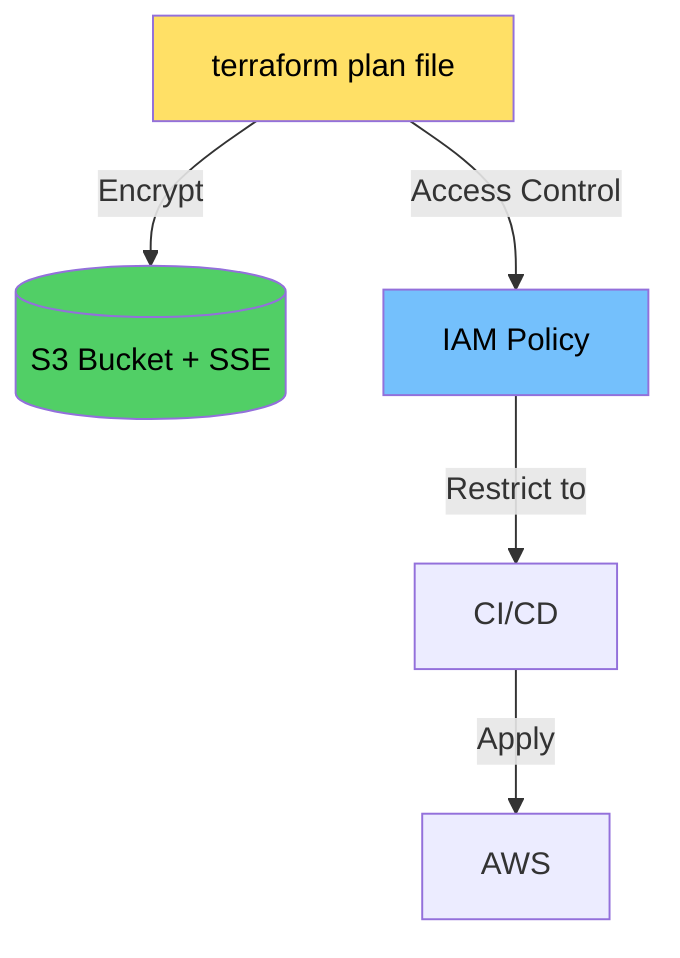

# Secret Management with Terraform (Chapter 6 Notes)

## Why Secret Stores Matter

- Centralized secret stores (AWS Secrets Manager, Google Secret Manager, Azure Key Vault, HashiCorp Vault) prevent the inconsistency that comes from every team inventing a different encryption workflow.
- Store credentials as JSON (`{"username":"app","password":"s3cret"}`) so Terraform can `jsondecode` into typed structures.
- Give each secret a unique name such as `db-creds`; treat the secret identifier like an API contract across environments.

## Example Workflow in Terraform

- Fetch the latest version of the secret with `aws_secretsmanager_secret_version`.
- Parse with `jsondecode` and keep the decoded object in a local for reuse.
- Pass the values into resources (`aws_db_instance`) knowing that the source of truth stays in the secret store.

## Advantages vs Drawbacks

**Key numbers:** AWS Secrets Manager is ~$0.40/secret/month plus $0.05 per 10k API calls. Typical small deployments land in the $10–$25/month range; large deployments can hit hundreds of dollars.

## Comparing Machine User Options (Table 6-2)

| Capability | Stored credentials | IAM roles | OIDC |
|------------|-------------------|-----------|------|
| Avoid manual credential management | ✗ | ✓ | ✓ |
| Avoid permanent credentials | ✗ | ✓ | ✓ |
| Works inside the cloud provider | ✗ | ✓ | ✗ |
| Works outside the cloud provider | ✓ | ✗ | ✓ |
| Widely supported (2022) | ✓ | ✓ | ✗ |

## Comparing Methods to Pass Secrets to Resources (Table 6-3)

| Capability | Env vars | Encrypted files | Secret stores |
|------------|----------|-----------------|---------------|
| Keeps plaintext out of code | ✓ | ✓ | ✓ |
| Everything defined as code | ✗ | ✓ | ✓ |
| Audit log for key access | ✗ | ✓ | ✓ |
| Audit log for individual secrets | ✗ | ✗ | ✓ |
| Easy rotation/revocation | ✗ | ✗ | ✓ |
| Easy to standardize practices | ✗ | ✗ | ✓ |
| Secrets versioned with the code | ✗ | ✓ | ✗ |
| Storing secrets is easy | ✓ | ✗ | ✓ |
| Retrieving secrets is easy | ✓ | ✓ | ✗ |
| Integrates with automated tests | ✓ | ✗ | ✗ |
| Cost | $0 | $ | $$$ |

## Handling Plan and State Files

Terraform plan/state files **always** include decoded secrets in plain text:

1. **Encrypt in transit and at rest**  
   - Use TLS for transfers.  
   - Store in S3 with SSE-KMS or SSE-S3; back state with DynamoDB that uses the same CMK.
2. **Tightly control access**  
   - Limit IAM policies so only the CI pipeline (or a tiny set of trusted engineers) can download production plans/states.
3. **Rotate secrets regularly**  
   - Enable automatic rotation (e.g., every 30 days) where the managed service supports it.
4. **Avoid shell history leaks**  
   - Prefix shell commands that include secrets with a space and set `HISTCONTROL=ignoreboth`.

## Checklist

1. Never store secrets in plain text (even temporarily).
2. Prefer centralized secret stores for shared credentials; document unique secret names.
3. When using encrypted files/KMS, keep only ciphertext in git and lock down decrypt permissions.
4. For machine users, choose IAM roles or OIDC so CI never handles long-lived credentials.
5. Always encrypt, version, and protect Terraform state and plan files as if they were the secrets themselves.
6. Audit who accessed which secret and when; enable rotation in managed stores.

## Alternatives to `aws-vault` for Azure

`aws-vault` is popular on AWS because it sources short-lived credentials locally, keeps the long-lived secrets encrypted, and injects the right environment variables before you run Terraform. To get a similar developer experience on Azure, you typically combine Azure AD authentication with Key Vault tooling:

| Azure Alternative | How it maps to `aws-vault` behavior |
|-------------------|--------------------------------------|
| **Azure CLI (`az login`) + `az account get-access-token`** | Stores refresh tokens securely (OS keychain/credential manager) and mints short-lived access tokens for Terraform providers via `ARM_USE_MSI=false` + environment variables. |
| **Azure Developer CLI (`azd auth login`)** | Wraps Azure CLI auth with project-scoped tenants/subscriptions, similar to `aws-vault exec <profile> -- terraform plan`. |
| **Key Vault + `azure-keyvault-env` / `direnv`** | Pulls secrets from Azure Key Vault at shell startup, keeping plaintext only in memory. Equivalent to using `aws-vault exec` to inject `AWS_ACCESS_KEY_ID`/`AWS_SECRET_ACCESS_KEY`. |
| **Managed Identity (locally via `az login --use-device-code`)** | Lets Terraform use the `Azure CLI` credential provider, so no client secrets are stored on disk. On CI you can use federated identities (similar to AWS OIDC). |

Tips:
- Use `az account set --subscription "<name>"` before Terraform commands to mimic `aws-vault exec <profile>`.
- Combine `direnv` with scripts that run `az account get-access-token --resource=https://management.azure.com/` and export `ARM_ACCESS_KEY`/`ARM_CLIENT_ID`/`ARM_TENANT_ID`.
- For Key Vault secrets, prefer `az keyvault secret download --vault-name ... --file - | jq` pipelines so nothing lands on disk, mirroring the `aws-vault` practice of keeping secrets in memory.

