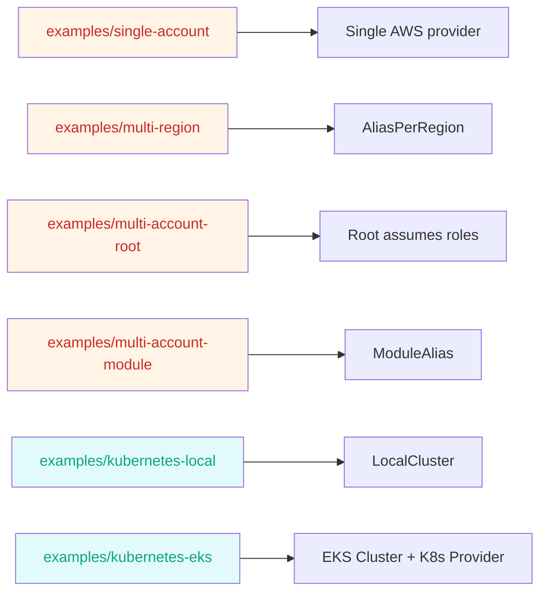
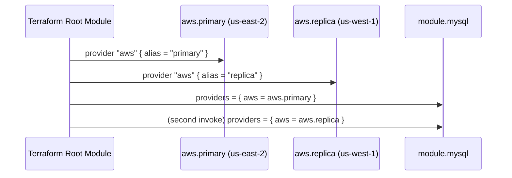
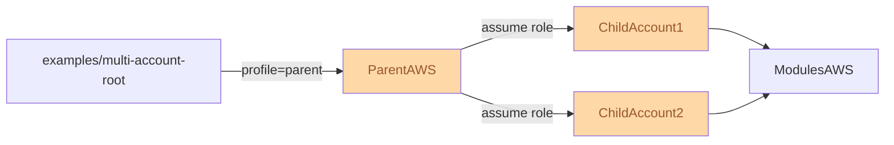
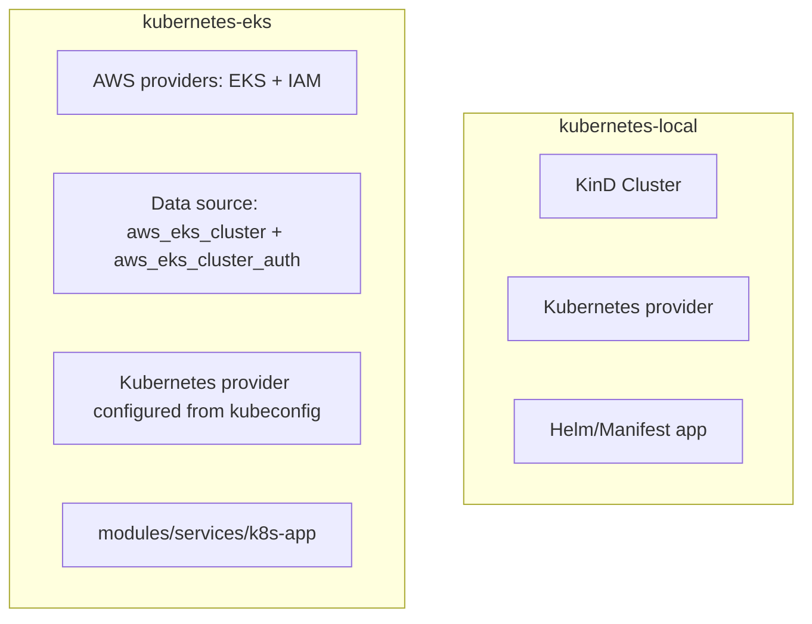
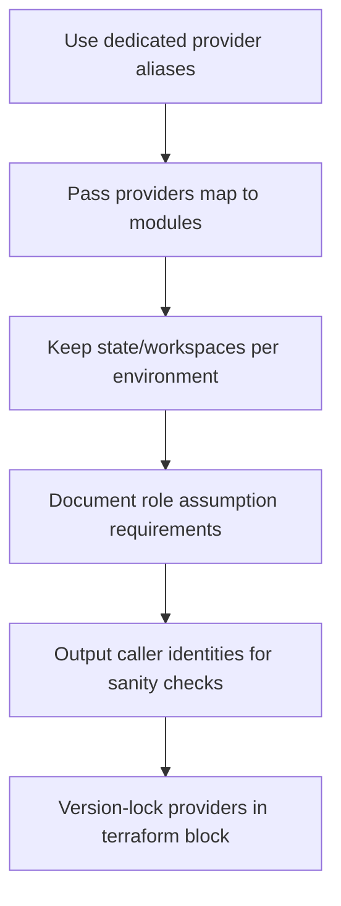

# Working with Multiple Providers (Chapter 7 Notes)

## Map of the Examples Directory

Each subdirectory highlights one provider pattern:

- `single-account`: baseline configuration with a single AWS provider block.
- `multi-region`: same account, multiple regions via provider aliases.
- `multi-account-root`: root Terraform code assumes roles in child accounts.
- `multi-account-module`: modules accept aliased providers.
- `kubernetes-local`: targets a local cluster with the Kubernetes provider.
- `kubernetes-eks`: provisions AWS EKS and then configures Kubernetes via the EKS kubeconfig.

---

## Provider Aliasing Cheat Sheet

- Declare aliases in the root module.
- Pass alias references via the `providers` map when calling modules.
- Inside modules, never declare new provider blocks; rely on the injected alias.

---

## Multi-Account Role Assumption Flow

Steps:
1. Configure the parent profile credentials locally (or via aws-vault/SSO).
2. Terraform root uses the parent provider to assume roles in each child account.
3. Modules receive the child account providers via alias maps.
4. Outputs often include the caller identities so you can verify access.

---

## Kubernetes Example Summary

- Local example points the Kubernetes provider at a KinD/minikube cluster.
- EKS example wires together the AWS and Kubernetes providers so workloads are deployed immediately after the cluster comes online.

---

## Best Practices Checklist

1. **Aliases everywhere:** Even in single-account examples, start with aliases so scaling to multi-region later is easy.
2. **Module inputs:** Make `providers` blocks explicit; avoid relying on default provider since it hinders reuse.
3. **Cross-account credentials:** Document which IAM role names or profiles are required (`README.md` in each example already outlines this; keep it updated).
4. **State isolation:** Multi-region and multi-account deployments usually need separate state backends per environment to avoid drift.
5. **Diagnostics:** Expose outputs like `aws_caller_identity` for parent/child accounts to verify your workflow.

---

## Quick Map from Examples to Modules

| Example | Modules Used | Key Concept |
|---------|--------------|-------------|
| single-account | `modules/services/eks-cluster` | One provider config |
| multi-region | `modules/data-stores/mysql` twice | Same account, multiple regions |
| multi-account-root | `modules/multi-account`, `modules/data-stores/mysql` | Root assumes roles |
| multi-account-module | `modules/multi-account` | Modules accept multiple providers |
| kubernetes-local | `modules/services/k8s-app` | Non-AWS provider usage |
| kubernetes-eks | `modules/services/eks-cluster`, `modules/services/k8s-app` | Chaining AWS + Kubernetes |

Use this table to decide which pattern to follow in your own infrastructure.

