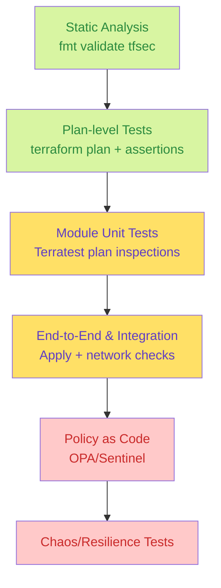
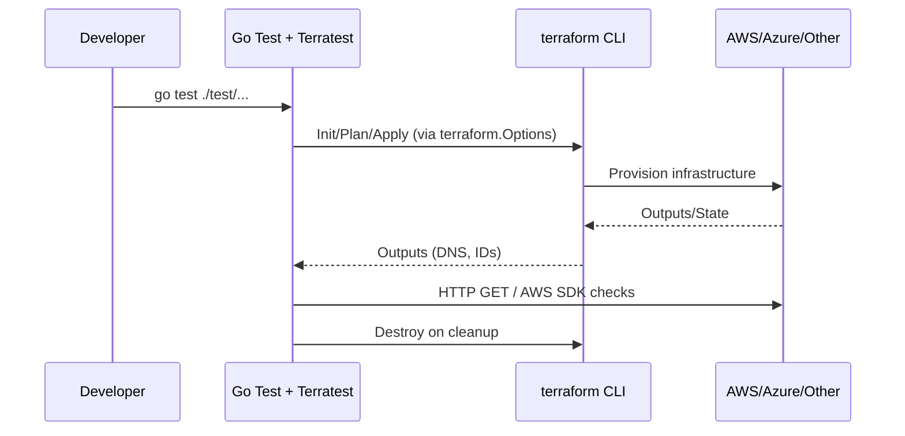
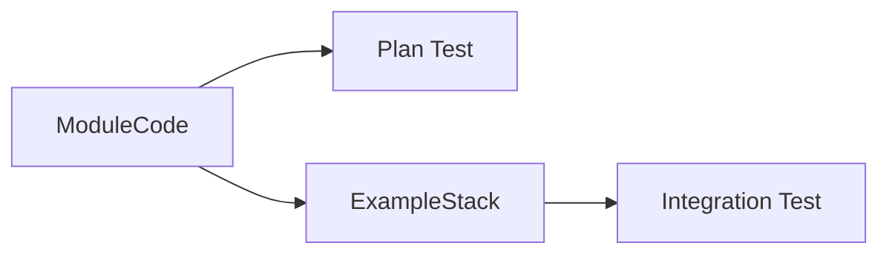
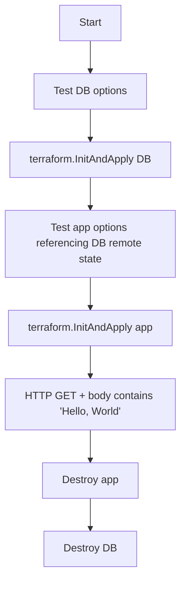
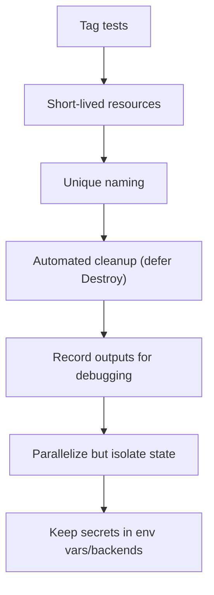
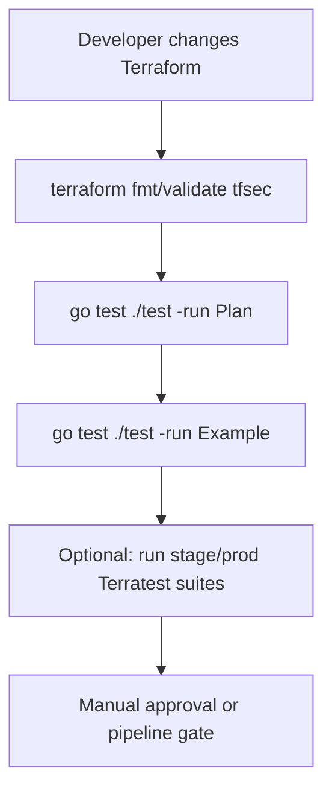

# Testing Terraform Code (Chapter 9 Notes)

## Testing Pyramid for IaC

- **Static analysis** catches syntax and security issues quickly.
- **Plan tests** are fast and validate drift counts or specific attribute values.
- **Unit/integration tests** (Terratest) provision real infra and run HTTP/DB assertions.
- **Policy tests** ensure org-wide rules (tagging, encryption) with OPA or Sentinel.
- **Chaos/Resilience** (advanced) simulate failures after deploy.

---

## Where Terratest Fits

Terratest provides:

- `terraform.Options` wrapper for vars, backend config, retries.
- Helpers like `InitAndApply`, `Destroy`, `OutputRequired`.
- HTTP/database helpers to assert behavior post-deploy.
- `test_structure` package for staged tests (deploy/validate/teardown separated).

---

## Testing Modules vs Examples

| Approach | When to Use | Example from repo |
|----------|-------------|-------------------|
| **Module-focused plan test** | Verify a reusable module produces expected resources without applying | `TestAlbExamplePlan` parses plan counts and attributes |
| **Example/integration test** | Ensure full stack (module wiring + env) works in real cloud | `TestAlbExample`, `TestHelloWorldAppExample` |
| **Staged integration** | Large environments where deploy/validate/teardown happen in separate stages | `TestHelloWorldAppStageWithStages` |

---

## Professional Testing Patterns

1. **Plan & Show assertions**  
   - Use `terraform.InitAndPlan` + `terraform.GetResourceCount`.
   - Inspect structured plan via `terraform.InitAndPlanAndShowWithStruct...`.

2. **Short-lived integration tests**  
   - Spin up resources, run HTTP/API checks, destroy.
   - Run in parallel with unique names (`random.UniqueId()`).

3. **Stage-based workflows**  
   - Save `terraform.Options` to disk (`test_structure.SaveTerraformOptions`).
   - Separate deploy/validate/teardown to rerun failed stages quickly.

4. **Environment parity**  
   - Stage and prod tests share modules; prod tests often gated behind tags.
   - Remote state buckets/locks provided via env vars (`TEST_STATE_S3_BUCKET`).

5. **Retries & Known Failures**  
   - Configure `RetryableTerraformErrors` and HTTP retries for transient issues.

6. **Policy tests**  
   - Evaluate plan JSON with OPA or Sentinel for mandatory tags, encryption, etc.

---

## Sample Terratest Anatomy (Hello World App)

Key helper functions (see `hello_world_integration_test.go`):

- `createDbOpts`: sets unique DB names, credentials, remote backend config.
- `createHelloOpts`: wires remote state bucket/key into the app module.
- `validateHelloApp`: uses `http_helper.HttpGetWithRetryWithCustomValidation`.
- `test_structure.RunTestStage`: orchestrates deploy/validate/teardown.

---

## Best Practices Checklist

- **Tagging/tests selection:** Use `go test -run` to target specific suites; consider build tags for expensive tests.
- **Lifecycle discipline:** Always `defer terraform.Destroy` and use unique IDs to avoid collisions.
- **Parallel execution:** `t.Parallel()` speeds up suites but ensure isolated state buckets/keys.
- **Infrastructure cost control:** Keep default regions close to free tier; tear down aggressively.
- **Secrets & state:** Provide S3/Dynamo (or equivalent) via env vars, not hard-coded into tests.
- **Docs:** Each test file should explain its intent and assumptions (mirrors updates in this repo).

---

## Tools in Use

| Tool | Purpose |
|------|---------|
| **Terratest** (`github.com/gruntwork-io/terratest`) | Go helpers for Terraform init/plan/apply/destroy, HTTP checks, AWS SDK |
| **test_structure** | Stage-based orchestration and state sharing between stages |
| **http-helper** | Simplifies polling HTTP endpoints with retries |
| **OPA / Policy tests** | (See `examples/opa`) evaluate plans for compliance |
| **Go test** | Native `go test ./test/...` runner with parallelism and subtests |

---

## Suggested Workflow

1. Run static analysis locally.
2. Execute plan-level Terratests (fast feedback).
3. Run targeted integration tests (ALB, ASG, Hello World, MySQL).
4. In CI, optionally run staged deployment tests to stage/prod directories.
5. Promote infrastructure changes only after tests pass.

Use these notes alongside the commented test files to understand how to apply modern Terraform testing strategies with Terratest as the backbone.
