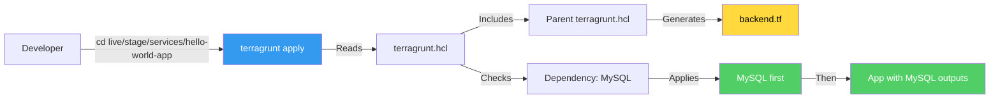
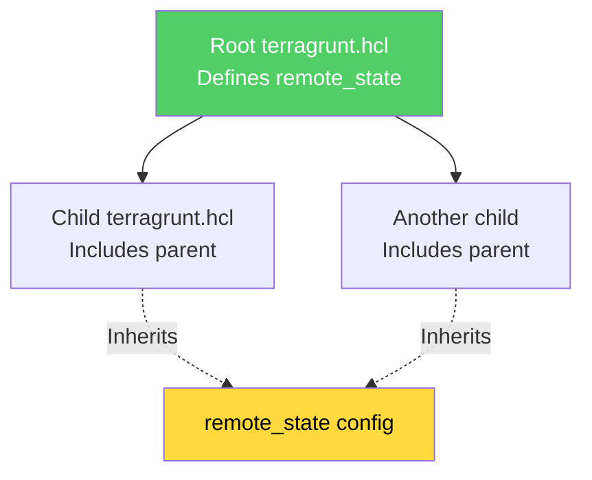
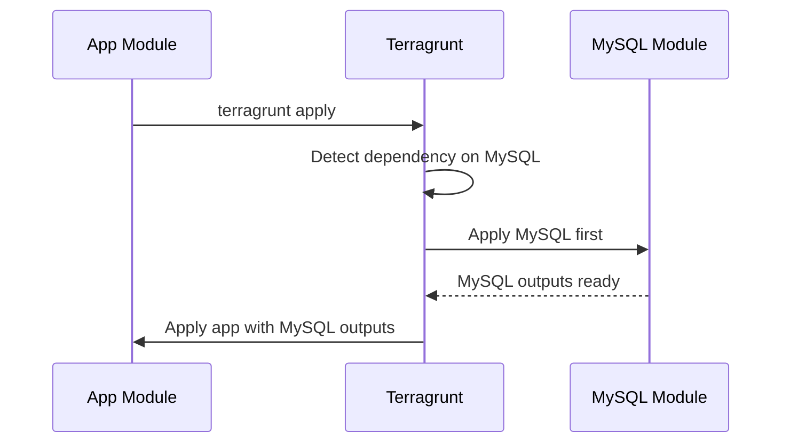
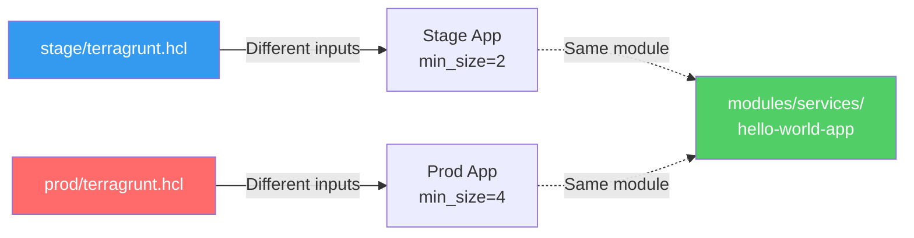

# Terragrunt Documentation Index

This directory contains comprehensive documentation and examples for working with Terragrunt in team environments.

## 📚 Documentation Files

### 1. [TERRAGRUNT_TUTORIAL.md](./TERRAGRUNT_TUTORIAL.md)
**Complete tutorial** covering all Terragrunt concepts with examples.

**Contents:**
- What is Terragrunt and why use it
- Key concepts (include, remote_state, generate, dependency, inputs)
- Detailed flow diagrams
- Common commands with examples
- Best practices checklist
- Real-world examples

**Start here if:** You're new to Terragrunt or want a comprehensive tutorial.

### 2. [TERRAGRUNT_ARCHITECTURE.md](./TERRAGRUNT_ARCHITECTURE.md)
**Architecture and team workflows** documentation.

**Contents:**
- Architecture diagrams
- State file organization
- Dependency flow
- Team collaboration patterns
- Configuration inheritance
- Troubleshooting guide

**Start here if:** You want to understand how Terragrunt works at an architectural level.

## 🗂️ Directory Structure

```
10-terraform-team/
├── live/                          # Live infrastructure configurations
│   ├── stage/                     # Staging environment
│   │   ├── terragrunt.hcl        # Root config (remote_state)
│   │   ├── data-stores/
│   │   │   └── mysql/            # MySQL database
│   │   └── services/
│   │       └── hello-world-app/  # Application service
│   └── prod/                     # Production environment
│       └── ... (same structure)
├── modules/                       # Reusable Terraform modules
│   ├── data-stores/mysql/
│   └── services/hello-world-app/
├── examples/                      # Standalone examples (no Terragrunt)
│   ├── alb/                      # ALB example
│   └── asg/                      # ASG example
└── test/                         # Terratest test files
```

## 🎯 Quick Start

### 1. Understanding the Flow



### 2. Basic Commands

```bash
# Apply a single module
cd live/stage/services/hello-world-app
terragrunt apply

# Apply all modules in dependency order
cd live/stage
terragrunt run-all apply

# Plan changes
terragrunt plan

# Destroy infrastructure
terragrunt destroy
```

### 3. Key Concepts at a Glance

| Concept | Purpose | Example |
|---------|---------|---------|
| **include** | Inherit parent config | `path = find_in_parent_folders()` |
| **remote_state** | Backend configuration | S3 bucket, DynamoDB table |
| **generate** | Auto-create files | Generate `backend.tf` |
| **dependency** | Module dependencies | Wait for MySQL before app |
| **inputs** | Module variables | Pass values to Terraform |

## 🔑 Key Features Explained

### Configuration Inheritance



### Dependency Management



## 📖 Learning Path

1. **Beginner**: Read [TERRAGRUNT_TUTORIAL.md](./TERRAGRUNT_TUTORIAL.md) sections 1-4
2. **Intermediate**: Practice with examples in `live/stage/`
3. **Advanced**: Study [TERRAGRUNT_ARCHITECTURE.md](./TERRAGRUNT_ARCHITECTURE.md)
4. **Expert**: Review all code comments in `live/` directories

## 🛠️ Common Workflows

### Deploying to Staging

```bash
# 1. Set environment variables
export TEST_STATE_S3_BUCKET=my-terraform-state
export TEST_STATE_REGION=us-east-2
export TEST_STATE_DYNAMODB_TABLE=terraform-locks
export TF_VAR_db_username=admin
export TF_VAR_db_password=secret

# 2. Deploy MySQL first
cd live/stage/data-stores/mysql
terragrunt apply

# 3. Deploy application
cd ../services/hello-world-app
terragrunt apply

# Or deploy everything at once
cd live/stage
terragrunt run-all apply
```

### Comparing Environments



## ⚠️ Important Notes

1. **State Files**: Each module gets its own isolated state file
2. **Dependencies**: Terragrunt automatically handles ordering
3. **Backend Config**: Generated automatically, don't edit `backend.tf` manually
4. **Environment Variables**: Use for sensitive values (credentials, bucket names)
5. **Team Collaboration**: Isolated state files prevent conflicts

## 🔍 Code Examples

All code in this directory has been extensively commented:

- **live/stage/terragrunt.hcl**: Root configuration with remote_state
- **live/stage/services/hello-world-app/terragrunt.hcl**: Service with dependency
- **live/stage/data-stores/mysql/terragrunt.hcl**: Database configuration
- **examples/**: Standalone examples showing traditional Terraform approach

## 📊 Comparison: Terragrunt vs Plain Terraform

| Feature | Plain Terraform | Terragrunt |
|---------|----------------|------------|
| Backend config | Manual in each module | Inherited from parent |
| Dependencies | Manual remote_state data sources | Automatic dependency blocks |
| DRY principle | Copy-paste configs | Inherit and override |
| Team workflows | Manual coordination | Automatic isolation |
| State management | Manual key management | Automatic unique keys |

## 🎓 Next Steps

1. Read the tutorial to understand concepts
2. Explore the `live/` directory structure
3. Try running `terragrunt plan` in different directories
4. Experiment with `terragrunt run-all` commands
5. Review the architecture document for advanced patterns

---

**Remember**: Terragrunt is a wrapper around Terraform. It doesn't replace Terraform—it makes working with Terraform easier for teams managing multiple environments and complex dependencies.

