# Terragrunt Architecture & Team Workflows

## Overview

This document explains the architecture of the Terragrunt setup and how teams collaborate using it.

---

## Architecture Diagram

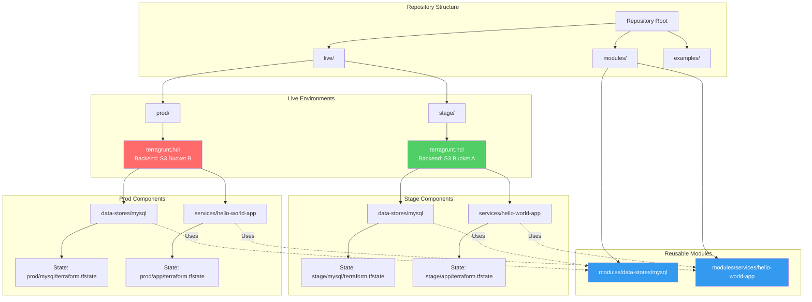

---

## State File Organization

### How State Files Are Organized

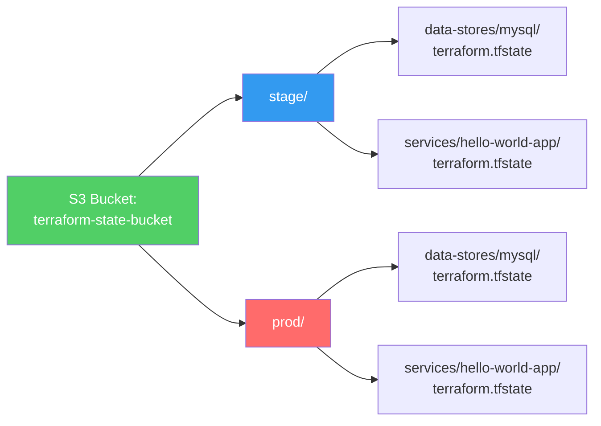

**Key Pattern:**

```hcl
# In root terragrunt.hcl
key = "${path_relative_to_include()}/terraform.tfstate"

# Results in unique keys:
# - stage/data-stores/mysql/terraform.tfstate
# - stage/services/hello-world-app/terraform.tfstate
# - prod/data-stores/mysql/terraform.tfstate
# - prod/services/hello-world-app/terraform.tfstate
```

---

## Dependency Flow

### How Dependencies Work

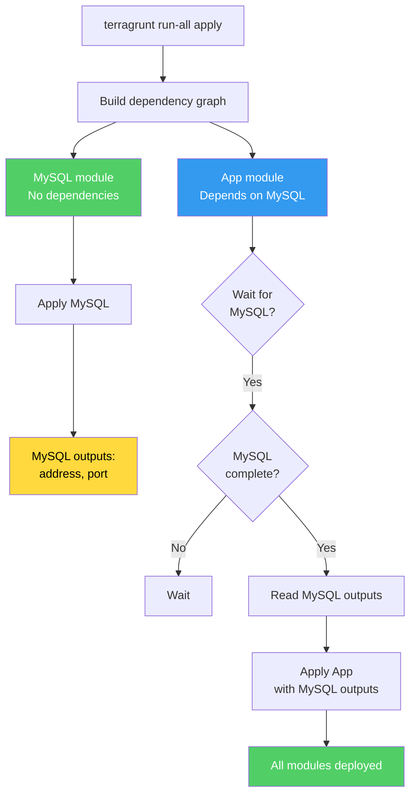

### Dependency Declaration

```hcl
# services/hello-world-app/terragrunt.hcl
dependency "mysql" {
  config_path = "../../data-stores/mysql"
  
  # Optional: Skip if dependency outputs are already available
  skip_outputs = false
  
  # Optional: Mock outputs for plan-only operations
  mock_outputs = {
    address = "mock-db-address"
    port    = 3306
  }
}
```

---

## Team Collaboration Patterns

### Pattern 1: Separate Environments

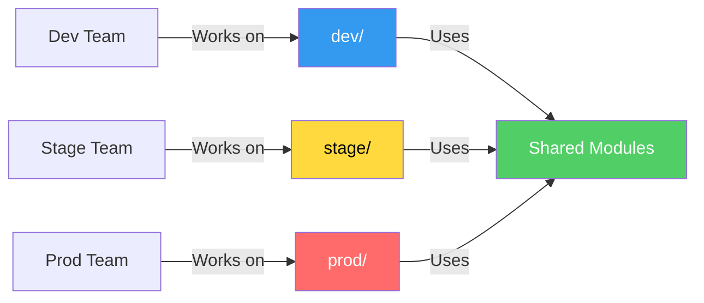

**Benefits:**
- Teams can work independently
- No state file conflicts
- Different backend buckets per environment
- Isolated deployments

### Pattern 2: Conflict Resolution

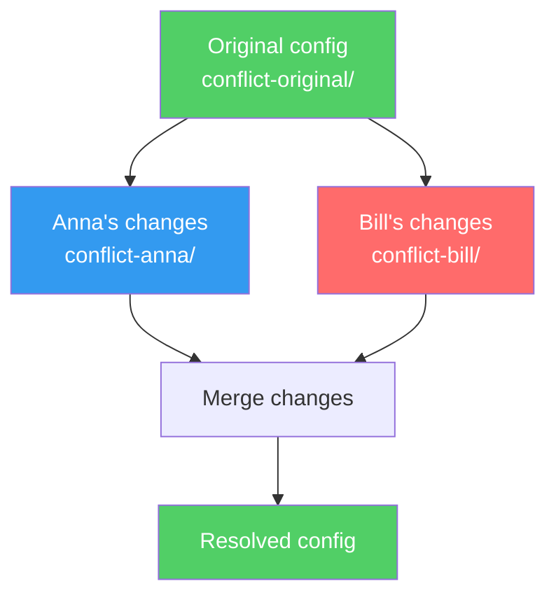

**Terragrunt helps with:**
- Isolated state files prevent conflicts
- Each developer can test in their own directory
- Easy to compare changes before merging

---

## Configuration Inheritance Flow

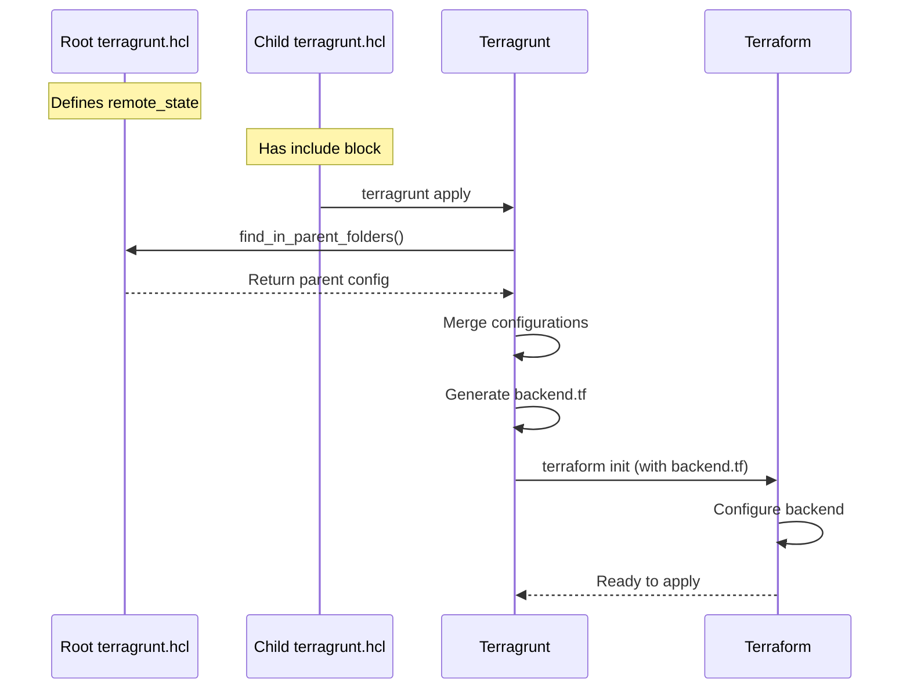

**What gets inherited:**

1. **remote_state** configuration
2. **generate** blocks
3. Any other shared configuration

**What doesn't get inherited:**

1. **inputs** (each module has its own)
2. **dependency** blocks (module-specific)
3. **terraform { source }** (module-specific)

---

## Command Execution Flow

### Single Module Execution

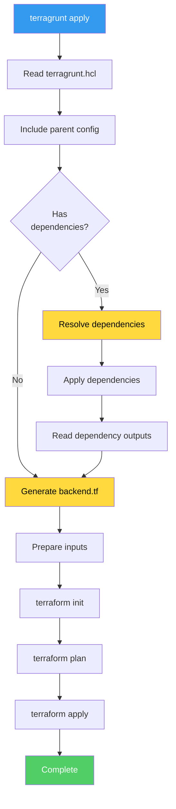

### Run-All Execution

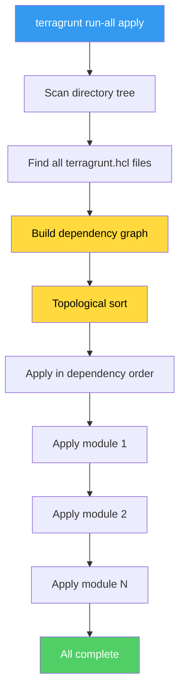

---

## State File Isolation

### Why Isolation Matters

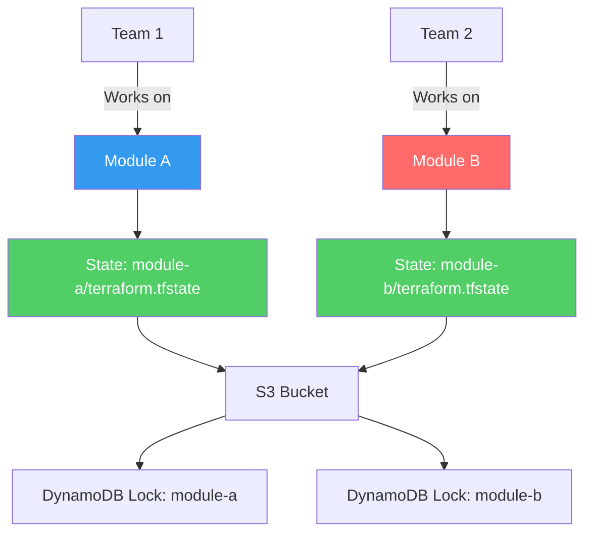

**Benefits:**
- No state file conflicts
- Teams can work in parallel
- Easier to debug (isolated state)
- Safer rollbacks (affect only one module)

---

## Best Practices Summary

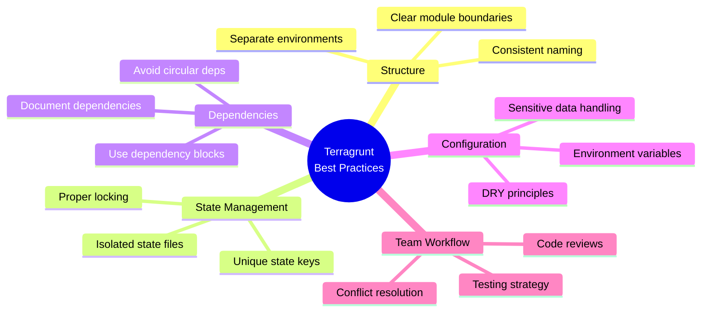

---

## Common Patterns

### Pattern 1: Environment-Specific Configuration

```hcl
# live/stage/terragrunt.hcl
remote_state {
  config = {
    bucket = "terraform-state-stage"
    # ...
  }
}

# live/prod/terragrunt.hcl
remote_state {
  config = {
    bucket = "terraform-state-prod"
    # ...
  }
}
```

### Pattern 2: Shared Module, Different Inputs

```hcl
# stage/services/hello-world-app/terragrunt.hcl
inputs = {
  environment = "stage"
  min_size    = 2
  max_size    = 2
}

# prod/services/hello-world-app/terragrunt.hcl
inputs = {
  environment = "prod"
  min_size    = 4
  max_size    = 10
}
```

### Pattern 3: Conditional Dependencies

```hcl
# Only include dependency in certain environments
dependency "monitoring" {
  config_path = "../../monitoring"
  skip_outputs = get_env("SKIP_MONITORING", "false") == "true"
}
```

---

## Troubleshooting Guide

### Issue: "Could not find parent terragrunt.hcl"

**Solution:** Ensure parent file exists and `find_in_parent_folders()` can reach it.

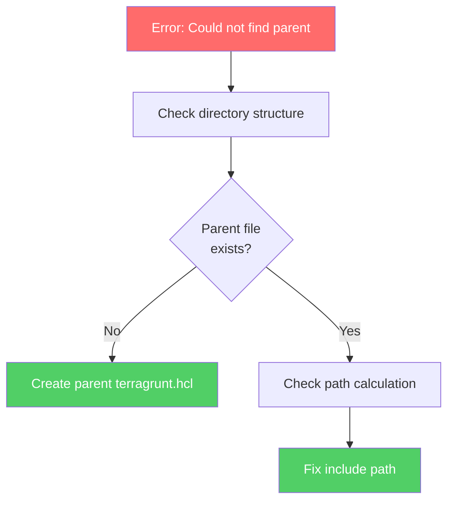

### Issue: "Dependency outputs not available"

**Solution:** Ensure dependency is applied first or use `mock_outputs` for planning.

```hcl
dependency "mysql" {
  config_path = "../../data-stores/mysql"
  mock_outputs = {
    address = "mock-address"
    port    = 3306
  }
}
```

### Issue: "State file conflicts"

**Solution:** Ensure unique state keys using `path_relative_to_include()`.

```hcl
key = "${path_relative_to_include()}/terraform.tfstate"
```

---

## Summary

Terragrunt provides a powerful way to:

1. **Organize** infrastructure code across environments
2. **Manage** dependencies automatically
3. **Standardize** backend configuration
4. **Enable** team collaboration
5. **Simplify** complex deployments

The key is understanding how configuration inheritance, dependency management, and state file organization work together to create a maintainable infrastructure codebase.

