# Terragrunt Tutorial: Working with Teams

## Table of Contents

1. [What is Terragrunt?](#what-is-terragrunt)
2. [Key Concepts](#key-concepts)
3. [Terragrunt Flow Diagram](#terragrunt-flow-diagram)
4. [Configuration Blocks Explained](#configuration-blocks-explained)
5. [Common Commands](#common-commands)
6. [Best Practices](#best-practices)

---

## What is Terragrunt?

Terragrunt is a thin wrapper around Terraform that provides:

- **DRY (Don't Repeat Yourself)**: Eliminate code duplication across environments
- **Automatic Backend Configuration**: Generate backend.tf files automatically
- **Dependency Management**: Automatically handle module dependencies
- **Remote State Management**: Simplify remote state configuration
- **Team Collaboration**: Standardize workflows across teams

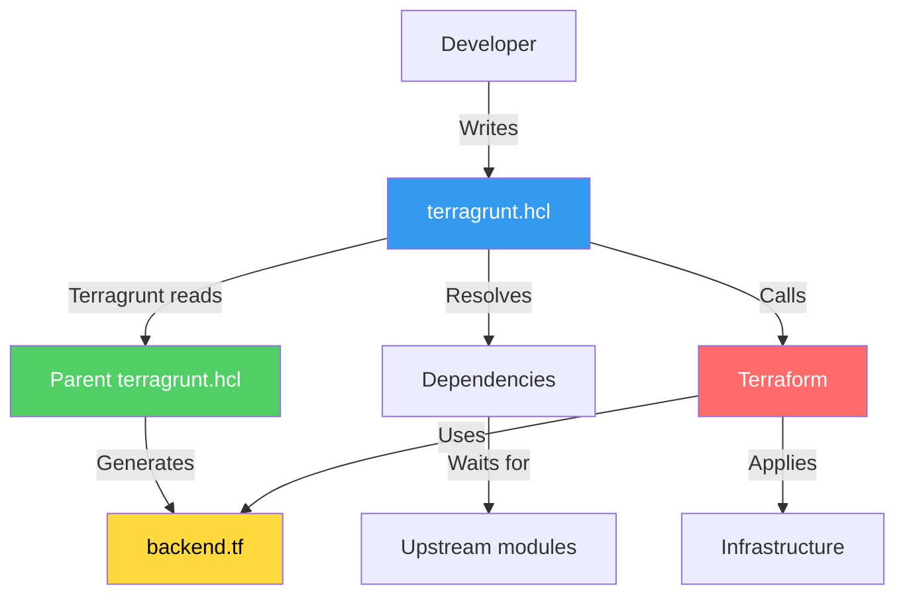

---

## Key Concepts

### 1. Include Block

The `include` block allows child configurations to inherit settings from parent configurations.

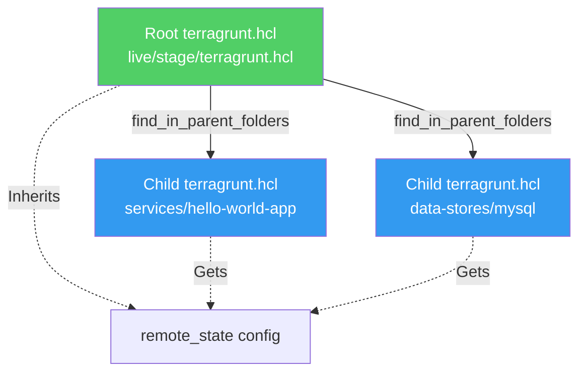

**Example:**

```hcl
# live/stage/terragrunt.hcl (Parent)
remote_state {
  backend = "s3"
  config = {
    bucket = "my-terraform-state"
    # ...
  }
}

# live/stage/services/hello-world-app/terragrunt.hcl (Child)
include {
  path = find_in_parent_folders()  # Finds live/stage/terragrunt.hcl
}

# Child automatically inherits remote_state config!
```

### 2. Remote State Block

Configures where Terraform state files are stored. Terragrunt automatically generates `backend.tf` files.

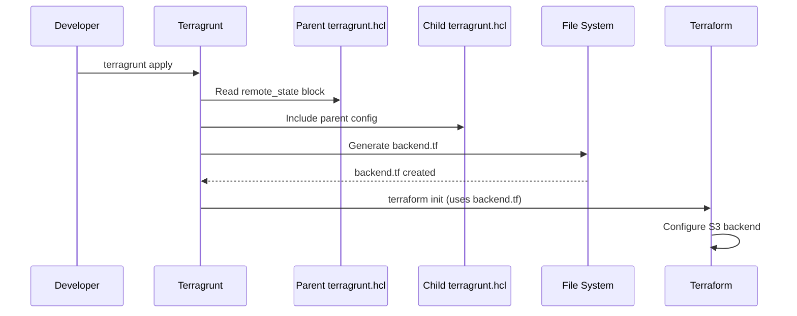

**Example:**

```hcl
remote_state {
  backend = "s3"
  
  generate = {
    path      = "backend.tf"
    if_exists = "overwrite"
  }
  
  config = {
    bucket         = get_env("STATE_BUCKET", "my-bucket")
    key            = "${path_relative_to_include()}/terraform.tfstate"
    region         = "us-east-2"
    encrypt        = true
    dynamodb_table = "terraform-locks"
  }
}
```

**Generated backend.tf:**

```hcl
terraform {
  backend "s3" {
    bucket         = "my-bucket"
    key            = "services/hello-world-app/terraform.tfstate"
    region         = "us-east-2"
    encrypt        = true
    dynamodb_table = "terraform-locks"
  }
}
```

### 3. Generate Block

Automatically creates Terraform configuration files.

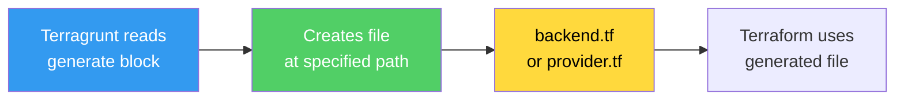

**Common use cases:**

- `backend.tf`: Backend configuration
- `provider.tf`: Provider version constraints
- `versions.tf`: Terraform version requirements

### 4. Dependency Block

Manages dependencies between modules automatically.

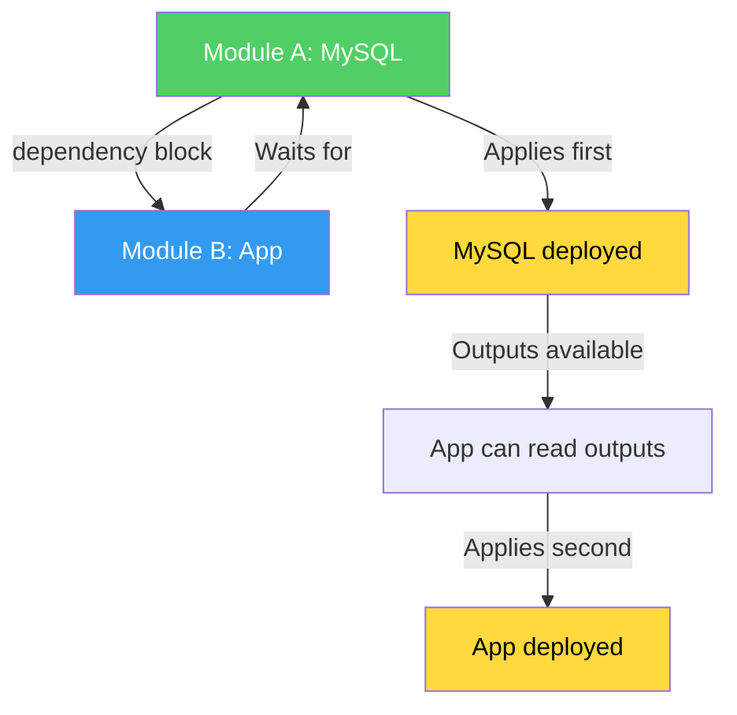

**Example:**

```hcl
# live/stage/services/hello-world-app/terragrunt.hcl
dependency "mysql" {
  config_path = "../../data-stores/mysql"
}

inputs = {
  mysql_config = dependency.mysql.outputs  # Auto-populated!
}
```

**What happens:**

1. Terragrunt detects the dependency
2. Runs `terragrunt apply` on MySQL first
3. Waits for MySQL to complete
4. Reads MySQL outputs
5. Makes them available as `dependency.mysql.outputs`
6. Then runs `terragrunt apply` on the app

### 5. Inputs Block

Passes variables to Terraform modules (equivalent to `-var` flags).

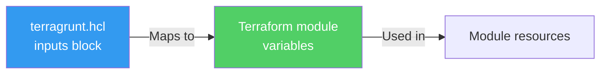

**Example:**

```hcl
inputs = {
  environment      = "stage"
  ami              = "ami-0fb653ca2d3203ac1"
  min_size         = 2
  max_size         = 2
  enable_autoscaling = false
  mysql_config     = dependency.mysql.outputs
}
```

---

## Terragrunt Flow Diagram

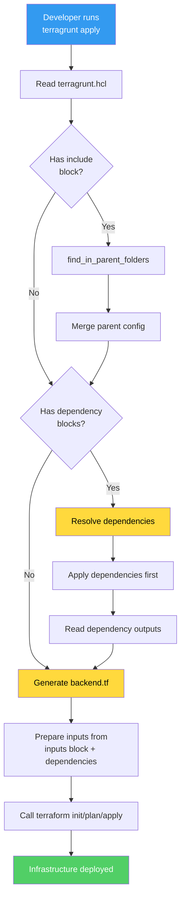

---

## Configuration Blocks Explained

### Complete Example Structure

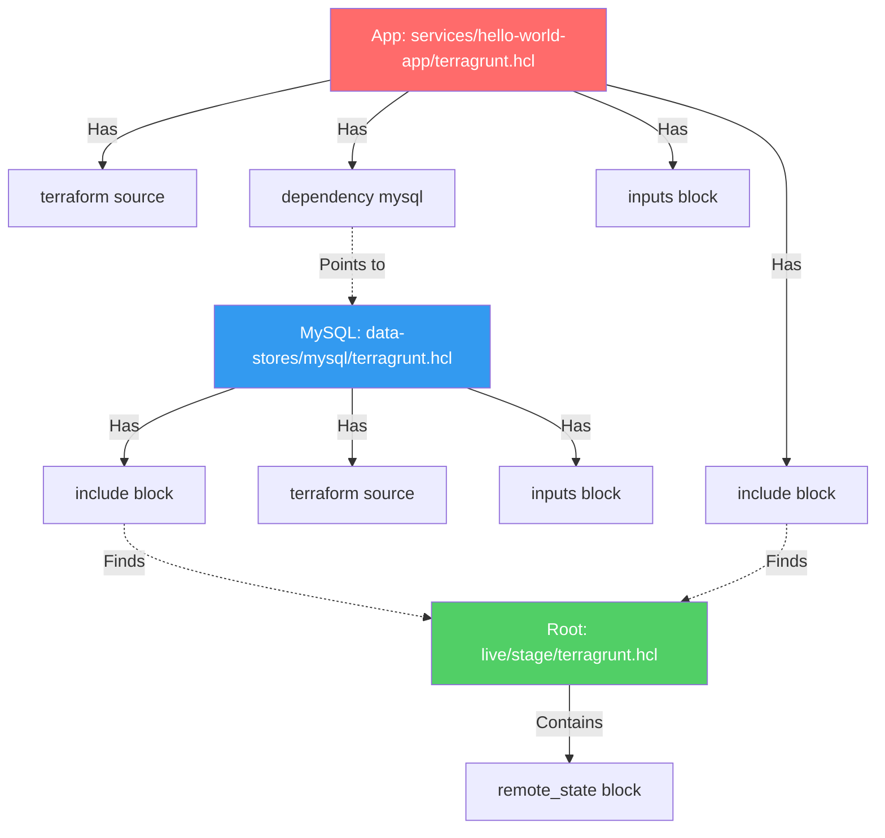

### Block Reference Table

| Block | Purpose | Required | Example |
|-------|---------|----------|---------|
| `terraform { source }` | Points to Terraform module | Yes | `source = "../../modules/mysql"` |
| `include` | Inherit parent config | Usually | `path = find_in_parent_folders()` |
| `remote_state` | Backend configuration | In parent | S3/DynamoDB settings |
| `generate` | Auto-generate files | Optional | Create `backend.tf` |
| `dependency` | Module dependencies | Optional | Wait for MySQL before app |
| `inputs` | Module variables | Optional | Pass values to module |

---

## Common Commands

### Basic Commands

```bash
# Apply a single module
terragrunt apply

# Plan changes
terragrunt plan

# Destroy infrastructure
terragrunt destroy

# Show current state
terragrunt output

# Validate configuration
terragrunt validate
```

### Working with Multiple Modules

```bash
# Apply all modules in dependency order
terragrunt run-all apply

# Plan all modules
terragrunt run-all plan

# Destroy all modules (reverse dependency order)
terragrunt run-all destroy

# Apply only modules matching a pattern
terragrunt run-all apply --terragrunt-include-dir "**/services/**"
```

### Useful Flags

```bash
# Apply with auto-approve
terragrunt apply --terragrunt-non-interactive

# Show detailed plan
terragrunt plan -detailed-exitcode

# Apply specific dependency first
terragrunt apply --terragrunt-dependency mysql

# Exclude certain modules
terragrunt run-all apply --terragrunt-exclude-dir "**/conflict-*"
```

### Command Flow Example

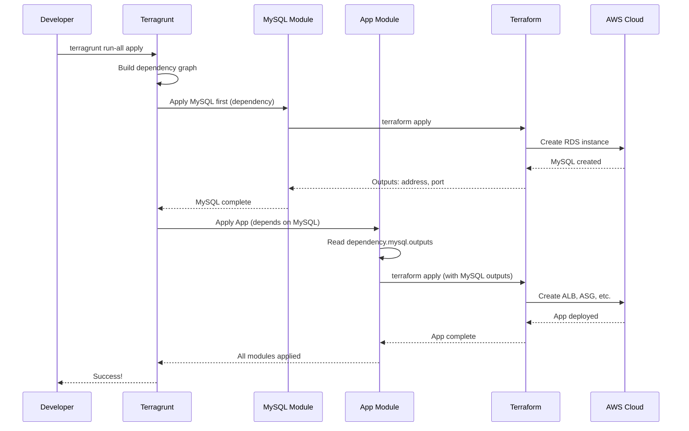

---

## Best Practices

### 1. Directory Structure

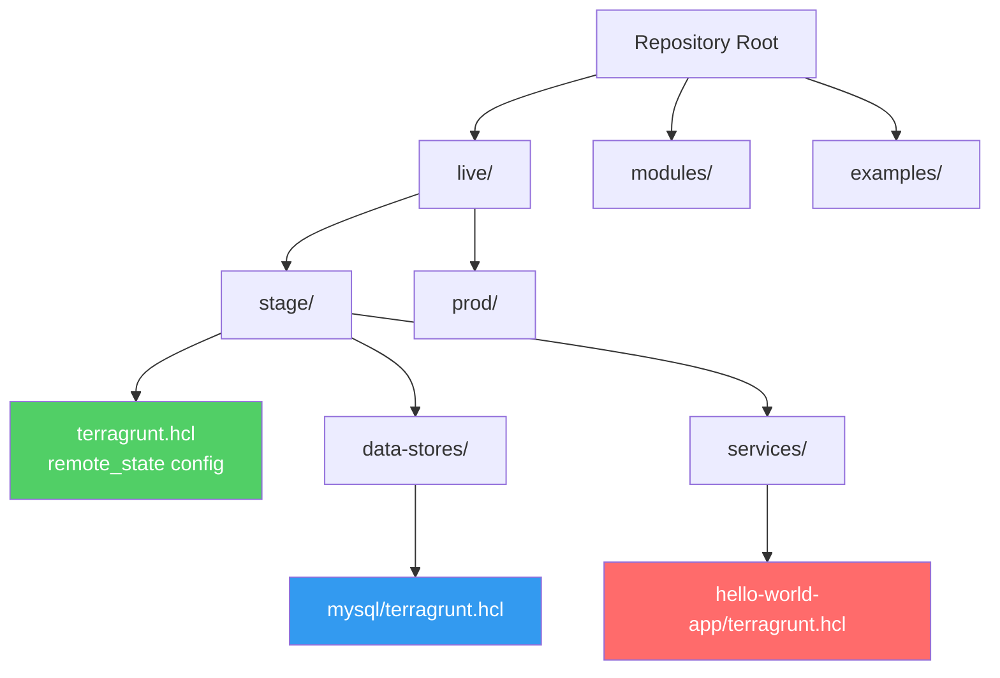

**Recommended structure:**

```
terraform-repo/
├── live/
│   ├── stage/
│   │   ├── terragrunt.hcl          # Root config
│   │   ├── data-stores/
│   │   │   └── mysql/
│   │   │       └── terragrunt.hcl  # MySQL config
│   │   └── services/
│   │       └── hello-world-app/
│   │           └── terragrunt.hcl  # App config
│   └── prod/
│       └── ... (same structure)
├── modules/
│   ├── data-stores/
│   │   └── mysql/                  # Reusable module
│   └── services/
│       └── hello-world-app/        # Reusable module
└── examples/
    └── ... (standalone examples)
```

### 2. State File Organization

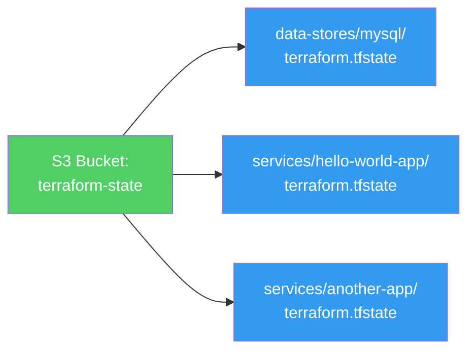

**Key naming pattern:**

```hcl
# In root terragrunt.hcl
key = "${path_relative_to_include()}/terraform.tfstate"

# Results in:
# - data-stores/mysql/terraform.tfstate
# - services/hello-world-app/terraform.tfstate
```

### 3. Dependency Management

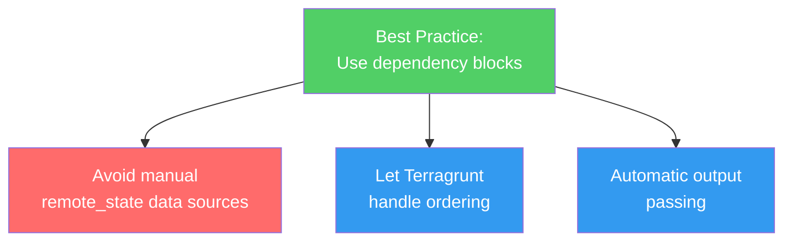

**Good (with Terragrunt):**

```hcl
dependency "mysql" {
  config_path = "../../data-stores/mysql"
}

inputs = {
  mysql_config = dependency.mysql.outputs  # Automatic!
}
```

**Bad (without Terragrunt):**

```hcl
# Manual remote state lookup
data "terraform_remote_state" "mysql" {
  backend = "s3"
  config = {
    bucket = "my-bucket"
    key    = "data-stores/mysql/terraform.tfstate"
  }
}

# Easy to get wrong, no dependency ordering
```

### 4. Environment Variables

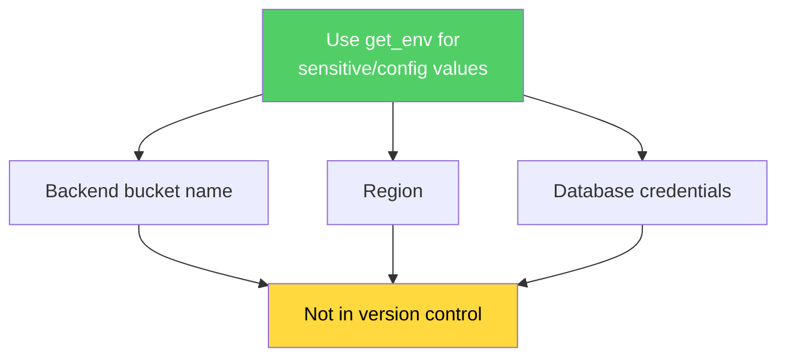

**Example:**

```hcl
remote_state {
  config = {
    bucket = get_env("TERRAFORM_STATE_BUCKET", "default-bucket")
    region = get_env("AWS_REGION", "us-east-2")
  }
}

inputs = {
  # Credentials via environment variables
  # Set: export TF_VAR_db_username=admin
  # Set: export TF_VAR_db_password=secret
}
```

### 5. Testing Strategy

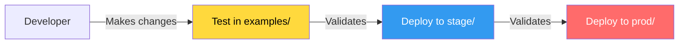

**Workflow:**

1. **Examples/**: Test module changes in isolation
2. **Stage/**: Test full integration with dependencies
3. **Prod/**: Deploy after validation

---

## Real-World Example: Complete Flow

### Scenario: Deploying Hello World App

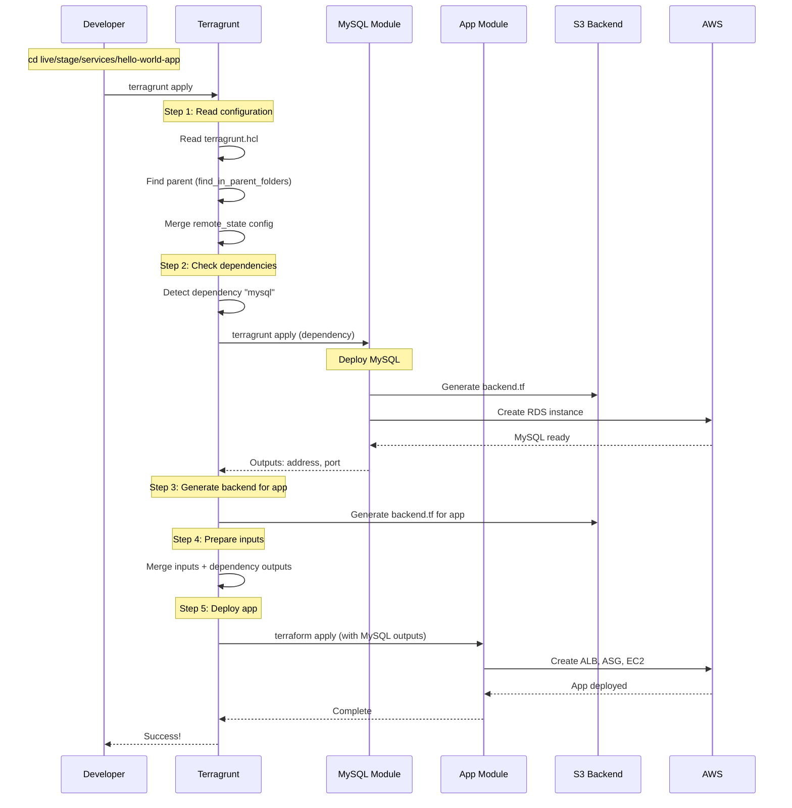

### Command Output Example

```bash
$ cd live/stage/services/hello-world-app
$ terragrunt apply

[terragrunt] 2024/01/15 10:30:00 Reading Terragrunt config at live/stage/services/hello-world-app/terragrunt.hcl
[terragrunt] 2024/01/15 10:30:00 Found parent terragrunt.hcl at live/stage/terragrunt.hcl
[terragrunt] 2024/01/15 10:30:00 Detected dependency: mysql
[terragrunt] 2024/01/15 10:30:00 Running command: terragrunt apply in ../../data-stores/mysql

# MySQL deployment output...
[terragrunt] 2024/01/15 10:32:00 Dependency mysql completed successfully
[terragrunt] 2024/01/15 10:32:00 Reading outputs from dependency mysql
[terragrunt] 2024/01/15 10:32:00 Generated backend.tf at live/stage/services/hello-world-app/backend.tf
[terragrunt] 2024/01/15 10:32:00 Running command: terraform init
[terragrunt] 2024/01/15 10:32:05 Running command: terraform apply

# App deployment output...
Apply complete! Resources: 5 added, 0 changed, 0 destroyed.

Outputs:
alb_dns_name = "hello-world-stage-123456789.us-east-2.elb.amazonaws.com"
```

---

## Summary

Terragrunt provides:

✅ **DRY Configuration**: Define backend once, reuse everywhere  
✅ **Automatic Dependencies**: No manual ordering needed  
✅ **Team Standardization**: Consistent workflows  
✅ **State Management**: Organized, isolated state files  
✅ **Less Boilerplate**: No need to write backend.tf manually  

Use Terragrunt when:
- Working with multiple environments (dev/stage/prod)
- Managing complex module dependencies
- Need consistent backend configuration
- Working in a team environment

Stick with plain Terraform when:
- Simple, single-module projects
- No need for dependency management
- Prefer explicit over implicit configuration

