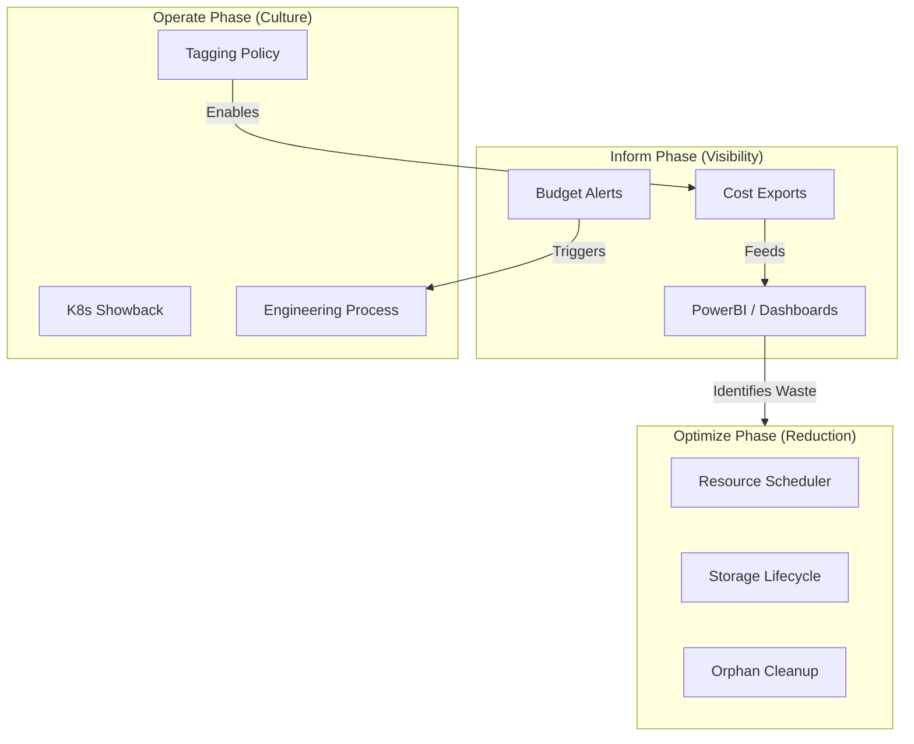
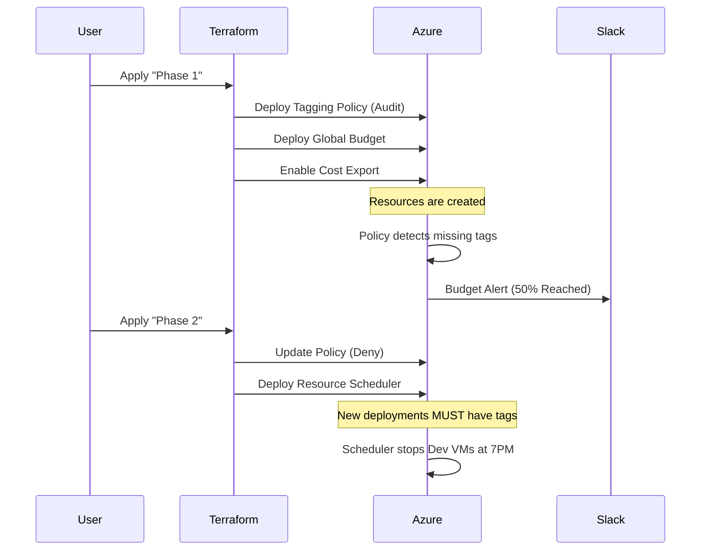

# FinOps Architecture Guide

This document visualizes the "Inform, Optimize, Operate" architecture implemented in this tutorial.

## The FinOps Lifecycle

The data must flow from the Foundation layer into Visibility tools, which then inform Optimization actions.

## Module Interaction

How the Terraform modules work together in a production environment:

