# Azure Networking Architectures and Communication Flows

This document provides comprehensive Mermaid diagrams showing complete architectures and communication flows for Azure networking services.

## Table of Contents

1. [Core Networking Architecture](#core-networking-architecture)
2. [Multi-Tier Application Architecture](#multi-tier-application-architecture)
3. [Hybrid Cloud Architecture](#hybrid-cloud-architecture)
4. [Global Distribution Architecture](#global-distribution-architecture)
5. [Hub-Spoke Architecture](#hub-spoke-architecture)
6. [DNS Resolution Flows](#dns-resolution-flows)
7. [Security Architecture](#security-architecture)
8. [Load Balancing Flows](#load-balancing-flows)

---

## Core Networking Architecture

### Complete Virtual Network with DNS

This diagram shows a complete Virtual Network architecture with DNS resolution, subnets, NSGs, and route tables.


**Key Points:**
- DNS resolution happens at multiple levels (Azure DNS, Private DNS zones)
- NSGs filter traffic at the subnet level
- Route tables control traffic routing
- Resources communicate using DNS names, not IP addresses

---

## Multi-Tier Application Architecture

### Complete Multi-Tier Application with Load Balancer and Application Gateway

This diagram shows a production-ready multi-tier application with load balancing, DNS, and security.


**Architecture Diagram:**


---

## Hybrid Cloud Architecture

### Complete Hybrid Architecture with VPN Gateway, DNS, and Private Link

This diagram shows how on-premises and Azure resources communicate through VPN Gateway with DNS resolution.


**Communication Flow:**


---

## Global Distribution Architecture

### Complete Global Architecture with Front Door, Traffic Manager, and DNS

This diagram shows how global applications use DNS, Traffic Manager, and Front Door for worldwide distribution.


**Traffic Flow Sequence:**


---

## Hub-Spoke Architecture

### Complete Hub-Spoke Architecture with Firewall, DNS, and Private Link

This diagram shows a hub-spoke architecture with centralized security and DNS.

```mermaid
graph TB
    subgraph "Internet"
        InternetUsers[Internet Users]
    end
    
    subgraph "Hub VNet (10.0.0.0/16)"
        HubDNS[Azure DNS<br/>168.63.129.16]
        HubPrivateDNS[Private DNS Zone<br/>company.internal]
        
        subgraph "Firewall Subnet (10.0.0.0/26)"
            Firewall[Azure Firewall<br/>10.0.0.4]
            FirewallPublicIP[Firewall Public IP<br/>20.1.2.5]
        end
        
        subgraph "Bastion Subnet (10.0.0.64/26)"
            Bastion[Azure Bastion<br/>10.0.0.68]
        end
        
        subgraph "Gateway Subnet (10.0.0.128/27)"
            VPNGW[VPN Gateway<br/>10.0.0.132]
        end
        
        RouteTable[Route Table<br/>0.0.0.0/0 → Firewall]
    end
    
    subgraph "Spoke 1 VNet (10.1.0.0/16)"
        Spoke1DNS[Private DNS Zone<br/>company.internal<br/>Linked]
        Spoke1VM[Spoke 1 VM<br/>10.1.1.10<br/>spoke1-vm.company.internal]
    end
    
    subgraph "Spoke 2 VNet (10.2.0.0/16)"
        Spoke2DNS[Private DNS Zone<br/>company.internal<br/>Linked]
        Spoke2VM[Spoke 2 VM<br/>10.2.1.10<br/>spoke2-vm.company.internal]
    end
    
    subgraph "Azure Services"
        Storage[Storage Account<br/>Private Endpoint<br/>10.0.1.10<br/>storage.company.internal]
    end
    
    InternetUsers -->|1. Request| FirewallPublicIP
    FirewallPublicIP -->|2. NAT Rule| Firewall
    Firewall -->|3. Application Rule<br/>Check FQDN| Firewall
    Firewall -->|4. Route via Route Table| Spoke1VM
    
    Spoke1VM -->|5. DNS Query: storage.company.internal| Spoke1DNS
    Spoke1DNS -->|6. Resolve via Hub| HubPrivateDNS
    HubPrivateDNS -->|7. Return Private Endpoint IP| Spoke1VM
    Spoke1VM -->|8. Connect via Private Link| Storage
    
    Spoke1VM -->|9. DNS Query: spoke2-vm.company.internal| Spoke1DNS
    Spoke1DNS -->|10. Resolve| HubPrivateDNS
    HubPrivateDNS -->|11. Return IP: 10.2.1.10| Spoke1VM
    Spoke1VM -->|12. Connect via VNet Peering| Spoke2VM
    
    Spoke1VM -->|13. Outbound Internet| Firewall
    Firewall -->|14. Network Rule Check| Firewall
    Firewall -->|15. Allow/Deny| InternetUsers
```



**Hub-Spoke Communication Flow:**


---

## DNS Resolution Flows

### Complete DNS Resolution Architecture

This diagram shows how DNS resolution works across different scenarios in Azure.


**DNS Resolution Sequence:**


---

## Security Architecture

### Complete Security Architecture with Firewall, WAF, and DNS

This diagram shows how security services work together with DNS.


**Security Flow Sequence:**


---

## Load Balancing Flows

### Complete Load Balancing Architecture with DNS

This diagram shows how different load balancing services work together with DNS.


**Load Balancing Flow Sequence:**


---

## NAT Gateway and Outbound Connectivity

### Complete Outbound Connectivity Architecture with DNS

This diagram shows how NAT Gateway provides outbound connectivity with DNS resolution.


**NAT Gateway Flow Sequence:**


---

## Private Link and DNS Integration

### Complete Private Link Architecture with DNS

This diagram shows how Private Link integrates with DNS for seamless service access.

```mermaid
graph TB
    subgraph "VNet: Production (10.0.0.0/16)"
        VM1[VM 1<br/>10.0.1.10]
        VM2[VM 2<br/>10.0.1.11]
        PrivateDNS[Private DNS Zone<br/>privatelink.blob.core.windows.net]
    end
    
    subgraph "VNet: Development (10.1.0.0/16)"
        DevVM[Dev VM<br/>10.1.1.10]
        DevPrivateDNS[Private DNS Zone<br/>privatelink.blob.core.windows.net<br/>Linked]
    end
    
    subgraph "Storage Account"
        StoragePublic[Public Endpoint<br/>mystorage.blob.core.windows.net<br/>Public IP: 20.1.2.7]
        PrivateEndpoint[Private Endpoint<br/>10.0.2.10<br/>mystorage.privatelink.blob.core.windows.net]
    end
    
    subgraph "SQL Database"
        SQLPublic[Public Endpoint<br/>myserver.database.windows.net<br/>Public IP: 20.1.2.8]
        SQLPrivateEndpoint[Private Endpoint<br/>10.0.2.11<br/>myserver.privatelink.database.windows.net]
    end
    
    VM1 -->|1. DNS Query: mystorage.blob.core.windows.net| PrivateDNS
    PrivateDNS -->|2. Check Private Endpoint| PrivateEndpoint
    PrivateDNS -->|3. Return Private IP: 10.0.2.10| VM1
    VM1 -->|4. Connect via Private Link<br/>(No Internet)| PrivateEndpoint
    
    DevVM -->|5. DNS Query: mystorage.blob.core.windows.net| DevPrivateDNS
    DevPrivateDNS -->|6. Check Private Endpoint| PrivateEndpoint
    DevPrivateDNS -->|7. Return Private IP: 10.0.2.10| DevVM
    DevVM -->|8. Connect via Private Link| PrivateEndpoint
    
    VM2 -->|9. DNS Query: myserver.database.windows.net| PrivateDNS
    PrivateDNS -->|10. Check Private Endpoint| SQLPrivateEndpoint
    PrivateDNS -->|11. Return Private IP: 10.0.2.11| VM2
    VM2 -->|12. Connect via Private Link| SQLPrivateEndpoint
```

**Private Link DNS Flow:**


---

## Complete Enterprise Architecture

### Full Enterprise Architecture with All Services

This comprehensive diagram shows how all Azure networking services work together in an enterprise scenario.


---

## Summary

These architectures demonstrate:

1. **DNS as Foundation**: DNS resolution is fundamental to all Azure networking services
2. **Layered Security**: Multiple security layers (DDoS, WAF, Firewall, NSG) work together
3. **Global Distribution**: DNS-based routing enables global application distribution
4. **Hybrid Connectivity**: DNS enables seamless name resolution across on-premises and cloud
5. **Private Connectivity**: Private Link uses DNS to provide seamless private access
6. **Service Discovery**: DNS enables dynamic service discovery without hardcoded IPs

All these architectures rely on proper DNS configuration for optimal performance, security, and maintainability.

