# Enterprise Security Integrations with Azure Networking

## Table of Contents

1. [Overview](#overview)
2. [ExpressRoute Integration](#expressroute-integration)
3. [Colt Technology Services Integration](#colt-technology-services-integration)
4. [CyberArk Integration](#cyberark-integration)
5. [Zero Trust Network Access (ZTNA)](#zero-trust-network-access-ztna)
6. [Dual NAT Firewall Architecture](#dual-nat-firewall-architecture)
7. [Complete Enterprise Architecture](#complete-enterprise-architecture)
8. [Implementation Examples](#implementation-examples)
9. [Best Practices](#best-practices)

---

## Overview

This document explains how enterprise security solutions integrate with Azure Networking services to create secure, compliant, and scalable hybrid cloud architectures.

### Key Integrations Covered

- **ExpressRoute**: Private connectivity between on-premises and Azure
- **Colt Technology Services**: Enterprise ExpressRoute connectivity provider
- **CyberArk**: Privileged Access Management (PAM) integration
- **ZTNA**: Zero Trust Network Access architecture
- **Dual NAT Firewall**: Network isolation between production and staging environments

### Architecture Overview

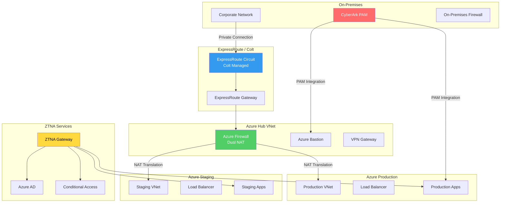
```mermaid
graph TB
    subgraph "On-Premises"
        CorpNet[Corporate Network]
        CyberArk[CyberArk PAM]
        OnPremFW[On-Premises Firewall]
    end
    
    subgraph "ExpressRoute / Colt"
        ER[ExpressRoute Circuit<br/>Colt Managed]
        ERGateway[ExpressRoute Gateway]
    end
    
    subgraph "Azure Hub VNet"
        HubFW[Azure Firewall<br/>Dual NAT]
        HubBastion[Azure Bastion]
        HubVPN[VPN Gateway]
    end
    
    subgraph "Azure Production"
        ProdVNet[Production VNet]
        ProdLB[Load Balancer]
        ProdApp[Production Apps]
    end
    
    subgraph "Azure Staging"
        StageVNet[Staging VNet]
        StageLB[Load Balancer]
        StageApp[Staging Apps]
    end
    
    subgraph "ZTNA Services"
        ZTNAGateway[ZTNA Gateway]
        Identity[Azure AD]
        ConditionalAccess[Conditional Access]
    end
    
    CorpNet -->|Private Connection| ER
    ER --> ERGateway
    ERGateway --> HubFW
    CyberArk -->|PAM Integration| HubBastion
    CyberArk -->|PAM Integration| ProdApp
    HubFW -->|NAT Translation| ProdVNet
    HubFW -->|NAT Translation| StageVNet
    ZTNAGateway --> Identity
    ZTNAGateway --> ConditionalAccess
    ZTNAGateway --> ProdApp
    ZTNAGateway --> StageApp
    
    style ER fill:#339af0,color:#fff
    style CyberArk fill:#ff6b6b,color:#fff
    style HubFW fill:#51cf66,color:#fff
    style ZTNAGateway fill:#ffd93d,color:#000
```

---

## ExpressRoute Integration

### What is ExpressRoute?

ExpressRoute provides private connectivity between on-premises networks and Azure datacenters. Unlike VPN connections that traverse the public Internet, ExpressRoute uses dedicated connections through a connectivity provider.

### ExpressRoute Architecture with Azure Networking

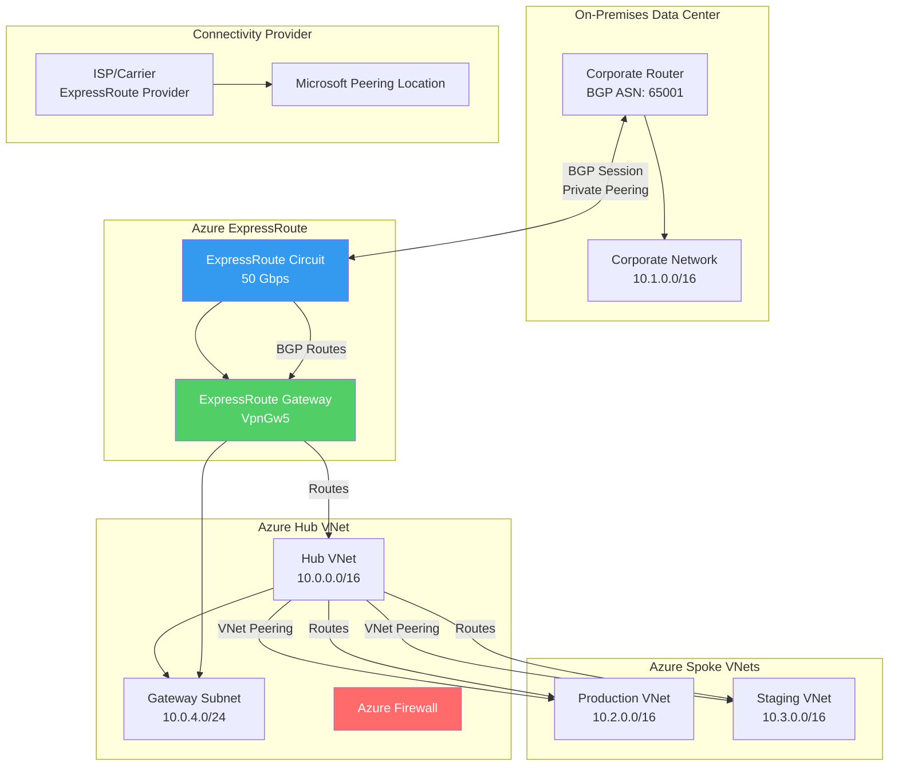
```mermaid
graph TB
    subgraph "On-Premises Data Center"
        CorpRouter[Corporate Router<br/>BGP ASN: 65001]
        CorpNetwork[Corporate Network<br/>10.1.0.0/16]
        CorpRouter --> CorpNetwork
    end
    
    subgraph "Connectivity Provider"
        Provider[ISP/Carrier<br/>ExpressRoute Provider]
        PeeringLocation[Microsoft Peering Location]
        Provider --> PeeringLocation
    end
    
    subgraph "Azure ExpressRoute"
        ERCircuit[ExpressRoute Circuit<br/>50 Gbps]
        ERGateway[ExpressRoute Gateway<br/>VpnGw5]
        ERCircuit --> ERGateway
    end
    
    subgraph "Azure Hub VNet"
        HubVNet[Hub VNet<br/>10.0.0.0/16]
        HubGatewaySubnet[Gateway Subnet<br/>10.0.4.0/24]
        HubFW[Azure Firewall]
        HubVNet --> HubGatewaySubnet
        ERGateway --> HubGatewaySubnet
    end
    
    subgraph "Azure Spoke VNets"
        ProdVNet[Production VNet<br/>10.2.0.0/16]
        StageVNet[Staging VNet<br/>10.3.0.0/16]
        HubVNet -->|VNet Peering| ProdVNet
        HubVNet -->|VNet Peering| StageVNet
    end
    
    CorpRouter <-->|BGP Session<br/>Private Peering| ERCircuit
    ERCircuit -->|BGP Routes| ERGateway
    ERGateway -->|Routes| HubVNet
    HubVNet -->|Routes| ProdVNet
    HubVNet -->|Routes| StageVNet
    
    style ERCircuit fill:#339af0,color:#fff
    style ERGateway fill:#51cf66,color:#fff
    style HubFW fill:#ff6b6b,color:#fff
```

### ExpressRoute Peering Types

#### 1. Azure Private Peering

**Purpose:** Connect on-premises networks to Azure Virtual Networks

**Configuration:**
- BGP ASN: On-premises (e.g., 65001) ↔ Azure (65515)
- Route exchange: On-premises routes ↔ Azure VNet routes
- Use case: Direct access to Azure VMs, PaaS services

**Integration Points:**
- **Virtual Network Gateway**: ExpressRoute Gateway in Hub VNet
- **Route Tables**: Custom routes for traffic steering
- **Azure Firewall**: Centralized security and NAT
- **Network Security Groups**: Additional layer of security

#### 2. Microsoft Peering

**Purpose:** Connect to Microsoft 365, Azure PaaS services, and Dynamics 365

**Configuration:**
- Public IP prefixes advertised
- Route filters for service selection
- Use case: Office 365, Azure Storage, Azure SQL

**Integration Points:**
- **Azure Firewall**: Filter and log Microsoft service access
- **Private Endpoints**: Combine with Private Link for private access
- **Route Filters**: Control which Microsoft services are accessible

### ExpressRoute with Azure Firewall

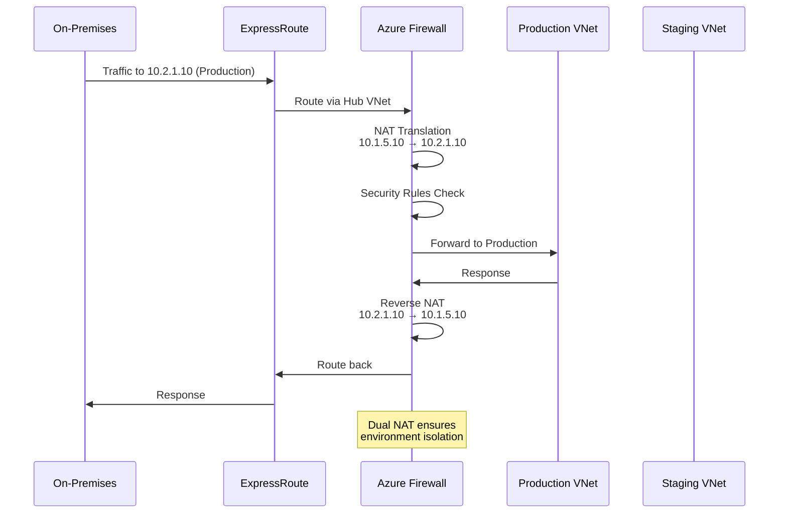
```mermaid
sequenceDiagram
    participant OnPrem as On-Premises
    participant ER as ExpressRoute
    participant HubFW as Azure Firewall
    participant Prod as Production VNet
    participant Stage as Staging VNet
    
    OnPrem->>ER: Traffic to 10.2.1.10 (Production)
    ER->>HubFW: Route via Hub VNet
    HubFW->>HubFW: NAT Translation<br/>10.1.5.10 → 10.2.1.10
    HubFW->>HubFW: Security Rules Check
    HubFW->>Prod: Forward to Production
    Prod->>HubFW: Response
    HubFW->>HubFW: Reverse NAT<br/>10.2.1.10 → 10.1.5.10
    HubFW->>ER: Route back
    ER->>OnPrem: Response
    
    Note over HubFW: Dual NAT ensures<br/>environment isolation
```

### ExpressRoute Benefits for Enterprise Networking

1. **Private Connectivity**: Traffic never traverses the public Internet
2. **Higher Bandwidth**: Up to 100 Gbps per circuit
3. **Lower Latency**: Predictable performance
4. **Redundancy**: Multiple circuits and peering locations
5. **Global Reach**: Connect to Azure regions worldwide
6. **SLA**: 99.95% uptime SLA

### ExpressRoute Integration with Other Services

| Service | Integration Point | Use Case |
|---------|-------------------|----------|
| **Azure Firewall** | Hub VNet with ExpressRoute Gateway | Centralized security, NAT, logging |
| **VPN Gateway** | Active-Active with ExpressRoute | Backup connectivity, remote users |
| **Virtual WAN** | ExpressRoute connections to Virtual WAN hubs | Simplified management, SD-WAN integration |
| **Private Link** | ExpressRoute + Private Endpoints | Private access to Azure PaaS services |
| **Network Watcher** | Monitor ExpressRoute connections | Troubleshooting, performance monitoring |
| **Route Tables** | Custom routes for ExpressRoute traffic | Traffic steering, path selection |

---

## Colt Technology Services Integration

### What is Colt Technology Services?

Colt Technology Services is a leading provider of high-bandwidth connectivity solutions, specializing in enterprise network services, cloud connectivity, and managed network services. Colt is a certified ExpressRoute connectivity provider and offers direct connectivity to Azure, Microsoft 365, and other cloud services.

### Colt ExpressRoute Services

Colt provides ExpressRoute connectivity through their IQ Network, offering:

- **Direct Azure Connectivity**: Private, dedicated connections to Azure datacenters
- **Global Reach**: Connectivity to Azure regions worldwide
- **High Bandwidth**: Up to 100 Gbps per circuit
- **SLA Guarantees**: 99.95% uptime SLA
- **Managed Services**: Fully managed ExpressRoute circuits

### Colt ExpressRoute Architecture

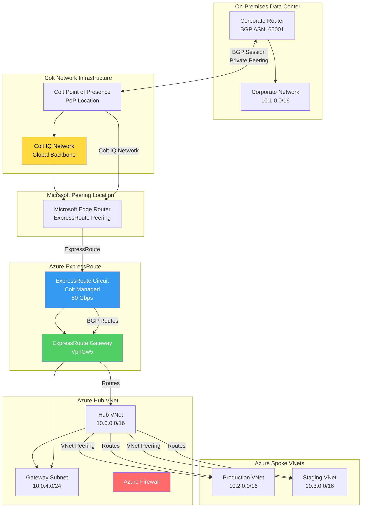
```mermaid
graph TB
    subgraph "On-Premises Data Center"
        CorpRouter[Corporate Router<br/>BGP ASN: 65001]
        CorpNetwork[Corporate Network<br/>10.1.0.0/16]
        CorpRouter --> CorpNetwork
    end
    
    subgraph "Colt Network Infrastructure"
        ColtPOP[Colt Point of Presence<br/>PoP Location]
        ColtBackbone[Colt IQ Network<br/>Global Backbone]
        ColtPOP --> ColtBackbone
    end
    
    subgraph "Microsoft Peering Location"
        MSPeering[Microsoft Edge Router<br/>ExpressRoute Peering]
        ColtBackbone --> MSPeering
    end
    
    subgraph "Azure ExpressRoute"
        ERCircuit[ExpressRoute Circuit<br/>Colt Managed<br/>50 Gbps]
        ERGateway[ExpressRoute Gateway<br/>VpnGw5]
        ERCircuit --> ERGateway
    end
    
    subgraph "Azure Hub VNet"
        HubVNet[Hub VNet<br/>10.0.0.0/16]
        HubGatewaySubnet[Gateway Subnet<br/>10.0.4.0/24]
        HubFW[Azure Firewall]
        HubVNet --> HubGatewaySubnet
        ERGateway --> HubGatewaySubnet
    end
    
    subgraph "Azure Spoke VNets"
        ProdVNet[Production VNet<br/>10.2.0.0/16]
        StageVNet[Staging VNet<br/>10.3.0.0/16]
        HubVNet -->|VNet Peering| ProdVNet
        HubVNet -->|VNet Peering| StageVNet
    end
    
    CorpRouter <-->|BGP Session<br/>Private Peering| ColtPOP
    ColtPOP -->|Colt IQ Network| MSPeering
    MSPeering -->|ExpressRoute| ERCircuit
    ERCircuit -->|BGP Routes| ERGateway
    ERGateway -->|Routes| HubVNet
    HubVNet -->|Routes| ProdVNet
    HubVNet -->|Routes| StageVNet
    
    style ERCircuit fill:#339af0,color:#fff
    style ERGateway fill:#51cf66,color:#fff
    style HubFW fill:#ff6b6b,color:#fff
    style ColtBackbone fill:#ffd93d,color:#000
```

### Colt ExpressRoute Service Offerings

#### 1. Colt On Demand

**Features:**
- **Flexible Bandwidth**: Scale bandwidth on-demand (1 Gbps to 100 Gbps)
- **Self-Service Portal**: Manage connections through Colt portal
- **Rapid Provisioning**: Activate services in minutes
- **Pay-as-you-grow**: Pay only for what you use

**Use Cases:**
- Dynamic workloads requiring variable bandwidth
- Development and testing environments
- Seasonal traffic spikes
- Multi-cloud connectivity

#### 2. Colt Dedicated Cloud Access

**Features:**
- **Dedicated Circuits**: Guaranteed bandwidth and performance
- **SLA Guarantees**: 99.95% uptime SLA
- **Global Reach**: Connect to Azure regions worldwide
- **Managed Services**: Fully managed by Colt

**Use Cases:**
- Production workloads requiring guaranteed performance
- Mission-critical applications
- Compliance requirements
- Enterprise-scale deployments

#### 3. Colt SD-WAN Integration

**Features:**
- **SD-WAN Integration**: Integrate Colt ExpressRoute with SD-WAN
- **Hybrid Connectivity**: Combine ExpressRoute with Internet/VPN
- **Intelligent Routing**: Automatic path selection
- **Centralized Management**: Single pane of glass

**Architecture:**

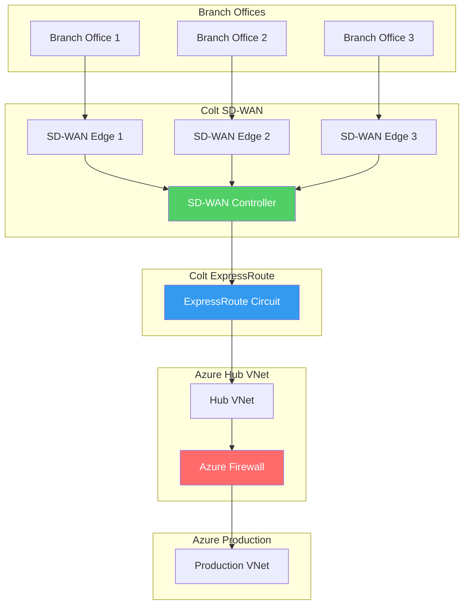
```mermaid
graph TB
    subgraph "Branch Offices"
        Branch1[Branch Office 1]
        Branch2[Branch Office 2]
        Branch3[Branch Office 3]
    end
    
    subgraph "Colt SD-WAN"
        SDWANController[SD-WAN Controller]
        SDWANEdge1[SD-WAN Edge 1]
        SDWANEdge2[SD-WAN Edge 2]
        SDWANEdge3[SD-WAN Edge 3]
        
        Branch1 --> SDWANEdge1
        Branch2 --> SDWANEdge2
        Branch3 --> SDWANEdge3
        
        SDWANEdge1 --> SDWANController
        SDWANEdge2 --> SDWANController
        SDWANEdge3 --> SDWANController
    end
    
    subgraph "Colt ExpressRoute"
        ERCircuit[ExpressRoute Circuit]
        SDWANController --> ERCircuit
    end
    
    subgraph "Azure Hub VNet"
        HubVNet[Hub VNet]
        HubFW[Azure Firewall]
        ERCircuit --> HubVNet
        HubVNet --> HubFW
    end
    
    subgraph "Azure Production"
        ProdVNet[Production VNet]
        HubFW --> ProdVNet
    end
    
    style ERCircuit fill:#339af0,color:#fff
    style SDWANController fill:#51cf66,color:#fff
    style HubFW fill:#ff6b6b,color:#fff
```

### Colt ExpressRoute with Azure Services

#### Integration with Azure Firewall

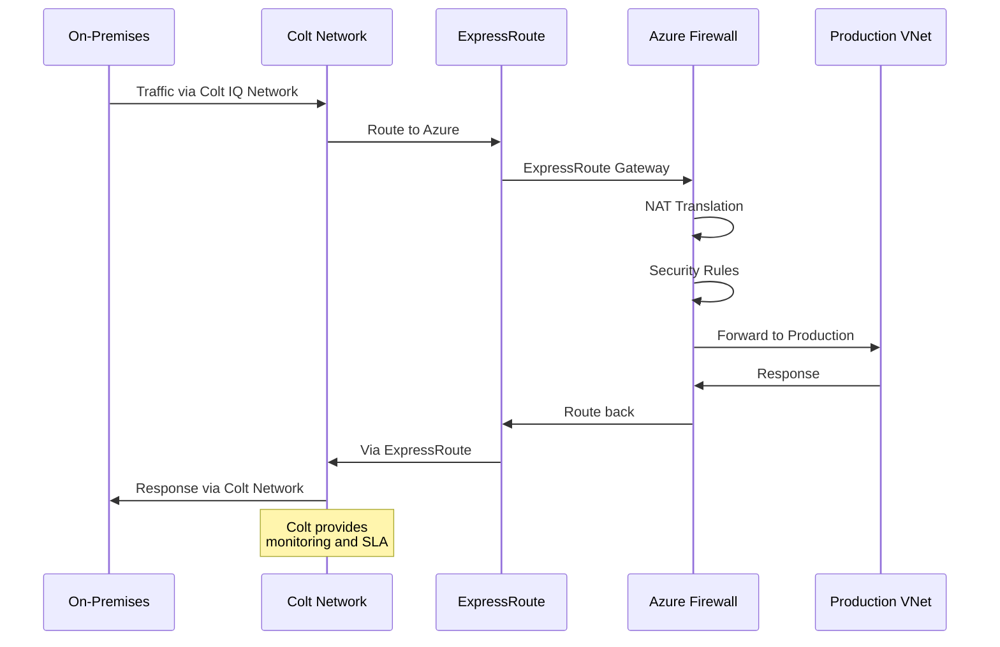
```mermaid
sequenceDiagram
    participant OnPrem as On-Premises
    participant Colt as Colt Network
    participant ER as ExpressRoute
    participant HubFW as Azure Firewall
    participant Prod as Production VNet
    
    OnPrem->>Colt: Traffic via Colt IQ Network
    Colt->>ER: Route to Azure
    ER->>HubFW: ExpressRoute Gateway
    HubFW->>HubFW: NAT Translation
    HubFW->>HubFW: Security Rules
    HubFW->>Prod: Forward to Production
    Prod->>HubFW: Response
    HubFW->>ER: Route back
    ER->>Colt: Via ExpressRoute
    Colt->>OnPrem: Response via Colt Network
    
    Note over Colt: Colt provides<br/>monitoring and SLA
```

#### Integration with Dual NAT Firewall

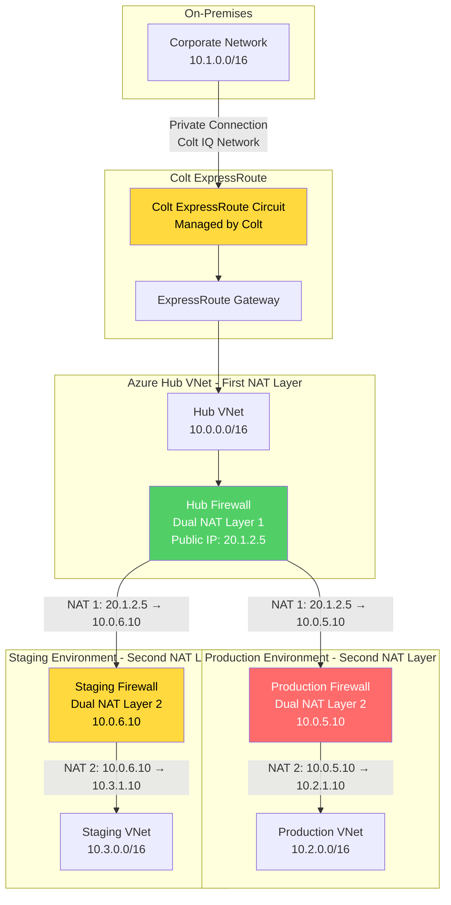
```mermaid
graph TB
    subgraph "On-Premises"
        CorpNet[Corporate Network<br/>10.1.0.0/16]
    end
    
    subgraph "Colt ExpressRoute"
        ColtER[Colt ExpressRoute Circuit<br/>Managed by Colt]
        ERGateway[ExpressRoute Gateway]
        ColtER --> ERGateway
    end
    
    subgraph "Azure Hub VNet - First NAT Layer"
        HubFW[Hub Firewall<br/>Dual NAT Layer 1<br/>Public IP: 20.1.2.5]
        HubVNet[Hub VNet<br/>10.0.0.0/16]
        ERGateway --> HubVNet
        HubVNet --> HubFW
    end
    
    subgraph "Production Environment - Second NAT Layer"
        ProdFW[Production Firewall<br/>Dual NAT Layer 2<br/>10.0.5.10]
        ProdVNet[Production VNet<br/>10.2.0.0/16]
        HubFW -->|NAT 1: 20.1.2.5 → 10.0.5.10| ProdFW
        ProdFW -->|NAT 2: 10.0.5.10 → 10.2.1.10| ProdVNet
    end
    
    subgraph "Staging Environment - Second NAT Layer"
        StageFW[Staging Firewall<br/>Dual NAT Layer 2<br/>10.0.6.10]
        StageVNet[Staging VNet<br/>10.3.0.0/16]
        HubFW -->|NAT 1: 20.1.2.5 → 10.0.6.10| StageFW
        StageFW -->|NAT 2: 10.0.6.10 → 10.3.1.10| StageVNet
    end
    
    CorpNet -->|Private Connection<br/>Colt IQ Network| ColtER
    
    style ColtER fill:#ffd93d,color:#000
    style HubFW fill:#51cf66,color:#fff
    style ProdFW fill:#ff6b6b,color:#fff
    style StageFW fill:#ffd93d,color:#000
```

### Colt Service Features

#### 1. Global Network Coverage

**Colt IQ Network:**
- **900+ Data Centers**: Connected to Colt's global network
- **29,000+ On-Net Buildings**: Direct connectivity in major cities
- **50+ Countries**: Global presence
- **Low Latency**: Optimized routing for performance

#### 2. Managed Services

**Colt Managed ExpressRoute:**
- **24/7 Monitoring**: Continuous monitoring and support
- **Proactive Management**: Automated issue detection and resolution
- **Performance Optimization**: Continuous optimization of network paths
- **Compliance**: Meet regulatory and compliance requirements

#### 3. Security Features

**Colt Security Services:**
- **DDoS Protection**: Built-in DDoS mitigation
- **Encryption**: End-to-end encryption options
- **Network Segmentation**: Isolated network segments
- **Compliance**: SOC 2, ISO 27001 certified

### Colt ExpressRoute Configuration

#### Terraform Configuration for Colt ExpressRoute

```hcl
# Colt ExpressRoute Circuit
resource "azurerm_express_route_circuit" "colt" {
  name                  = "er-circuit-colt-main"
  resource_group_name   = azurerm_resource_group.main.name
  location              = "eastus"
  service_provider_name = "Colt"
  peering_location      = "London"  # Colt peering location
  bandwidth_in_mbps     = 1000     # 1 Gbps circuit
  
  sku {
    tier   = "Standard"  # or "Premium" for additional features
    family = "MeteredData"  # or "UnlimitedData"
  }
  
  allow_classic_operations = false
  
  tags = {
    Provider = "Colt"
    Managed  = "Colt"
  }
}

# ExpressRoute Gateway
resource "azurerm_virtual_network_gateway" "expressroute" {
  name                = "gw-expressroute-colt"
  location            = azurerm_resource_group.main.location
  resource_group_name = azurerm_resource_group.main.name
  type                = "ExpressRoute"
  vpn_type            = null
  
  sku = "ErGw5AZ"  # High-performance gateway for Colt circuit
  
  ip_configuration {
    name                          = "vnetGatewayConfig"
    public_ip_address_id          = azurerm_public_ip.gateway.id
    private_ip_address_allocation = "Dynamic"
    subnet_id                     = azurerm_subnet.gateway.id
  }
  
  tags = {
    Provider = "Colt"
  }
}

# ExpressRoute Connection
resource "azurerm_express_route_connection" "colt" {
  name                    = "er-connection-colt"
  express_route_gateway_id = azurerm_virtual_network_gateway.expressroute.id
  express_route_circuit_id = azurerm_express_route_circuit.colt.id
  
  routing_weight = 10
  
  # BGP Configuration
  routing {
    associated_route_table_id = azurerm_virtual_network.hub.route_table_id
    propagated_route_table {
      route_table_ids = [
        azurerm_virtual_network.hub.route_table_id
      ]
      labels = ["default"]
    }
  }
}
```

### Colt Integration with Other Services

#### Colt + CyberArk Integration

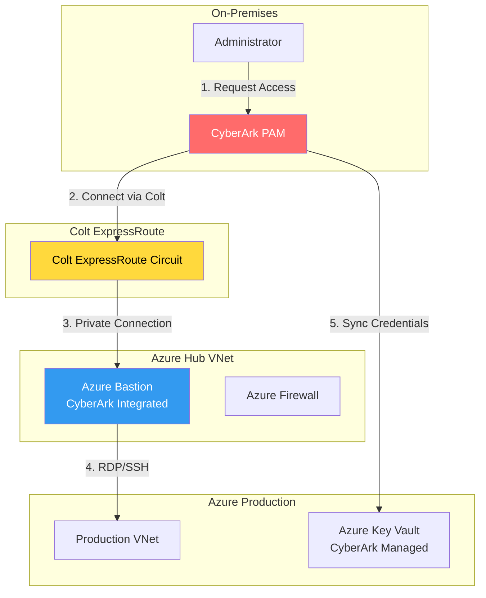
```mermaid
graph TB
    subgraph "On-Premises"
        Admin[Administrator]
        CyberArk[CyberArk PAM]
    end
    
    subgraph "Colt ExpressRoute"
        ColtER[Colt ExpressRoute Circuit]
    end
    
    subgraph "Azure Hub VNet"
        HubBastion[Azure Bastion<br/>CyberArk Integrated]
        HubFW[Azure Firewall]
    end
    
    subgraph "Azure Production"
        ProdVNet[Production VNet]
        ProdKeyVault[Azure Key Vault<br/>CyberArk Managed]
    end
    
    Admin -->|1. Request Access| CyberArk
    CyberArk -->|2. Connect via Colt| ColtER
    ColtER -->|3. Private Connection| HubBastion
    HubBastion -->|4. RDP/SSH| ProdVNet
    CyberArk -->|5. Sync Credentials| ProdKeyVault
    
    style ColtER fill:#ffd93d,color:#000
    style CyberArk fill:#ff6b6b,color:#fff
    style HubBastion fill:#339af0,color:#fff
```

#### Colt + ZTNA Integration

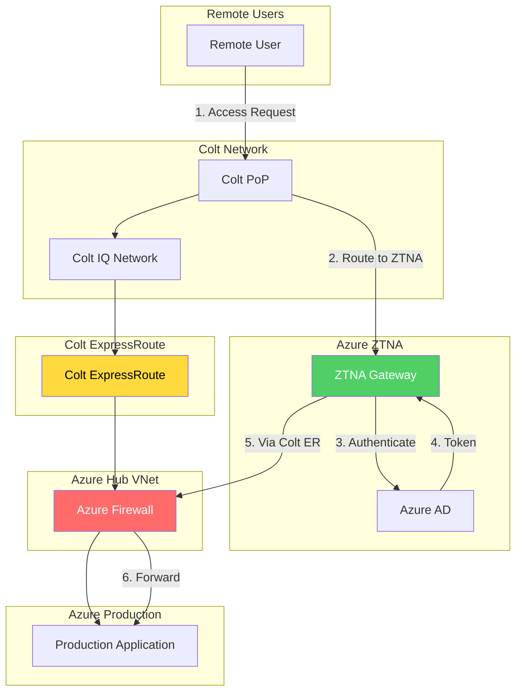
```mermaid
graph TB
    subgraph "Remote Users"
        User[Remote User]
    end
    
    subgraph "Colt Network"
        ColtPOP[Colt PoP]
        ColtBackbone[Colt IQ Network]
        ColtPOP --> ColtBackbone
    end
    
    subgraph "Azure ZTNA"
        ZTNAGateway[ZTNA Gateway]
        AzureAD[Azure AD]
    end
    
    subgraph "Colt ExpressRoute"
        ColtER[Colt ExpressRoute]
        ColtBackbone --> ColtER
    end
    
    subgraph "Azure Hub VNet"
        HubFW[Azure Firewall]
        ColtER --> HubFW
    end
    
    subgraph "Azure Production"
        ProdApp[Production Application]
        HubFW --> ProdApp
    end
    
    User -->|1. Access Request| ColtPOP
    ColtPOP -->|2. Route to ZTNA| ZTNAGateway
    ZTNAGateway -->|3. Authenticate| AzureAD
    AzureAD -->|4. Token| ZTNAGateway
    ZTNAGateway -->|5. Via Colt ER| HubFW
    HubFW -->|6. Forward| ProdApp
    
    style ColtER fill:#ffd93d,color:#000
    style ZTNAGateway fill:#51cf66,color:#fff
    style HubFW fill:#ff6b6b,color:#fff
```

### Colt Benefits for Enterprise Networking

1. **Global Reach**: Connect to Azure regions worldwide through Colt's network
2. **High Performance**: Low latency, high bandwidth connectivity
3. **Managed Services**: Fully managed ExpressRoute circuits
4. **Flexibility**: On-demand bandwidth scaling
5. **Security**: Enterprise-grade security and compliance
6. **SLA Guarantees**: 99.95% uptime SLA
7. **SD-WAN Integration**: Seamless integration with SD-WAN solutions
8. **Cost Optimization**: Flexible pricing models

### Colt vs Other ExpressRoute Providers

| Feature | Colt | Other Providers |
|---------|------|-----------------|
| **Global Network** | 900+ data centers, 29,000+ buildings | Varies by provider |
| **Managed Services** | Fully managed options | Varies by provider |
| **On-Demand Bandwidth** | Colt On Demand available | Limited availability |
| **SD-WAN Integration** | Native SD-WAN support | Varies by provider |
| **SLA** | 99.95% uptime | Varies by provider |
| **Support** | 24/7 global support | Varies by provider |

### Best Practices for Colt ExpressRoute

1. **Redundancy**: Use multiple Colt circuits from different PoPs
2. **Monitoring**: Leverage Colt's monitoring and management tools
3. **Bandwidth Planning**: Use Colt On Demand for variable workloads
4. **Security**: Enable encryption and network segmentation
5. **Documentation**: Document Colt circuit IDs and configurations
6. **Support**: Establish relationship with Colt support team
7. **Testing**: Regularly test failover scenarios
8. **Cost Management**: Monitor bandwidth usage and optimize costs

---

## CyberArk Integration

### What is CyberArk?

CyberArk is a Privileged Access Management (PAM) solution that secures, manages, and monitors privileged accounts and credentials. It integrates with Azure services to provide secure access to cloud resources.

### CyberArk Architecture with Azure Networking

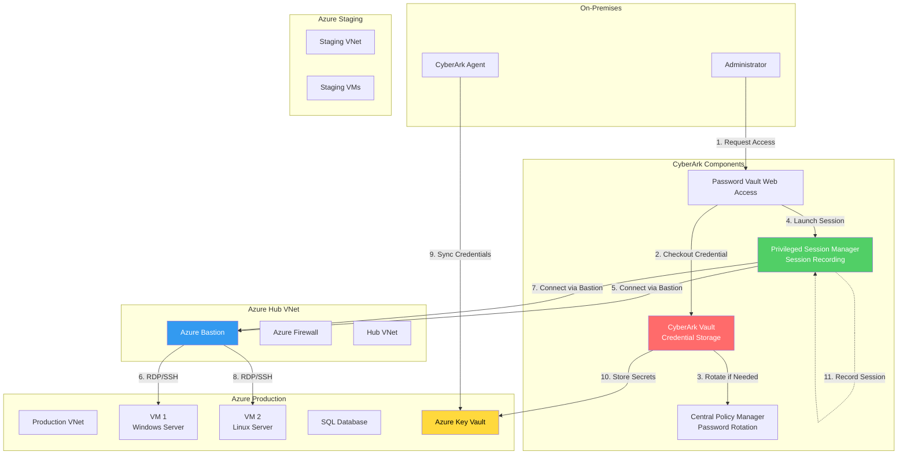
```mermaid
graph TB
    subgraph "CyberArk Components"
        Vault[CyberArk Vault<br/>Credential Storage]
        CPM[Central Policy Manager<br/>Password Rotation]
        PSM[Privileged Session Manager<br/>Session Recording]
        PVWA[Password Vault Web Access]
    end
    
    subgraph "On-Premises"
        Admin[Administrator]
        CyberArkAgent[CyberArk Agent]
    end
    
    subgraph "Azure Hub VNet"
        HubBastion[Azure Bastion]
        HubFW[Azure Firewall]
        HubVNet[Hub VNet]
    end
    
    subgraph "Azure Production"
        ProdVNet[Production VNet]
        ProdVM1[VM 1<br/>Windows Server]
        ProdVM2[VM 2<br/>Linux Server]
        ProdSQL[SQL Database]
        ProdKeyVault[Azure Key Vault]
    end
    
    subgraph "Azure Staging"
        StageVNet[Staging VNet]
        StageVM[Staging VMs]
    end
    
    Admin -->|1. Request Access| PVWA
    PVWA -->|2. Checkout Credential| Vault
    Vault -->|3. Rotate if Needed| CPM
    PVWA -->|4. Launch Session| PSM
    PSM -->|5. Connect via Bastion| HubBastion
    HubBastion -->|6. RDP/SSH| ProdVM1
    PSM -->|7. Connect via Bastion| HubBastion
    HubBastion -->|8. RDP/SSH| ProdVM2
    
    CyberArkAgent -->|9. Sync Credentials| ProdKeyVault
    Vault -->|10. Store Secrets| ProdKeyVault
    
    PSM -.->|11. Record Session| PSM
    
    style Vault fill:#ff6b6b,color:#fff
    style PSM fill:#51cf66,color:#fff
    style HubBastion fill:#339af0,color:#fff
    style ProdKeyVault fill:#ffd93d,color:#000
```

### CyberArk Integration Points

#### 1. Azure Bastion Integration

**Purpose:** Secure RDP/SSH access to VMs without public IPs

**How it works:**
1. Administrator requests access through CyberArk PSM
2. CyberArk validates permissions and checks out credentials
3. PSM establishes session through Azure Bastion
4. All sessions are recorded and audited
5. Credentials are rotated automatically

**Benefits:**
- No public IPs on VMs (security)
- All access logged and monitored
- Credential rotation automated
- Session recording for compliance

#### 2. Azure Key Vault Integration

**Purpose:** Store and rotate secrets managed by CyberArk

**Configuration:**
- CyberArk CPM rotates passwords in Key Vault
- Applications retrieve secrets from Key Vault
- Audit logs track all secret access

**Integration Flow:**

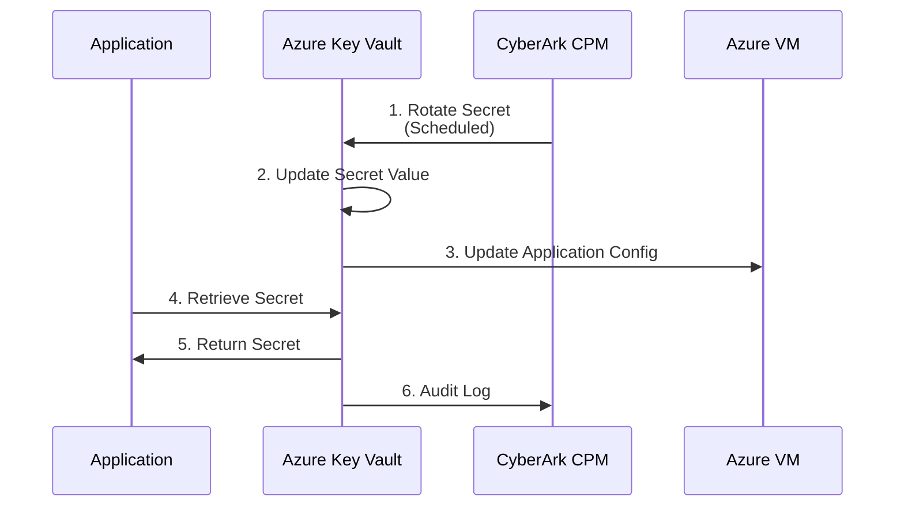
```mermaid
sequenceDiagram
    participant App as Application
    participant KV as Azure Key Vault
    participant CyberArk as CyberArk CPM
    participant VM as Azure VM
    
    CyberArk->>KV: 1. Rotate Secret<br/>(Scheduled)
    KV->>KV: 2. Update Secret Value
    KV->>VM: 3. Update Application Config
    App->>KV: 4. Retrieve Secret
    KV->>App: 5. Return Secret
    KV->>CyberArk: 6. Audit Log
```

#### 3. Azure Firewall Integration

**Purpose:** Control and log access to CyberArk services

**Configuration:**
- Allow traffic from CyberArk PSM to Azure Bastion
- Allow traffic from CyberArk agents to Key Vault
- Log all CyberArk-related traffic
- Block unauthorized access attempts

**Firewall Rules:**

```hcl
# Application Rule: Allow CyberArk PSM to Azure Bastion
application_rule_collections = [{
  name     = "AllowCyberArkPSM"
  priority = 100
  action   = "Allow"
  rules = [{
    name             = "CyberArkToBastion"
    source_addresses = ["10.1.10.0/24"]  # CyberArk PSM subnet
    target_fqdns     = ["*.bastion.azure.com"]
  }]
}]

# Network Rule: Allow CyberArk to Key Vault
network_rule_collections = [{
  name     = "AllowCyberArkKeyVault"
  priority = 200
  action   = "Allow"
  rules = [{
    name                  = "CyberArkToKeyVault"
    source_addresses      = ["10.1.10.0/24"]
    destination_addresses = ["10.2.5.0/24"]  # Key Vault private endpoint
    destination_ports     = ["443"]
    protocols             = ["TCP"]
  }]
}]
```

### CyberArk with Dual NAT Firewall

When using a dual NAT firewall architecture, CyberArk sessions are routed through the firewall for additional security:

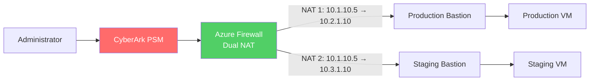
```mermaid
graph LR
    Admin[Administrator] --> CyberArk[CyberArk PSM]
    CyberArk --> HubFW[Azure Firewall<br/>Dual NAT]
    HubFW -->|NAT 1: 10.1.10.5 → 10.2.1.10| ProdBastion[Production Bastion]
    HubFW -->|NAT 2: 10.1.10.5 → 10.3.1.10| StageBastion[Staging Bastion]
    ProdBastion --> ProdVM[Production VM]
    StageBastion --> StageVM[Staging VM]
    
    style HubFW fill:#51cf66,color:#fff
    style CyberArk fill:#ff6b6b,color:#fff
```

**Benefits:**
- Additional security layer
- Centralized logging of all privileged access
- Environment isolation maintained
- Compliance with audit requirements

---

## Zero Trust Network Access (ZTNA)

### What is ZTNA?

Zero Trust Network Access (ZTNA) is a security model that requires strict identity verification for every person and device trying to access resources on a private network, regardless of whether they are sitting within or outside of the network perimeter.

### ZTNA Architecture with Azure Networking

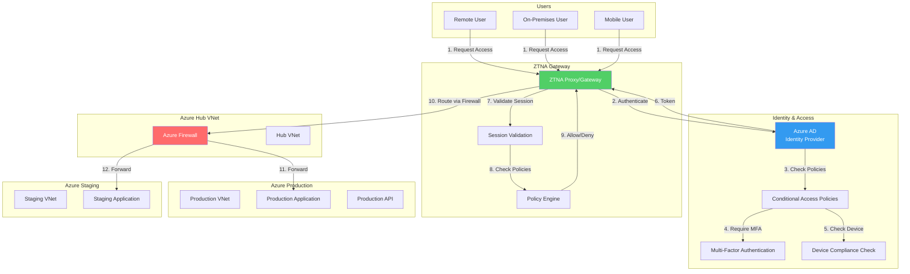
```mermaid
graph TB
    subgraph "Users"
        RemoteUser[Remote User]
        OnPremUser[On-Premises User]
        MobileUser[Mobile User]
    end
    
    subgraph "Identity & Access"
        AzureAD[Azure AD<br/>Identity Provider]
        ConditionalAccess[Conditional Access Policies]
        MFA[Multi-Factor Authentication]
        DeviceCompliance[Device Compliance Check]
    end
    
    subgraph "ZTNA Gateway"
        ZTNAProxy[ZTNA Proxy/Gateway]
        SessionValidation[Session Validation]
        PolicyEngine[Policy Engine]
    end
    
    subgraph "Azure Hub VNet"
        HubFW[Azure Firewall]
        HubVNet[Hub VNet]
    end
    
    subgraph "Azure Production"
        ProdVNet[Production VNet]
        ProdApp[Production Application]
        ProdAPI[Production API]
    end
    
    subgraph "Azure Staging"
        StageVNet[Staging VNet]
        StageApp[Staging Application]
    end
    
    RemoteUser -->|1. Request Access| ZTNAProxy
    OnPremUser -->|1. Request Access| ZTNAProxy
    MobileUser -->|1. Request Access| ZTNAProxy
    
    ZTNAProxy -->|2. Authenticate| AzureAD
    AzureAD -->|3. Check Policies| ConditionalAccess
    ConditionalAccess -->|4. Require MFA| MFA
    ConditionalAccess -->|5. Check Device| DeviceCompliance
    
    AzureAD -->|6. Token| ZTNAProxy
    ZTNAProxy -->|7. Validate Session| SessionValidation
    SessionValidation -->|8. Check Policies| PolicyEngine
    
    PolicyEngine -->|9. Allow/Deny| ZTNAProxy
    ZTNAProxy -->|10. Route via Firewall| HubFW
    HubFW -->|11. Forward| ProdApp
    HubFW -->|12. Forward| StageApp
    
    style AzureAD fill:#339af0,color:#fff
    style ZTNAProxy fill:#51cf66,color:#fff
    style HubFW fill:#ff6b6b,color:#fff
```

### ZTNA Implementation with Azure Services

#### 1. Azure AD Integration

**Components:**
- **Azure AD**: Identity provider and authentication
- **Conditional Access**: Policy-based access control
- **Azure AD Application Proxy**: ZTNA gateway functionality
- **Azure AD Private Link**: Private access to Azure AD

**Configuration:**

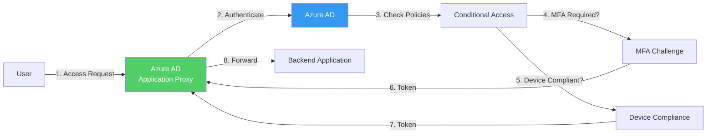
```mermaid
graph LR
    User[User] -->|1. Access Request| AppProxy[Azure AD<br/>Application Proxy]
    AppProxy -->|2. Authenticate| AzureAD[Azure AD]
    AzureAD -->|3. Check Policies| ConditionalAccess[Conditional Access]
    ConditionalAccess -->|4. MFA Required?| MFA[MFA Challenge]
    ConditionalAccess -->|5. Device Compliant?| DeviceCheck[Device Compliance]
    MFA -->|6. Token| AppProxy
    DeviceCheck -->|7. Token| AppProxy
    AppProxy -->|8. Forward| BackendApp[Backend Application]
    
    style AzureAD fill:#339af0,color:#fff
    style AppProxy fill:#51cf66,color:#fff
```

#### 2. Azure Firewall Integration

**Purpose:** Enforce ZTNA policies at the network layer

**Configuration:**
- Application rules based on FQDN and user identity
- Network rules based on source IP and identity
- Threat intelligence integration
- TLS inspection for deep packet inspection

**Firewall Rules for ZTNA:**

```hcl
# Application Rule: Allow ZTNA traffic based on user identity
application_rule_collections = [{
  name     = "ZTNAApplicationRules"
  priority = 100
  action   = "Allow"
  rules = [{
    name             = "AllowZTNAUsers"
    source_addresses = ["10.1.20.0/24"]  # ZTNA gateway subnet
    target_fqdns     = ["app-prod.company.com", "api-prod.company.com"]
    # Note: User identity is validated by ZTNA gateway before traffic reaches firewall
  }]
}]

# Network Rule: Allow ZTNA gateway to backend
network_rule_collections = [{
  name     = "ZTNANetworkRules"
  priority = 200
  action   = "Allow"
  rules = [{
    name                  = "ZTNAGatewayToBackend"
    source_addresses      = ["10.1.20.0/24"]  # ZTNA gateway
    destination_addresses = ["10.2.1.0/24"]   # Production backend
    destination_ports     = ["443", "8080"]
    protocols             = ["TCP"]
  }]
}]
```

#### 3. Private Endpoint Integration

**Purpose:** Provide private access to applications without exposing them to the Internet

**Architecture:**

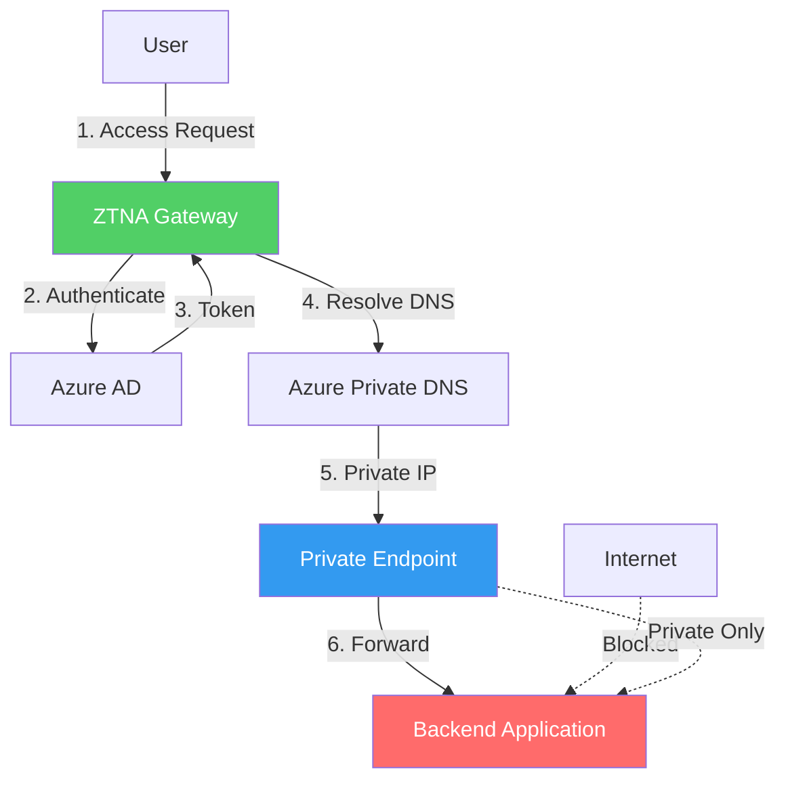
```mermaid
graph TB
    User[User] -->|1. Access Request| ZTNAGateway[ZTNA Gateway]
    ZTNAGateway -->|2. Authenticate| AzureAD[Azure AD]
    AzureAD -->|3. Token| ZTNAGateway
    ZTNAGateway -->|4. Resolve DNS| PrivateDNS[Azure Private DNS]
    PrivateDNS -->|5. Private IP| PrivateEndpoint[Private Endpoint]
    PrivateEndpoint -->|6. Forward| BackendApp[Backend Application]
    
    Internet -.->|Blocked| BackendApp
    PrivateEndpoint -.->|Private Only| BackendApp
    
    style ZTNAGateway fill:#51cf66,color:#fff
    style PrivateEndpoint fill:#339af0,color:#fff
    style BackendApp fill:#ff6b6b,color:#fff
```

### ZTNA Benefits

1. **No VPN Required**: Users don't need VPN clients
2. **Granular Access**: Per-application access control
3. **Device Compliance**: Enforce device security policies
4. **Audit Trail**: Complete logging of all access
5. **Reduced Attack Surface**: Applications not exposed to Internet
6. **Scalability**: Cloud-native, scales automatically

---

## Dual NAT Firewall Architecture

### What is Dual NAT?

Dual NAT (Network Address Translation) uses two layers of NAT translation to provide complete network isolation between production and staging environments while maintaining connectivity through a centralized firewall.

### Dual NAT Architecture

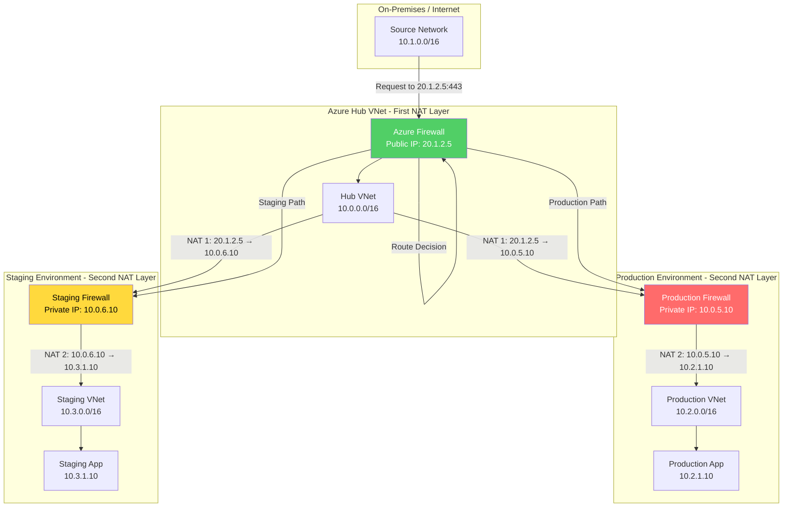
```mermaid
graph TB
    subgraph "On-Premises / Internet"
        Source[Source Network<br/>10.1.0.0/16]
    end
    
    subgraph "Azure Hub VNet - First NAT Layer"
        HubFW[Azure Firewall<br/>Public IP: 20.1.2.5]
        HubVNet[Hub VNet<br/>10.0.0.0/16]
        HubFW --> HubVNet
    end
    
    subgraph "Production Environment - Second NAT Layer"
        ProdFW[Production Firewall<br/>Private IP: 10.0.5.10]
        ProdVNet[Production VNet<br/>10.2.0.0/16]
        ProdApp[Production App<br/>10.2.1.10]
        HubVNet -->|NAT 1: 20.1.2.5 → 10.0.5.10| ProdFW
        ProdFW -->|NAT 2: 10.0.5.10 → 10.2.1.10| ProdVNet
        ProdVNet --> ProdApp
    end
    
    subgraph "Staging Environment - Second NAT Layer"
        StageFW[Staging Firewall<br/>Private IP: 10.0.6.10]
        StageVNet[Staging VNet<br/>10.3.0.0/16]
        StageApp[Staging App<br/>10.3.1.10]
        HubVNet -->|NAT 1: 20.1.2.5 → 10.0.6.10| StageFW
        StageFW -->|NAT 2: 10.0.6.10 → 10.3.1.10| StageVNet
        StageVNet --> StageApp
    end
    
    Source -->|Request to 20.1.2.5:443| HubFW
    HubFW -->|Route Decision| HubFW
    HubFW -->|Production Path| ProdFW
    HubFW -->|Staging Path| StageFW
    
    style HubFW fill:#51cf66,color:#fff
    style ProdFW fill:#ff6b6b,color:#fff
    style StageFW fill:#ffd93d,color:#000
```

### Dual NAT Flow Sequence

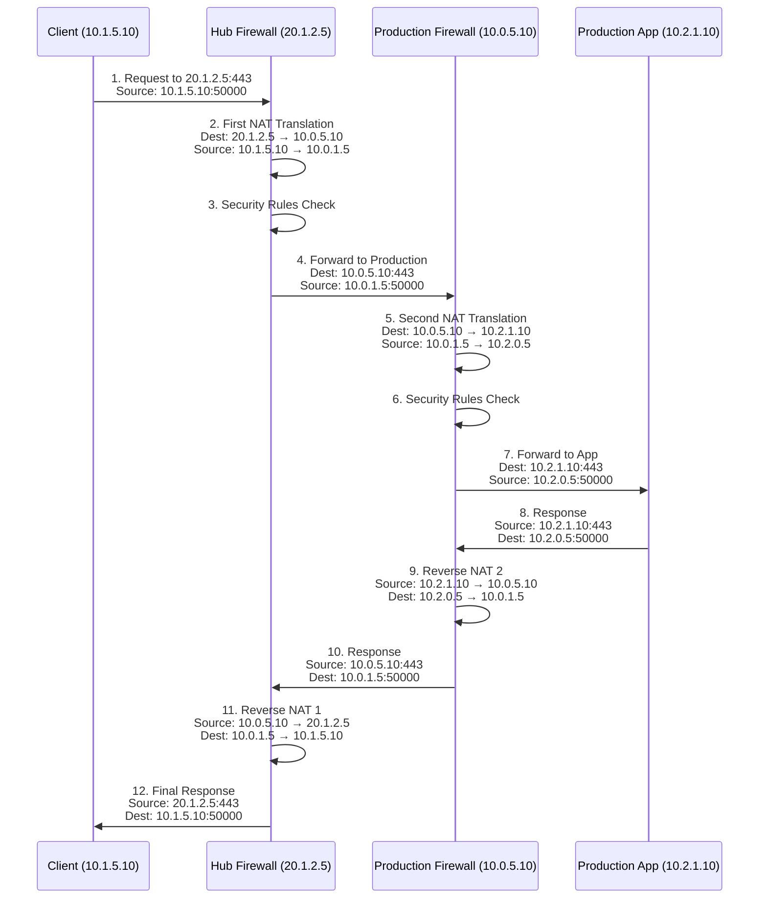
```mermaid
sequenceDiagram
    participant Client as Client (10.1.5.10)
    participant HubFW as Hub Firewall (20.1.2.5)
    participant ProdFW as Production Firewall (10.0.5.10)
    participant ProdApp as Production App (10.2.1.10)
    
    Client->>HubFW: 1. Request to 20.1.2.5:443<br/>Source: 10.1.5.10:50000
    HubFW->>HubFW: 2. First NAT Translation<br/>Dest: 20.1.2.5 → 10.0.5.10<br/>Source: 10.1.5.10 → 10.0.1.5
    HubFW->>HubFW: 3. Security Rules Check
    HubFW->>ProdFW: 4. Forward to Production<br/>Dest: 10.0.5.10:443<br/>Source: 10.0.1.5:50000
    ProdFW->>ProdFW: 5. Second NAT Translation<br/>Dest: 10.0.5.10 → 10.2.1.10<br/>Source: 10.0.1.5 → 10.2.0.5
    ProdFW->>ProdFW: 6. Security Rules Check
    ProdFW->>ProdApp: 7. Forward to App<br/>Dest: 10.2.1.10:443<br/>Source: 10.2.0.5:50000
    ProdApp->>ProdFW: 8. Response<br/>Source: 10.2.1.10:443<br/>Dest: 10.2.0.5:50000
    ProdFW->>ProdFW: 9. Reverse NAT 2<br/>Source: 10.2.1.10 → 10.0.5.10<br/>Dest: 10.2.0.5 → 10.0.1.5
    ProdFW->>HubFW: 10. Response<br/>Source: 10.0.5.10:443<br/>Dest: 10.0.1.5:50000
    HubFW->>HubFW: 11. Reverse NAT 1<br/>Source: 10.0.5.10 → 20.1.2.5<br/>Dest: 10.0.1.5 → 10.1.5.10
    HubFW->>Client: 12. Final Response<br/>Source: 20.1.2.5:443<br/>Dest: 10.1.5.10:50000
```

### Dual NAT Configuration

#### Hub Firewall Configuration (First NAT Layer)

```hcl
# Hub Firewall NAT Rules
nat_rule_collections = [{
  name     = "ProductionDNAT"
  priority = 100
  action   = "Dnat"
  rules = [{
    name                = "ProdHTTPS"
    source_addresses    = ["*"]
    destination_address = "20.1.2.5"  # Hub Firewall Public IP
    destination_ports   = ["443"]
    translated_address  = "10.0.5.10"  # Production Firewall Private IP
    translated_port     = "443"
    protocols           = ["TCP"]
  }]
}, {
  name     = "StagingDNAT"
  priority = 200
  action   = "Dnat"
  rules = [{
    name                = "StageHTTPS"
    source_addresses    = ["*"]
    destination_address = "20.1.2.5"  # Hub Firewall Public IP
    destination_ports   = ["8443"]     # Different port for staging
    translated_address  = "10.0.6.10"  # Staging Firewall Private IP
    translated_port     = "443"
    protocols           = ["TCP"]
  }]
}]

# Network Rules for Forwarding
network_rule_collections = [{
  name     = "AllowToProduction"
  priority = 100
  action   = "Allow"
  rules = [{
    name                  = "HubToProd"
    source_addresses      = ["10.0.0.0/16"]  # Hub VNet
    destination_addresses = ["10.0.5.10"]    # Production Firewall
    destination_ports     = ["443"]
    protocols             = ["TCP"]
  }]
}, {
  name     = "AllowToStaging"
  priority = 200
  action   = "Allow"
  rules = [{
    name                  = "HubToStage"
    source_addresses      = ["10.0.0.0/16"]  # Hub VNet
    destination_addresses = ["10.0.6.10"]    # Staging Firewall
    destination_ports     = ["443"]
    protocols             = ["TCP"]
  }]
}]
```

#### Production Firewall Configuration (Second NAT Layer)

```hcl
# Production Firewall NAT Rules
nat_rule_collections = [{
  name     = "ProductionAppDNAT"
  priority = 100
  action   = "Dnat"
  rules = [{
    name                = "ProdAppHTTPS"
    source_addresses    = ["10.0.0.0/16"]  # From Hub VNet
    destination_address = "10.0.5.10"     # Production Firewall IP
    destination_ports   = ["443"]
    translated_address  = "10.2.1.10"     # Production App IP
    translated_port     = "443"
    protocols           = ["TCP"]
  }]
}]

# Application Rules
application_rule_collections = [{
  name     = "AllowProductionApp"
  priority = 100
  action   = "Allow"
  rules = [{
    name             = "ProdAppAccess"
    source_addresses = ["10.0.0.0/16"]
    target_fqdns     = ["app-prod.company.com"]
  }]
}]
```

### Dual NAT Benefits

1. **Complete Isolation**: Production and staging networks are completely isolated
2. **Security**: Multiple layers of security and NAT translation
3. **Compliance**: Meets requirements for environment separation
4. **Centralized Management**: Hub firewall manages all ingress traffic
5. **Audit Trail**: Complete logging at both NAT layers
6. **Flexibility**: Easy to add new environments

### Dual NAT with ExpressRoute

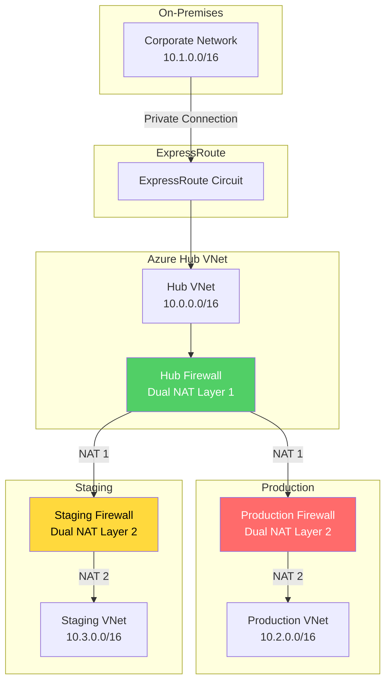
```mermaid
graph TB
    subgraph "On-Premises"
        CorpNet[Corporate Network<br/>10.1.0.0/16]
    end
    
    subgraph "ExpressRoute"
        ER[ExpressRoute Circuit]
    end
    
    subgraph "Azure Hub VNet"
        HubFW[Hub Firewall<br/>Dual NAT Layer 1]
        HubVNet[Hub VNet<br/>10.0.0.0/16]
    end
    
    subgraph "Production"
        ProdFW[Production Firewall<br/>Dual NAT Layer 2]
        ProdVNet[Production VNet<br/>10.2.0.0/16]
    end
    
    subgraph "Staging"
        StageFW[Staging Firewall<br/>Dual NAT Layer 2]
        StageVNet[Staging VNet<br/>10.3.0.0/16]
    end
    
    CorpNet -->|Private Connection| ER
    ER --> HubVNet
    HubVNet --> HubFW
    HubFW -->|NAT 1| ProdFW
    HubFW -->|NAT 1| StageFW
    ProdFW -->|NAT 2| ProdVNet
    StageFW -->|NAT 2| StageVNet
    
    style HubFW fill:#51cf66,color:#fff
    style ProdFW fill:#ff6b6b,color:#fff
    style StageFW fill:#ffd93d,color:#000
```

---

## Complete Enterprise Architecture

### Integrated Architecture Diagram

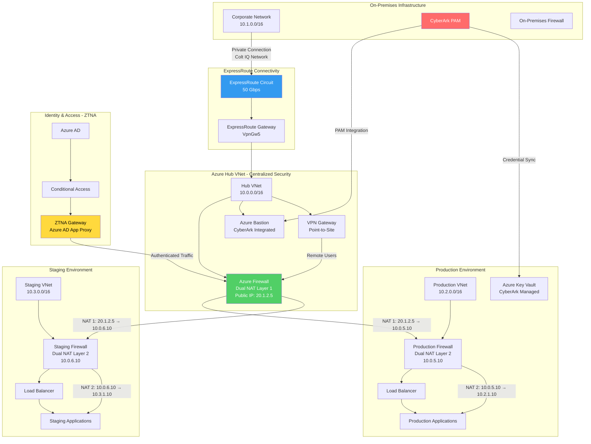
```mermaid
graph TB
    subgraph "On-Premises Infrastructure"
        CorpNet[Corporate Network<br/>10.1.0.0/16]
        CyberArk[CyberArk PAM]
        OnPremFW[On-Premises Firewall]
    end
    
    subgraph "ExpressRoute Connectivity"
        ERCircuit[ExpressRoute Circuit<br/>50 Gbps]
        ERGateway[ExpressRoute Gateway<br/>VpnGw5]
    end
    
    subgraph "Azure Hub VNet - Centralized Security"
        HubVNet[Hub VNet<br/>10.0.0.0/16]
        HubFW[Azure Firewall<br/>Dual NAT Layer 1<br/>Public IP: 20.1.2.5]
        HubBastion[Azure Bastion<br/>CyberArk Integrated]
        HubVPN[VPN Gateway<br/>Point-to-Site]
        HubVNet --> HubFW
        HubVNet --> HubBastion
        HubVNet --> HubVPN
    end
    
    subgraph "Identity & Access - ZTNA"
        AzureAD[Azure AD]
        ConditionalAccess[Conditional Access]
        ZTNAGateway[ZTNA Gateway<br/>Azure AD App Proxy]
        AzureAD --> ConditionalAccess
        ConditionalAccess --> ZTNAGateway
    end
    
    subgraph "Production Environment"
        ProdVNet[Production VNet<br/>10.2.0.0/16]
        ProdFW[Production Firewall<br/>Dual NAT Layer 2<br/>10.0.5.10]
        ProdLB[Load Balancer]
        ProdApp[Production Applications]
        ProdKeyVault[Azure Key Vault<br/>CyberArk Managed]
        ProdVNet --> ProdFW
        ProdFW --> ProdLB
        ProdLB --> ProdApp
    end
    
    subgraph "Staging Environment"
        StageVNet[Staging VNet<br/>10.3.0.0/16]
        StageFW[Staging Firewall<br/>Dual NAT Layer 2<br/>10.0.6.10]
        StageLB[Load Balancer]
        StageApp[Staging Applications]
        StageVNet --> StageFW
        StageFW --> StageLB
        StageLB --> StageApp
    end
    
    CorpNet -->|Private Connection<br/>Colt IQ Network| ERCircuit
    ERCircuit --> ERGateway
    ERGateway --> HubVNet
    
    CyberArk -->|PAM Integration| HubBastion
    CyberArk -->|Credential Sync| ProdKeyVault
    
    ZTNAGateway -->|Authenticated Traffic| HubFW
    HubVPN -->|Remote Users| HubFW
    
    HubFW -->|NAT 1: 20.1.2.5 → 10.0.5.10| ProdFW
    HubFW -->|NAT 1: 20.1.2.5 → 10.0.6.10| StageFW
    
    ProdFW -->|NAT 2: 10.0.5.10 → 10.2.1.10| ProdApp
    StageFW -->|NAT 2: 10.0.6.10 → 10.3.1.10| StageApp
    
    style HubFW fill:#51cf66,color:#fff
    style CyberArk fill:#ff6b6b,color:#fff
    style ZTNAGateway fill:#ffd93d,color:#000
    style ERCircuit fill:#339af0,color:#fff
```

### Traffic Flow Examples

#### 1. On-Premises to Production via ExpressRoute

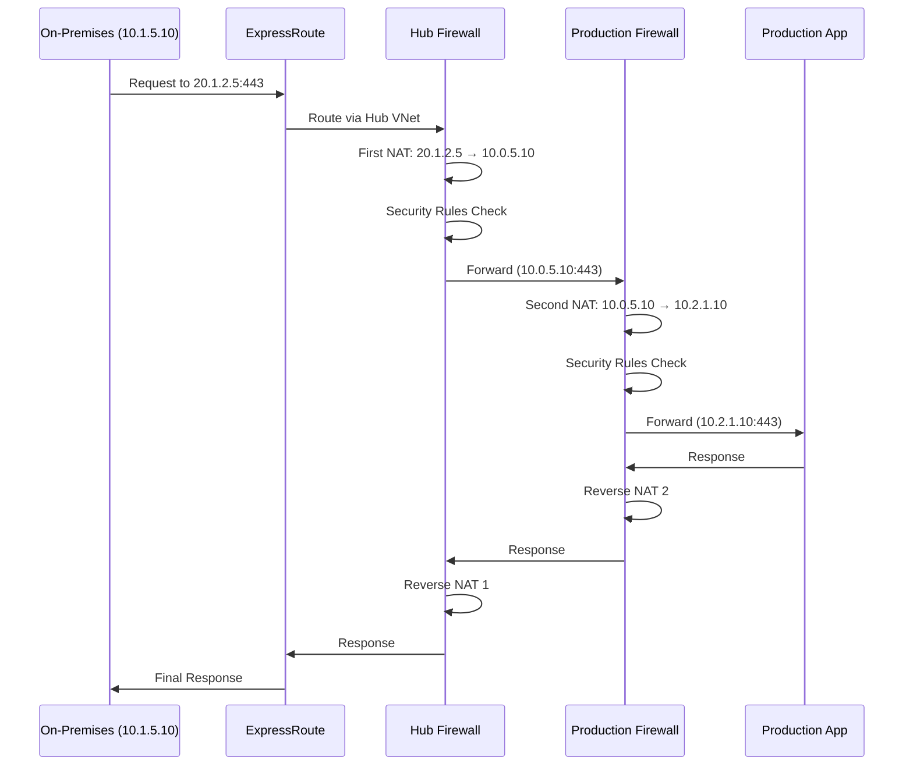
```mermaid
sequenceDiagram
    participant OnPrem as On-Premises (10.1.5.10)
    participant ER as ExpressRoute
    participant HubFW as Hub Firewall
    participant ProdFW as Production Firewall
    participant ProdApp as Production App
    
    OnPrem->>ER: Request to 20.1.2.5:443
    ER->>HubFW: Route via Hub VNet
    HubFW->>HubFW: First NAT: 20.1.2.5 → 10.0.5.10
    HubFW->>HubFW: Security Rules Check
    HubFW->>ProdFW: Forward (10.0.5.10:443)
    ProdFW->>ProdFW: Second NAT: 10.0.5.10 → 10.2.1.10
    ProdFW->>ProdFW: Security Rules Check
    ProdFW->>ProdApp: Forward (10.2.1.10:443)
    ProdApp->>ProdFW: Response
    ProdFW->>ProdFW: Reverse NAT 2
    ProdFW->>HubFW: Response
    HubFW->>HubFW: Reverse NAT 1
    HubFW->>ER: Response
    ER->>OnPrem: Final Response
```

#### 2. Remote User via ZTNA to Staging

```mermaid
sequenceDiagram
    participant User as Remote User
    participant ZTNA as ZTNA Gateway
    participant AzureAD as Azure AD
    participant HubFW as Hub Firewall
    participant StageFW as Staging Firewall
    participant StageApp as Staging App
    
    User->>ZTNA: Access Request
    ZTNA->>AzureAD: Authenticate
    AzureAD->>AzureAD: Conditional Access Check
    AzureAD->>ZTNA: Token + Policies
    ZTNA->>HubFW: Authenticated Request (20.1.2.5:8443)
    HubFW->>HubFW: First NAT: 20.1.2.5 → 10.0.6.10
    HubFW->>StageFW: Forward (10.0.6.10:443)
    StageFW->>StageFW: Second NAT: 10.0.6.10 → 10.3.1.10
    StageFW->>StageApp: Forward (10.3.1.10:443)
    StageApp->>StageFW: Response
    StageFW->>HubFW: Response
    HubFW->>ZTNA: Response
    ZTNA->>User: Final Response
```

#### 3. CyberArk Privileged Access to Production

```mermaid
sequenceDiagram
    participant Admin as Administrator
    participant CyberArk as CyberArk PSM
    participant HubBastion as Azure Bastion
    participant HubFW as Hub Firewall
    participant ProdFW as Production Firewall
    participant ProdVM as Production VM
    
    Admin->>CyberArk: Request Access
    CyberArk->>CyberArk: Validate Permissions
    CyberArk->>CyberArk: Checkout Credentials
    CyberArk->>HubBastion: Connect via Bastion
    HubBastion->>HubFW: Route to Production
    HubFW->>HubFW: First NAT
    HubFW->>ProdFW: Forward
    ProdFW->>ProdFW: Second NAT
    ProdFW->>ProdVM: RDP/SSH Connection
    CyberArk->>CyberArk: Record Session
    ProdVM->>CyberArk: Session Established
    CyberArk->>Admin: Remote Desktop/SSH
```

---

## Implementation Examples

### Terraform Configuration for Dual NAT Firewall

```hcl
# Hub Firewall Module
module "hub_firewall" {
  source = "./modules/firewall"
  
  resource_group_name = "rg-hub-networking"
  location           = "eastus"
  firewall_name      = "fw-hub"
  
  # Public IP for Hub Firewall
  public_ip_count = 1
  
  # NAT Rules - First NAT Layer
  nat_rule_collections = [
    {
      name     = "ProductionDNAT"
      priority = 100
      action   = "Dnat"
      rules = [
        {
          name                = "ProdHTTPS"
          source_addresses    = ["*"]
          destination_address = "20.1.2.5"
          destination_ports   = ["443"]
          translated_address  = "10.0.5.10"  # Production Firewall
          translated_port     = "443"
          protocols           = ["TCP"]
        }
      ]
    },
    {
      name     = "StagingDNAT"
      priority = 200
      action   = "Dnat"
      rules = [
        {
          name                = "StageHTTPS"
          source_addresses    = ["*"]
          destination_address = "20.1.2.5"
          destination_ports   = ["8443"]  # Different port
          translated_address  = "10.0.6.10"  # Staging Firewall
          translated_port     = "443"
          protocols           = ["TCP"]
        }
      ]
    }
  ]
  
  # Network Rules
  network_rule_collections = [
    {
      name     = "AllowToProduction"
      priority = 100
      action   = "Allow"
      rules = [
        {
          name                  = "HubToProd"
          source_addresses      = ["10.0.0.0/16"]
          destination_addresses = ["10.0.5.10"]
          destination_ports     = ["443"]
          protocols             = ["TCP"]
        }
      ]
    },
    {
      name     = "AllowToStaging"
      priority = 200
      action   = "Allow"
      rules = [
        {
          name                  = "HubToStage"
          source_addresses      = ["10.0.0.0/16"]
          destination_addresses = ["10.0.6.10"]
          destination_ports     = ["443"]
          protocols             = ["TCP"]
        }
      ]
    }
  ]
}

# Production Firewall Module
module "production_firewall" {
  source = "./modules/firewall"
  
  resource_group_name = "rg-prod-networking"
  location           = "eastus"
  firewall_name      = "fw-prod"
  
  # NAT Rules - Second NAT Layer
  nat_rule_collections = [
    {
      name     = "ProductionAppDNAT"
      priority = 100
      action   = "Dnat"
      rules = [
        {
          name                = "ProdAppHTTPS"
          source_addresses    = ["10.0.0.0/16"]  # From Hub
          destination_address = "10.0.5.10"
          destination_ports   = ["443"]
          translated_address  = "10.2.1.10"  # Production App
          translated_port     = "443"
          protocols           = ["TCP"]
        }
      ]
    }
  ]
}
```

### ExpressRoute Configuration

```hcl
# ExpressRoute Circuit
resource "azurerm_express_route_circuit" "main" {
  name                  = "er-circuit-main"
  resource_group_name   = azurerm_resource_group.main.name
  location              = "eastus"
  service_provider_name = "Equinix"
  peering_location      = "Washington DC"
  bandwidth_in_mbps     = 1000
  
  sku {
    tier   = "Standard"
    family = "MeteredData"
  }
  
  allow_classic_operations = false
}

# ExpressRoute Gateway
resource "azurerm_virtual_network_gateway" "expressroute" {
  name                = "gw-expressroute"
  location            = azurerm_resource_group.main.location
  resource_group_name = azurerm_resource_group.main.name
  type                = "ExpressRoute"
  vpn_type            = null
  
  sku = "ErGw5AZ"  # For high bandwidth
  
  ip_configuration {
    name                          = "vnetGatewayConfig"
    public_ip_address_id          = azurerm_public_ip.gateway.id
    private_ip_address_allocation = "Dynamic"
    subnet_id                     = azurerm_subnet.gateway.id
  }
}

# ExpressRoute Connection
resource "azurerm_express_route_connection" "main" {
  name                    = "er-connection-main"
  express_route_gateway_id = azurerm_virtual_network_gateway.expressroute.id
  express_route_circuit_id = azurerm_express_route_circuit.main.id
  
  routing_weight = 10
}
```

---

## Best Practices

### ExpressRoute Best Practices

1. **Redundancy**: Use multiple ExpressRoute circuits from different providers
2. **Peering Locations**: Choose peering locations close to your on-premises infrastructure
3. **BGP Configuration**: Use BGP for dynamic routing and automatic failover
4. **Route Filtering**: Use route filters to control which Microsoft services are accessible
5. **Monitoring**: Use Network Watcher to monitor ExpressRoute health
6. **Cost Optimization**: Use metered data plans for predictable costs

### CyberArk Integration Best Practices

1. **Credential Rotation**: Enable automatic credential rotation in Key Vault
2. **Session Recording**: Enable session recording for all privileged access
3. **Access Policies**: Implement least privilege access policies
4. **Audit Logging**: Enable comprehensive audit logging
5. **Integration Testing**: Test CyberArk integration before production deployment
6. **Backup**: Regularly backup CyberArk vault configurations

### ZTNA Best Practices

1. **Conditional Access**: Implement strong conditional access policies
2. **MFA**: Require multi-factor authentication for all access
3. **Device Compliance**: Enforce device compliance policies
4. **Application Segmentation**: Isolate applications using Private Endpoints
5. **Monitoring**: Monitor ZTNA access patterns and anomalies
6. **User Education**: Train users on ZTNA access procedures

### Dual NAT Firewall Best Practices

1. **Documentation**: Document all NAT translations and routing rules
2. **Testing**: Test NAT translations in staging before production
3. **Monitoring**: Monitor NAT translation performance and errors
4. **Backup Routes**: Implement backup routes for high availability
5. **Security Rules**: Apply security rules at both NAT layers
6. **Logging**: Enable comprehensive logging at both firewall layers

---

## Conclusion

This document demonstrates how enterprise security solutions integrate with Azure Networking services:

- **ExpressRoute** provides private, high-bandwidth connectivity
- **CyberArk** secures privileged access through Azure Bastion and Key Vault
- **ZTNA** implements zero-trust access through Azure AD and Application Proxy
- **Dual NAT Firewall** ensures complete isolation between production and staging

Together, these solutions create a secure, compliant, and scalable hybrid cloud architecture that meets enterprise security requirements.

For implementation details, see the Terraform modules and Terragrunt configurations in this repository.

