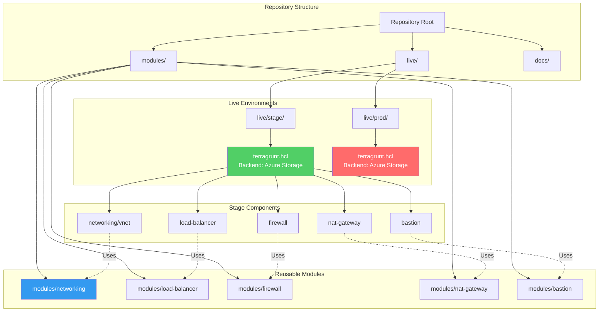
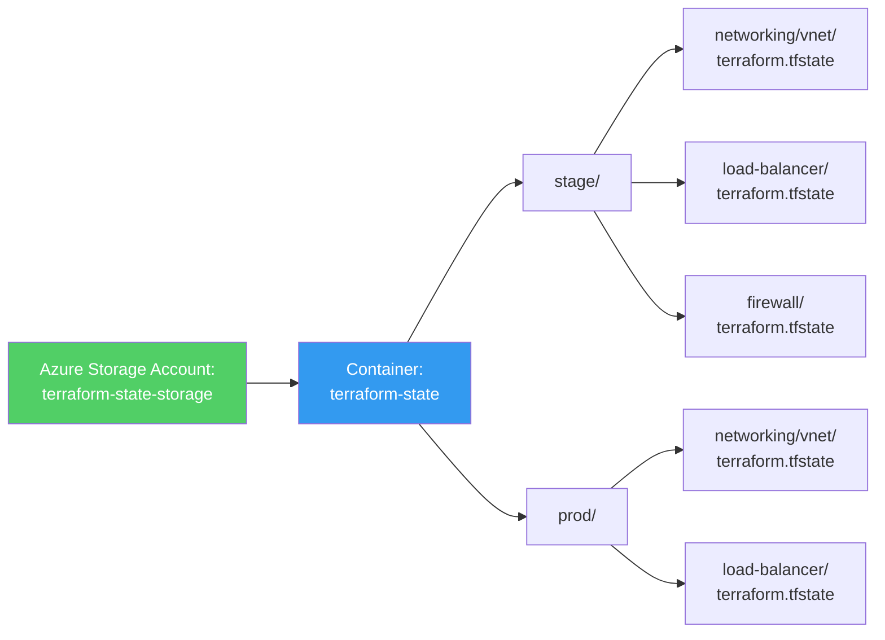

# Terragrunt Guide for Azure Networking Tutorial

## Table of Contents

1. [Introduction](#introduction)
2. [Architecture Overview](#architecture-overview)
3. [Directory Structure](#directory-structure)
4. [Getting Started](#getting-started)
5. [Common Operations](#common-operations)
6. [Importing Existing Resources](#importing-existing-resources)
7. [Moving Resources](#moving-resources)
8. [Best Practices](#best-practices)
9. [Troubleshooting](#troubleshooting)

---

## Introduction

This guide explains how to use **Terragrunt** with the Azure Networking Tutorial. Terragrunt is a thin wrapper around Terraform that provides:

- **DRY (Don't Repeat Yourself)**: Eliminate code duplication
- **Automatic Backend Configuration**: Generate backend.tf files automatically
- **Dependency Management**: Automatically handle module dependencies
- **Environment Management**: Separate configurations for stage/prod
- **State Management**: Organize state files automatically

### What is Terragrunt?

Terragrunt is a wrapper that:
- Keeps your Terraform code DRY
- Manages remote state configuration
- Handles dependencies between modules
- Provides a consistent structure for multiple environments

### Why Use Terragrunt?

**Without Terragrunt:**
- Duplicate backend configuration in every module
- Manually manage dependencies
- Copy-paste code between environments
- Risk of configuration drift

**With Terragrunt:**
- Define backend once, reuse everywhere
- Automatic dependency resolution
- Environment-specific configurations
- Consistent structure across projects

---

## Architecture Overview

### Terragrunt Architecture



### State File Organization



**Key Pattern:**

```hcl
# In root terragrunt.hcl
key = "${get_env("TF_STATE_KEY", "stage")}/${path_relative_to_include()}/terraform.tfstate"

# Results in unique keys:
# - stage/networking/vnet/terraform.tfstate
# - stage/load-balancer/terraform.tfstate
# - prod/networking/vnet/terraform.tfstate
# - prod/load-balancer/terraform.tfstate
```

---

## Directory Structure

```
azure-networking-tutorial/
├── live/
│   ├── stage/
│   │   ├── terragrunt.hcl          # Root config for stage
│   │   ├── networking/
│   │   │   └── vnet/
│   │   │       └── terragrunt.hcl   # VNet configuration
│   │   ├── load-balancer/
│   │   │   └── terragrunt.hcl       # Load Balancer config
│   │   ├── firewall/
│   │   │   └── terragrunt.hcl       # Firewall config
│   │   ├── nat-gateway/
│   │   │   └── terragrunt.hcl       # NAT Gateway config
│   │   └── bastion/
│   │       └── terragrunt.hcl       # Bastion config
│   └── prod/
│       ├── terragrunt.hcl          # Root config for prod
│       └── networking/
│           └── vnet/
│               └── terragrunt.hcl   # VNet configuration
├── modules/
│   ├── networking/                 # Reusable VNet module
│   ├── load-balancer/              # Reusable LB module
│   ├── firewall/                   # Reusable Firewall module
│   ├── nat-gateway/                # Reusable NAT Gateway module
│   └── bastion/                    # Reusable Bastion module
└── docs/
    └── TERRAGRUNT_GUIDE.md         # This file
```

---

## Getting Started

### Prerequisites

1. **Terraform** >= 1.0.0
2. **Terragrunt** >= 0.50.0
3. **Azure CLI** installed and configured
4. **Azure Storage Account** for remote state

### Setup Azure Storage for State

```bash
# Create resource group for state storage
az group create \
  --name rg-terraform-state \
  --location eastus

# Create storage account
az storage account create \
  --name myterraformstate \
  --resource-group rg-terraform-state \
  --location eastus \
  --sku Standard_LRS

# Create storage container
az storage container create \
  --name terraform-state \
  --account-name myterraformstate
```

### Configure Environment Variables

```bash
# Set environment variables for Terragrunt
export TF_STATE_STORAGE_ACCOUNT_NAME="myterraformstate"
export TF_STATE_RESOURCE_GROUP_NAME="rg-terraform-state"
export TF_STATE_CONTAINER_NAME="terraform-state"
export TF_STATE_KEY="stage"  # or "prod" for production
export TF_VAR_location="eastus"
```

### Basic Commands

```bash
# Navigate to a module directory
cd live/stage/networking/vnet

# Initialize Terragrunt (downloads modules, configures backend)
terragrunt init

# Plan changes
terragrunt plan

# Apply changes
terragrunt apply

# Destroy resources
terragrunt destroy

# Run commands across all modules
cd live/stage
terragrunt run-all plan
terragrunt run-all apply
```

---

## Common Operations

### Working with Dependencies

Terragrunt automatically handles dependencies. For example, the Load Balancer depends on the VNet:

```hcl
# live/stage/load-balancer/terragrunt.hcl
dependency "vnet" {
  config_path = "../networking/vnet"
  
  mock_outputs = {
    vnet_id = "/subscriptions/.../virtualNetworks/vnet-stage"
    subnet_ids = {}
  }
}

inputs = {
  subnet_id = dependency.vnet.outputs.subnet_ids["web-subnet"]
}
```

When you run `terragrunt apply`:
1. Terragrunt checks if VNet is applied
2. If not, applies VNet first
3. Reads VNet outputs
4. Passes outputs to Load Balancer
5. Applies Load Balancer

### Working with Multiple Environments

```bash
# Stage environment
cd live/stage/networking/vnet
terragrunt apply

# Production environment
cd live/prod/networking/vnet
terragrunt apply
```

Both use the same module but with different configurations and state files.

---

## Importing Existing Resources

When you have existing Azure resources that were created manually or with other tools, you can import them into Terraform/Terragrunt state.

### General Import Process

1. **Identify the resource ID** in Azure
2. **Add the resource to your Terraform code** (or ensure it's in the module)
3. **Run terragrunt import** with the resource ID
4. **Verify with terragrunt plan** (should show no changes)

### Import Examples by Resource Type

#### 1. Importing Virtual Network

```bash
# Navigate to the VNet module
cd live/stage/networking/vnet

# Get the VNet resource ID from Azure
# Format: /subscriptions/{subscription-id}/resourceGroups/{resource-group}/providers/Microsoft.Network/virtualNetworks/{vnet-name}
VNET_ID="/subscriptions/12345678-1234-1234-1234-123456789012/resourceGroups/rg-networking-stage/providers/Microsoft.Network/virtualNetworks/vnet-stage"

# Import the VNet
# Syntax: terragrunt import <resource_address> <resource_id>
terragrunt import azurerm_virtual_network.vnet "$VNET_ID"

# Verify the import
terragrunt plan
# Should show: No changes. Your infrastructure matches the configuration.
```

**What happens:**
- Terragrunt reads the VNet configuration from `terragrunt.hcl`
- Imports the existing VNet into Terraform state
- Links the state entry to the resource in your code
- Future `plan`/`apply` operations will manage this resource

#### 2. Importing Subnets

```bash
cd live/stage/networking/vnet

# Get subnet resource ID
# Format: /subscriptions/{subscription-id}/resourceGroups/{resource-group}/providers/Microsoft.Network/virtualNetworks/{vnet-name}/subnets/{subnet-name}
SUBNET_WEB_ID="/subscriptions/12345678-1234-1234-1234-123456789012/resourceGroups/rg-networking-stage/providers/Microsoft.Network/virtualNetworks/vnet-stage/subnets/web-subnet"
SUBNET_APP_ID="/subscriptions/12345678-1234-1234-1234-123456789012/resourceGroups/rg-networking-stage/providers/Microsoft.Network/virtualNetworks/vnet-stage/subnets/app-subnet"

# Import each subnet
# Note: The resource address depends on how subnets are defined in the module
# If using for_each: azurerm_subnet.subnets["web-subnet"]
terragrunt import 'azurerm_subnet.subnets["web-subnet"]' "$SUBNET_WEB_ID"
terragrunt import 'azurerm_subnet.subnets["app-subnet"]' "$SUBNET_APP_ID"

# Verify
terragrunt plan
```

**Important Notes:**
- Subnets must be imported after the VNet is in state
- Use quotes around resource addresses with brackets
- Check your module's variable structure to get the correct resource address

#### 3. Importing Network Security Groups

```bash
cd live/stage/networking/vnet

# Get NSG resource ID
# Format: /subscriptions/{subscription-id}/resourceGroups/{resource-group}/providers/Microsoft.Network/networkSecurityGroups/{nsg-name}
NSG_WEB_ID="/subscriptions/12345678-1234-1234-1234-123456789012/resourceGroups/rg-networking-stage/providers/Microsoft.Network/networkSecurityGroups/nsg-web"

# Import the NSG
terragrunt import 'azurerm_network_security_group.nsgs["nsg-web"]' "$NSG_WEB_ID"

# Import NSG rules (if defined separately)
# Format: /subscriptions/{subscription-id}/resourceGroups/{resource-group}/providers/Microsoft.Network/networkSecurityGroups/{nsg-name}/securityRules/{rule-name}
RULE_ID="/subscriptions/12345678-1234-1234-1234-123456789012/resourceGroups/rg-networking-stage/providers/Microsoft.Network/networkSecurityGroups/nsg-web/securityRules/AllowHTTP"
terragrunt import 'azurerm_network_security_rule.rules["nsg-web"]["AllowHTTP"]' "$RULE_ID"

# Verify
terragrunt plan
```

#### 4. Importing Load Balancer

```bash
cd live/stage/load-balancer

# Get Load Balancer resource ID
# Format: /subscriptions/{subscription-id}/resourceGroups/{resource-group}/providers/Microsoft.Network/loadBalancers/{lb-name}
LB_ID="/subscriptions/12345678-1234-1234-1234-123456789012/resourceGroups/rg-networking-stage/providers/Microsoft.Network/loadBalancers/lb-web-stage"

# Import the Load Balancer
terragrunt import azurerm_lb.lb "$LB_ID"

# Import backend address pools
# Format: /subscriptions/{subscription-id}/resourceGroups/{resource-group}/providers/Microsoft.Network/loadBalancers/{lb-name}/backendAddressPools/{pool-name}
BACKEND_POOL_ID="/subscriptions/12345678-1234-1234-1234-123456789012/resourceGroups/rg-networking-stage/providers/Microsoft.Network/loadBalancers/lb-web-stage/backendAddressPools/web-backend-pool"
terragrunt import 'azurerm_lb_backend_address_pool.backend_pools["web-backend-pool"]' "$BACKEND_POOL_ID"

# Import health probes
# Format: /subscriptions/{subscription-id}/resourceGroups/{resource-group}/providers/Microsoft.Network/loadBalancers/{lb-name}/probes/{probe-name}
PROBE_ID="/subscriptions/12345678-1234-1234-1234-123456789012/resourceGroups/rg-networking-stage/providers/Microsoft.Network/loadBalancers/lb-web-stage/probes/http-probe"
terragrunt import 'azurerm_lb_probe.probes["http-probe"]' "$PROBE_ID"

# Import load balancing rules
# Format: /subscriptions/{subscription-id}/resourceGroups/{resource-group}/providers/Microsoft.Network/loadBalancers/{lb-name}/loadBalancingRules/{rule-name}
RULE_ID="/subscriptions/12345678-1234-1234-1234-123456789012/resourceGroups/rg-networking-stage/providers/Microsoft.Network/loadBalancers/lb-web-stage/loadBalancingRules/http-rule"
terragrunt import 'azurerm_lb_rule.rules["http-rule"]' "$RULE_ID"

# Verify
terragrunt plan
```

**Note:** Load Balancer has many child resources. Import them in this order:
1. Load Balancer
2. Backend Address Pools
3. Health Probes
4. Load Balancing Rules
5. NAT Rules (if any)
6. Outbound Rules (if any)

#### 5. Importing Azure Firewall

```bash
cd live/stage/firewall

# Get Firewall resource ID
# Format: /subscriptions/{subscription-id}/resourceGroups/{resource-group}/providers/Microsoft.Network/azureFirewalls/{firewall-name}
FIREWALL_ID="/subscriptions/12345678-1234-1234-1234-123456789012/resourceGroups/rg-networking-stage/providers/Microsoft.Network/azureFirewalls/fw-stage"

# Import the Firewall
terragrunt import azurerm_firewall.firewall "$FIREWALL_ID"

# Import Public IP (if managed separately)
# Format: /subscriptions/{subscription-id}/resourceGroups/{resource-group}/providers/Microsoft.Network/publicIPAddresses/{pip-name}
PIP_ID="/subscriptions/12345678-1234-1234-1234-123456789012/resourceGroups/rg-networking-stage/providers/Microsoft.Network/publicIPAddresses/pip-fw-stage"
terragrunt import 'azurerm_public_ip.public_ips[0]' "$PIP_ID"

# Import Network Rule Collections
# Format: /subscriptions/{subscription-id}/resourceGroups/{resource-group}/providers/Microsoft.Network/azureFirewalls/{firewall-name}/networkRuleCollections/{collection-name}
NETWORK_RULE_COLLECTION_ID="/subscriptions/12345678-1234-1234-1234-123456789012/resourceGroups/rg-networking-stage/providers/Microsoft.Network/azureFirewalls/fw-stage/networkRuleCollections/AllowOutboundHTTPS"
terragrunt import 'azurerm_firewall_network_rule_collection.network_rules["AllowOutboundHTTPS"]' "$NETWORK_RULE_COLLECTION_ID"

# Import Application Rule Collections
# Format: /subscriptions/{subscription-id}/resourceGroups/{resource-group}/providers/Microsoft.Network/azureFirewalls/{firewall-name}/applicationRuleCollections/{collection-name}
APP_RULE_COLLECTION_ID="/subscriptions/12345678-1234-1234-1234-123456789012/resourceGroups/rg-networking-stage/providers/Microsoft.Network/azureFirewalls/fw-stage/applicationRuleCollections/AllowMicrosoftServices"
terragrunt import 'azurerm_firewall_application_rule_collection.application_rules["AllowMicrosoftServices"]' "$APP_RULE_COLLECTION_ID"

# Import NAT Rule Collections (if any)
# Format: /subscriptions/{subscription-id}/resourceGroups/{resource-group}/providers/Microsoft.Network/azureFirewalls/{firewall-name}/natRuleCollections/{collection-name}
NAT_RULE_COLLECTION_ID="/subscriptions/12345678-1234-1234-1234-123456789012/resourceGroups/rg-networking-stage/providers/Microsoft.Network/azureFirewalls/fw-stage/natRuleCollections/DNATRules"
terragrunt import 'azurerm_firewall_nat_rule_collection.nat_rules["DNATRules"]' "$NAT_RULE_COLLECTION_ID"

# Verify
terragrunt plan
```

**Note:** Firewall rule collections are complex. Import them carefully and verify each step.

#### 6. Importing NAT Gateway

```bash
cd live/stage/nat-gateway

# Get NAT Gateway resource ID
# Format: /subscriptions/{subscription-id}/resourceGroups/{resource-group}/providers/Microsoft.Network/natGateways/{nat-name}
NAT_ID="/subscriptions/12345678-1234-1234-1234-123456789012/resourceGroups/rg-networking-stage/providers/Microsoft.Network/natGateways/nat-gateway-stage"

# Import the NAT Gateway
terragrunt import azurerm_nat_gateway.nat_gateway "$NAT_ID"

# Import Public IP (if managed separately)
PIP_ID="/subscriptions/12345678-1234-1234-1234-123456789012/resourceGroups/rg-networking-stage/providers/Microsoft.Network/publicIPAddresses/pip-nat-stage"
terragrunt import 'azurerm_public_ip.public_ip[0]' "$PIP_ID"

# Import NAT Gateway Public IP Association
# Format: /subscriptions/{subscription-id}/resourceGroups/{resource-group}/providers/Microsoft.Network/natGateways/{nat-name}/publicIpAddresses/{pip-name}
ASSOCIATION_ID="/subscriptions/12345678-1234-1234-1234-123456789012/resourceGroups/rg-networking-stage/providers/Microsoft.Network/natGateways/nat-gateway-stage/publicIpAddresses/pip-nat-stage"
terragrunt import 'azurerm_nat_gateway_public_ip_association.association[0]' "$ASSOCIATION_ID"

# Verify
terragrunt plan
```

#### 7. Importing Azure Bastion

```bash
cd live/stage/bastion

# Get Bastion resource ID
# Format: /subscriptions/{subscription-id}/resourceGroups/{resource-group}/providers/Microsoft.Network/bastionHosts/{bastion-name}
BASTION_ID="/subscriptions/12345678-1234-1234-1234-123456789012/resourceGroups/rg-networking-stage/providers/Microsoft.Network/bastionHosts/bastion-stage"

# Import the Bastion
terragrunt import azurerm_bastion_host.bastion "$BASTION_ID"

# Import Public IP (if managed separately)
PIP_ID="/subscriptions/12345678-1234-1234-1234-123456789012/resourceGroups/rg-networking-stage/providers/Microsoft.Network/publicIPAddresses/pip-bastion-stage"
terragrunt import azurerm_public_ip.bastion_pip "$PIP_ID"

# Verify
terragrunt plan
```

### Import Script Example

Here's a complete script to import all resources:

```bash
#!/bin/bash
# import-all-resources.sh
# Script to import existing Azure resources into Terragrunt state

set -e

# Configuration
SUBSCRIPTION_ID="12345678-1234-1234-1234-123456789012"
RESOURCE_GROUP="rg-networking-stage"
ENVIRONMENT="stage"
LOCATION="eastus"

# Colors for output
GREEN='\033[0;32m'
YELLOW='\033[1;33m'
NC='\033[0m' # No Color

echo -e "${GREEN}Starting import process...${NC}"

# 1. Import Virtual Network
echo -e "${YELLOW}Importing Virtual Network...${NC}"
cd live/${ENVIRONMENT}/networking/vnet
VNET_ID="/subscriptions/${SUBSCRIPTION_ID}/resourceGroups/${RESOURCE_GROUP}/providers/Microsoft.Network/virtualNetworks/vnet-${ENVIRONMENT}"
terragrunt import azurerm_virtual_network.vnet "$VNET_ID" || echo "VNet may already be imported"

# 2. Import Subnets
echo -e "${YELLOW}Importing Subnets...${NC}"
for subnet in web-subnet app-subnet db-subnet; do
  SUBNET_ID="/subscriptions/${SUBSCRIPTION_ID}/resourceGroups/${RESOURCE_GROUP}/providers/Microsoft.Network/virtualNetworks/vnet-${ENVIRONMENT}/subnets/${subnet}"
  terragrunt import "azurerm_subnet.subnets[\"${subnet}\"]" "$SUBNET_ID" || echo "Subnet ${subnet} may already be imported"
done

# 3. Import Network Security Groups
echo -e "${YELLOW}Importing Network Security Groups...${NC}"
for nsg in nsg-web nsg-app; do
  NSG_ID="/subscriptions/${SUBSCRIPTION_ID}/resourceGroups/${RESOURCE_GROUP}/providers/Microsoft.Network/networkSecurityGroups/${nsg}"
  terragrunt import "azurerm_network_security_group.nsgs[\"${nsg}\"]" "$NSG_ID" || echo "NSG ${nsg} may already be imported"
done

# 4. Import Load Balancer
echo -e "${YELLOW}Importing Load Balancer...${NC}"
cd ../../load-balancer
LB_ID="/subscriptions/${SUBSCRIPTION_ID}/resourceGroups/${RESOURCE_GROUP}/providers/Microsoft.Network/loadBalancers/lb-web-${ENVIRONMENT}"
terragrunt import azurerm_lb.lb "$LB_ID" || echo "Load Balancer may already be imported"

# 5. Import Firewall
echo -e "${YELLOW}Importing Azure Firewall...${NC}"
cd ../firewall
FIREWALL_ID="/subscriptions/${SUBSCRIPTION_ID}/resourceGroups/${RESOURCE_GROUP}/providers/Microsoft.Network/azureFirewalls/fw-${ENVIRONMENT}"
terragrunt import azurerm_firewall.firewall "$FIREWALL_ID" || echo "Firewall may already be imported"

# 6. Import NAT Gateway
echo -e "${YELLOW}Importing NAT Gateway...${NC}"
cd ../nat-gateway
NAT_ID="/subscriptions/${SUBSCRIPTION_ID}/resourceGroups/${RESOURCE_GROUP}/providers/Microsoft.Network/natGateways/nat-gateway-${ENVIRONMENT}"
terragrunt import azurerm_nat_gateway.nat_gateway "$NAT_ID" || echo "NAT Gateway may already be imported"

# 7. Import Bastion
echo -e "${YELLOW}Importing Azure Bastion...${NC}"
cd ../bastion
BASTION_ID="/subscriptions/${SUBSCRIPTION_ID}/resourceGroups/${RESOURCE_GROUP}/providers/Microsoft.Network/bastionHosts/bastion-${ENVIRONMENT}"
terragrunt import azurerm_bastion_host.bastion "$BASTION_ID" || echo "Bastion may already be imported"

echo -e "${GREEN}Import process completed!${NC}"
echo -e "${YELLOW}Run 'terragrunt plan' in each directory to verify imports.${NC}"
```

---

## Moving Resources

Moving resources in Terraform/Terragrunt means changing where a resource is tracked in state. This is useful when:

- Reorganizing your code structure
- Moving resources between modules
- Splitting or merging state files
- Refactoring module structure

### General Move Process

1. **Identify the resource address** in current state
2. **Identify the new resource address** where it should be
3. **Run terragrunt state mv** to move it
4. **Update your code** to match the new structure
5. **Verify with terragrunt plan**

### Move Examples by Scenario

#### 1. Moving VNet to a Different Module Path

**Scenario:** You want to move the VNet from `live/stage/networking/vnet` to `live/stage/core/vnet`

```bash
# Step 1: Navigate to the OLD location
cd live/stage/networking/vnet

# Step 2: Move the state to the new location
# Syntax: terragrunt state mv <old_address> <new_address>
# Since we're moving to a different directory, we need to use the full state path
terragrunt state mv \
  'azurerm_virtual_network.vnet' \
  'azurerm_virtual_network.vnet'

# Actually, for moving between directories, you need to:
# 1. Copy the state file manually, OR
# 2. Use terragrunt state pull/push, OR
# 3. Use terraform state mv with -state flags

# Better approach: Use state pull/push
cd live/stage/networking/vnet
terragrunt state pull > old-state.json

# Move to new location
cd ../../core/vnet
terragrunt init  # Initialize the new location
terragrunt state push ../networking/vnet/old-state.json

# Now remove from old location
cd ../networking/vnet
terragrunt state rm azurerm_virtual_network.vnet  # Remove from old state
```

**Note:** Moving between different Terragrunt configurations is complex. Consider using `terragrunt state pull` and `terragrunt state push`.

#### 2. Moving Resources Within the Same Module (Refactoring)

**Scenario:** You refactored your module and changed resource names

```bash
cd live/stage/networking/vnet

# Old resource name: azurerm_virtual_network.main_vnet
# New resource name: azurerm_virtual_network.vnet

# Move the resource
terragrunt state mv \
  'azurerm_virtual_network.main_vnet' \
  'azurerm_virtual_network.vnet'

# Verify
terragrunt plan
# Should show: No changes
```

#### 3. Moving Subnets to a Different Module

**Scenario:** You want to manage subnets in a separate module

```bash
# Step 1: In the VNet module, move subnet state
cd live/stage/networking/vnet

# Move subnet state to a file (we'll import it in the new module)
terragrunt state pull > vnet-state.json

# Extract subnet resources from state
# (This requires manual editing or using jq)

# Step 2: Remove from VNet module
terragrunt state mv \
  'azurerm_subnet.subnets["web-subnet"]' \
  'azurerm_subnet.subnets["web-subnet"]' \
  -state-out=../subnets/web-subnet/terraform.tfstate

# Actually, better approach:
# 1. Create new subnet module
# 2. Import subnets into new module
# 3. Remove from old module
```

#### 4. Moving Load Balancer Components

**Scenario:** You want to split Load Balancer into separate modules (LB, Backend Pools, Rules)

```bash
cd live/stage/load-balancer

# Move backend pool to separate module
terragrunt state mv \
  'azurerm_lb_backend_address_pool.backend_pools["web-backend-pool"]' \
  'azurerm_lb_backend_address_pool.backend_pools["web-backend-pool"]'

# This won't work across modules. Better approach:
# 1. Keep everything in one module (recommended)
# 2. OR: Use data sources to reference resources in other modules
```

**Best Practice:** Keep related resources (LB + pools + rules) in the same module.

#### 5. Moving Resources Between Environments

**Scenario:** You want to move a resource from stage to prod

```bash
# This is NOT recommended! Resources should be created separately in each environment.
# Instead, use terragrunt import in the prod environment to import the resource.

# If you really need to move (e.g., promoting a resource):
# 1. Export state from stage
cd live/stage/networking/vnet
terragrunt state pull > stage-vnet-state.json

# 2. Import into prod (after creating prod configuration)
cd ../../prod/networking/vnet
# First, ensure the resource exists in Azure and matches prod config
# Then import it
VNET_ID="/subscriptions/.../virtualNetworks/vnet-prod"
terragrunt import azurerm_virtual_network.vnet "$VNET_ID"

# 3. Remove from stage (if you're actually moving, not copying)
cd ../../stage/networking/vnet
terragrunt destroy  # Only if you want to remove from stage
```

**Important:** Moving resources between environments usually means you're actually copying them. Use `import` instead of `state mv`.

#### 6. Moving Resources with Dependencies

**Scenario:** Moving a VNet that has dependent resources (subnets, NSGs, etc.)

```bash
cd live/stage/networking/vnet

# When moving resources with dependencies, move them in the correct order:
# 1. Move child resources first (subnets, NSGs)
# 2. Then move parent resource (VNet)

# Example: Moving a subnet
terragrunt state mv \
  'azurerm_subnet.subnets["web-subnet"]' \
  'azurerm_subnet.subnets["web-subnet"]'

# Then move NSG association
terragrunt state mv \
  'azurerm_subnet_network_security_group_association.associations["web-subnet"]' \
  'azurerm_subnet_network_security_group_association.associations["web-subnet"]'

# Finally, if moving VNet itself
terragrunt state mv \
  'azurerm_virtual_network.vnet' \
  'azurerm_virtual_network.vnet'
```

### Advanced Move Scenarios

#### Moving State Between Backends

```bash
# Scenario: Moving from local backend to Azure Storage backend

# Step 1: In old location (local state)
cd old-project
terraform state pull > state.json

# Step 2: In new location (Terragrunt with remote state)
cd live/stage/networking/vnet
terragrunt init  # This sets up the remote backend

# Step 3: Push the state
terragrunt state push ../old-project/state.json

# Step 4: Verify
terragrunt plan
```

#### Splitting a Large State File

```bash
# Scenario: You have everything in one module and want to split it

# Step 1: Create new module structure
mkdir -p live/stage/networking/subnets
mkdir -p live/stage/networking/nsgs

# Step 2: Move resources to new modules
cd live/stage/networking/vnet

# Move subnets
terragrunt state mv \
  'azurerm_subnet.subnets["web-subnet"]' \
  -state-out=../subnets/web-subnet/terraform.tfstate \
  'azurerm_subnet.subnets["web-subnet"]'

# This is complex. Better approach: Use terragrunt state list and state mv carefully
```

### Move Script Example

```bash
#!/bin/bash
# move-resources.sh
# Script to move resources between Terragrunt configurations

set -e

SOURCE_DIR="live/stage/networking/vnet"
TARGET_DIR="live/stage/core/vnet"

echo "Moving resources from $SOURCE_DIR to $TARGET_DIR"

# Step 1: Pull state from source
cd "$SOURCE_DIR"
terragrunt state pull > /tmp/source-state.json

# Step 2: Initialize target
cd "../../$TARGET_DIR"
terragrunt init

# Step 3: Push state to target
terragrunt state push /tmp/source-state.json

# Step 4: Verify
terragrunt plan

echo "Move completed. Verify the plan output above."
echo "If everything looks good, remove resources from source:"
echo "cd $SOURCE_DIR"
echo "terragrunt state rm <resource_address>"
```

---

## Best Practices

### 1. Import Best Practices

- **Import in dependency order**: Import parent resources before child resources
- **Verify after each import**: Run `terragrunt plan` to ensure no unexpected changes
- **Document imports**: Keep a log of what was imported and when
- **Use scripts**: Automate imports for consistency
- **Test imports in non-production first**: Practice in stage before production

### 2. Move Best Practices

- **Avoid moving between environments**: Use import instead
- **Move within same backend**: Easier than moving between backends
- **Update code before moving**: Ensure your code matches the new structure
- **Test moves carefully**: Verify with `terragrunt plan` after each move
- **Backup state**: Always backup state before moving resources
- **Move during maintenance windows**: Avoid moving during active operations

### 3. State Management

- **Use remote state**: Always use Azure Storage or similar for state
- **Enable state locking**: Prevents concurrent modifications
- **Regular backups**: Backup state files regularly
- **Version state files**: Use versioning in Azure Storage
- **Separate state per environment**: Keep stage and prod state separate

### 4. Module Organization

- **Keep related resources together**: VNet + Subnets + NSGs in one module
- **Use dependencies correctly**: Let Terragrunt handle dependencies
- **Document module structure**: Keep README files updated
- **Version modules**: Tag module versions for stability

---

## Troubleshooting

### Common Import Issues

**Issue:** `Error: resource not found`
- **Cause:** Resource ID is incorrect or resource doesn't exist
- **Solution:** Verify resource ID with `az resource show --ids <resource-id>`

**Issue:** `Error: resource already managed`
- **Cause:** Resource is already in state
- **Solution:** Check state with `terragrunt state list`

**Issue:** `Error: resource configuration doesn't match`
- **Cause:** Your Terraform code doesn't match the imported resource
- **Solution:** Update your code to match the actual resource configuration

### Common Move Issues

**Issue:** `Error: resource not found in state`
- **Cause:** Resource address is incorrect
- **Solution:** List resources with `terragrunt state list` to find correct address

**Issue:** `Error: cannot move resource with dependencies`
- **Cause:** Child resources must be moved first
- **Solution:** Move dependencies first, then parent resource

**Issue:** `Error: backend configuration mismatch`
- **Cause:** Trying to move between different backends
- **Solution:** Use `state pull` and `state push` instead of `state mv`

### Getting Help

- **Check Terragrunt logs**: Look for detailed error messages
- **Verify resource IDs**: Use Azure Portal or CLI to verify
- **Test in stage first**: Always test operations in non-production
- **Review state file**: Use `terragrunt state show <resource>` to inspect state

---

## Conclusion

Terragrunt simplifies managing Azure Networking resources by:

- **Eliminating duplication**: Define backend config once
- **Managing dependencies**: Automatic dependency resolution
- **Organizing state**: Clean state file organization
- **Supporting environments**: Easy stage/prod separation

When importing or moving resources:

- **Plan carefully**: Understand the impact before executing
- **Test first**: Always test in non-production
- **Document changes**: Keep records of what was changed
- **Verify results**: Always run `terragrunt plan` after operations

For more information, see:
- [Terragrunt Documentation](https://terragrunt.gruntwork.io/docs/)
- [Terraform Import Documentation](https://www.terraform.io/docs/cli/import/index.html)
- [Terraform State Management](https://www.terraform.io/docs/cli/state/index.html)

