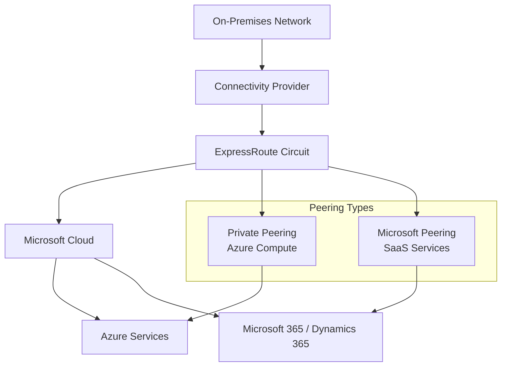
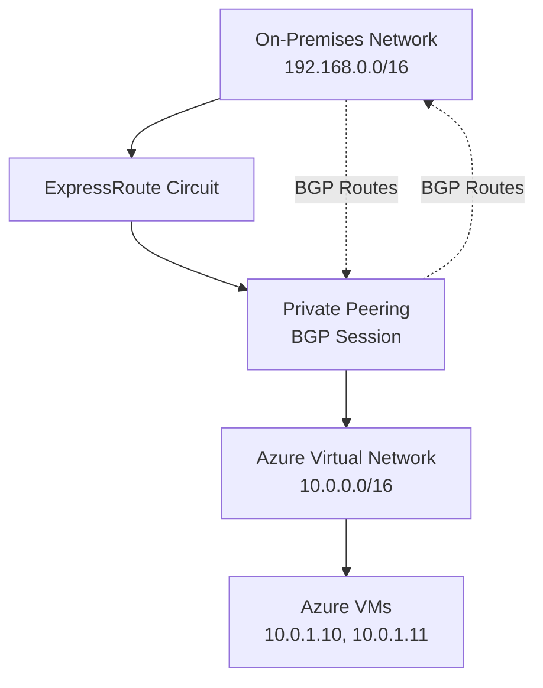
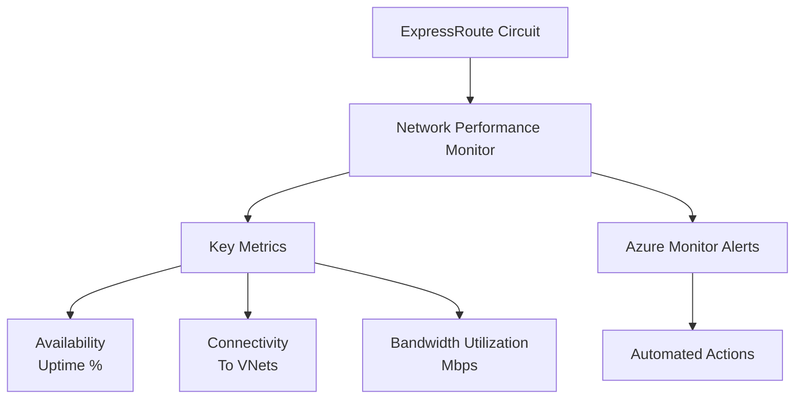

# EXPRESS ROUTE

**Overview**
Azure ExpressRoute provides private, dedicated connectivity between your on-premises infrastructure and Microsoft Azure datacenters. Unlike VPN connections over the public internet, ExpressRoute uses a direct link via a connectivity provider, ensuring:
- **Higher security**
- **Lower latency**
- **Greater reliability**
- **Higher bandwidth** (50 Mbps to 10 Gbps)

**Learn more:**
- [ExpressRoute Overview](https://learn.microsoft.com/en-us/azure/expressroute/expressroute-introduction)
- [ExpressRoute Documentation](https://learn.microsoft.com/en-us/azure/expressroute/)

An ExpressRoute circuit is the logical connection between your on-premises infrastructure and the Microsoft Cloud. A connectivity provider implements that connection, although some organizations use multiple connectivity providers for redundancy reasons. Each circuit has a fixed bandwidth of either 50, 100, 200 Mbps or 500 Mbps, or 1 Gbps or 10 Gbps, and each of those circuits map to a connectivity provider and a peering location. In addition, each ExpressRoute circuit has default quotas and limits.

An ExpressRoute circuit isn't equivalent to a network connection or a network device. Each circuit is defined by a GUID, called a service or s-key. This s-key provides the connectivity link between Microsoft, your connectivity provider, and your organization; it isn't a cryptographic secret. Each s-key has a one-to-one mapping to an Azure ExpressRoute circuit.

Each circuit can have up to two peerings, which are a pair of BGP sessions that are configured for redundancy.

ExpressRoute also supports connectivity to Microsoft cloud services like **Microsoft 365** and **Dynamics 365**.

## ExpressRoute Architecture

**Key Advantages**
- Speeds from **50 Mbps to 10 Gbps**, with dynamic bandwidth scaling.
- Lower latency and higher reliability through built-in peering.
- Connectivity to all supported Azure services.
- **Global connectivity** with premium add-on.
- Dynamic routing via **Border Gateway Protocol (BGP)**.
- SLAs for uptime and QoS for services like Skype for Business.

**Premium Add-On Features**
- Increased route limits.
- Global service connectivity.
- More virtual network links per circuit.

**Connectivity Models**
1. **IPVPN (Any-to-any)**: Managed Layer 3 connections via IPVPN providers.
2. **Virtual Cross-Connection**: Through an Ethernet exchange facility.
3. **Point-to-Point Ethernet**: Direct Layer 2 or managed Layer 3 link.

**Routing and Layer 3 Connectivity**
- ExpressRoute uses **BGP** for dynamic route exchange between:
  - On-premises network
  - Azure instances
  - Microsoft public addresses
- Multiple BGP sessions for redundancy and traffic profiles.

**ExpressRoute Circuits**
- Logical connection between on-premises and Microsoft Cloud.
- Implemented by a connectivity provider.
- Bandwidth options: 50 Mbps, 100 Mbps, 200 Mbps, 500 Mbps, 1 Gbps, 10 Gbps.
- Each circuit identified by a **service key (s-key)**.
- Supports up to two peerings:
  - **Azure Private Peering**: Connects to Azure compute services (VMs, VNets).
  - **Microsoft Peering**: Connects to SaaS services (Microsoft 365, Dynamics 365).

**Routing Domains**
- Each ExpressRoute circuit maps to routing domains.
- Active-active configuration for high availability.

**Azure private peering**
Azure private peering connects to Azure compute services such as virtual machines and cloud services that are deployed with a virtual network. As far as security goes, the private peering domain is simply an extension of your on-premises network into Azure. You then enable bidirectional connectivity between that network and any Azure virtual networks, making the Azure VM IP addresses visible within your internal network.

You can connect only one virtual network to the private peering domain.

**Private Peering Architecture:**

**Learn more:**
- [ExpressRoute Private Peering](https://learn.microsoft.com/en-us/azure/expressroute/expressroute-circuit-peerings)
- [Configure Private Peering](https://learn.microsoft.com/en-us/azure/expressroute/expressroute-howto-routing-portal-resource-manager)

**Monitoring ExpressRoute**
- Use **Network Performance Monitor** for check the health for following areas:
  - Availability
  - Connectivity to VNets
  - Bandwidth utilization

**ExpressRoute Monitoring:**

- Use ExpressRoute for sensitive data and high-volume workloads.
- Combine with VPN Gateway for hybrid scenarios.
- Plan redundancy with multiple circuits and providers.
- Monitor health and performance regularly.

**Learn more:**
- [Monitor ExpressRoute](https://learn.microsoft.com/en-us/azure/expressroute/expressroute-monitoring-metrics-alerts)
- [ExpressRoute Monitoring Best Practices](https://learn.microsoft.com/en-us/azure/expressroute/expressroute-monitoring-metrics-alerts)

 **Comparison: ExpressRoute vs VPN Gateway**
| Feature             | ExpressRoute                 | VPN Gateway                 |
| ------------------- | ---------------------------- | --------------------------- |
| **Connection Type** | Private dedicated link       | Over public internet        |
| **Security**        | Very high                    | High (encrypted)            |
| **Bandwidth**       | Up to 10 Gbps                | Limited by SKU              |
| **Latency**         | Low                          | Higher than ExpressRoute    |
| **Use Case**        | Enterprise, mission-critical | Dev/test, smaller workloads |

### Module assessment

1) You need to connect Azure resources like Azure virtual machines across geographical regions. Which Azure networking option should you use?
- ✅ Correct: Virtual network peering

Why:

- Virtual network (VNet) peering—specifically Global VNet Peering—links VNets across different Azure regions to enable private, low-latency connectivity between resources like VMs. It uses the Microsoft backbone (not the public Internet) and doesn’t require gateways or tunnels. It’s ideal for intra-Azure connectivity across regions.

- ❌ Not correct: Azure ExpressRoute
ExpressRoute is for private connectivity between on-premises environments and Azure, not for connecting VNets to each other. You can use ExpressRoute Global Reach between on-prem sites via Microsoft’s network, but for connecting Azure resources across regions, VNet peering is the right choice.

- ❌ Not correct: VPN Gateway
VPN Gateway is used for encrypted tunnels (site-to-site or point-to-site) generally involving on-premises networks or users. You can connect VNets to each other with VNet-to-VNet VPN, but it’s more complex, has throughput limits, and adds cost versus peering. For native, scalable, and simpler Azure-to-Azure connectivity, VNet peering is preferred.

2) For a point-to-site Azure VPN gateway, what are the key parameters that you must specify when you create it?
- ✅ Correct: Gateway type is Vpn, vpn type is RouteBased, and you need to specify a gateway sku.

Why:
- A Point-to-Site (P2S) configuration requires an Azure VPN gateway with:
  - *Gateway type*: Vpn (not ExpressRoute)
  - *VPN type*: RouteBased (required for P2S)
  - *Gateway SKU*: e.g., VpnGw1, VpnGw2, etc. (impacts performance/features)

You also need a *GatewaySubnet* in the VNet, but that’s part of the network setup, not an attribute of the gateway resource itself.

- ❌ Partially correct but incomplete: “Gateway type is Vpn and vpn type is RouteBased.”
This misses the SKU, which is required to create the gateway and determines scale/performance.

- ❌ Not correct / misleading: “Subnet is GatewaySubnet and gateway type is Vpn.”
While having a GatewaySubnet is necessary in the VNet, the option omits the vpn type (RouteBased) and the SKU, both critical for P2S.

3) Which peering configuration would you use for your ExpressRoute circuit where you need to allow direct connections to Azure compute resources?

- ✅ Correct: Azure private peering

Why:

- Private peering on ExpressRoute gives a private, Layer-3 extension of your on-premises network into Azure VNets, enabling access to Azure compute resources (VMs, private IP addresses). Routes are exchanged via BGP on private address spaces.

- ❌ Not correct: Microsoft peering
  - Microsoft peering is for accessing public services (e.g., Microsoft 365, Dynamics 365, Azure public services via public IPs). It’s not used to reach private VNet resources like VMs.
- ❌ Not correct: Azure Virtual Network peering
  - VNet peering is within Azure between VNets. It’s not an ExpressRoute “peering” type and does not involve the ExpressRoute circuit configuration.

3) Which protocol provides dynamic routing for Azure ExpressRoute?
- ✅ Correct: Border Gateway Protocol (BGP)

Why:
- BGP is used for dynamic route exchange between your on-premises edge and Microsoft’s edge for ExpressRoute. It supports route advertisement, failover, and scalable path selection.

- ❌ Not correct: IPVPN
  - IPVPN is a service type (often MPLS-based), not a routing protocol.
- ❌ Not correct: S-key
  - “S-key” is not a routing protocol in this context.
