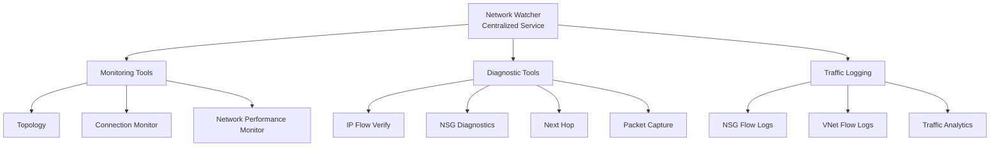
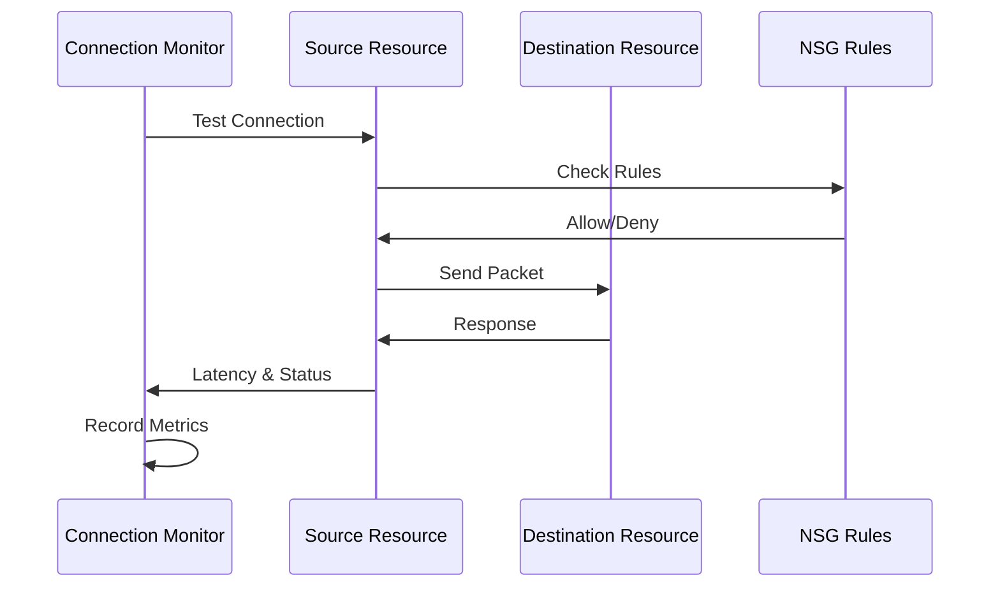
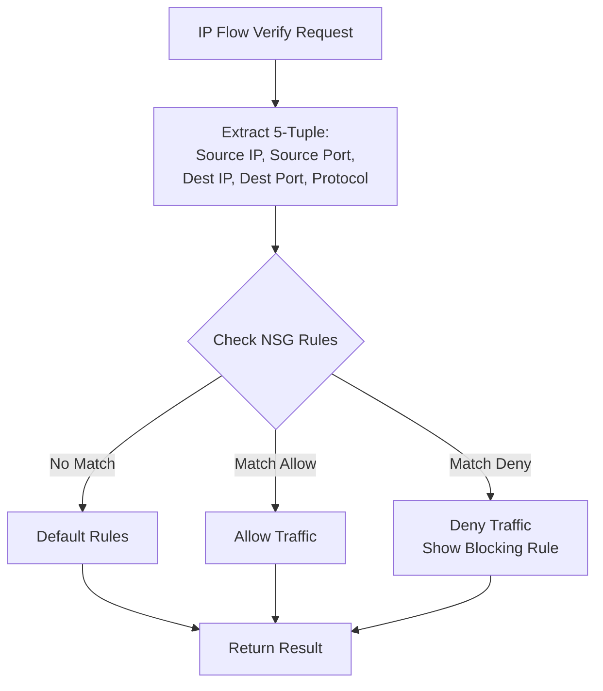
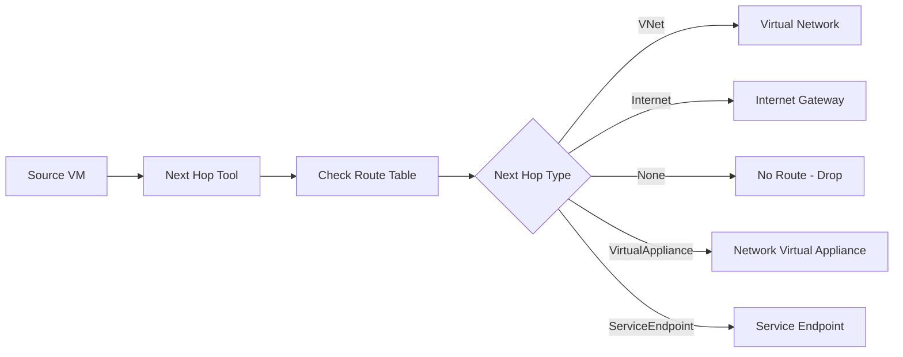
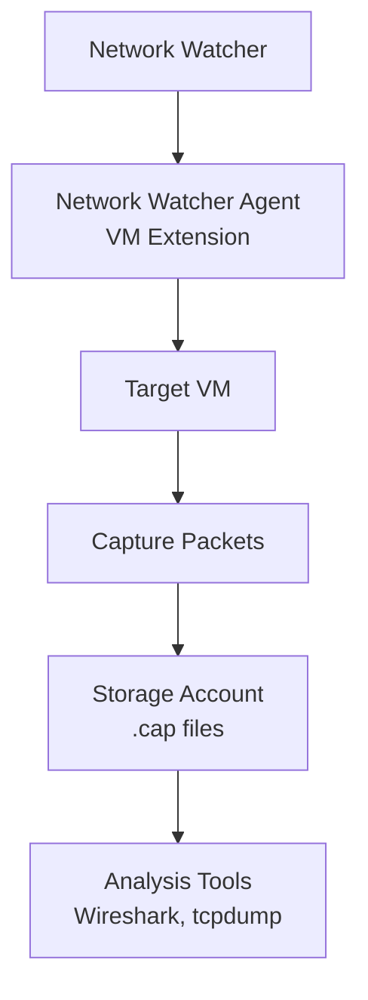
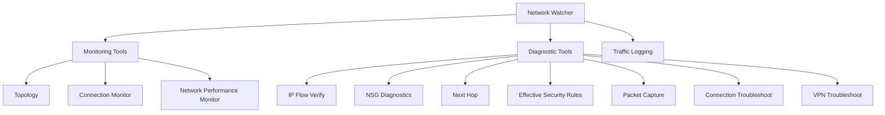
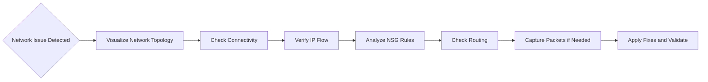

# Troubleshoot a network by using Network Watcher monitoring and diagnostic toolss

## What is Network Watcher?

Azure Network Watcher is a centralized service for monitoring and diagnosing the health of Azure networks. It provides tools grouped into three categories:
- **Monitoring tools**
- **Network diagnostic tools**
- **Traffic logging tools**

Network Watcher helps identify issues like connectivity problems, latency, packet drops, and misconfigured security rules.

**Network Watcher Overview:**

**Learn more:**
- [Network Watcher Overview](https://learn.microsoft.com/en-us/azure/network-watcher/network-watcher-monitoring-overview)
- [Network Watcher Documentation](https://learn.microsoft.com/en-us/azure/network-watcher/)

Azure Network Watcher includes several tools you can use to monitor your virtual networks and virtual machines (VMs). To effectively make use of Network Watcher, it's essential to understand all the available options and the purpose of each tool.

In your engineering company, you want to help your staff to choose the right Network Watcher tool for each troubleshooting task. They need to understand all the options available and the kinds of problems that each tool can solve.

Here, you look at the Network Watcher tool categories, the tools in each category, and how each tool is applied in example use cases.

## **Tool Categories and Details**

### **Monitoring Tools**
1. **Topology**
   - Visualizes the Azure virtual network, resources, and interconnections.
   - Useful for understanding infrastructure before troubleshooting.

2. **Connection Monitor**
   - Verifies connectivity between Azure resources.
   - Measures latency and detects configuration changes or NSG rule impacts.
   - Can monitor IP addresses or FQDNs.

**Connection Monitor Flow:**

**Learn more:**
- [Connection Monitor](https://learn.microsoft.com/en-us/azure/network-watcher/connection-monitor-overview)

3. **Network Performance Monitor**
   - Tracks latency and packet drops over time.
   - Monitors hybrid connections, ExpressRoute circuits, and endpoint-to-endpoint connectivity.

### **Network Diagnostic Tools**
1. **IP Flow Verify**
   - Checks if packets are allowed or denied for a VM.
   - Identifies NSG blocking rules using 5-tuple parameters.

**IP Flow Verify Process:**

**Learn more:**
- [IP Flow Verify](https://learn.microsoft.com/en-us/azure/network-watcher/diagnose-vm-network-traffic-filtering-problem)

2. **NSG Diagnostics**
   - Displays NSGs traversed and rules applied for a source-destination pair.
   - Shows final allow/deny status.

3. **Next Hop**
   - Determines packet routing path from a VM to a destination.
   - Diagnoses routing table issues.

**Next Hop Analysis:**

**Learn more:**
- [Next Hop](https://learn.microsoft.com/en-us/azure/network-watcher/diagnose-vm-network-routing-problem)

4. **Effective Security Rules**
   - Lists all effective NSG rules applied to a network interface.
   - Helps identify blocking rules and unnecessary open ports.

5. **Packet Capture**
   - Captures packets for detailed analysis.
   - Useful for diagnosing low-level network issues.

**Packet Capture Architecture:**

**Learn more:**
- [Packet Capture](https://learn.microsoft.com/en-us/azure/network-watcher/network-watcher-packet-capture-manage-portal)

6. **Connection Troubleshoot**
   - Tests connectivity between resources and provides remediation steps.

7. **VPN Troubleshoot**
   - Diagnoses VPN gateway and connection issues.

**Network Watcher Tool Categories**

**Troubleshooting Workflow**

#### Quick Comparison: Network Watcher vs. Virtual Network Manager

| Aspect       | Network Watcher                       | Virtual Network Manager                                |
| ------------ | ------------------------------------- | ------------------------------------------------------ |
| Purpose      | Monitoring and troubleshooting        | Centralized governance and configuration               |
| Scope        | Regional                              | Multi-subscription and multi-region                    |
| Key Features | Topology, diagnostics, packet capture | Connectivity (mesh/hub), security admin rules, routing |
| Use Case     | Operational support                   | Design and enforce network standards                   |

**Integration:**
- Network Watcher can monitor and validate configurations created by Virtual Network Manager
- IP Flow Verify considers both NSG rules and Virtual Network Manager security admin rules
- Use Network Watcher to troubleshoot issues in topologies managed by Virtual Network Manager

---

#### Practical Tips
- Use **Virtual Network Manager** for consistent topology and security policies across large environments.
- Use **Network Watcher** for real-time diagnostics and troubleshooting.
- Combine with **Azure Monitor** for alerts and analytics.

1) You need to connect Azure resources like Azure virtual machines across geographical regions. Which Azure networking option should you use?
✅ Correct: Virtual network peering
Why:
Virtual network (VNet) peering—specifically Global VNet Peering—links VNets across different Azure regions to enable private, low-latency connectivity between resources like VMs. It uses the Microsoft backbone (not the public Internet) and doesn’t require gateways or tunnels. It’s ideal for intra-Azure connectivity across regions.

❌ Not correct: Azure ExpressRoute
ExpressRoute is for private connectivity between on-premises environments and Azure, not for connecting VNets to each other. You can use ExpressRoute Global Reach between on-prem sites via Microsoft’s network, but for connecting Azure resources across regions, VNet peering is the right choice.

❌ Not correct: VPN Gateway
VPN Gateway is used for encrypted tunnels (site-to-site or point-to-site) generally involving on-premises networks or users. You can connect VNets to each other with VNet-to-VNet VPN, but it’s more complex, has throughput limits, and adds cost versus peering. For native, scalable, and simpler Azure-to-Azure connectivity, VNet peering is preferred.

2) For a point-to-site Azure VPN gateway, what are the key parameters that you must specify when you create it?
✅ Correct: Gateway type is Vpn, vpn type is RouteBased, and you need to specify a gateway sku.
Why:
A Point-to-Site (P2S) configuration requires an Azure VPN gateway with:

Gateway type: Vpn (not ExpressRoute)
VPN type: RouteBased (required for P2S)
Gateway SKU: e.g., VpnGw1, VpnGw2, etc. (impacts performance/features) You also need a GatewaySubnet in the VNet, but that’s part of the network setup, not an attribute of the gateway resource itself.
❌ Partially correct but incomplete: “Gateway type is Vpn and vpn type is RouteBased.”
This misses the SKU, which is required to create the gateway and determines scale/performance.

❌ Not correct / misleading: “Subnet is GatewaySubnet and gateway type is Vpn.”
While having a GatewaySubnet is necessary in the VNet, the option omits the vpn type (RouteBased) and the SKU, both critical for P2S.

3) Which peering configuration would you use for your ExpressRoute circuit where you need to allow direct connections to Azure compute resources?
✅ Correct: Azure private peering
Why:
Private peering on ExpressRoute gives a private, Layer-3 extension of your on-premises network into Azure VNets, enabling access to Azure compute resources (VMs, private IP addresses). Routes are exchanged via BGP on private address spaces.

❌ Not correct: Microsoft peering
Microsoft peering is for accessing public services (e.g., Microsoft 365, Dynamics 365, Azure public services via public IPs). It’s not used to reach private VNet resources like VMs.

❌ Not correct: Azure Virtual Network peering
VNet peering is within Azure between VNets. It’s not an ExpressRoute “peering” type and does not involve the ExpressRoute circuit configuration.

4) Which protocol provides dynamic routing for Azure ExpressRoute?
✅ Correct: Border Gateway Protocol (BGP)
Why:
BGP is used for dynamic route exchange between your on-premises edge and Microsoft’s edge for ExpressRoute. It supports route advertisement, failover, and scalable path selection.

❌ Not correct: IPVPN
IPVPN is a service type (often MPLS-based), not a routing protocol.

❌ Not correct: S-key
“S-key” is not a routing protocol in this context.

Final Answers
Virtual network peering
Gateway type is Vpn, vpn type is RouteBased, and you need to specify a gateway sku.
Azure private peering
Border Gateway Protocol (BGP)
If you want, I can also add quick design tips (e.g., when to choose peering vs. VNet-to-VNet VPN, typical SKUs for P2S, or how private vs. Microsoft peering impacts route filters and services).

## Module assessment

Question 1: To capture traffic on a virtual machine (VM), Azure Network Watcher requires:

- ✅ Correct: Network Watcher Agent VM Extension

Why:

- To perform packet capture on a VM, Network Watcher needs the Network Watcher Agent VM Extension installed on that VM. This extension enables capturing and sending traffic data to storage for analysis.

- ❌ Not correct: Azure Traffic Manager
    
    Why not:

  - Traffic Manager is a DNS-based global load balancer, not a diagnostic tool. It does not capture traffic or interact with VM-level packet data.

- ❌ Not correct: An Azure storage account

    Why not:
  
  - While a storage account is used to store captured packets, it is not the requirement to enable capture. The essential prerequisite is the VM extension. The storage account is a destination, not the enabling component.

Question 2: To resolve latency issues on the network, which Azure Network Watcher features can you use?

- ✅ Correct: Connection troubleshoot

Why:

- Connection Troubleshoot tests connectivity between two endpoints (VMs, IPs, FQDNs) and provides hop-by-hop latency and packet loss details, making it the right tool for diagnosing latency problems.

- ❌ Not correct: IP flow verify

    Why not:

    - IP Flow Verify checks whether traffic is allowed or denied by NSGs and rules. It does not measure latency; it only validates access control.

- ❌ Not correct: Next hop

    Why not:
    
    - Next Hop shows the routing path for a packet (which route or gateway will be used). It helps with routing issues but does not provide latency metrics.