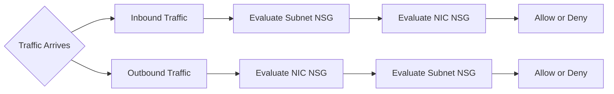
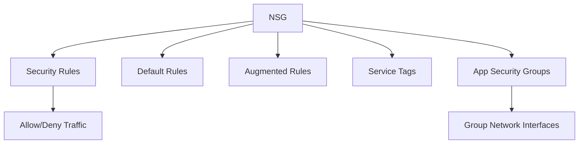
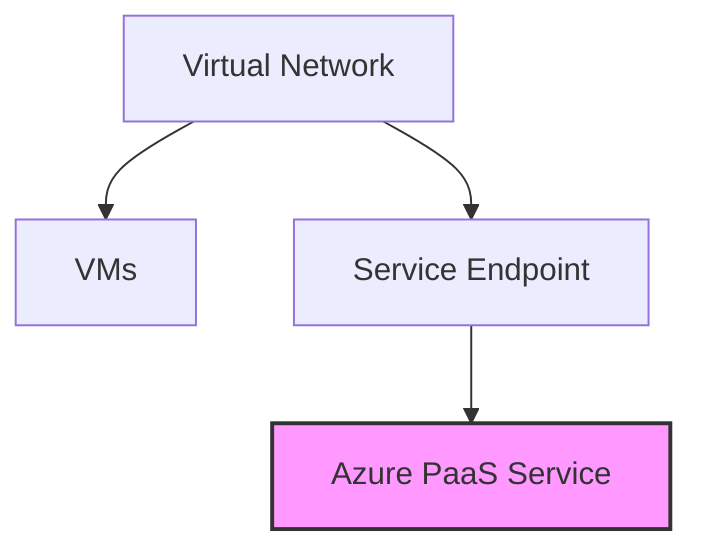
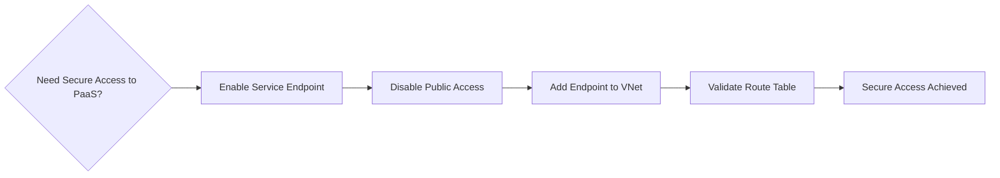

# Secure and isolate access to Azure resources by using network security groups and service 

##  NSG: Use network security groups to control network access

As part of the project to move your ERP system to Azure, you must ensure that servers have proper isolation so that only allowed systems can make network connections. For example, you have database servers that store data for your ERP app. You want to block prohibited systems from communicating with the servers over the network, while allowing app servers to communicate with the database servers.

    - ERP : Enterprise Resource Planning : business management software that allows you to control and automate all key flows within a company.

### NSG - Network security groups 

## **Overview**
Network Security Groups (NSGs) filter network traffic to and from Azure resources. They contain security rules that allow or deny inbound and outbound traffic. NSGs can:
- Filter traffic between VMs or subnets within a virtual network.
- Filter traffic from the internet.

Network security groups filter network traffic to and from Azure resources. They also contain security rules that you configure to allow or deny inbound and outbound traffic. You can use network security groups to filter traffic between VMs or subnets, both within a virtual network and from the internet.

#### Network security group assignment and evaluation

 **Assignment and Evaluation**
- NSGs can be assigned to **subnets** or **network interfaces**.
- Rules applied to a subnet affect all network interfaces in that subnet.
- You can further restrict traffic by associating an NSG to a VM's network interface.

**Evaluation Order:**
- **Inbound traffic:** Subnet NSG → Network Interface NSG.
- **Outbound traffic:** Network Interface NSG → Subnet NSG.

Applying NSGs at the subnet level reduces administrative overhead and ensures consistent security across VMs.

Network security groups are assigned to a network interface or a subnet. When you assign a network security group to a subnet, the rules apply to all network interfaces in that subnet. You can restrict traffic further by associating a network security group to a VM's network interface.

When you apply network security groups to both a subnet and a network interface, each network security group is evaluated independently. Inbound traffic is first evaluated by the network security group applied to the subnet, then by the network security group applied to the network interface. Conversely, outbound traffic from a VM is first evaluated by the network security group applied to the network interface, then by the network security group applied to the subnet.

Applying a network security group to a subnet instead of individual network interfaces can reduce administration and management efforts. This approach also ensures that all VMs within the specified subnet are secured with the same set of rules.

Each subnet and network interface can have one network security group applied to it. Network security groups support TCP (Transmission Control Protocol), UDP (User Datagram Protocol), and ICMP (Internet Control Message Protocol), and operate at Layer 4 of the OSI (Open Systems Interconnection) model.

In this manufacturing-company scenario, network security groups can help you secure the network. You can control which computers can connect to your app servers. You can configure the network security group so that only a specific range of IP addresses can connect to the servers. You can lock this down even more by only allowing access to or from specific ports or from individual IP addresses. You can apply these rules to devices that are connecting remotely from on-premises networks or between resources within Azure.

**Security Rules**
- Rules allow or deny traffic based on five-tuple: 
  - source, 
  - source port,
  - destination,
  - destination port,
  - protocol: TCP, UDP, or Any  
-  Source & Destination: Any, or an individual IP address, classless inter-domain routing (CIDR) block (10.0.0.0/24, for example), service tag, or app security group
- Rules are evaluated by **priority** (lower number = higher priority): A number between 100 and 4096
- Also, 
  - Direction: Whether the rule applies to inbound or outbound traffic
  - Port Range: An individual port or range of ports
  - Action: Allow or deny the traffic
- Connections are **stateful**: return traffic is automatically allowed.

**Example:**
- Allow inbound RDP (port 3389) with priority 200.
- Deny inbound RDP with priority 150 → Deny rule takes precedence.

**Default Rules**
- Created automatically by Azure.
- Allow connectivity within a virtual network and from Azure load balancers.
- Allow outbound internet traffic.
- Deny inbound traffic from the internet.

#### INBOUND
| Priority            | Rule name                | Description                 |
|-------------------|------------------------------|---------------------------------|
| **65000**       | AllowVnetInbound | Allow inbound coming from any VM to any VM within the virtual network|
| **65001**   | AllowAzureLoadBalancerInbound                          | Allow traffic from the default load balancer to any VM within the subnet                            |
| **65500**       | DenyAllInBound                       | Deny traffic from any external source to any of the VMs         |

Same as for outbound, but with different rule names.

**Augmented Security Rules**
- Combine multiple IPs, ports, service tags, and app security groups in one rule.

EXAMPLE: Suppose your company wants to restrict access to resources in your datacenter spread across several network address ranges. With augmented rules, you can add all these ranges into a single rule, reducing the administrative overhead and complexity in your network security groups.

**Service Tags**

You can use service tags to simplify network security group security even further. You can allow or deny traffic to a specific Azure service, either globally or per region.

Service tags simplify security for VMs and Azure virtual networks by allowing you to restrict access by resources or services. Service tags represent a group of IP addresses, and help simplify the configuration of your security rules. For resources that you can specify by using a tag, you don't need to know the IP address or port details.

- Simplify rules by using tags representing Azure services.
  - VirtualNetwork: Represents all virtual network addresses anywhere in Azure, and in your on-premises network if you're using hybrid connectivity.
  
  - AzureLoadBalancer: Denotes Azure's infrastructure load balancer. The tag translates to the virtual IP address of the host (168.63.129.16) where Azure health probes originate.

  - Internet: Represents anything outside the virtual network address that's publicly reachable, including resources that have public IP addresses. One such resource is the Web Apps feature of Azure App Service.

  - AzureTrafficManager: Represents the IP address for Azure Traffic Manager.

  - Storage: Represents the IP address space for Azure Storage. You can specify whether traffic is allowed or denied. You can also specify if access is allowed only to a specific region, but you can't select individual storage accounts.
  
  - SQL: Represents the address for Azure SQL Database, Azure Database for MySQL, Azure Database for PostgreSQL, and Azure Synapse Analytics services. You can specify whether traffic is allowed or denied, and you can limit to a specific region.

  - AppService: Represents address prefixes for Azure App Service.
- Microsoft manages service tags.

**App Security Groups**

- Group network interfaces for easier rule management.
- Apply rules to workloads instead of individual VMs.

App security groups let you configure network security for resources used by specific apps. You can group VMs logically, no matter what their IP address or subnet assignment.

You can use app security groups within a network security group to apply a security rule to a group of resources. It's easier to deploy and scale up specific app workloads. You can add a new VM deployment to one or more app security groups, and that VM automatically picks up your security rules for that workload.

An app security group lets you group network interfaces together. You can then use that app security group as a source or destination rule within a network security group.

**Example:**
- Web servers group: allow ports 80 and 8080.
- Database servers group: allow port 1433.

## **Mermaid Diagram: NSG Evaluation Flow**

## **Mermaid Diagram: NSG Components**

------------------------------------------------------------------------------------------------------

## Security Endpoints : Secure network access to PaaS services with virtual network service endpoints

You've migrated your existing app and database servers for your ERP system to Azure as VMs. Now, to reduce your costs and administrative requirements, you're considering using some Azure platform as a service (PaaS) services. Storage services will hold certain large file assets, such as engineering diagrams. These engineering diagrams have proprietary information, and must remain secure from unauthorized access. These files must only be accessible from specific systems.

In this unit, you'll look at how to use virtual network service endpoints for securing supported Azure services.

### Virtual network service endpoints

Virtual Network Service Endpoints extend your private address space in Azure by providing a direct connection to Azure services. They allow you to:
- Secure Azure resources to only your virtual network.
- Keep service traffic on the Azure backbone (not exposed to the internet).

By default, Azure services (like Storage and SQL Database) have public IP addresses and are accessible from the internet. Service endpoints provide isolation and reduce the attack surface.

Use virtual network service endpoints to extend your private address space in Azure by providing a direct connection to your Azure services. Service endpoints let you secure your Azure resources to only your virtual network. Service traffic will remain on the Azure backbone and doesn't go out to the internet.

By default, Azure services are all designed for direct internet access. All Azure resources have public IP addresses, including PaaS services such as Azure SQL Database and Azure Storage. Because these services are exposed to the internet, anyone can potentially access your Azure services.

Service endpoints can connect certain PaaS services directly to your private address space in Azure, so they act like they're on the same virtual network. Use your private address space to access the PaaS services directly. Adding service endpoints doesn't remove the public endpoint. It simply provides a redirection of traffic.

Azure service endpoints are available for many services, such as:
- Azure Storage.
- Azure SQL Database.
- Azure Cosmos DB.
- Azure Key Vault.
- Azure Service Bus.
- Azure Data Lake.
  
For a service like SQL Database, which you can't access until you add IP addresses to its firewall, you should still consider service endpoints. Using a service endpoint for SQL Database restricts access to specific virtual networks, providing greater isolation and reducing the attack surface.

### **How Service Endpoints Work**

To enable a service endpoint, you must:

1. Turn off public access to the service.
2. Add the service endpoint to a virtual network.
3. Restrict traffic so Azure VMs access the service directly from private IP space.
4. Public access should be disabled for maximum security.

When you enable a service endpoint, you restrict the flow of traffic and enable your Azure VMs to access the service directly from your private address space. Devices can't access the service from a public network. On a deployed VM vNIC, if you look at ***Effective routes***, you'll notice the service endpoint as the ***Next Hop Type*** (VNet, Internet, None, etc)

1. Turn off public access to the PaaS service.
2. Add the service endpoint to the virtual network.
3. Validate route tables (Next Hop Type becomes VirtualNetworkServiceEndpoint).

**Routing Behavior:**
- Before enabling: traffic routes via Internet.
- After enabling: traffic routes via VirtualNetworkServiceEndpoint.

### Service endpoints and hybrid networks

- Service endpoints do not allow on-premises access by default.
- For on-premises access:
  - Use NAT IPs.
  - Add ExpressRoute NAT IPs to the service firewall configuration.
    -  If you use ExpressRoute for connectivity from on-premises to Azure, you have to identify the NAT IP addresses ExpressRoute uses.

By default, each circuit uses two NAT IP addresses to connect to the Azure backbone network. You then need to add these IP addresses into the Azure service resource's IP firewall configuration (for example, Azure Storage).

#### **Service Endpoint Concept**

#### **Enabling Flow**

