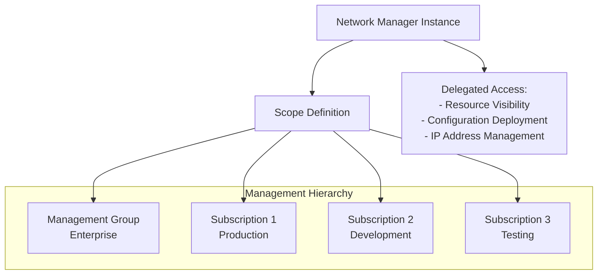

# Implementing Azure Virtual Network Manager Instance with Terraform

## Overview

The Network Manager instance is the top-level resource that defines the scope of management for your Azure Virtual Network Manager. It provides centralized governance across multiple subscriptions and regions.

## Architecture



## Terraform Implementation

### Basic Network Manager Instance

```hcl
# Resource Group
resource "azurerm_resource_group" "network_manager" {
  name     = "rg-network-management"
  location = "eastus"
}

# Network Manager Instance
resource "azurerm_network_manager" "main" {
  name                = "nwm-enterprise"
  location            = azurerm_resource_group.network_manager.location
  resource_group_name = azurerm_resource_group.network_manager.name

  # Scope: Define which subscriptions/management groups to manage
  scope {
    subscription_ids = [
      "/subscriptions/00000000-0000-0000-0000-000000000001", # Production
      "/subscriptions/00000000-0000-0000-0000-000000000002", # Development
      "/subscriptions/00000000-0000-0000-0000-000000000003"  # Testing
    ]
  }

  # Scope Access: Define what operations the Network Manager can perform
  scope_accesses = [
    "Connectivity",    # For connectivity configurations
    "SecurityAdmin",    # For security admin rules
    "Routing"          # For routing configurations
  ]

  description = "Enterprise Network Manager for centralized network governance"

  tags = {
    Environment = "Production"
    ManagedBy   = "Terraform"
    Team        = "Network Engineering"
  }
}
```

### Using Data Sources for Subscription IDs

```hcl
# Get current subscription
data "azurerm_client_config" "current" {}

# Get subscription IDs from management group
data "azurerm_management_group" "enterprise" {
  name = "Enterprise"
}

# Network Manager with Management Group scope
resource "azurerm_network_manager" "main" {
  name                = "nwm-enterprise"
  location            = "eastus"
  resource_group_name = azurerm_resource_group.network_manager.name

  scope {
    management_group_ids = [data.azurerm_management_group.enterprise.id]
    # Or use subscription_ids for direct subscription management
    subscription_ids = [data.azurerm_client_config.current.subscription_id]
  }

  scope_accesses = ["Connectivity", "SecurityAdmin", "Routing"]
}
```

## Key Parameters

| Parameter | Description | Required | Example |
|-----------|-------------|----------|---------|
| `name` | Name of the Network Manager instance | Yes | `nwm-enterprise` |
| `location` | Azure region | Yes | `eastus` |
| `resource_group_name` | Resource group name | Yes | `rg-network-management` |
| `scope.subscription_ids` | List of subscription IDs to manage | Yes* | `["/subscriptions/..."]` |
| `scope.management_group_ids` | List of management group IDs | Yes* | `["/providers/Microsoft.Management/..."]` |
| `scope_accesses` | Operations the manager can perform | Yes | `["Connectivity", "SecurityAdmin", "Routing"]` |
| `description` | Description of the instance | No | `"Enterprise Network Manager"` |
| `tags` | Resource tags | No | `{Environment = "Production"}` |

*Either `subscription_ids` or `management_group_ids` must be provided.

## Scope Access Types

- **Connectivity**: Enables connectivity configurations (hub-and-spoke, mesh)
- **SecurityAdmin**: Enables security admin rules
- **Routing**: Enables routing configurations

## Best Practices

1. **Single Network Manager per Organization**: Use one Network Manager instance for enterprise-wide governance
2. **Scope Definition**: Start with a limited scope and expand as needed
3. **Naming Convention**: Use descriptive names (e.g., `nwm-enterprise`, `nwm-production`)
4. **Tagging**: Apply consistent tags for resource management
5. **Permissions**: Ensure proper RBAC permissions for the Network Manager

## Outputs

```hcl
output "network_manager_id" {
  description = "The ID of the Network Manager instance"
  value       = azurerm_network_manager.main.id
}

output "network_manager_name" {
  description = "The name of the Network Manager instance"
  value       = azurerm_network_manager.main.name
}
```

## References

- [Terraform: azurerm_network_manager](https://registry.terraform.io/providers/hashicorp/azurerm/latest/docs/resources/network_manager)
- [Azure Virtual Network Manager Overview](https://learn.microsoft.com/en-us/azure/virtual-network-manager/overview)
- [Create Network Manager Instance](https://learn.microsoft.com/en-us/azure/virtual-network-manager/create-virtual-network-manager-portal)

