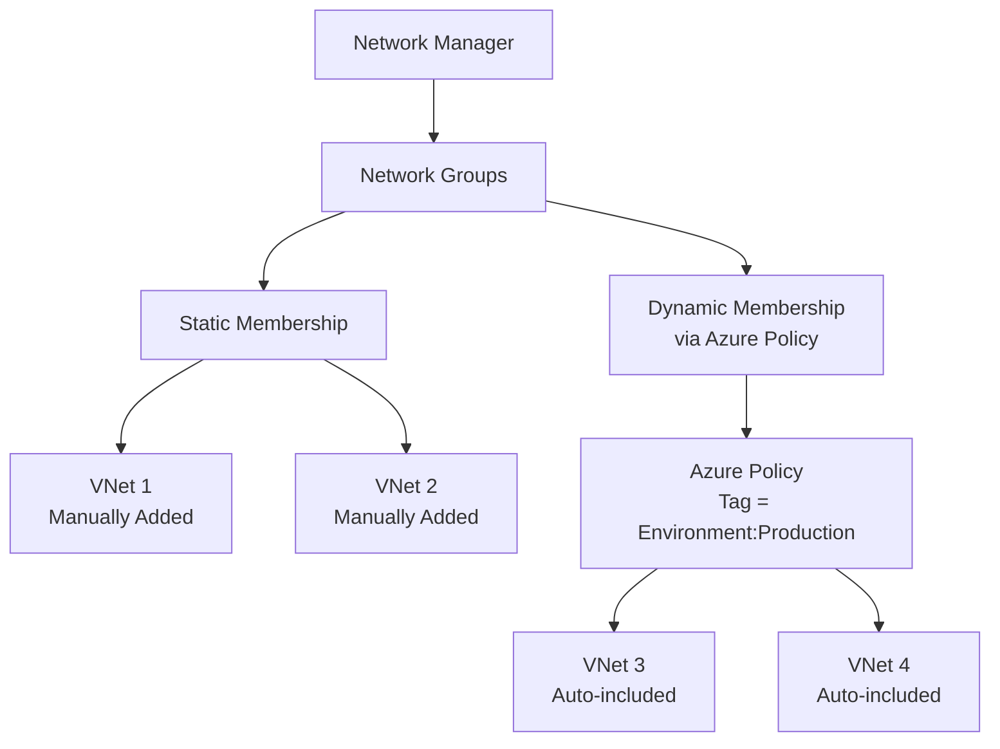

# Implementing Network Groups with Terraform

## Overview

Network Groups serve as logical containers of networking resources (VNets) to apply configurations at scale. VNets can be added statically or dynamically via Azure Policy.

## Architecture



## Terraform Implementation

### Static Network Group

```hcl
# Network Manager (assumed to exist)
resource "azurerm_network_manager" "main" {
  # ... (see 01-network-manager-instance.md)
}

# Virtual Networks (assumed to exist)
resource "azurerm_virtual_network" "prod_vnet_1" {
  name                = "vnet-prod-1"
  resource_group_name = "rg-prod"
  location            = "eastus"
  address_space       = ["10.1.0.0/16"]
}

resource "azurerm_virtual_network" "prod_vnet_2" {
  name                = "vnet-prod-2"
  resource_group_name = "rg-prod"
  location            = "eastus"
  address_space       = ["10.2.0.0/16"]
}

# Network Group with Static Membership
resource "azurerm_network_manager_network_group" "production" {
  name               = "production-vnets"
  network_manager_id = azurerm_network_manager.main.id
  description        = "Production virtual networks"
}

# Add VNets as static members
resource "azurerm_network_manager_static_member" "prod_vnet_1" {
  name                      = "static-member-prod-vnet-1"
  network_group_id          = azurerm_network_manager_network_group.production.id
  target_virtual_network_id = azurerm_virtual_network.prod_vnet_1.id
}

resource "azurerm_network_manager_static_member" "prod_vnet_2" {
  name                      = "static-member-prod-vnet-2"
  network_group_id          = azurerm_network_manager_network_group.production.id
  target_virtual_network_id = azurerm_virtual_network.prod_vnet_2.id
}
```

### Multiple Network Groups

```hcl
# Production Network Group
resource "azurerm_network_manager_network_group" "production" {
  name               = "production-vnets"
  network_manager_id = azurerm_network_manager.main.id
  description        = "Production virtual networks"
}

# Development Network Group
resource "azurerm_network_manager_network_group" "development" {
  name               = "development-vnets"
  network_manager_id = azurerm_network_manager.main.id
  description        = "Development virtual networks"
}

# Testing Network Group
resource "azurerm_network_manager_network_group" "testing" {
  name               = "testing-vnets"
  network_manager_id = azurerm_network_manager.main.id
  description        = "Testing virtual networks"
}
```

### Dynamic Network Groups with Azure Policy

**Note:** Dynamic membership via Azure Policy requires Azure Policy configuration outside of Terraform. The Network Group itself is created in Terraform, but the policy that adds VNets dynamically is configured separately.

```hcl
# Network Group (ready for dynamic membership)
resource "azurerm_network_manager_network_group" "production_dynamic" {
  name               = "production-vnets-dynamic"
  network_manager_id = azurerm_network_manager.main.id
  description        = "Production VNets with dynamic membership via Azure Policy"
}

# Azure Policy for Dynamic Membership (example)
# This would be configured separately via Azure Policy
# Policy condition: Tag Environment = Production
```

## Using the Module

```hcl
module "network_manager" {
  source = "../../modules/virtual-network-manager"

  resource_group_name    = "rg-network-management"
  location              = "eastus"
  network_manager_name  = "nwm-enterprise"
  scope_subscription_ids = ["subscription-id-1", "subscription-id-2"]

  network_groups = {
    "production-vnets" = {
      description            = "Production virtual networks"
      static_member_vnet_ids = [
        azurerm_virtual_network.prod_vnet_1.id,
        azurerm_virtual_network.prod_vnet_2.id
      ]
    }
    "development-vnets" = {
      description            = "Development virtual networks"
      static_member_vnet_ids = [
        azurerm_virtual_network.dev_vnet_1.id
      ]
    }
  }
}
```

## Key Parameters

| Parameter | Description | Required | Example |
|-----------|-------------|----------|---------|
| `name` | Name of the network group | Yes | `production-vnets` |
| `network_manager_id` | ID of the Network Manager | Yes | `azurerm_network_manager.main.id` |
| `description` | Description of the network group | No | `"Production VNets"` |

## Static Member Parameters

| Parameter | Description | Required | Example |
|-----------|-------------|----------|---------|
| `name` | Name of the static member | Yes | `static-member-prod-vnet-1` |
| `network_group_id` | ID of the network group | Yes | `azurerm_network_manager_network_group.production.id` |
| `target_virtual_network_id` | ID of the VNet to add | Yes | `azurerm_virtual_network.prod_vnet_1.id` |

## Best Practices

1. **Logical Grouping**: Group VNets by environment, workload, or team
2. **Naming Convention**: Use descriptive names (e.g., `production-vnets`, `web-tier-vnets`)
3. **Documentation**: Document network group purposes and members
4. **Dynamic Membership**: Use Azure Policy for automatic inclusion based on tags
5. **Tagging Strategy**: Tag VNets consistently to enable dynamic membership

## Outputs

```hcl
output "network_group_id" {
  description = "The ID of the network group"
  value       = azurerm_network_manager_network_group.production.id
}

output "network_group_name" {
  description = "The name of the network group"
  value       = azurerm_network_manager_network_group.production.name
}
```

## References

- [Terraform: azurerm_network_manager_network_group](https://registry.terraform.io/providers/hashicorp/azurerm/latest/docs/resources/network_manager_network_group)
- [Terraform: azurerm_network_manager_static_member](https://registry.terraform.io/providers/hashicorp/azurerm/latest/docs/resources/network_manager_static_member)
- [Network Groups and Azure Policy](https://learn.microsoft.com/en-us/azure/virtual-network-manager/concept-network-groups)

