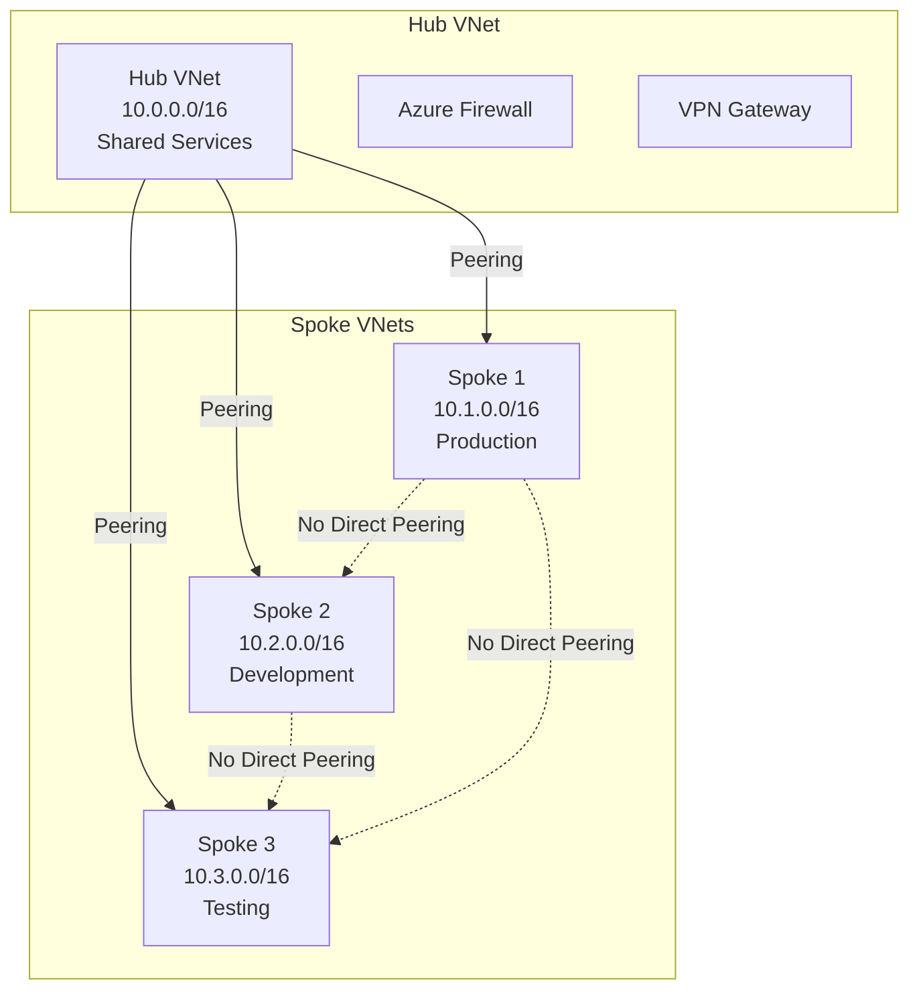
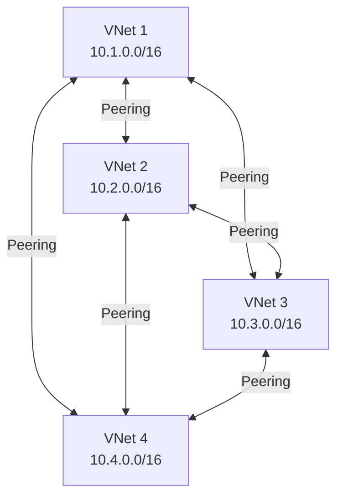

# Implementing Connectivity Configuration with Terraform

## Overview

Connectivity configurations define how VNets connect to each other. Azure Virtual Network Manager supports two topologies: **Hub-and-Spoke** and **Mesh**.

## Architecture

### Hub-and-Spoke Topology



### Mesh Topology



## Terraform Implementation

### Hub-and-Spoke Configuration

```hcl
# Hub Virtual Network
resource "azurerm_virtual_network" "hub" {
  name                = "vnet-hub"
  resource_group_name = "rg-hub"
  location            = "eastus"
  address_space       = ["10.0.0.0/16"]
}

# Network Manager and Groups (assumed to exist)
resource "azurerm_network_manager" "main" {
  # ... (see 01-network-manager-instance.md)
}

resource "azurerm_network_manager_network_group" "spokes" {
  name               = "spoke-vnets"
  network_manager_id = azurerm_network_manager.main.id
  description        = "Spoke virtual networks"
}

# Connectivity Configuration - Hub-and-Spoke
resource "azurerm_network_manager_connectivity_configuration" "hub_spoke" {
  name               = "hub-spoke-config"
  network_manager_id = azurerm_network_manager.main.id

  connectivity_topology = "HubAndSpoke"

  # Apply to network groups
  applies_to_group {
    network_group_id   = azurerm_network_manager_network_group.spokes.id
    group_connectivity = "None" # "None" or "DirectlyConnected"
  }

  # Hub configuration (required for hub-and-spoke)
  hub {
    resource_id   = azurerm_virtual_network.hub.id
    resource_type = "Microsoft.Network/virtualNetworks"
  }

  # Delete existing peerings before applying
  delete_existing_peering_enabled = false

  description = "Hub-and-spoke topology for production environment"
}
```

### Mesh Configuration

```hcl
# Network Group for mesh VNets
resource "azurerm_network_manager_network_group" "mesh_vnets" {
  name               = "mesh-vnets"
  network_manager_id = azurerm_network_manager.main.id
  description        = "VNets for full mesh connectivity"
}

# Connectivity Configuration - Mesh
resource "azurerm_network_manager_connectivity_configuration" "mesh" {
  name               = "mesh-config"
  network_manager_id = azurerm_network_manager.main.id

  connectivity_topology = "Mesh"

  # Apply to network groups
  applies_to_group {
    network_group_id   = azurerm_network_manager_network_group.mesh_vnets.id
    group_connectivity = "DirectlyConnected" # Enable direct connectivity
  }

  delete_existing_peering_enabled = false

  description = "Full mesh connectivity between VNets"
}
```

### Multiple Connectivity Configurations

```hcl
# Production Hub-and-Spoke
resource "azurerm_network_manager_connectivity_configuration" "prod_hub_spoke" {
  name               = "prod-hub-spoke"
  network_manager_id = azurerm_network_manager.main.id

  connectivity_topology = "HubAndSpoke"

  applies_to_group {
    network_group_id   = azurerm_network_manager_network_group.production.id
    group_connectivity = "None"
  }

  hub {
    resource_id   = azurerm_virtual_network.hub_prod.id
    resource_type = "Microsoft.Network/virtualNetworks"
  }

  description = "Production hub-and-spoke topology"
}

# Development Mesh
resource "azurerm_network_manager_connectivity_configuration" "dev_mesh" {
  name               = "dev-mesh"
  network_manager_id = azurerm_network_manager.main.id

  connectivity_topology = "Mesh"

  applies_to_group {
    network_group_id   = azurerm_network_manager_network_group.development.id
    group_connectivity = "DirectlyConnected"
  }

  description = "Development mesh topology"
}
```

## Using the Module

```hcl
module "network_manager" {
  source = "../../modules/virtual-network-manager"

  # ... (other configuration)

  connectivity_configurations = {
    "hub-spoke-prod" = {
      topology                        = "HubAndSpoke"
      network_group_names            = ["production-vnets"]
      group_connectivity             = "None"
      delete_existing_peering_enabled = false
      description                    = "Hub-and-spoke for production"
      hub = {
        resource_id   = azurerm_virtual_network.hub.id
        resource_type = "Microsoft.Network/virtualNetworks"
      }
    }
    "mesh-dev" = {
      topology                        = "Mesh"
      network_group_names            = ["development-vnets"]
      group_connectivity             = "DirectlyConnected"
      delete_existing_peering_enabled = false
      description                    = "Mesh topology for development"
    }
  }
}
```

## Key Parameters

| Parameter | Description | Required | Example |
|-----------|-------------|----------|---------|
| `name` | Name of the connectivity configuration | Yes | `hub-spoke-config` |
| `network_manager_id` | ID of the Network Manager | Yes | `azurerm_network_manager.main.id` |
| `connectivity_topology` | Topology type | Yes | `"HubAndSpoke"` or `"Mesh"` |
| `applies_to_group.network_group_id` | Network group ID | Yes | `azurerm_network_manager_network_group.spokes.id` |
| `applies_to_group.group_connectivity` | Group connectivity | Yes | `"None"` or `"DirectlyConnected"` |
| `hub.resource_id` | Hub VNet ID (hub-and-spoke only) | Yes* | `azurerm_virtual_network.hub.id` |
| `hub.resource_type` | Hub resource type | Yes* | `"Microsoft.Network/virtualNetworks"` |
| `delete_existing_peering_enabled` | Delete existing peerings | No | `false` |
| `description` | Description | No | `"Hub-and-spoke topology"` |

*Required only for HubAndSpoke topology.

## Group Connectivity Options

- **None**: Spokes communicate only through the hub (traditional hub-and-spoke)
- **DirectlyConnected**: Enable direct connectivity between spokes (simplified hub-and-spoke)

## Best Practices

1. **Hub Design**: Use a dedicated VNet for hub services
2. **Address Space**: Ensure non-overlapping IP ranges
3. **Gateway Transit**: Enable gateway transit for spoke-to-spoke communication via hub
4. **Topology Selection**: Use hub-and-spoke for centralized services, mesh for distributed workloads
5. **Testing**: Test connectivity configurations in non-production first

## Deployment

**Important:** Configurations do not take effect until deployed to regions.

```hcl
# Deploy connectivity configuration
resource "azurerm_network_manager_deployment" "connectivity" {
  location           = "eastus"
  network_manager_id = azurerm_network_manager.main.id
  scope_access       = "Connectivity"

  configuration_ids = [
    azurerm_network_manager_connectivity_configuration.hub_spoke.id
  ]
}
```

## Outputs

```hcl
output "connectivity_configuration_id" {
  description = "The ID of the connectivity configuration"
  value       = azurerm_network_manager_connectivity_configuration.hub_spoke.id
}
```

## References

- [Terraform: azurerm_network_manager_connectivity_configuration](https://registry.terraform.io/providers/hashicorp/azurerm/latest/docs/resources/network_manager_connectivity_configuration)
- [Hub-and-Spoke Topology](https://learn.microsoft.com/en-us/azure/virtual-network-manager/concept-connectivity-configuration)
- [Mesh Topology](https://learn.microsoft.com/en-us/azure/virtual-network-manager/concept-connectivity-configuration)

