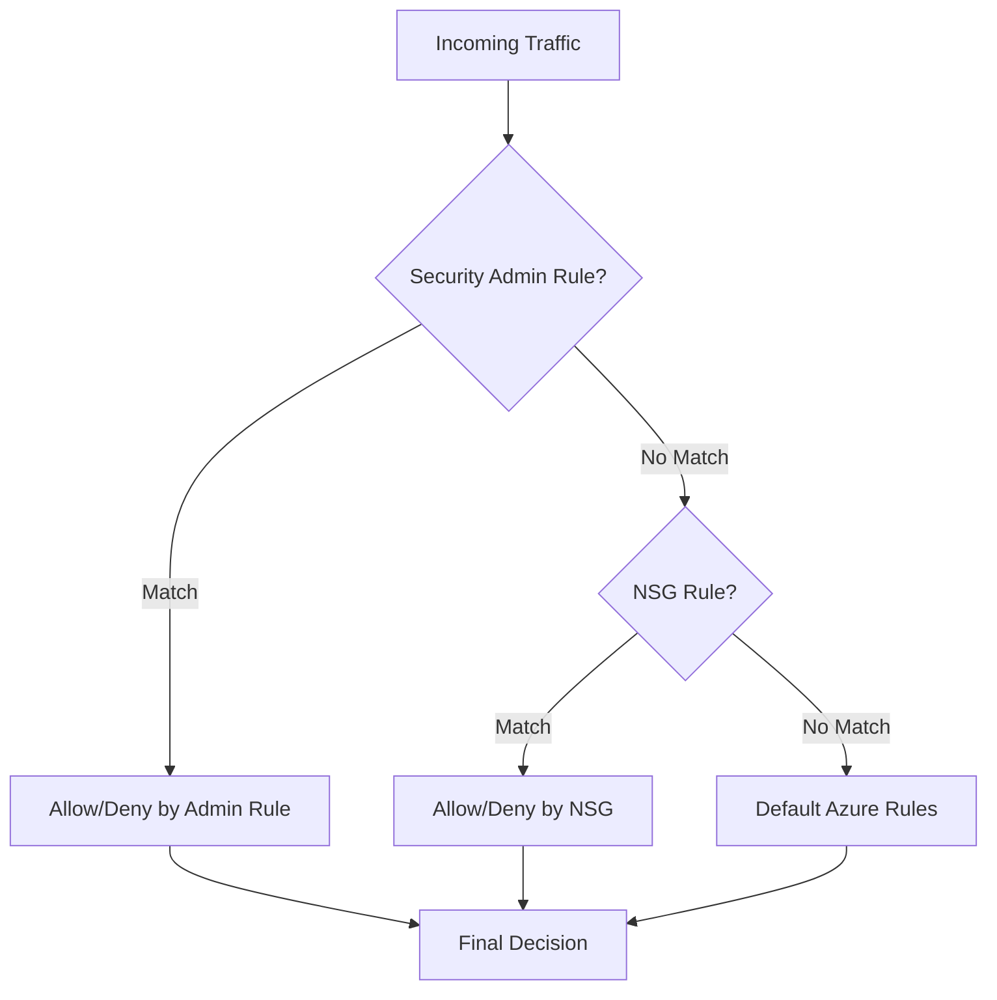

# Implementing Security Admin Rules with Terraform

## Overview

Security Admin Rules provide organization-level security policies that override NSG rules. They are evaluated before NSG rules and provide centralized security governance.

## Architecture



## Rule Evaluation Order

1. **Security Admin Rules** (highest priority)
2. **Network Security Group (NSG) Rules**
3. **Default Azure Rules**

## Terraform Implementation

### Security Admin Configuration

```hcl
# Network Manager and Groups (assumed to exist)
resource "azurerm_network_manager" "main" {
  # ... (see 01-network-manager-instance.md)
}

resource "azurerm_network_manager_network_group" "production" {
  name               = "production-vnets"
  network_manager_id = azurerm_network_manager.main.id
}

# Security Admin Configuration
resource "azurerm_network_manager_security_admin_configuration" "production" {
  name               = "security-prod"
  network_manager_id = azurerm_network_manager.main.id
  description        = "Security admin rules for production environment"

  applies_to_group {
    network_group_id = azurerm_network_manager_network_group.production.id
  }
}
```

### Security Admin Rule Collection

```hcl
# Rule Collection
resource "azurerm_network_manager_admin_rule_collection" "deny_internet" {
  name                            = "deny-internet-prod"
  security_admin_configuration_id = azurerm_network_manager_security_admin_configuration.production.id

  network_group_ids = [
    azurerm_network_manager_network_group.production.id
  ]

  description = "Deny internet traffic for production"
}
```

### Security Admin Rules

```hcl
# Deny all inbound internet traffic
resource "azurerm_network_manager_admin_rule" "deny_internet_inbound" {
  name                    = "deny-all-internet-inbound"
  admin_rule_collection_id = azurerm_network_manager_admin_rule_collection.deny_internet.id
  priority                 = 100
  direction                = "Inbound"
  action                   = "Deny"
  protocol                 = "Any"

  source {
    address_prefix_type = "ServiceTag"
    address_prefix      = "Internet"
  }

  destination {
    address_prefix_type = "IPPrefix"
    address_prefix      = "0.0.0.0/0"
  }

  description = "Deny all inbound internet traffic"
}

# Allow internal VNet traffic
resource "azurerm_network_manager_admin_rule" "allow_vnet_inbound" {
  name                    = "allow-vnet-inbound"
  admin_rule_collection_id = azurerm_network_manager_admin_rule_collection.deny_internet.id
  priority                 = 200
  direction                = "Inbound"
  action                   = "Allow"
  protocol                 = "Any"

  source {
    address_prefix_type = "ServiceTag"
    address_prefix      = "VirtualNetwork"
  }

  destination {
    address_prefix_type = "IPPrefix"
    address_prefix      = "0.0.0.0/0"
  }

  description = "Allow internal VNet traffic"
}

# Allow HTTPS from specific service tag
resource "azurerm_network_manager_admin_rule" "allow_https_storage" {
  name                    = "allow-https-storage"
  admin_rule_collection_id = azurerm_network_manager_admin_rule_collection.deny_internet.id
  priority                 = 300
  direction                = "Outbound"
  action                   = "Allow"
  protocol                 = "Tcp"

  source {
    address_prefix_type = "IPPrefix"
    address_prefix      = "10.0.0.0/16"
  }

  destination {
    address_prefix_type = "ServiceTag"
    address_prefix      = "Storage"
  }

  destination_port_ranges = ["443"]

  description = "Allow HTTPS to Azure Storage"
}
```

## Using the Module

```hcl
module "network_manager" {
  source = "../../modules/virtual-network-manager"

  # ... (other configuration)

  security_admin_configurations = {
    "security-prod" = {
      network_group_names = ["production-vnets"]
      description         = "Security admin rules for production"
    }
  }

  security_admin_rule_collections = {
    "deny-internet-prod" = {
      security_admin_configuration_name = "security-prod"
      network_group_names               = ["production-vnets"]
      description                       = "Deny internet traffic for production"
    }
  }

  security_admin_rules = {
    "deny-all-internet-inbound" = {
      rule_collection_name            = "deny-internet-prod"
      priority                        = 100
      direction                       = "Inbound"
      action                          = "Deny"
      protocol                        = "Any"
      source_address_prefix_type      = "ServiceTag"
      source_address_prefix           = "Internet"
      destination_address_prefix_type = "IPPrefix"
      destination_address_prefix      = "0.0.0.0/0"
      description                     = "Deny all inbound internet traffic"
    }
    "allow-vnet-inbound" = {
      rule_collection_name            = "deny-internet-prod"
      priority                        = 200
      direction                       = "Inbound"
      action                          = "Allow"
      protocol                        = "Any"
      source_address_prefix_type      = "ServiceTag"
      source_address_prefix           = "VirtualNetwork"
      destination_address_prefix_type = "IPPrefix"
      destination_address_prefix      = "0.0.0.0/0"
      description                     = "Allow internal VNet traffic"
    }
  }
}
```

## Key Parameters

### Security Admin Configuration

| Parameter | Description | Required | Example |
|-----------|-------------|----------|---------|
| `name` | Name of the configuration | Yes | `security-prod` |
| `network_manager_id` | ID of the Network Manager | Yes | `azurerm_network_manager.main.id` |
| `applies_to_group.network_group_id` | Network group ID | Yes | `azurerm_network_manager_network_group.production.id` |
| `description` | Description | No | `"Production security rules"` |

### Security Admin Rule Collection

| Parameter | Description | Required | Example |
|-----------|-------------|----------|---------|
| `name` | Name of the collection | Yes | `deny-internet-prod` |
| `security_admin_configuration_id` | Security admin configuration ID | Yes | `azurerm_network_manager_security_admin_configuration.production.id` |
| `network_group_ids` | List of network group IDs | Yes | `[azurerm_network_manager_network_group.production.id]` |
| `description` | Description | No | `"Deny internet traffic"` |

### Security Admin Rule

| Parameter | Description | Required | Example |
|-----------|-------------|----------|---------|
| `name` | Name of the rule | Yes | `deny-all-internet-inbound` |
| `admin_rule_collection_id` | Rule collection ID | Yes | `azurerm_network_manager_admin_rule_collection.deny_internet.id` |
| `priority` | Rule priority (lower = higher priority) | Yes | `100` |
| `direction` | Traffic direction | Yes | `"Inbound"` or `"Outbound"` |
| `action` | Action to take | Yes | `"Allow"` or `"Deny"` |
| `protocol` | Protocol | Yes | `"Tcp"`, `"Udp"`, `"Icmp"`, `"Esp"`, `"Any"`, `"Ah"` |
| `source.address_prefix_type` | Source address type | Yes | `"IPPrefix"`, `"ServiceTag"`, `"Default"` |
| `source.address_prefix` | Source address prefix | Conditional | `"10.0.0.0/16"` or `"Internet"` |
| `destination.address_prefix_type` | Destination address type | Yes | `"IPPrefix"`, `"ServiceTag"`, `"Default"` |
| `destination.address_prefix` | Destination address prefix | Conditional | `"0.0.0.0/0"` or `"Storage"` |
| `source_port_ranges` | Source port ranges | No | `["80", "443"]` |
| `destination_port_ranges` | Destination port ranges | No | `["443"]` |
| `description` | Description | No | `"Deny internet traffic"` |

## Address Prefix Types

- **IPPrefix**: Specific IP address or CIDR block (e.g., `10.0.0.0/16`)
- **ServiceTag**: Azure service tag (e.g., `Internet`, `VirtualNetwork`, `Storage`, `SQL`)
- **Default**: Default address prefix

## Common Use Cases

### 1. Deny All Internet Traffic

```hcl
resource "azurerm_network_manager_admin_rule" "deny_internet" {
  name                    = "deny-all-internet"
  admin_rule_collection_id = azurerm_network_manager_admin_rule_collection.main.id
  priority                 = 100
  direction                = "Inbound"
  action                   = "Deny"
  protocol                 = "Any"

  source {
    address_prefix_type = "ServiceTag"
    address_prefix      = "Internet"
  }

  destination {
    address_prefix_type = "IPPrefix"
    address_prefix      = "0.0.0.0/0"
  }
}
```

### 2. Allow Specific Azure Services

```hcl
resource "azurerm_network_manager_admin_rule" "allow_storage" {
  name                    = "allow-storage"
  admin_rule_collection_id = azurerm_network_manager_admin_rule_collection.main.id
  priority                 = 200
  direction                = "Outbound"
  action                   = "Allow"
  protocol                 = "Tcp"

  source {
    address_prefix_type = "IPPrefix"
    address_prefix      = "10.0.0.0/16"
  }

  destination {
    address_prefix_type = "ServiceTag"
    address_prefix      = "Storage"
  }

  destination_port_ranges = ["443"]
}
```

### 3. Allow RDP from Specific IP Range

```hcl
resource "azurerm_network_manager_admin_rule" "allow_rdp" {
  name                    = "allow-rdp-office"
  admin_rule_collection_id = azurerm_network_manager_admin_rule_collection.main.id
  priority                 = 300
  direction                = "Inbound"
  action                   = "Allow"
  protocol                 = "Tcp"

  source {
    address_prefix_type = "IPPrefix"
    address_prefix      = "203.0.113.0/24" # Office IP range
  }

  destination {
    address_prefix_type = "IPPrefix"
    address_prefix      = "10.0.0.0/16"
  }

  destination_port_ranges = ["3389"]
}
```

## Best Practices

1. **Start Restrictive**: Begin with deny-all, then allow specific traffic
2. **Priority Management**: Use lower numbers for higher priority rules
3. **Test Thoroughly**: Test in staging before production deployment
4. **Documentation**: Document rule purposes and business justifications
5. **Review Regularly**: Periodically review and update rules
6. **Use Service Tags**: Leverage service tags for Azure services
7. **Avoid Conflicts**: Ensure rules don't conflict with NSG rules unnecessarily

## Deployment

```hcl
# Deploy security admin configuration
resource "azurerm_network_manager_deployment" "security" {
  location           = "eastus"
  network_manager_id = azurerm_network_manager.main.id
  scope_access       = "SecurityAdmin"

  configuration_ids = [
    azurerm_network_manager_security_admin_configuration.production.id
  ]
}
```

## Outputs

```hcl
output "security_admin_configuration_id" {
  description = "The ID of the security admin configuration"
  value       = azurerm_network_manager_security_admin_configuration.production.id
}
```

## References

- [Terraform: azurerm_network_manager_security_admin_configuration](https://registry.terraform.io/providers/hashicorp/azurerm/latest/docs/resources/network_manager_security_admin_configuration)
- [Terraform: azurerm_network_manager_admin_rule](https://registry.terraform.io/providers/hashicorp/azurerm/latest/docs/resources/network_manager_admin_rule)
- [Security Admin Rules](https://learn.microsoft.com/en-us/azure/virtual-network-manager/concept-security-admins)

