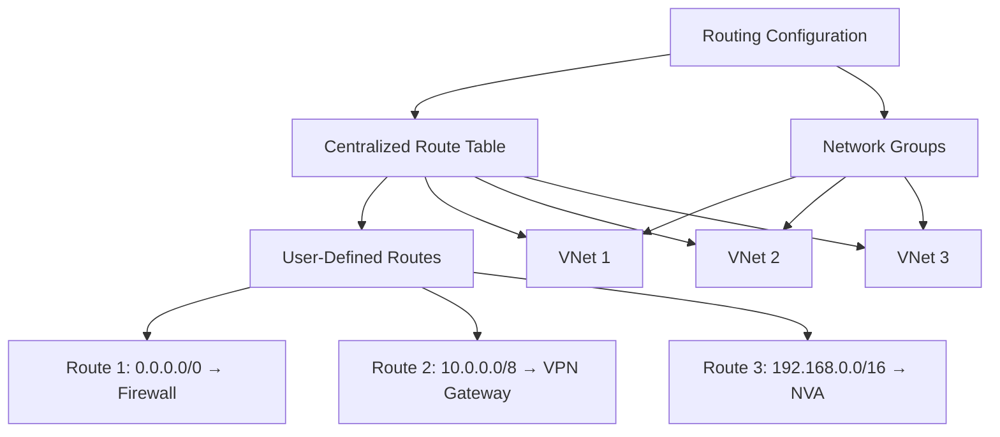
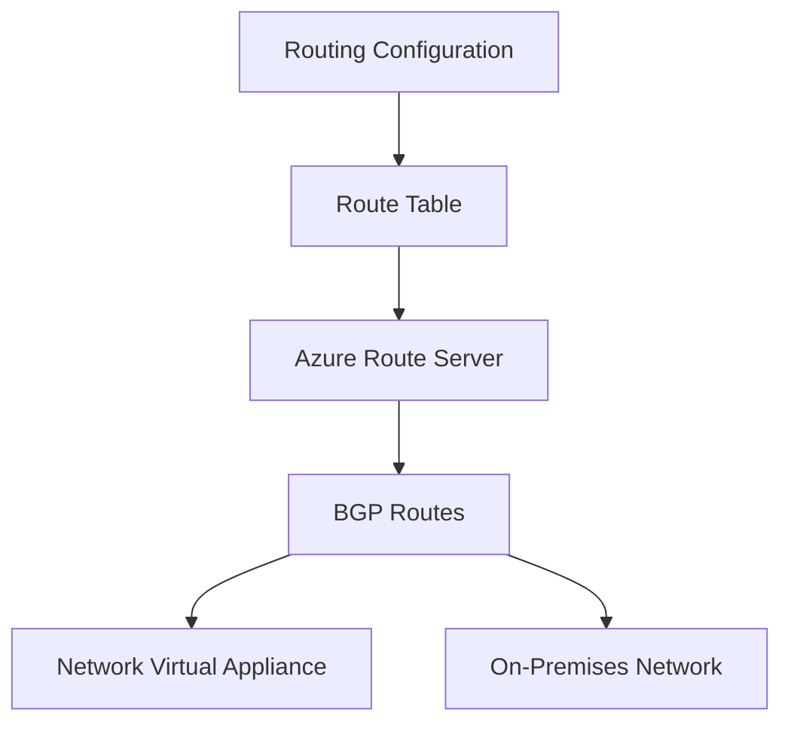

# Implementing Routing Configuration with Terraform

## Overview

Routing configurations let you orchestrate user-defined routes at scale to control traffic flow according to your desired routing behavior. They provide centralized route table management across multiple VNets.

## Architecture



## Terraform Implementation

### Basic Routing Configuration

```hcl
# Network Manager and Groups (assumed to exist)
resource "azurerm_network_manager" "main" {
  # ... (see 01-network-manager-instance.md)
}

resource "azurerm_network_manager_network_group" "production" {
  name               = "production-vnets"
  network_manager_id = azurerm_network_manager.main.id
}

# Routing Configuration
resource "azurerm_network_manager_routing_configuration" "production" {
  name               = "routing-prod"
  network_manager_id = azurerm_network_manager.main.id

  applies_to_group {
    network_group_id = azurerm_network_manager_network_group.production.id
  }

  description = "Routing configuration for production VNets"
}
```

### Routing Configuration with Route Tables

**Note:** The routing configuration in Network Manager works with existing route tables. You create route tables separately and the routing configuration applies them to network groups.

```hcl
# Route Table
resource "azurerm_route_table" "production" {
  name                          = "rt-prod"
  location                      = "eastus"
  resource_group_name           = "rg-network"
  disable_bgp_route_propagation = false

  route {
    name           = "default-to-firewall"
    address_prefix = "0.0.0.0/0"
    next_hop_type  = "VirtualAppliance"
    next_hop_in_ip_address = "10.0.1.4" # Azure Firewall IP
  }

  route {
    name           = "on-premises"
    address_prefix = "192.168.0.0/16"
    next_hop_type  = "VirtualNetworkGateway"
  }
}

# Associate route table with subnets (separate from Network Manager)
resource "azurerm_subnet_route_table_association" "production" {
  subnet_id      = azurerm_subnet.production.id
  route_table_id = azurerm_route_table.production.id
}
```

## Using the Module

```hcl
module "network_manager" {
  source = "../../modules/virtual-network-manager"

  # ... (other configuration)

  routing_configurations = {
    "routing-prod" = {
      network_group_names = ["production-vnets"]
      description         = "Routing configuration for production"
    }
  }
}
```

## Key Parameters

| Parameter | Description | Required | Example |
|-----------|-------------|----------|---------|
| `name` | Name of the routing configuration | Yes | `routing-prod` |
| `network_manager_id` | ID of the Network Manager | Yes | `azurerm_network_manager.main.id` |
| `applies_to_group.network_group_id` | Network group ID | Yes | `azurerm_network_manager_network_group.production.id` |
| `description` | Description | No | `"Production routing"` |

## Integration with Azure Route Server



```hcl
# Azure Route Server
resource "azurerm_route_server" "main" {
  name                = "rs-main"
  resource_group_name = "rg-network"
  location            = "eastus"
  sku                 = "Standard"
  subnet_id           = azurerm_subnet.route_server.id

  public_ip_address_id = azurerm_public_ip.route_server.id
}

# Route Server BGP Peer
resource "azurerm_route_server_bgp_connection" "nva" {
  name            = "bgp-nva"
  route_server_id = azurerm_route_server.main.id
  peer_asn        = 65001
  peer_ip         = "10.0.1.10" # NVA IP
}
```

## Best Practices

1. **Centralized Management**: Use routing configuration for consistent routing policies
2. **Route Table Design**: Design route tables before applying routing configuration
3. **Next Hop Types**: Understand different next hop types (VirtualAppliance, VirtualNetworkGateway, Internet, None)
4. **BGP Integration**: Use Azure Route Server for dynamic routing with NVAs
5. **Testing**: Test routing changes in non-production first

## Deployment

```hcl
# Deploy routing configuration
resource "azurerm_network_manager_deployment" "routing" {
  location           = "eastus"
  network_manager_id = azurerm_network_manager.main.id
  scope_access       = "Routing"

  configuration_ids = [
    azurerm_network_manager_routing_configuration.production.id
  ]
}
```

## Outputs

```hcl
output "routing_configuration_id" {
  description = "The ID of the routing configuration"
  value       = azurerm_network_manager_routing_configuration.production.id
}
```

## References

- [Terraform: azurerm_network_manager_routing_configuration](https://registry.terraform.io/providers/hashicorp/azurerm/latest/docs/resources/network_manager_routing_configuration)
- [Azure Route Server](https://learn.microsoft.com/en-us/azure/route-server/overview)
- [Routing Configuration](https://learn.microsoft.com/en-us/azure/virtual-network-manager/concept-routing-configuration)

