# Azure Virtual Network Manager

## Overview

Azure Virtual Network Manager (AVNM) is a centralized management service that simplifies network governance and configuration at scale across multiple subscriptions and regions. It provides unified management for connectivity, security, and routing configurations, making it ideal for large enterprises managing complex network topologies.

**Learn more:**
- [Azure Virtual Network Manager Overview](https://learn.microsoft.com/en-us/azure/virtual-network-manager/overview)
- [Virtual Network Manager Documentation](https://learn.microsoft.com/en-us/azure/virtual-network-manager/)

## What is Azure Virtual Network Manager?

Azure Virtual Network Manager is a centralized management service that enables you to **group, configure, deploy, and manage virtual networks globally across subscriptions and tenants**. As organizations scale their cloud infrastructure, managing multiple virtual networks across different regions and subscriptions becomes increasingly complex. Azure Virtual Network Manager addresses this challenge by providing a unified pane of glass for network administration.

With Virtual Network Manager, you can define network groups to identify and logically segment your virtual networks. Then you can determine the connectivity, security, and routing configurations you want and apply them across all the selected virtual networks in network groups at once, ensuring consistent network policies across your entire infrastructure.

**Key Capabilities:**
- **Centralize network governance** across multiple subscriptions and regions
- **Automate topology deployment** (hub-and-spoke, mesh)
- **Enforce security policies** with security admin rules
- **Manage routing configurations** consistently
- **Scale network management** without manual per-VNet configuration
- **Manage IP address space** and prevent conflicts
- **Troubleshoot connectivity** with reachability verification

**Reference:** [Azure Virtual Network Manager Overview](https://learn.microsoft.com/en-us/azure/virtual-network-manager/overview)

### Key Capabilities

1. **Connectivity Configuration**
   - Automatically create and maintain hub-and-spoke or mesh topologies
   - Manage VNet peering relationships at scale
   - Deploy connectivity configurations across multiple VNets simultaneously

2. **Security Admin Rules**
   - Organization-level security policies that override NSG rules
   - Centralized security rule management
   - Conflict resolution with priority-based evaluation

3. **Routing Configuration**
   - Centralized route table management
   - Consistent routing policies across VNets
   - Integration with Azure Route Server

4. **IP Address Management (IPAM)**
   - Track and manage IP address spaces
   - Automatically allocate non-overlapping IP address space from IP address pools
   - Prevent IP address conflicts across on-premises and multicloud environments
   - Verify IP address reachability and troubleshoot connectivity issues
   - Analyze reachability paths between Azure resources
   - Identify Azure policies and configurations disallowing network traffic

**IPAM and Reachability Verification:**
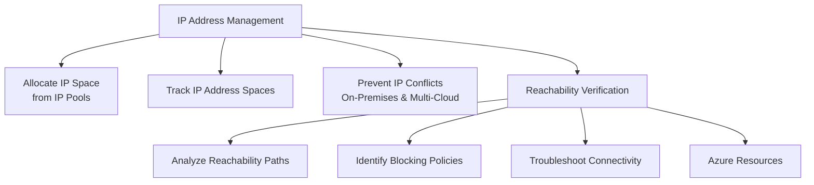

**Virtual Network Manager Components:**
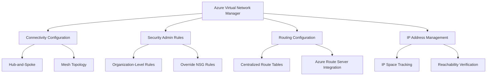

**Learn more:**
- [Virtual Network Manager Features](https://learn.microsoft.com/en-us/azure/virtual-network-manager/concept-network-manager)

## Hub-and-Spoke Architecture with Virtual Network Manager

### Traditional Hub-and-Spoke Challenges

In traditional hub-and-spoke implementations, you face several challenges:
- **Manual Configuration**: Each VNet peering must be configured individually
- **Inconsistency**: Different teams may configure peerings differently
- **Scalability**: Managing hundreds of VNets becomes complex
- **Maintenance**: Adding or removing spokes requires manual updates
- **Governance**: Difficult to enforce consistent network policies

### How Virtual Network Manager Solves This

Virtual Network Manager automates hub-and-spoke topology creation and maintenance:

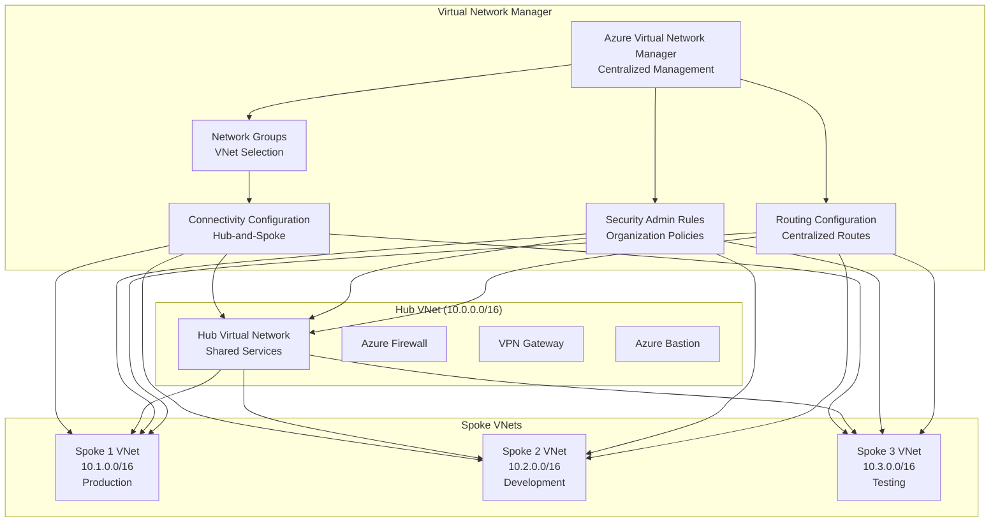

### Hub-and-Spoke Topology Benefits

**Centralized Services:**
- Shared security services (Azure Firewall, Network Virtual Appliances)
- Centralized connectivity (VPN Gateway, ExpressRoute Gateway)
- Shared management tools (Azure Bastion, Network Watcher)

**Isolation:**
- Each spoke is isolated from other spokes
- Spokes communicate only through the hub
- Prevents lateral movement between workloads

**Scalability:**
- Add new spokes without modifying existing ones
- Automatic peering configuration
- Consistent topology across all spokes

**Cost Optimization:**
- Share expensive resources (firewalls, gateways) in the hub
- Reduce redundant infrastructure
- Optimize network traffic routing

## Architecture Components

### 1. Network Manager Instance

The Network Manager instance is the top-level resource that defines the scope of management. During the creation process, you define the scope for what your Azure Virtual Network Manager instance, or _network manager_, manages. Your network manager only has the delegated access for resource visibility, configuration deployment, and IP address management within this scope boundary.

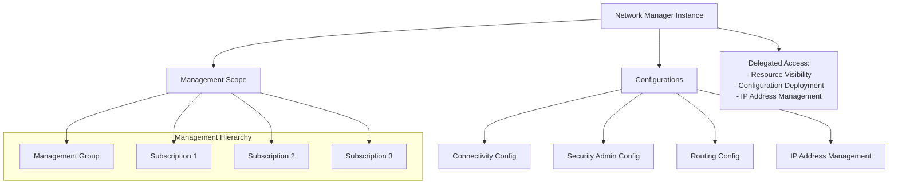

**Scope Definition:**
- **Management Groups**: Apply to all subscriptions in a management group (provides hierarchical organization)
- **Subscriptions**: Apply to specific subscriptions directly
- **Scope Boundary**: Network manager only has access within the defined scope

**Network Manager Scope Hierarchy:**
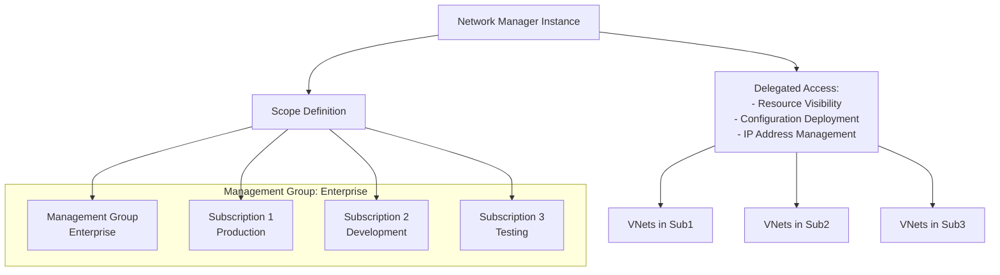

**Important:** After you deploy the network manager, you create network groups, which serve as logical containers of networking resources to apply configurations at scale. Configurations do not take effect until they are deployed to regions containing your target network resources.

**Reference:** [How does Azure Virtual Network Manager work?](https://learn.microsoft.com/en-us/azure/virtual-network-manager/overview#how-does-azure-virtual-network-manager-work)

**Learn more:**
- [Create Network Manager Instance](https://learn.microsoft.com/en-us/azure/virtual-network-manager/create-virtual-network-manager-portal)
- [Network Manager Scope](https://learn.microsoft.com/en-us/azure/virtual-network-manager/concept-network-manager-scope)

### 2. Network Groups

Network Groups define which VNets are included in configurations. A network group serves as a logical container of networking resources to apply configurations at scale.

**Selection Methods:**
- **Static Membership**: Manually select individual virtual networks to be added to your network group
- **Azure Policy**: Use Azure Policy to define conditions that govern your group membership dynamically
- **Dynamic Membership**: Automatically include VNets based on tags or conditions via Azure Policy initiatives

**Network Groups and Azure Policy:**
- Use Azure Policy initiatives to automatically add/remove VNets based on conditions
- Enforce consistent tagging for dynamic membership
- Scale network group membership as your infrastructure grows

**Network Group Membership Flow:**
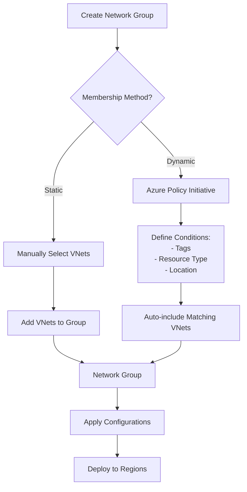

**Network Group with Azure Policy:**
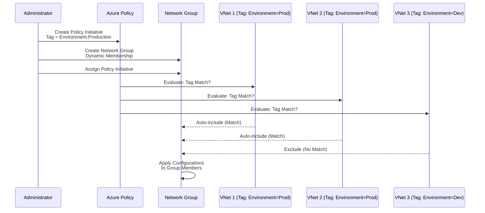

**Reference:** [Network groups and Azure Policy](https://learn.microsoft.com/en-us/azure/virtual-network-manager/concept-network-groups)

**Example Network Group:**
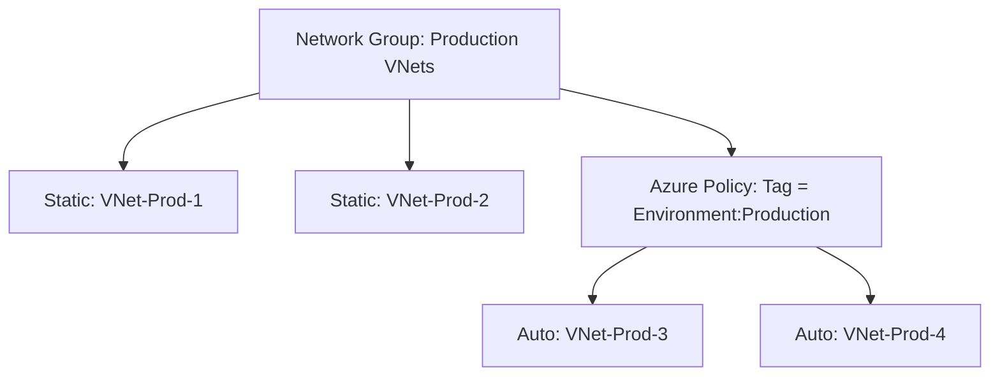

### 3. Connectivity Configuration

Connectivity configurations define how VNets connect to each other:

**Hub-and-Spoke Configuration:**
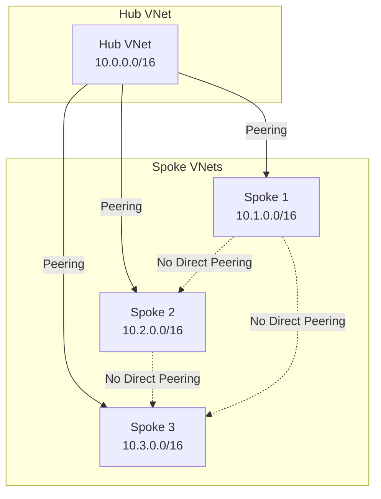

**Mesh Configuration:**
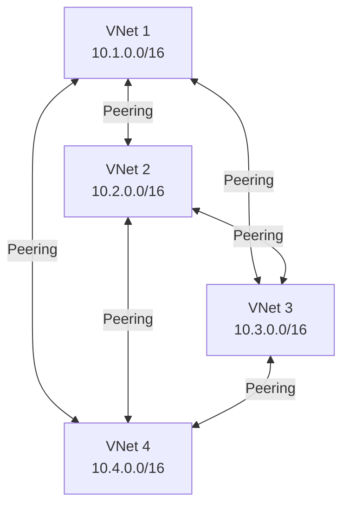

**Key Features:**
- **Automatic Peering**: Creates and manages VNet peerings automatically
- **Gateway Transit**: Enable hub gateway for spoke-to-spoke communication
- **Topology Maintenance**: Automatically updates when VNets are added/removed
- **Simplified Hub-and-Spoke**: Enable direct connectivity between spoke virtual networks in a hub-and-spoke configuration without the complexity of managing a mesh network or manually configuring additional peerings

**Deployment:**
Once you create your desired network groups and configurations, you can deploy the configurations to any region of your choosing. **Configurations do not take effect until they are deployed to regions containing your target network resources.**

**Deployment Options:**
- Azure Portal
- Azure CLI
- Azure PowerShell
- Bicep
- Terraform

**Configuration Deployment Flow:**
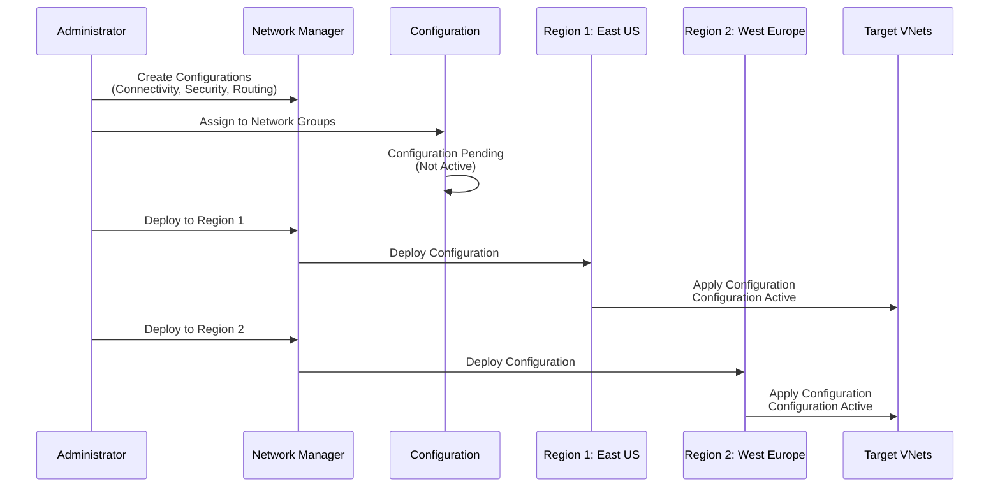

**Regional Deployment Strategy:**
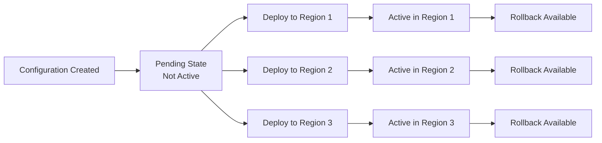

### 4. Security Admin Rules

Security Admin Rules provide organization-level security policies:

**Rule Evaluation Order:**
1. Security Admin Rules (highest priority)
2. Network Security Group (NSG) Rules
3. Default Azure rules

**Learn more:**
- [Security Admin Rules](https://learn.microsoft.com/en-us/azure/virtual-network-manager/concept-security-admins)
- [Security Admin Rules vs NSG](https://learn.microsoft.com/en-us/azure/virtual-network-manager/concept-security-admins#how-security-admin-rules-work)

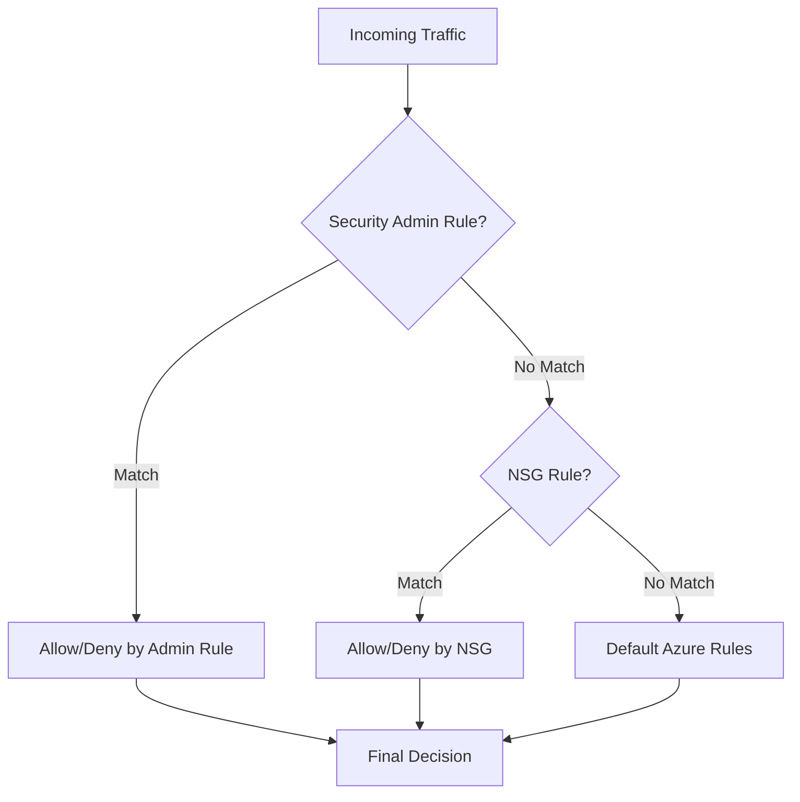

**Use Cases:**
- **Deny All Internet Traffic**: Organization-wide policy to block internet access
- **Allow Specific Services**: Permit access to approved Azure services only
- **Compliance Requirements**: Enforce regulatory compliance across all VNets
- **Emergency Response**: Quickly block or allow traffic during security incidents

### 5. Routing Configuration

A routing configuration lets you describe and orchestrate user-defined routes at scale to control traffic flow according to your desired routing behavior.

**Features:**
- **Route Tables**: Define and apply route tables to multiple VNets
- **Route Aggregation**: Combine routes from multiple sources
- **Integration**: Works with Azure Route Server and BGP
- **Centralized Management**: Apply consistent routing policies across all VNets in network groups

**Routing Configuration Architecture:**
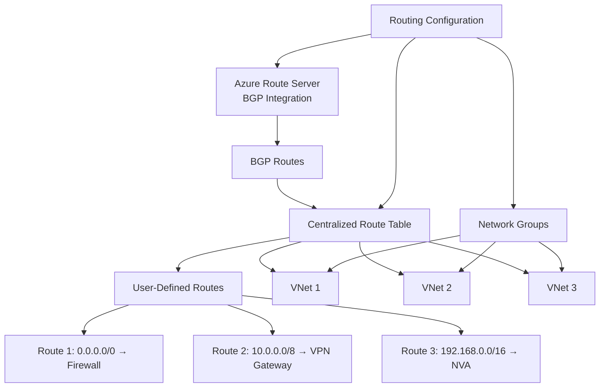

**Routing Flow:**
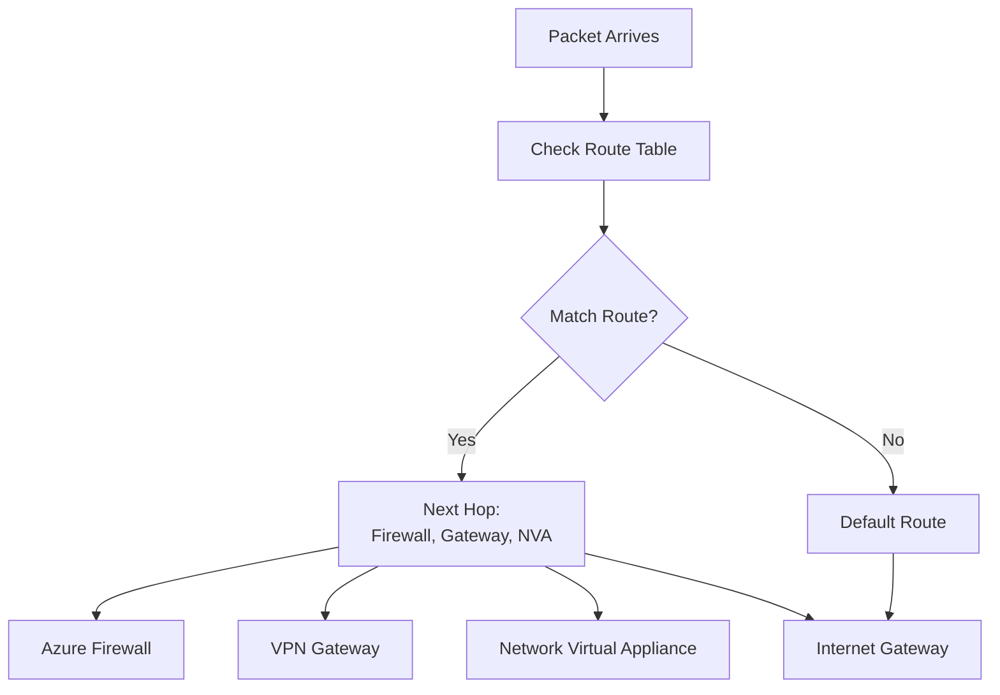

## Hub-and-Spoke Implementation Workflow

### Step 1: Create Network Manager Instance

1. Define the management scope (subscriptions, management groups)
2. Create the Network Manager instance
3. Assign appropriate permissions
4. Configure delegated access for resource visibility and configuration deployment

**Important:** The network manager only has access within the defined scope boundary.

### Step 2: Define Network Groups

1. Create network groups based on workload requirements
2. Define membership (static or dynamic via Azure Policy)
3. Tag VNets appropriately for dynamic membership
4. Use Azure Policy initiatives to automate membership

### Step 3: Configure Hub-and-Spoke Topology

1. Designate hub VNet(s)
2. Create connectivity configuration
3. Select network groups for spokes
4. Configure peering settings (gateway transit, etc.)
5. Choose between hub-and-spoke or mesh topology

### Step 4: Deploy Security Admin Rules

1. Define security policies
2. Create security admin rules
3. Assign to network groups
4. Test in staging before production
5. Document rule purposes and business justifications

### Step 5: Configure Routing

1. Define route tables
2. Create routing configuration
3. Apply to network groups
4. Validate routing paths
5. Integrate with Azure Route Server if needed

### Step 6: Deploy and Validate

1. **Deploy configurations to regions** - Configurations do not take effect until deployed
2. Choose deployment regions containing your target network resources
3. Validate connectivity using Network Watcher
4. Monitor with Azure Monitor
5. Use reachability verification to troubleshoot issues
6. Adjust as needed

**Deployment Strategy:**
- Roll out network changes through a specific region sequence and frequency of your choosing
- Enables controlled and safe network updates and rollbacks
- Deploy to non-production environments first

**Complete Workflow Diagram:**
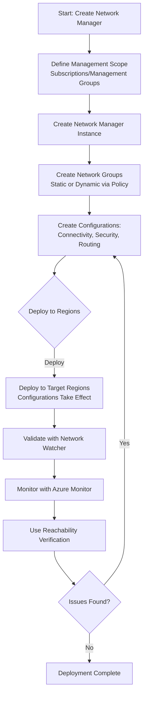

## Comparison: Traditional vs. Virtual Network Manager

| Aspect | Traditional Hub-and-Spoke | Virtual Network Manager |
|--------|---------------------------|-------------------------|
| **Configuration** | Manual per-VNet | Automated, centralized |
| **Scalability** | Limited by manual effort | Scales to hundreds of VNets |
| **Consistency** | Varies by team | Enforced automatically |
| **Maintenance** | Manual updates required | Automatic topology maintenance |
| **Governance** | Difficult to enforce | Built-in policy enforcement |
| **Security** | Per-VNet NSG rules | Organization-level admin rules |
| **Time to Deploy** | Days/weeks | Minutes/hours |

## Integration with Other Azure Services

### Network Watcher Integration

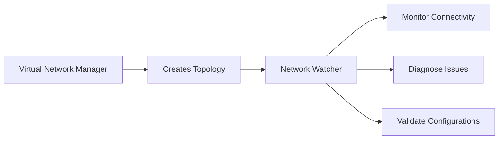

- Network Watcher can monitor topologies created by Virtual Network Manager
- IP Flow Verify considers both NSG and Security Admin Rules
- Use Network Watcher to troubleshoot connectivity issues

### Azure Policy Integration

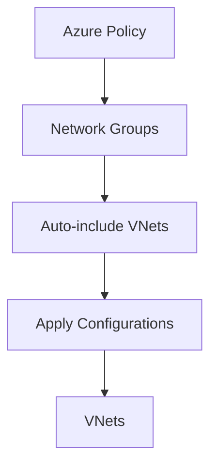

- Use Azure Policy to automatically include VNets in network groups
- Enforce tagging and compliance
- Dynamic membership based on policy conditions

### Azure Firewall Integration

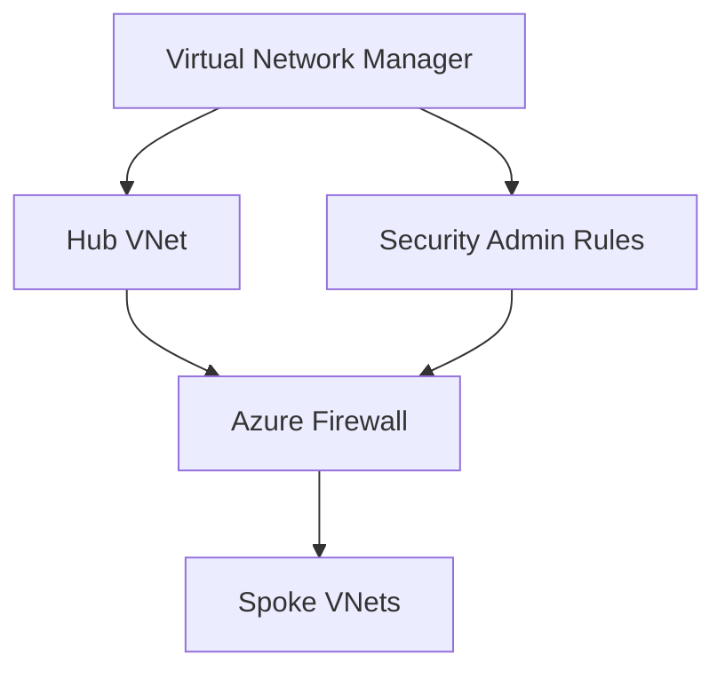

- Centralize firewall management in hub
- Security Admin Rules can reference firewall policies
- Consistent security across all spokes

## Best Practices

### 1. Hub Design
- **Dedicated Hub VNet**: Use a separate VNet for hub services
- **Subnet Planning**: Plan subnets for firewall, gateways, shared services
- **Address Space**: Reserve sufficient IP space for growth
- **Redundancy**: Deploy hub services in multiple availability zones

### 2. Spoke Design
- **Isolation**: Keep spokes isolated from each other
- **Naming Convention**: Use consistent naming for easy management
- **Tagging**: Tag VNets for dynamic network group membership
- **Address Space**: Avoid overlapping IP ranges

### 3. Network Groups
- **Logical Grouping**: Group VNets by environment, workload, or team
- **Dynamic Membership**: Use Azure Policy for automatic inclusion
- **Documentation**: Document network group purposes and members

### 4. Security Admin Rules
- **Start Restrictive**: Begin with deny-all, then allow specific traffic
- **Test Thoroughly**: Test in staging before production deployment
- **Documentation**: Document rule purposes and business justifications
- **Review Regularly**: Periodically review and update rules

### 5. Deployment Strategy
- **Phased Rollout**: Deploy to non-production first
- **Validation**: Use Network Watcher to validate connectivity
- **Monitoring**: Set up alerts for configuration changes
- **Rollback Plan**: Have a plan to revert if issues occur

## Common Use Cases

### Enterprise Multi-Subscription Environment

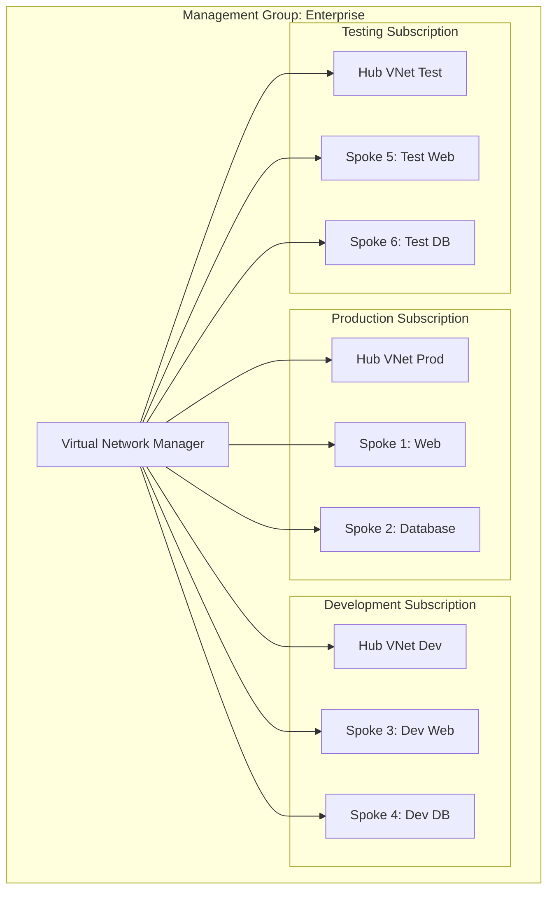

### Multi-Region Deployment

```mermaid
graph TB
    AVNM[Virtual Network Manager<br/>Global Scope]
    
    subgraph "Region 1: East US"
        Hub1[Hub VNet 1]
        Spoke1A[Spoke A]
        Spoke1B[Spoke B]
    end
    
    subgraph "Region 2: West Europe"
        Hub2[Hub VNet 2]
        Spoke2A[Spoke A]
        Spoke2B[Spoke B]
    end
    
    AVNM --> Hub1
    AVNM --> Hub2
    AVNM --> Spoke1A
    AVNM --> Spoke1B
    AVNM --> Spoke2A
    AVNM --> Spoke2B
    
    Hub1 <-->|Global Peering| Hub2
```

## Troubleshooting

### Common Issues

1. **Peering Not Created**
   - Verify network group membership
   - Check VNet address space conflicts
   - Validate permissions

2. **Security Admin Rules Blocking Traffic**
   - Review rule priority and order
   - Use Network Watcher IP Flow Verify
   - Check rule evaluation logs

3. **Routing Issues**
   - Verify route table configuration
   - Check for conflicting routes
   - Validate next hop configuration

### Diagnostic Tools

- **Network Watcher**: Topology, IP Flow Verify, Connection Troubleshoot
- **Azure Monitor**: Metrics and logs for Network Manager operations
- **Activity Log**: Track configuration changes and deployments

## Key Benefits

Based on the official Microsoft documentation, Azure Virtual Network Manager provides the following key benefits:

### Centralized Management
Manage connectivity and security policies globally across regions and subscriptions from a single pane of glass, reducing administrative overhead and ensuring consistency.

### Simplified Hub-and-Spoke Connectivity
Enable direct connectivity between spoke virtual networks in a hub-and-spoke configuration without the complexity of managing a mesh network or manually configuring additional peerings.

### Enterprise-Grade Reliability
Azure Virtual Network Manager is a highly scalable and highly available service with redundancy and replication across the globe.

### Advanced Security Controls
Create network security rules that are evaluated before network security group rules, providing granular control over traffic flow with global enforcement capabilities.

### Optimized Performance
Low latency and high bandwidth between resources in different virtual networks using virtual network peering.

### Flexible Deployment
Roll out network changes through a specific region sequence and frequency of your choosing for controlled and safe network updates and rollbacks.

### Cost Optimization
Reduce operational costs by automating network management tasks and eliminating the need for complex custom scripting solutions.

### Centralized IP Address Management
Manage your organization's IP address space by automatically allocating non-overlapping IP address space from IP address pools to prevent address space conflicts across on-premises and multicloud environments.

### Reachability Verification
Validate Azure network policies and troubleshoot connectivity issues by analyzing reachability paths between Azure resources and identifying Azure policies and configurations disallowing network traffic.

**Reference:** [Key Benefits](https://learn.microsoft.com/en-us/azure/virtual-network-manager/overview#key-benefits)

## Pricing and Availability

### Pricing Model
- **Virtual Network-Based Pricing**: New Azure Virtual Network Manager instances charge solely on the virtual network-based pricing
- **Subscription-Based Pricing**: Instances created before the release of virtual network-based pricing continue to charge on subscription-based pricing (to be retired February 6, 2028)

**Learn more:**
- [Azure Virtual Network Manager Pricing](https://learn.microsoft.com/en-us/azure/virtual-network-manager/pricing)
- [Switch Pricing Model](https://learn.microsoft.com/en-us/azure/virtual-network-manager/overview#pricing)

### Regions
For current information on the regions where Azure Virtual Network Manager is available, see:
- [Azure Virtual Network Manager Regions](https://learn.microsoft.com/en-us/azure/virtual-network-manager/regions)

### Limits
For detailed limits information, see:
- [Azure Virtual Network Manager Limits](https://learn.microsoft.com/en-us/azure/virtual-network-manager/limits)

### Service Level Agreement (SLA)
For SLA information, see:
- [SLA for Azure Virtual Network Manager](https://learn.microsoft.com/en-us/azure/virtual-network-manager/sla)

## Summary

Azure Virtual Network Manager revolutionizes network management in Azure by:
- **Automating** hub-and-spoke topology creation and maintenance
- **Centralizing** security and routing policies
- **Scaling** to hundreds of VNets across multiple subscriptions
- **Enforcing** consistent network governance
- **Reducing** operational overhead and human error
- **Managing** IP address space and preventing conflicts
- **Troubleshooting** connectivity with reachability verification

When combined with Network Watcher for monitoring and Azure Policy for governance, Virtual Network Manager provides a complete solution for enterprise-scale network management in Azure.

**Additional Resources:**
- [Virtual Network Manager Quickstart](https://learn.microsoft.com/en-us/azure/virtual-network-manager/quickstart-create-virtual-network-manager-portal)
- [Virtual Network Manager Tutorials](https://learn.microsoft.com/en-us/azure/virtual-network-manager/tutorial-create-secured-hub-and-spoke)
- [Virtual Network Manager Best Practices](https://learn.microsoft.com/en-us/azure/virtual-network-manager/concept-network-manager)
- [Virtual Network Manager FAQ](https://learn.microsoft.com/en-us/azure/virtual-network-manager/faq)
- [Virtual Network Manager Use Cases](https://learn.microsoft.com/en-us/azure/virtual-network-manager/overview#use-cases)
- [Create Network Manager Instance](https://learn.microsoft.com/en-us/azure/virtual-network-manager/create-virtual-network-manager-portal)

