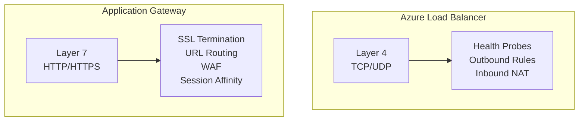
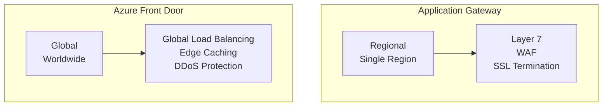
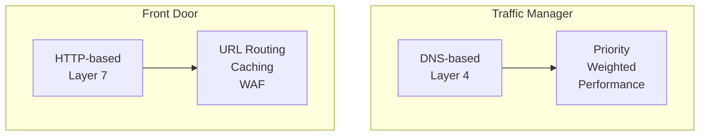
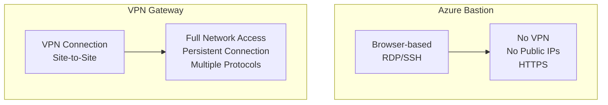
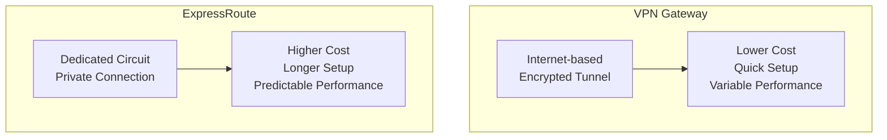
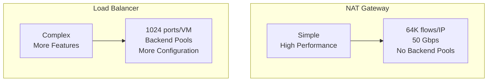
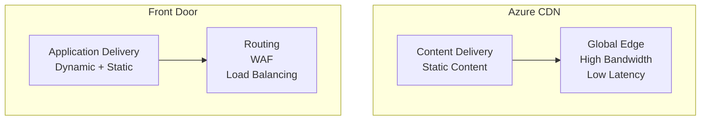
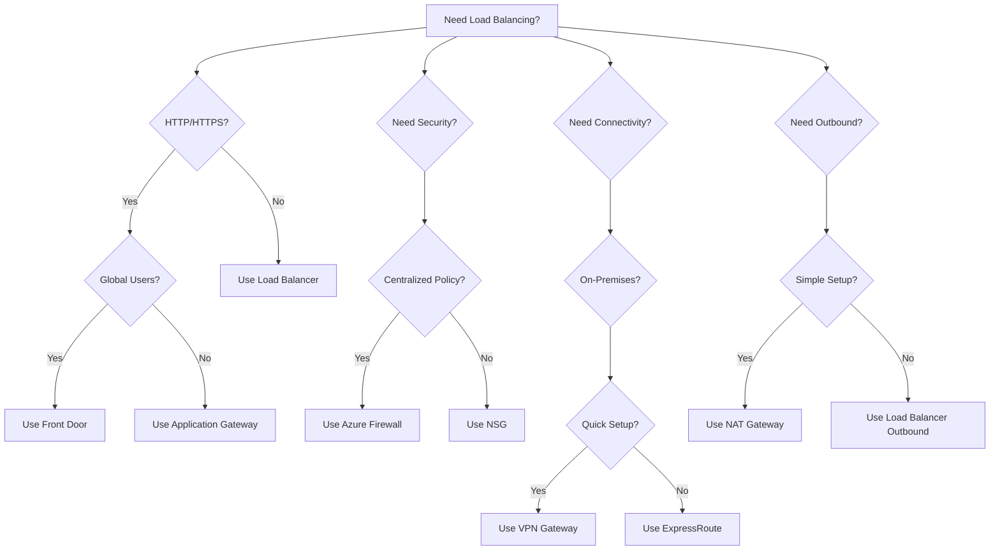

# Azure Networking Service Comparisons

This document provides detailed comparisons between similar Azure networking services to help you choose the right solution for your needs.

## Load Balancing Services

### Azure Load Balancer vs Application Gateway



| Feature | Load Balancer | Application Gateway |
|---------|---------------|---------------------|
| **Layer** | Layer 4 (TCP/UDP) | Layer 7 (HTTP/HTTPS) |
| **Use Case** | General load balancing | Web application load balancing |
| **SSL/TLS** | No | Yes (termination) |
| **URL Routing** | No | Yes |
| **WAF** | No | Yes (optional) |
| **Session Affinity** | Source IP | Cookie-based |
| **Cost** | Lower | Higher |
| **Throughput** | Up to millions of flows | Up to 2.22 Gbps (v1), variable (v2) |
| **SKU** | Basic, Standard | Standard, WAF, Standard_v2, WAF_v2 |

**When to Use Load Balancer:**
- Non-HTTP/HTTPS traffic
- Simple TCP/UDP load balancing
- Outbound NAT requirements
- Cost-sensitive scenarios

**When to Use Application Gateway:**
- HTTP/HTTPS web applications
- Need SSL termination
- URL-based routing
- WAF protection needed
- Cookie-based session affinity

---

### Application Gateway vs Azure Front Door



| Feature | Application Gateway | Azure Front Door |
|---------|---------------------|------------------|
| **Scope** | Regional | Global |
| **Use Case** | Regional web apps | Global web apps |
| **Caching** | No | Yes (edge caching) |
| **Global Distribution** | No | Yes |
| **DDoS Protection** | No | Yes (built-in) |
| **Cost** | Lower | Higher |
| **Latency** | Regional | Global (lowest latency) |
| **Multi-region** | Manual setup | Automatic |

**When to Use Application Gateway:**
- Single region deployment
- Regional compliance requirements
- Lower cost needed
- Internal applications

**When to Use Front Door:**
- Global user base
- Multi-region deployment
- Need edge caching
- DDoS protection required
- Lowest latency worldwide

---

### Traffic Manager vs Front Door



| Feature | Traffic Manager | Front Door |
|---------|----------------|------------|
| **Layer** | Layer 4 (DNS) | Layer 7 (HTTP/HTTPS) |
| **Routing** | DNS-based | HTTP-based |
| **Caching** | No | Yes |
| **WAF** | No | Yes |
| **SSL/TLS** | No | Yes |
| **Use Case** | Simple DNS routing | Advanced HTTP routing |

**When to Use Traffic Manager:**
- Simple DNS-based routing
- Non-HTTP services
- Lower cost needed
- Basic failover

**When to Use Front Door:**
- HTTP/HTTPS applications
- Need caching
- WAF protection
- Advanced routing rules

---

## Security Services

### Azure Firewall vs Network Security Groups

```mermaid
graph TB
    subgraph "NSG"
        NSG[Stateless<br/>Distributed]
        NSG --> Features7[IP/Port Rules<br/>Service Tags<br/>ASGs]
    end
    
    subgraph "Azure Firewall"
        FW[Stateful<br/>Centralized]
        FW --> Features8[Network Rules<br/>App Rules<br/>NAT Rules<br/>Threat Intel]
    end
```

| Feature | NSG | Azure Firewall |
|---------|-----|----------------|
| **Type** | Stateless | Stateful |
| **Deployment** | Distributed (per subnet/NIC) | Centralized (single instance) |
| **Rules** | IP/Port based | IP/Port + FQDN based |
| **NAT** | No | Yes (DNAT) |
| **Threat Intelligence** | No | Yes |
| **Cost** | Free | Paid |
| **Management** | Simple | Advanced |
| **Throughput** | High (distributed) | Up to 30 Gbps |

**When to Use NSG:**
- Basic network filtering
- Cost-sensitive
- Simple rules
- Distributed filtering

**When to Use Firewall:**
- Centralized security policy
- FQDN filtering needed
- NAT requirements
- Threat intelligence
- Advanced security

---

### Azure Bastion vs VPN Gateway



| Feature | Bastion | VPN Gateway |
|---------|---------|-------------|
| **Use Case** | VM access | Network connectivity |
| **Access Method** | Browser | VPN client |
| **Scope** | Individual VMs | Entire network |
| **Connection** | On-demand | Persistent |
| **Cost** | Per hour | Per hour + bandwidth |
| **Setup** | Simple | Complex |

**When to Use Bastion:**
- Occasional VM access
- No VPN infrastructure
- Browser-based access
- Simple setup

**When to Use VPN Gateway:**
- Full network access needed
- Site-to-site connectivity
- Multiple users
- Persistent connection

---

## Connectivity Services

### VPN Gateway vs ExpressRoute



| Feature | VPN Gateway | ExpressRoute |
|---------|------------|--------------|
| **Connection** | Internet (encrypted) | Dedicated circuit |
| **Bandwidth** | Up to 10 Gbps | Up to 100 Gbps |
| **Latency** | Variable | Predictable |
| **Cost** | Lower | Higher |
| **Setup Time** | Hours | Weeks/Months |
| **SLA** | 99.9% | 99.95% |
| **Use Case** | Small/Medium | Enterprise |

**When to Use VPN Gateway:**
- Small to medium deployments
- Cost-sensitive
- Quick setup needed
- Variable bandwidth acceptable

**When to Use ExpressRoute:**
- Enterprise deployments
- High bandwidth needed
- Predictable performance required
- Compliance requirements

---

### NAT Gateway vs Load Balancer Outbound Rules



| Feature | NAT Gateway | Load Balancer Outbound |
|---------|------------|------------------------|
| **Configuration** | Simple | Complex |
| **Performance** | Up to 50 Gbps | Variable |
| **Flows per IP** | 64,000 | Limited by ports |
| **Backend Pools** | Not needed | Required |
| **Cost** | Per hour + data | Per hour + data |
| **SNAT Exhaustion** | Rare | Common |

**When to Use NAT Gateway:**
- Simple outbound connectivity
- High performance needed
- Many concurrent connections
- Avoid SNAT exhaustion

**When to Use Load Balancer Outbound:**
- Already using Load Balancer
- Need inbound + outbound
- Fine-grained control needed

---

## Application Delivery Services

### Azure CDN vs Front Door Caching



| Feature | Azure CDN | Front Door |
|---------|-----------|------------|
| **Primary Use** | Static content | Application delivery |
| **Caching** | Yes (optimized) | Yes (basic) |
| **Routing** | No | Yes |
| **WAF** | No | Yes |
| **Load Balancing** | No | Yes |
| **Cost** | Lower | Higher |

**When to Use CDN:**
- Static content delivery
- High bandwidth needs
- Cost optimization
- Simple caching

**When to Use Front Door:**
- Dynamic applications
- Need routing + caching
- WAF protection
- Multi-region apps

---

## Summary Decision Tree



---

## Cost Comparison (Approximate)

| Service | Cost Model | Typical Monthly Cost |
|---------|-----------|---------------------|
| Load Balancer (Standard) | Per hour + data | $20-100 |
| Application Gateway (v2) | Per hour + data | $100-500 |
| Front Door | Per GB + requests | $50-500 |
| Azure Firewall | Per hour | $200-1000 |
| VPN Gateway | Per hour + bandwidth | $100-500 |
| ExpressRoute | Circuit + bandwidth | $1000-10000+ |
| NAT Gateway | Per hour + data | $30-200 |
| Bastion | Per hour | $50-200 |

*Costs vary by region, usage, and SKU. Check Azure pricing calculator for accurate estimates.*

---

## Performance Comparison

| Service | Throughput | Latency | Concurrent Connections |
|---------|-----------|---------|----------------------|
| Load Balancer | Millions of flows | Low | Very High |
| Application Gateway | 2.22 Gbps (v1), variable (v2) | Low | High |
| Front Door | Variable | Very Low (edge) | Very High |
| Azure Firewall | 2.5-30 Gbps | Low | High |
| VPN Gateway | 100 Mbps - 10 Gbps | Variable | Medium |
| ExpressRoute | Up to 100 Gbps | Very Low | Very High |
| NAT Gateway | Up to 50 Gbps | Low | 64K per IP |

---

## Conclusion

Choose services based on:
1. **Requirements**: What do you need to accomplish?
2. **Scope**: Regional or global?
3. **Traffic Type**: HTTP/HTTPS or other protocols?
4. **Security Needs**: Basic or advanced?
5. **Budget**: Cost constraints?
6. **Performance**: Throughput and latency requirements?

This comparison should help you make informed decisions about which Azure networking services to use for your specific scenarios.

