# Azure Application Gateway

## Overview

Application Gateway manages the requests that client applications can send to a web app. Application Gateway routes traffic to a pool of web servers based on the URL of a request. This is known as application layer routing. The pool of web servers can be Azure virtual machines, Azure virtual machine scale sets, Azure App Service, and even on-premises servers.

**Learn more:**
- [Azure Application Gateway Overview](https://learn.microsoft.com/en-us/azure/application-gateway/overview)
- [Application Gateway Documentation](https://learn.microsoft.com/en-us/azure/application-gateway/)

## How Application Gateway Routes Requests

Clients send requests to your web apps to the IP address or DNS name of the gateway. The gateway routes requests to a selected web server in the back-end pool, using a set of rules configured for the gateway to determine where the request should go.

**Application Gateway Request Routing:**
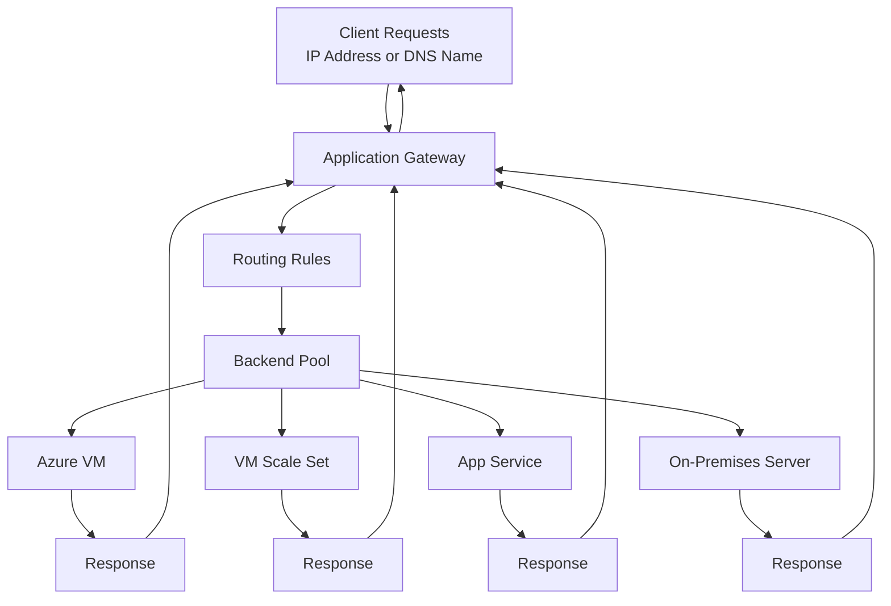

**Key Characteristics:**
- **Application Layer Routing**: Routes based on URL path and hostname (OSI Layer 7)
- **Multiple Backend Types**: Supports VMs, VM Scale Sets, App Service, and on-premises servers
- **Intelligent Routing**: Uses rules to determine request destination
- **Single Entry Point**: Provides unified endpoint for multiple backend services

## Application Gateway Components

Application Gateway comprises a series of components that combine to route requests to a pool of web servers and to check the health of these web servers. Understanding how these components are related and what role they play is essential for configuring Application Gateway effectively.

### Component Overview

Each component in Application Gateway has a specific role in the request routing process:

**1. Front-End IP Address**
- **Purpose**: Entry point for client requests
- **Configuration**: Can be configured with a public IP address, a private IP address, or both
- **Function**: Receives all incoming client requests before they are processed by other components
- **Use Cases**: 
  - Public IP for internet-facing applications
  - Private IP for internal-only applications
  - Both for applications requiring dual access

**2. Listeners**
- **Purpose**: Logical entity that checks for incoming connection requests
- **Function**: Accepts requests when protocol, port, hostname, and IP address match the listener's configuration
- **Requirements**: You must have at least one listener configured
- **Configuration**: Defines which protocol (HTTP/HTTPS), port, hostname, and IP address to listen on
- **Types**: Basic listener (path-based) or Multisite listener (hostname-based)

**3. Request Routing Rules**
- **Purpose**: Key component that determines how to route traffic on the listener
- **Function**: Binds the listener, backend server pool, and backend HTTP settings together
- **Decision Making**: When a listener accepts a request, the routing rule decides:
  - Whether to forward the request to a backend pool
  - Which backend pool to forward it to
  - Whether to redirect the request elsewhere
- **Types**: Basic rule, Path-based rule, or Multisite rule

**4. Backend Pools**
- **Purpose**: Collection of web servers that receive and process requests
- **Function**: Contains the actual servers that handle application traffic
- **Backend Targets**: Can include:
  - Fixed set of virtual machines
  - Virtual machine scale sets
  - Apps hosted by Azure App Services
  - Collection of on-premises servers
- **Load Distribution**: Requests are distributed across servers in the pool using round-robin algorithm

**5. Health Probes**
- **Purpose**: Determine which servers are available for load-balancing in a backend pool
- **Function**: Continuously monitor server health by sending probe requests
- **Automatic Management**: Servers are automatically added and removed from the backend pool based on their availability
- **Health Criteria**: Servers returning HTTP status codes 200-399 are considered healthy
- **Impact**: Only healthy servers receive traffic, ensuring high availability

**Component Interaction Flow:**
```
Client Request → Front-End IP → Listener → Routing Rule → Backend Pool → Backend Server
                                                              ↑
                                                         Health Probe
```

**Application Gateway Components Architecture:**
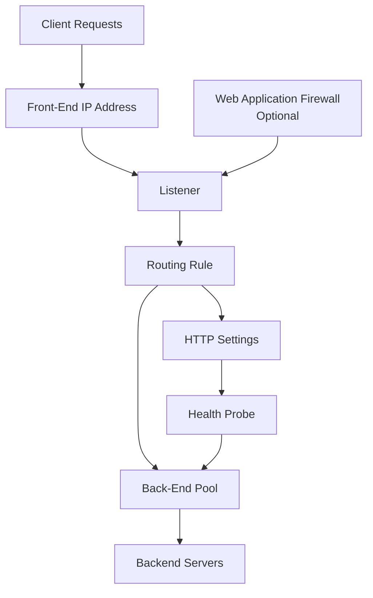

### Front-End IP Address

Client requests are received through a front-end IP address. You can configure Application Gateway to have a public IP address, a private IP address, or both. Application Gateway can't have more than one public and one private IP address.

**Front-End IP Configuration:**
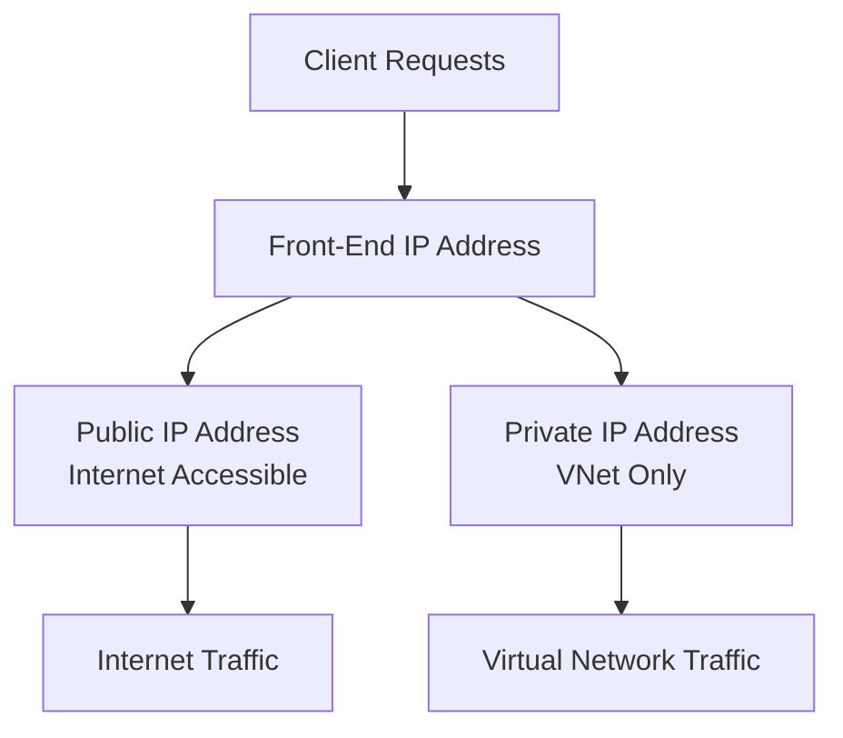

**Key Characteristics:**
- **Public IP**: Allows internet access to Application Gateway
- **Private IP**: Restricts access to virtual network only
- **Dual Configuration**: Can have both public and private IP addresses
- **Single Instance**: Maximum one public and one private IP address

**Use Cases:**
- **Public IP**: Internet-facing web applications
- **Private IP**: Internal applications, multi-tier architectures
- **Both**: Applications requiring both internet and internal access

### Listeners

Application Gateway uses one or more listeners to receive incoming requests. A listener accepts traffic arriving on a specified combination of protocol, port, host, and IP address. Each listener routes requests to a back-end pool of servers following routing rules that you specify.

**Listener Types:**
- **Basic Listener**: Only routes a request based on the path in the URL
- **Multisite Listener**: Can also route requests using the hostname element of the URL

**Listener Configuration:**
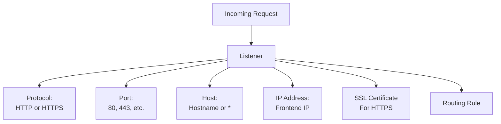

**Listener Characteristics:**
- **Protocol**: HTTP or HTTPS
- **Port**: Typically 80 (HTTP) or 443 (HTTPS)
- **Host**: Specific hostname or wildcard (*)
- **SSL Certificates**: Handles SSL/TLS termination for HTTPS listeners
- **Routing**: Passes requests to routing rules for backend pool selection

**Basic vs Multisite Listeners:**

| Feature | Basic Listener | Multisite Listener |
|---------|---------------|-------------------|
| **Routing Basis** | Path in URL only | Hostname + Path |
| **Hostname** | Not used for routing | Used for routing |
| **Use Case** | Single site | Multiple sites |
| **Example** | `http://example.com/*` | `http://contoso.com/*`, `http://fabrikam.com/*` |

### Routing Rules

A routing rule binds a listener to the back-end pools. A rule specifies how to interpret the hostname and path elements in the URL of a request, and how to direct the request to the appropriate back-end pool. A routing rule also has an associated set of HTTP settings.

**Routing Rule Components:**
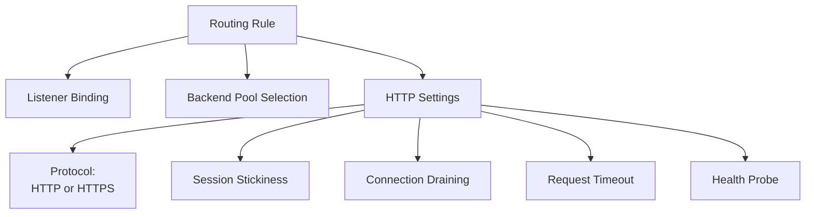

**HTTP Settings Configuration:**

The HTTP settings indicate whether (and how) traffic is encrypted between Application Gateway and the back-end servers, and other configuration information such as:

- **Protocol**: HTTP or HTTPS for backend communication
- **Session Stickiness**: Pass all requests in a client session to the same web server rather than distributing them across servers with load balancing
- **Connection Draining**: Enable the graceful removal of servers from a back-end pool
- **Request Timeout Period**: Timeout in seconds for backend requests
- **Health Probes**: Specify probe URL, time-out periods, and other parameters used to determine whether a server in the back-end pool is available

**Routing Rule Types:**
- **Basic Rule**: Routes all traffic from a listener to a single backend pool
- **Path-Based Rule**: Routes traffic based on URL path to different backend pools
- **Multisite Rule**: Routes traffic based on hostname to different backend pools

### Back-End Pools

A back-end pool references a collection of web servers. You provide the IP address of each web server and the port on which it listens for requests when configuring the pool. Each pool can specify a fixed set of virtual machines, a virtual machine scale-set, an app hosted by Azure App Services, or a collection of on-premises servers. Each back-end pool has an associated load balancer that distributes work across the pool.

**Backend Pool Types:**
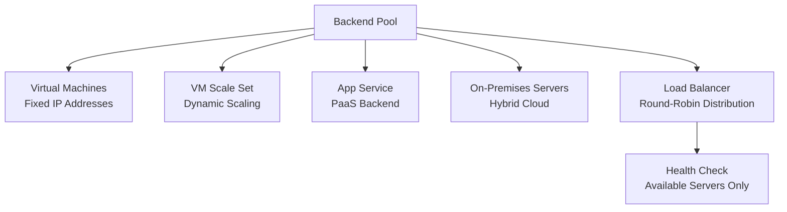

**Backend Pool Configuration:**
- **IP Addresses**: Static IP addresses of backend servers
- **FQDNs**: Fully qualified domain names for dynamic backends
- **Port**: Port on which backend servers listen
- **Load Balancing**: Round-robin distribution across healthy servers

### Web Application Firewall

The web application firewall (WAF) is an optional component that handles incoming requests before they reach a listener. The web application firewall checks each request for many common threats, based on the Open Web Application Security Project (OWASP).

**WAF Architecture:**
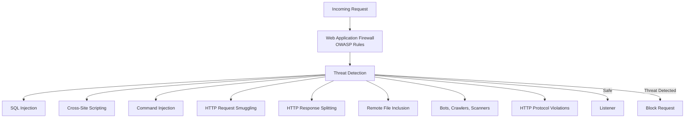

**WAF Protection Against:**
- **SQL Injection**: Malicious SQL code injection
- **Cross-Site Scripting (XSS)**: Script injection attacks
- **Command Injection**: System command execution attempts
- **HTTP Request Smuggling**: Protocol manipulation attacks
- **HTTP Response Splitting**: Response header manipulation
- **Remote File Inclusion**: Unauthorized file access attempts
- **Bots, Crawlers, and Scanners**: Automated attack tools
- **HTTP Protocol Violations and Anomalies**: Protocol-level attacks

**OWASP Core Rule Sets (CRS):**

OWASP has defined a set of generic rules for detecting attacks called the Core Rule Set (CRS). The rule sets are under continuous review as attacks evolve in sophistication. WAF supports two rule sets:

- **CRS 2.2.9**: Older rule set
- **CRS 3.0**: Default and more recent rule set (recommended)

**WAF Configuration Options:**
- **Rule Set Selection**: Choose CRS 2.2.9 or CRS 3.0
- **Rule Customization**: Select specific rules to enable/disable
- **Custom Rules**: Define custom firewall rules
- **Request Inspection**: Specify which elements in a request to examine
- **Message Size Limits**: Limit the size of messages to prevent massive uploads

**WAF Modes:**
- **Detection Mode**: Logs threats but doesn't block requests
- **Prevention Mode**: Blocks requests that match threat patterns

You can enable WAF on your Application Gateway by selecting the WAF tier when you create a gateway.

### Health Probes

Health probes are an important element in assisting the load balancer to determine which servers are available for load balancing in a back-end pool. Application Gateway uses a health probe to send a request to a server. If the server returns an HTTP response with a status code between 200 and 399, the server is deemed healthy.

**Health Probe Architecture:**
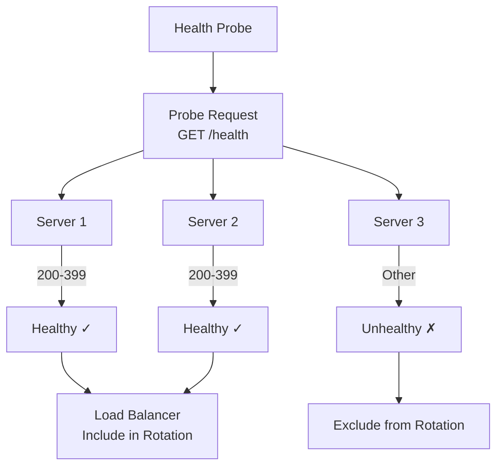

**Health Probe Configuration:**
- **Probe URL**: Path to check (e.g., `/health`, `/api/health`)
- **Interval**: Time between probe requests (seconds)
- **Timeout**: Time to wait for response (seconds)
- **Unhealthy Threshold**: Number of failed probes before marking unhealthy
- **Healthy Status Codes**: HTTP status codes indicating health (200-399 by default)

**Default Health Probe:**
If you don't configure a health probe, Application Gateway creates a default probe that:
- Waits for 30 seconds before deciding that a server is unavailable
- Uses the root path (`/`)
- Checks for status codes 200-399

**Health Probe Best Practices:**
- **Dedicated Endpoint**: Use a dedicated health check endpoint
- **Lightweight**: Keep health checks fast and lightweight
- **Appropriate Interval**: Balance between responsiveness and overhead
- **Status Codes**: Configure appropriate healthy status code ranges

## Application Gateway Network Requirements

Application Gateway requires a virtual network in which to operate. You must create this virtual network and a dedicated subnet before setting up Application Gateway.

**Network Requirements:**
```mermaid
graph TB
    VNet[Virtual Network] --> Subnet[Dedicated Subnet<br/>Application Gateway]
    
    Subnet --> IPs[Private IP Addresses<br/>Internal Communication]
    Subnet --> Scaling[Scaling Instances<br/>Additional IPs Needed]
    
    Scaling --> Size1[/28 Subnet<br/>~16 IPs<br/>Up to 4 Instances]
    Scaling --> Size2[/27 Subnet<br/>~32 IPs<br/>Up to 8 Instances]
    Scaling --> Size3[/26 Subnet<br/>~64 IPs<br/>Up to 16 Instances]
```

**Subnet Sizing Guidelines:**
- **/28 Subnet**: Supports up to 4 instances (recommended minimum)
- **/27 Subnet**: Supports up to 8 instances
- **/26 Subnet**: Supports up to 16 instances
- **Larger Subnets**: For higher scaling requirements

**Important Considerations:**
- Application Gateway uses a number of private addresses for internal use
- Additional addresses needed for communicating with each instance if the gateway scales out
- Plan subnet size based on expected scaling requirements
- Example: If planning to scale to 4 instances, create a /28 size subnet

**Network Configuration Options:**
- **Public IP Address**: Expose Application Gateway to the internet
- **Private IP Address**: Keep Application Gateway private within virtual network
- **Both**: Can have both public and private IP addresses

**Private Application Gateway Use Case:**
Keeping Application Gateway private (private IP only) is useful if you have internal sites that you would like to use Application Gateway to provide load balancing without internet exposure.

## Application Gateway Options

You can create an Application Gateway on the Standard tier or the WAF tier. You also have a choice of three sizes with varying performance, pricing, and scalability: Small, Medium, and Large.

**Application Gateway Tiers:**
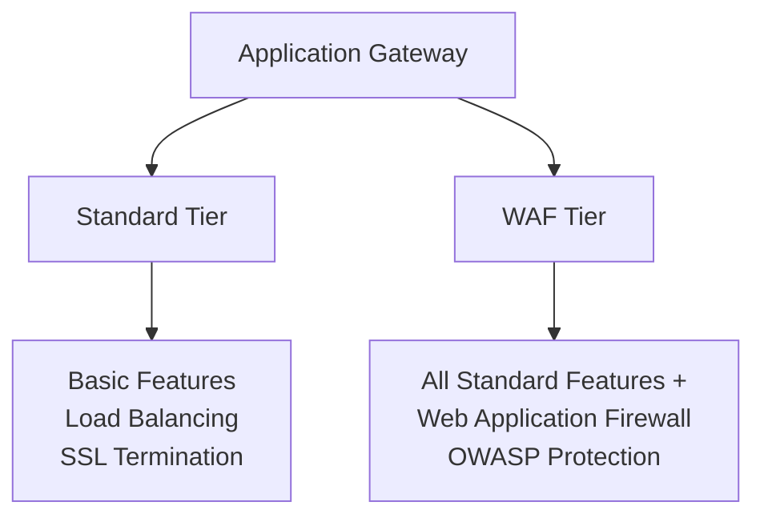

**Tier Comparison:**

| Feature | Standard Tier | WAF Tier |
|---------|--------------|----------|
| **Load Balancing** | Yes | Yes |
| **SSL Termination** | Yes | Yes |
| **Path-Based Routing** | Yes | Yes |
| **Multiple Site Hosting** | Yes | Yes |
| **Web Application Firewall** | No | Yes |
| **OWASP Protection** | No | Yes |
| **Use Case** | General web applications | Web applications requiring security |

**Application Gateway Versions:**

The Standard and WAF tiers are available in two versions:

- **V1**: Original version
  - Manual scaling only
  - Fixed instance sizes (Small, Medium, Large)
  - No availability zone support

- **V2**: Modern version (recommended)
  - Autoscaling support
  - Zone redundancy
  - Performance improvements
  - Better cost optimization
  - Currently the recommended version

**Instance Sizes (V1 Only):**

- **Small**: Basic workloads, low traffic
- **Medium**: Medium workloads, moderate traffic
- **Large**: High workloads, high traffic

**Note**: V2 uses autoscaling and doesn't require size selection.

### Scaling Options

Application Gateway supports manual scaling and autoscaling.

**Manual Scaling:**
- Fixed number of instances
- You specify the instance count
- Available in V1 and V2
- Requires manual adjustment for traffic changes

**Autoscaling:**
- Automatically scales out and in according to application traffic
- Available in V2 only
- You can limit the maximum and minimum number of instances
- Responds to traffic patterns automatically

**Autoscaling Configuration:**
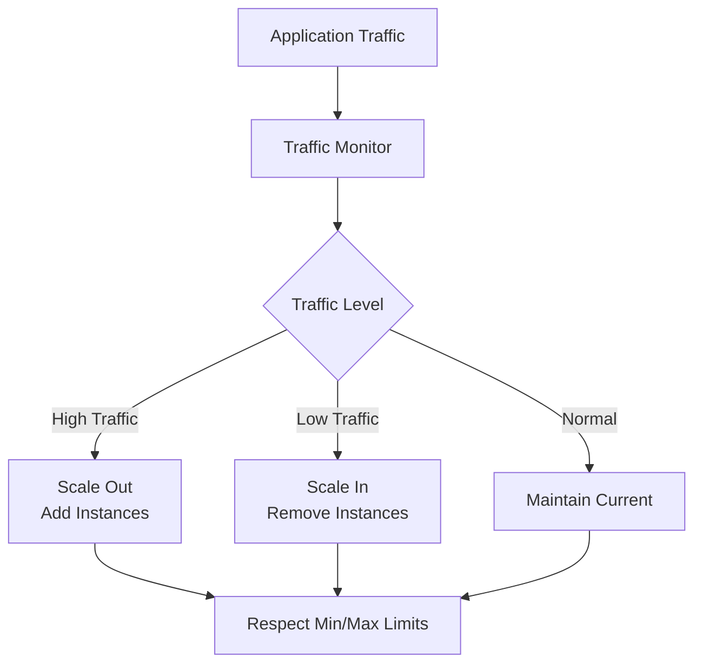

**Autoscaling Benefits:**
- **Cost Optimization**: Pay only for instances in use
- **Performance**: Automatically handle traffic spikes
- **Efficiency**: Scale down during low traffic periods
- **Flexibility**: Set minimum and maximum instance limits

## Create and Configure Application Gateway

You can create and configure Application Gateway using the Azure portal, Azure PowerShell, or the Azure CLI.

### Azure CLI Commands

**Create Application Gateway:**
```bash
az network application-gateway create \
  --name ag-main \
  --resource-group rg-main \
  --location eastus \
  --sku Standard_v2 \
  --capacity 2 \
  --vnet-name vnet-main \
  --subnet subnet-ag \
  --public-ip-address pip-ag
```

**Configure Components:**

- **HTTP Listener**: `az network application-gateway http-listener`
- **Routing Rule**: `az network application-gateway rule`
- **Backend Pool**: `az network application-gateway address-pool`
- **HTTP Settings**: `az network application-gateway http-settings`
- **Frontend Port**: `az network application-gateway front-end-port`

### Azure PowerShell Commands

**Create Application Gateway:**
```powershell
New-AzApplicationGateway `
  -Name ag-main `
  -ResourceGroupName rg-main `
  -Location eastus `
  -Sku Standard_v2 `
  -Capacity 2 `
  -VirtualNetworkName vnet-main `
  -SubnetName subnet-ag `
  -PublicIpAddressName pip-ag
```

**Configure Components:**

- **Get Operations**: `Get-AzApplicationGateway*` cmdlets
- **Set Operations**: `Set-AzApplicationGateway*` cmdlets

### Azure Portal

You can also use the Azure portal to perform most operations:
- Create Application Gateway through guided wizard
- Configure all components through UI
- Visual configuration and validation
- Real-time status and monitoring

## Routing Methods

There are two primary methods of routing traffic: path-based routing and multiple site hosting.

### Path-Based Routing

Path-based routing allows you to send requests with different paths in the URL to a different pool of back-end servers. For example, you could direct requests with the path `/video/*` to a back-end pool containing servers that are optimized to handle video streaming, and direct `/images/*` requests to a pool of servers that handle image retrieval.

**Path-Based Routing Architecture:**
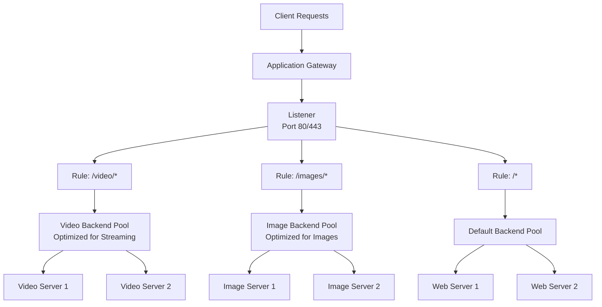

**Use Cases:**
- **Content-Type Routing**: Route different content types to specialized servers
- **Service Separation**: Separate microservices by URL path
- **Performance Optimization**: Route to servers optimized for specific workloads
- **Example**: `/api/*` to API servers, `/static/*` to static content servers

**Path-Based Routing Example:**
```
Request: https://example.com/video/movie.mp4
→ Routes to: Video Backend Pool

Request: https://example.com/images/photo.jpg
→ Routes to: Image Backend Pool

Request: https://example.com/page.html
→ Routes to: Default Backend Pool
```

### Multiple Site Hosting

Multiple site hosting allows you to configure more than one web application on the same application gateway instance. In a multisite configuration, you can register multiple DNS names (CNAMEs) for the IP address of the Application Gateway, specifying the name of each site. Application Gateway uses separate listeners to wait for requests for each site. Each listener passes the request to a different rule, which can route the requests to servers in a different back-end pool.

**Multiple Site Hosting Architecture:**
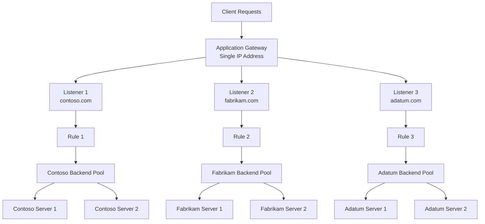

**Example Configuration:**
- `http://contoso.com` → Contoso Backend Pool
- `http://fabrikam.com` → Fabrikam Backend Pool
- `http://adatum.com` → Adatum Backend Pool

**Use Cases:**
- **Multi-Tenant Applications**: Each tenant has its own set of virtual machines or resources
- **Multiple Domains**: Host multiple websites on a single Application Gateway
- **Cost Optimization**: Share infrastructure across multiple applications
- **Unified Management**: Manage multiple sites from one gateway instance

**Multiple Site Hosting Benefits:**
- **Single IP Address**: All sites share the same Application Gateway IP
- **Separate Listeners**: Each site has its own listener configuration
- **Independent Routing**: Each site can route to different backend pools
- **Isolation**: Sites are logically separated while sharing infrastructure

## Other Routing Capabilities

Along with path-based routing and multiple site hosting, Application Gateway provides additional routing capabilities:

### Redirection

Redirection can be used to redirect traffic to another site, or from HTTP to HTTPS.

**Redirection Types:**
- **HTTP to HTTPS**: Automatically redirect insecure HTTP traffic to secure HTTPS
- **Site Redirection**: Redirect requests from one site to another
- **Path Redirection**: Redirect specific paths to different locations

**Redirection Architecture:**
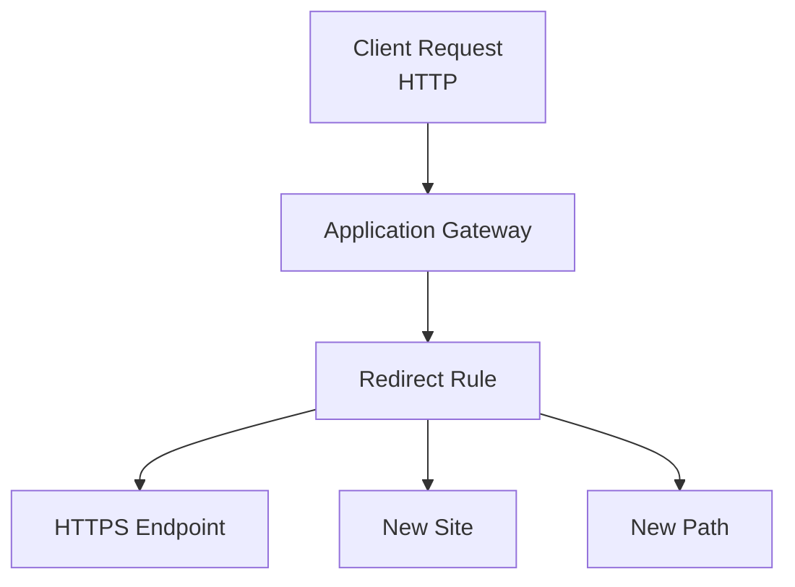

**Use Cases:**
- **Security**: Force HTTPS for all traffic
- **Migration**: Redirect old URLs to new locations
- **Canonical URLs**: Redirect www to non-www or vice versa

### Rewrite HTTP Headers

HTTP headers allow the client and server to pass additional information with the request or the response. Application Gateway can rewrite HTTP headers to add, remove, or modify header values.

**Header Rewrite Capabilities:**
- **Request Headers**: Modify headers before sending to backend
- **Response Headers**: Modify headers before sending to client
- **Add Headers**: Add custom headers for tracking or routing
- **Remove Headers**: Remove sensitive or unnecessary headers

**Use Cases:**
- **X-Forwarded-For**: Add client IP information
- **Custom Headers**: Add application-specific headers
- **Security Headers**: Add security-related headers
- **Routing Information**: Add headers for backend routing decisions

### Custom Error Pages

Application Gateway allows you to create custom error pages instead of displaying default error pages. You can use your own branding and layout using a custom error page.

**Custom Error Page Features:**
- **Branding**: Match your application's look and feel
- **User Experience**: Provide helpful error messages
- **Consistency**: Maintain consistent user experience
- **Error Codes**: Customize pages for different HTTP error codes

**Supported Error Codes:**
- 403 Forbidden
- 404 Not Found
- 500 Internal Server Error
- 502 Bad Gateway
- 503 Service Unavailable

## Load Balancing in Application Gateway

Application Gateway automatically load balances requests sent to the servers in each back-end pool using a round-robin mechanism. However, you can configure session stickiness if you need to ensure that all requests for a client in the same session are routed to the same server in a back-end pool.

**Load Balancing Architecture:**
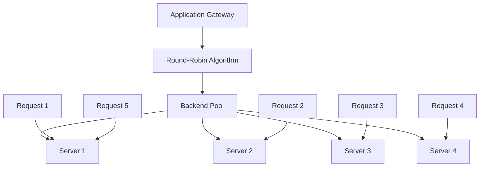

**Load Balancing Characteristics:**
- **Round-Robin**: Distributes requests evenly across available servers
- **Session Affinity**: Optional cookie-based session stickiness
- **Health-Aware**: Only routes to healthy backend servers
- **Automatic Failover**: Removes unhealthy servers from rotation

### OSI Layer 7 Load Balancing

Load-balancing works with the OSI Layer 7 routing that Application Gateway routing implements, which means that it load balances requests based on the routing parameters (host names and paths) the Application Gateway rules use. In comparison, other load balancers, such as Azure Load Balancer, function at the OSI Layer 4 level, and distribute traffic based on the IP address of the target of a request.

**OSI Layer Comparison:**
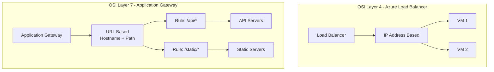

**Layer 7 Advantages:**
- **Content-Aware Routing**: Route based on URL content, not just IP
- **Intelligent Distribution**: Different paths can go to different pools
- **Application-Level Features**: SSL termination, header rewriting, URL rewriting
- **Better Resource Utilization**: Optimize server usage based on content type

### Application Gateway Features

Operating at OSI Layer 7 lets load balancing take advantage of the other features that Application Gateway provides. These features include:

**Protocol Support:**
- **HTTP**: Standard HTTP protocol support
- **HTTPS**: Secure HTTPS with SSL/TLS termination
- **HTTP/2**: Modern HTTP/2 protocol support
- **WebSocket**: Real-time bidirectional communication

**Security Features:**
- **Web Application Firewall (WAF)**: Protect against web application vulnerabilities
- **SSL/TLS Termination**: Offload SSL processing from backend servers
- **End-to-End Encryption**: Encrypt traffic from gateway to backend
- **DDoS Protection**: Built-in DDoS protection capabilities

**Scalability Features:**
- **Autoscaling**: Dynamically adjust capacity as web traffic load changes
- **Zone Redundancy**: Deploy across availability zones for high availability
- **Performance Optimization**: Optimize for different workload types

**Application Gateway Feature Overview:**
```mermaid
graph TB
    AG[Application Gateway] --> Protocols[Protocol Support]
    AG --> Security[Security Features]
    AG --> Scalability[Scalability Features]
    AG --> Routing[Advanced Routing]
    
    Protocols --> HTTP[HTTP]
    Protocols --> HTTPS[HTTPS]
    Protocols --> HTTP2[HTTP/2]
    Protocols --> WebSocket[WebSocket]
    
    Security --> WAF[Web Application Firewall]
    Security --> SSL[SSL/TLS Termination]
    Security --> E2E[End-to-End Encryption]
    Security --> DDoS[DDoS Protection]
    
    Scalability --> AutoScale[Autoscaling]
    Scalability --> Zones[Zone Redundancy]
    Scalability --> Performance[Performance Optimization]
    
    Routing --> PathBased[Path-Based Routing]
    Routing --> MultiSite[Multiple Site Hosting]
    Routing --> Redirection[Redirection]
    Routing --> Rewrite[Header Rewriting]
```

## Routing for the Motor-Vehicle Department

Revisiting our scenario at the motor-vehicle department, we can use Application Gateway to address both issues. We can use the load-balancing and health-probe capabilities to ensure that failures are handled without user impact. We can also use path-based routing to provide a single endpoint for users to access sites hosted across disparate web services.

**Motor-Vehicle Department Architecture:**
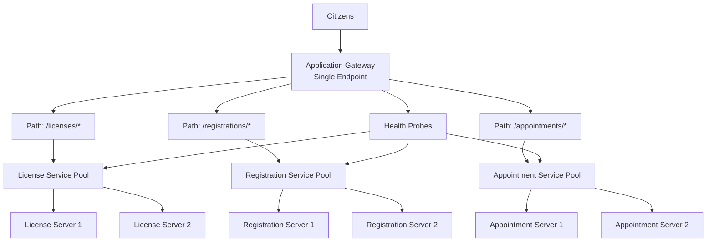

**Benefits:**
- **Single Endpoint**: Citizens access all services through one URL
- **High Availability**: Health probes ensure failures don't impact users
- **Service Separation**: Each service can scale independently
- **Unified Experience**: Consistent access pattern for all services

## Check Your Knowledge

### Question 1: Primary Function of Application Gateway

**What is the primary function of Azure Application Gateway?**

- ✅ **Correct**: The Application Gateway is primarily used as a load balancer and web traffic manager.

**Why:**
- Application Gateway provides Layer 7 (application layer) load balancing
- Manages and distributes web traffic across multiple backend servers
- Routes traffic based on URL content (hostname, path)
- Provides intelligent traffic management and routing capabilities
- Ensures high availability through health monitoring and automatic failover

**Key Functions:**
- **Load Balancing**: Distributes requests evenly across backend servers using round-robin
- **Traffic Management**: Routes traffic based on URL patterns and hostnames
- **Health Monitoring**: Continuously checks backend server health
- **SSL/TLS Termination**: Handles SSL/TLS encryption/decryption
- **Web Application Firewall**: Optional WAF protection against web vulnerabilities

### Question 2: Application Gateway Routing Type

**Which type of routing does the Azure Application Gateway provide?**

- ✅ **Correct**: Application, layer 7.

**Why:**
- Application Gateway operates at OSI Layer 7 (Application Layer)
- Routes traffic based on application-level information (URL, hostname, path)
- Provides content-aware routing, not just IP-based routing
- Enables intelligent routing decisions based on HTTP/HTTPS request content
- Supports advanced features like path-based routing and multiple site hosting

**Layer 7 Characteristics:**
- **Content-Aware**: Makes routing decisions based on URL content
- **Protocol Support**: HTTP, HTTPS, HTTP/2, WebSocket
- **Intelligent Routing**: Different paths can route to different backend pools
- **Application Features**: SSL termination, header rewriting, URL rewriting

**Comparison with Layer 4:**
- **Layer 4 (Transport)**: Routes based on IP address and port (used by Azure Load Balancer)
- **Layer 7 (Application)**: Routes based on URL, hostname, and path (used by Application Gateway)

### Question 3: Application Gateway Listeners

**What is a listener?**

- ✅ **Correct**: A listener is an entity that checks for incoming connection requests.

**Why:**
- Listeners are logical entities that monitor for incoming requests
- Check if incoming requests match specific criteria (protocol, port, hostname, IP address)
- Accept requests when all configured criteria match
- Act as the entry point after the front-end IP address
- At least one listener is required for Application Gateway to function

**Listener Functions:**
- **Request Validation**: Verifies that requests match listener configuration
- **Protocol Matching**: Checks if request uses correct protocol (HTTP/HTTPS)
- **Port Matching**: Validates that request arrives on correct port (80, 443, etc.)
- **Hostname Matching**: For multisite listeners, validates hostname
- **Request Routing**: Passes accepted requests to routing rules

**Listener Configuration:**
- **Protocol**: HTTP or HTTPS
- **Port**: Typically 80 (HTTP) or 443 (HTTPS)
- **Hostname**: Specific hostname or wildcard (*)
- **IP Address**: Frontend IP configuration
- **SSL Certificate**: Required for HTTPS listeners

### Question 4: Application Gateway Routing Criteria

**Which criteria does Application Gateway use to route requests to a web server?**

- ✅ **Correct**: The hostname, port, and path in the URL of the request.

**Why:**
- Application Gateway operates at OSI Layer 7 (application layer)
- Routing is based on URL components: hostname, port, and path
- This allows intelligent, content-aware routing
- Different paths can route to different backend pools
- Multiple hostnames can be hosted on the same gateway

- ❌ **Not correct**: The IP address of the web server that is the target of the request.
  - Application Gateway routes based on URL, not IP address
  - IP-based routing is Layer 4 (used by Azure Load Balancer)
  - Application Gateway provides more intelligent routing capabilities

- ❌ **Not correct**: The region in which the servers hosting the web application are located.
  - Region is not a routing criteria for Application Gateway
  - Backend servers can be in the same or different regions
  - Routing is based on URL content, not geographic location

### Question 2: Application Gateway Load Balancing Strategy

**Which load balancing strategy does Application Gateway implement?**

- ✅ **Correct**: Application Gateway follows a round-robin approach, distributing requests to each available server in a backend pool in turn.

**Why:**
- Application Gateway uses round-robin as the default load balancing algorithm
- Requests are distributed evenly across available healthy servers
- Each server receives requests in rotation
- Only healthy servers (as determined by health probes) receive traffic
- This ensures even distribution and optimal resource utilization

- ❌ **Not correct**: Application Gateway selects the server in the backend pool that currently has the lightest load.
  - Application Gateway does not use least-connections or load-based algorithms
  - It uses round-robin, which distributes requests sequentially
  - Load-based selection would require real-time load monitoring

- ❌ **Not correct**: Application Gateway polls each server in the backend pool in turn, and sends the request to the first server that responds.
  - This describes a different algorithm (not used by Application Gateway)
  - Application Gateway uses round-robin, not polling-based selection
  - Health probes determine server availability, but routing uses round-robin

## Key Features Summary

**Application Gateway provides:**
- **Layer 7 Load Balancing**: Content-aware routing based on URL
- **Path-Based Routing**: Route different paths to different backend pools
- **Multiple Site Hosting**: Host multiple websites on one gateway
- **Protocol Support**: HTTP, HTTPS, HTTP/2, and WebSocket
- **Security**: WAF, SSL termination, end-to-end encryption
- **Scalability**: Autoscaling and zone redundancy
- **Advanced Features**: Redirection, header rewriting, custom error pages

**Comparison: Application Gateway vs Azure Load Balancer**

| Feature | Application Gateway | Azure Load Balancer |
|---------|-------------------|---------------------|
| **OSI Layer** | Layer 7 (Application) | Layer 4 (Transport) |
| **Routing Basis** | URL (hostname, path) | IP address |
| **Protocols** | HTTP, HTTPS, HTTP/2, WebSocket | TCP, UDP |
| **SSL Termination** | Yes | No |
| **WAF** | Yes (optional) | No |
| **Path-Based Routing** | Yes | No |
| **Multiple Site Hosting** | Yes | No |
| **Use Case** | Web applications | General load balancing |

**Additional Resources:**
- [Application Gateway Quickstart](https://learn.microsoft.com/en-us/azure/application-gateway/quick-create-portal)
- [Application Gateway Tutorials](https://learn.microsoft.com/en-us/azure/application-gateway/tutorial-url-route-powershell)
- [Application Gateway Best Practices](https://learn.microsoft.com/en-us/azure/application-gateway/application-gateway-best-practices)
- [Application Gateway FAQ](https://learn.microsoft.com/en-us/azure/application-gateway/application-gateway-faq)

