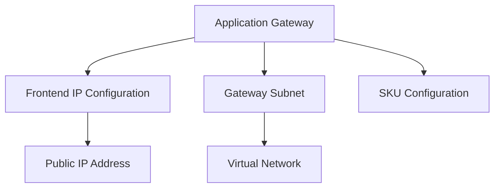

# Implementing Azure Application Gateway with Terraform

## Overview

Application Gateway is a web traffic load balancer that enables you to manage traffic to your web applications. It operates at OSI Layer 7 and provides application-level routing.

## Architecture



## Terraform Implementation

### Basic Application Gateway

```hcl
# Resource Group
resource "azurerm_resource_group" "ag" {
  name     = "rg-application-gateway"
  location = "eastus"
}

# Virtual Network
resource "azurerm_virtual_network" "main" {
  name                = "vnet-main"
  address_space       = ["10.0.0.0/16"]
  location            = "eastus"
  resource_group_name = azurerm_resource_group.ag.name
}

# Gateway Subnet (dedicated subnet for Application Gateway)
resource "azurerm_subnet" "ag" {
  name                 = "subnet-ag"
  resource_group_name  = azurerm_resource_group.ag.name
  virtual_network_name = azurerm_virtual_network.main.name
  address_prefixes     = ["10.0.1.0/24"]
}

# Public IP
resource "azurerm_public_ip" "ag" {
  name                = "pip-ag"
  location            = "eastus"
  resource_group_name = azurerm_resource_group.ag.name
  allocation_method   = "Static"
  sku                 = "Standard"
}

# Application Gateway
resource "azurerm_application_gateway" "main" {
  name                = "ag-main"
  location            = "eastus"
  resource_group_name = azurerm_resource_group.ag.name

  sku {
    name     = "Standard_v2"
    tier     = "Standard_v2"
    capacity = 2
  }

  gateway_ip_configuration {
    name      = "appGatewayIpConfig"
    subnet_id = azurerm_subnet.ag.id
  }

  frontend_port {
    name = "http"
    port = 80
  }

  frontend_ip_configuration {
    name                 = "appGatewayFrontendIP"
    public_ip_address_id = azurerm_public_ip.ag.id
  }

  backend_address_pool {
    name = "backendPool"
  }

  backend_http_settings {
    name                  = "httpSettings"
    cookie_based_affinity = "Disabled"
    port                  = 80
    protocol              = "Http"
    request_timeout       = 20
  }

  http_listener {
    name                           = "listener"
    frontend_ip_configuration_name = "appGatewayFrontendIP"
    frontend_port_name             = "http"
    protocol                       = "Http"
  }

  request_routing_rule {
    name                       = "rule"
    rule_type                  = "Basic"
    http_listener_name         = "listener"
    backend_address_pool_name   = "backendPool"
    backend_http_settings_name  = "httpSettings"
  }
}
```

### Application Gateway with WAF

```hcl
resource "azurerm_application_gateway" "waf" {
  name                = "ag-waf"
  location            = "eastus"
  resource_group_name = azurerm_resource_group.ag.name

  sku {
    name     = "WAF_v2"
    tier     = "WAF_v2"
    capacity = 2
  }

  waf_configuration {
    enabled          = true
    firewall_mode    = "Detection"
    rule_set_type    = "OWASP"
    rule_set_version = "3.2"
  }

  # ... other configuration ...
}
```

## Key Configuration Parameters

| Parameter | Description | Required | Example |
|-----------|-------------|----------|---------|
| `name` | Application Gateway name | Yes | `ag-main` |
| `location` | Azure region | Yes | `eastus` |
| `resource_group_name` | Resource group | Yes | Resource group name |
| `sku.name` | SKU name | Yes | `Standard_v2` or `WAF_v2` |
| `sku.tier` | SKU tier | Yes | `Standard_v2` or `WAF_v2` |
| `sku.capacity` | Instance count (manual) | No | `1-125` (for manual scaling) |
| `autoscale_configuration` | Autoscaling config | No | Min/max instances |

## SKU Options

**Standard_v2:**
- Autoscaling support
- Zone redundancy
- Performance improvements
- Recommended for production
- Manual or automatic scaling

**WAF_v2:**
- All Standard_v2 features
- Web Application Firewall
- OWASP rule sets (CRS 2.2.9 or CRS 3.0)
- Recommended for web applications
- Threat protection

## Network Requirements

**Subnet Configuration:**
- Application Gateway requires a dedicated subnet
- Subnet size depends on scaling requirements:
  - `/28`: Up to 4 instances
  - `/27`: Up to 8 instances
  - `/26`: Up to 16 instances
- Gateway uses private IPs for internal communication

```hcl
# Dedicated subnet for Application Gateway
resource "azurerm_subnet" "ag" {
  name                 = "subnet-ag"
  resource_group_name  = azurerm_resource_group.main.name
  virtual_network_name = azurerm_virtual_network.main.name
  address_prefixes     = ["10.0.1.0/24"]  # /24 for flexibility
}
```

## Frontend IP Configuration

**Public IP Address:**
```hcl
resource "azurerm_public_ip" "ag" {
  name                = "pip-ag"
  location            = "eastus"
  resource_group_name = azurerm_resource_group.main.name
  allocation_method   = "Static"
  sku                 = "Standard"
}

frontend_ip_configuration {
  name                 = "appGatewayFrontendIP"
  public_ip_address_id = azurerm_public_ip.ag.id
}
```

**Private IP Address:**
```hcl
frontend_ip_configuration {
  name                          = "appGatewayFrontendIP"
  private_ip_address_allocation = "Static"
  private_ip_address            = "10.0.1.10"
  subnet_id                     = azurerm_subnet.ag.id
}
```

**Both Public and Private:**
```hcl
# Public frontend
frontend_ip_configuration {
  name                 = "publicFrontend"
  public_ip_address_id = azurerm_public_ip.ag.id
}

# Private frontend
frontend_ip_configuration {
  name                          = "privateFrontend"
  private_ip_address_allocation = "Static"
  private_ip_address            = "10.0.1.10"
  subnet_id                     = azurerm_subnet.ag.id
}
```

## Best Practices

1. **Dedicated Subnet**: Use dedicated subnet for Application Gateway
2. **Subnet Size**: Use /24 or larger for gateway subnet
3. **Public IP**: Use Standard SKU public IP
4. **WAF**: Enable WAF for web applications
5. **HTTPS**: Configure HTTPS listeners with certificates

## Outputs

```hcl
output "application_gateway_id" {
  value       = azurerm_application_gateway.main.id
  description = "Application Gateway resource ID"
}

output "application_gateway_public_ip" {
  value       = azurerm_public_ip.ag.ip_address
  description = "Application Gateway public IP address"
}
```

## Next Steps

After creating Application Gateway:
1. Configure backend pools (see [02-backend-pools.md](./02-backend-pools.md))
2. Set up listeners and rules (see [03-listeners-and-rules.md](./03-listeners-and-rules.md))
3. Configure multiple site hosting (see [04-multiple-site-hosting.md](./04-multiple-site-hosting.md))

## Additional Resources

- [Application Gateway Overview](https://learn.microsoft.com/en-us/azure/application-gateway/overview)
- [Terraform azurerm_application_gateway](https://registry.terraform.io/providers/hashicorp/azurerm/latest/docs/resources/application_gateway)

