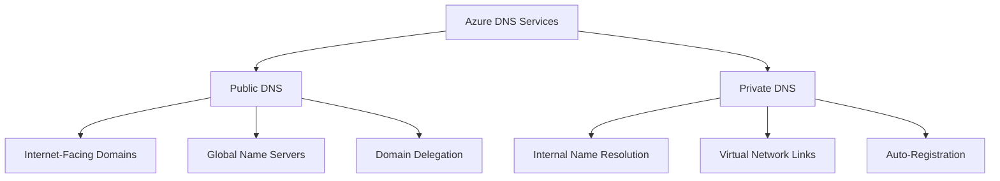
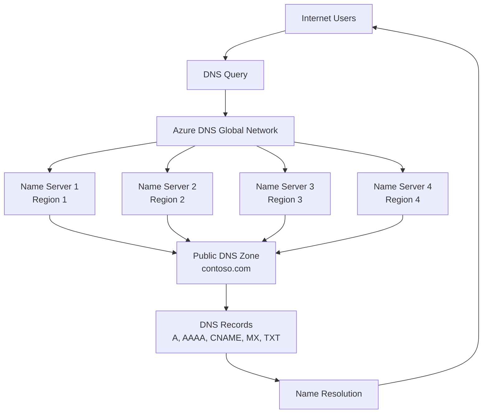
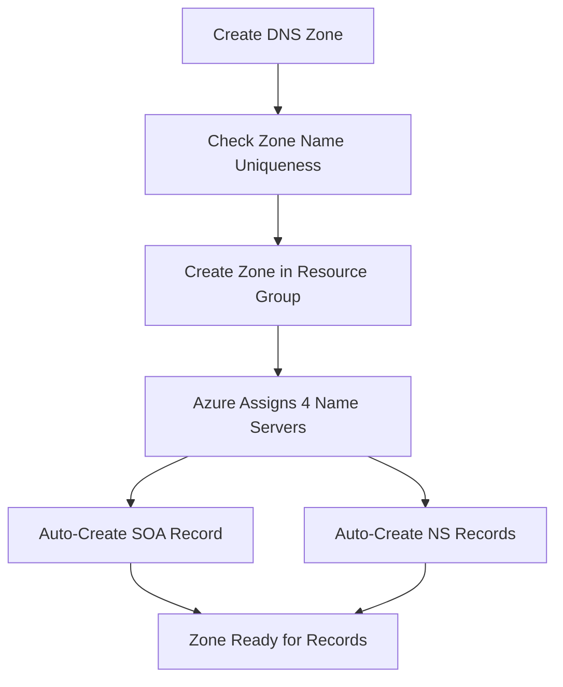
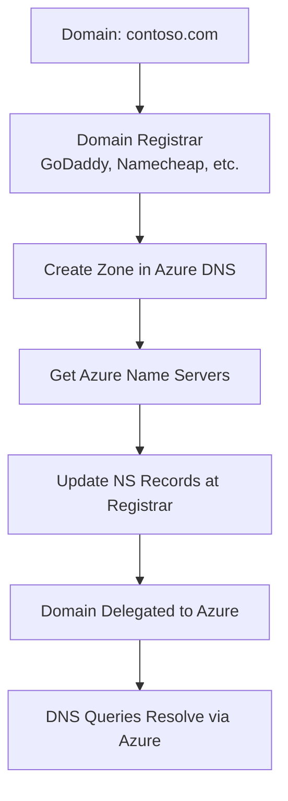
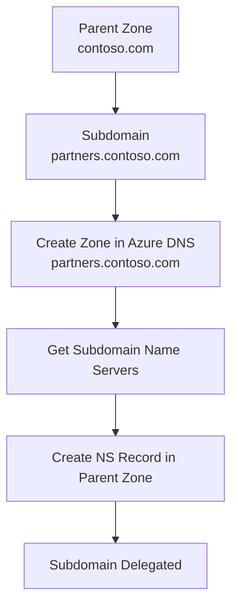
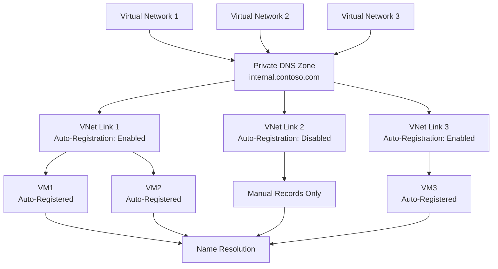
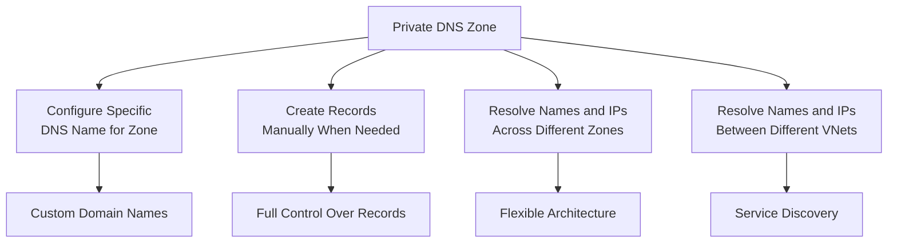
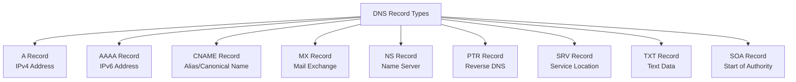
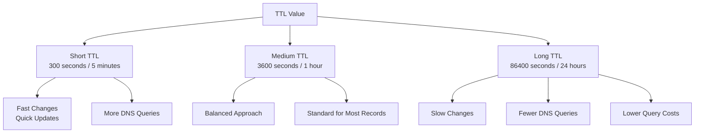

# Azure DNS

## Overview

Azure provides both public and private DNS services to enable name resolution for your Azure resources and applications. Azure DNS is a hosting service for DNS domains that provides name resolution using Microsoft Azure's infrastructure. DNS domains in Azure DNS are hosted on Azure's global network of DNS name servers, ensuring high availability and fast resolution times.

**Key Benefits:**
- **High Availability**: 99.99% SLA with global distribution
- **Fast Resolution**: Queries are routed to the nearest available DNS server
- **Secure and Reliable**: Managed DNS service without custom DNS solutions
- **Easy Management**: Simple configuration and management through Azure Portal, CLI, or Terraform
- **Cost-Effective**: Pay only for the DNS zones and queries you use

**Learn more:**
- [Azure DNS Overview](https://learn.microsoft.com/en-us/azure/dns/dns-overview)
- [Azure DNS Documentation](https://learn.microsoft.com/en-us/azure/dns/)
- [Private DNS Zones](https://learn.microsoft.com/en-us/azure/dns/private-dns-overview)

**Azure DNS Service Types:**


## Public DNS Services

Azure Public DNS is a hosting service for DNS domains that provides name resolution using Microsoft Azure's infrastructure. DNS domains in Azure DNS are hosted on Azure's global network of DNS name servers. Each DNS query is routed to the nearest available DNS server. Azure DNS provides a secure and reliable DNS service for managing and resolving domain names of a virtual network without needing to add a custom DNS solution.

**Public DNS Zone Architecture:**


**Key Features:**
- **Global Distribution**: DNS zones are replicated across Azure's global network
- **High Performance**: Low latency DNS resolution worldwide
- **Standard DNS Records**: Support for all standard DNS record types (A, AAAA, CNAME, MX, NS, PTR, SRV, TXT, SOA)
- **Automatic SOA and NS Records**: Azure automatically creates SOA and NS records when a zone is created
- **Domain Delegation**: Easy delegation from parent domains

### Configuration Considerations

When creating public DNS zones in Azure, consider the following:

**Zone Name Requirements:**
- The DNS zone name must be unique within the resource group
- The zone must not already exist in Azure
- The same zone name can be reused in another resource group or another Azure subscription
- When multiple zones share the same name, each instance is assigned different name server addresses

**Zone Creation Process:**


**Important Notes:**
- The root or primary zone is registered with the domain registrar and points to Azure DNS name servers (NS records)
- Azure DNS is not a domain registrar - you must register your domain with a third-party registrar
- After creating the zone, you must delegate your domain to Azure DNS at your registrar

## DNS Domain Delegation

Azure DNS allows you to host a DNS zone and manage DNS records for a domain in Azure. For DNS queries for a domain to reach Azure DNS, the domain must be delegated to Azure DNS from the parent domain. Note that Azure DNS is not a domain registrar.

**Domain Delegation Process:**


**Delegation Steps:**

1. **Create DNS Zone**: Create the DNS zone in Azure DNS
2. **Get Name Servers**: Azure DNS assigns name servers from a pool when a DNS zone is created
3. **Update Registrar**: Update the parent domain at your registrar with Azure DNS name servers
4. **Wait for Propagation**: DNS changes can take up to 48 hours to propagate globally

**Important:**
- When delegating a domain to Azure DNS, you must use the name server names provided by Azure DNS
- Always use all four name server names, regardless of your domain name
- Do not use name servers from other zones or create custom name servers

**Delegation Example:**
```
Domain: contoso.com
Azure Name Servers:
- ns1-01.azure-dns.com
- ns2-01.azure-dns.net
- ns3-01.azure-dns.org
- ns4-01.azure-dns.info

At Registrar (GoDaddy, Namecheap, etc.):
Update NS records to point to the four Azure name servers above
```

### Secondary Domains (Subdomains)

If you want to configure an independent secondary zone, you can delegate a subdomain in Azure DNS. For example, after configuring `contoso.com` in Azure DNS, you could configure an independent secondary zone for `partners.contoso.com`.

**Subdomain Delegation:**


**Configuration Process:**

The configuration of a subdomain follows the same process as typical delegation. The only difference is that the NS records must be created in the parent zone `contoso.com` in Azure DNS, rather than at a domain registrar.

**Example:**
- Parent zone: `contoso.com` (hosted in Azure DNS)
- Subdomain zone: `partners.contoso.com` (new zone in Azure DNS)
- Create NS record in `contoso.com` pointing to `partners.contoso.com` name servers

**Note:**
- Parent and child zones can be in the same resource group or different resource groups
- Parent and child zones can be in the same subscription or different subscriptions
- The NS record in the parent zone enables subdomain resolution

## Private DNS Services

Private DNS services provide a reliable and secure DNS service for virtual networks. Azure Private DNS manages and resolves domain names in the virtual network without needing to configure a custom DNS solution. By using private DNS zones, you can use your custom domain name instead of the names provided by Azure during deployment. Using custom domain names makes it easier to adapt your virtual network architecture to your organization's needs. It provides name resolution for virtual machines within a virtual network and connected virtual networks.

**Private DNS Architecture:**


**Key Benefits:**
- **Eliminates Custom DNS**: No need to create custom DNS solutions
- **Hosts Custom Records**: Hosts custom DNS records, including hostname records
- **Cross-VNet Resolution**: Provides hostname resolution between virtual networks
- **Zone Sharing**: Private DNS zones can be shared between virtual networks, simplifying service discovery and cross-network scenarios like virtual network peering
- **Global Availability**: Azure DNS private zones feature is available in all Azure regions in the Azure public cloud

### Considerations

**Private DNS Zone Characteristics:**
- **Internal Only**: Azure private DNS zones are only available for internal resources
- **Global Scope**: Globally scoped, so you can access them from any region, subscription, VNet, and tenant
- **Permission-Based**: If you have permission to read the zone, you can use it for name resolution
- **Highly Resilient**: Private DNS zones are highly resilient and replicated across regions worldwide
- **Not Internet-Accessible**: Not available for Internet resources

**Use Cases:**
- Internal service discovery
- Custom domain names for internal applications
- Cross-VNet name resolution
- Simplified network architecture

### Azure Private DNS Zones

In scenarios that require more flexibility than internal DNS, you can create your own private DNS zones. These zones allow you to:

**Private DNS Zone Capabilities:**


**Key Features:**
1. **Configure Specific DNS Name**: Set a custom DNS name for a zone (e.g., `internal.contoso.com`)
2. **Manual Record Creation**: Create records manually when necessary
3. **Multi-Zone Resolution**: Resolve names and IP addresses across different zones
4. **Cross-VNet Resolution**: Resolve names and IP addresses between different virtual networks

**Virtual Network Links:**
- Private DNS zones require virtual network links to enable name resolution
- Each link can have auto-registration enabled or disabled
- When auto-registration is enabled, VMs automatically register their hostnames
- When auto-registration is disabled, all records must be created manually
- One private DNS zone can link to multiple virtual networks

## DNS Record Types

Azure DNS supports all standard DNS record types. Understanding each record type is essential for proper DNS configuration.

**DNS Record Types Overview:**


### A Records (Address Records)

A records map hostnames to IPv4 addresses. They are the most common DNS record type.

**Characteristics:**
- Maps domain name to IPv4 address (e.g., `www.contoso.com -> 20.1.1.1`)
- Supports multiple IP addresses for load balancing and redundancy
- TTL (Time To Live) controls how long resolvers cache the record

**Example:**
```
www.contoso.com    A    3600    20.1.1.1
www.contoso.com    A    3600    20.1.1.2
```

### AAAA Records (IPv6 Address Records)

AAAA records map hostnames to IPv6 addresses.

**Characteristics:**
- Maps domain name to IPv6 address
- Used for IPv6-enabled services and applications
- Same structure as A records but for IPv6

**Example:**
```
www.contoso.com    AAAA    3600    2001:0db8:85a3:0000:0000:8a2e:0370:7334
```

### CNAME Records (Canonical Name)

CNAME records create an alias from one domain name to another.

**Characteristics:**
- Creates an alias from one domain name to another
- Cannot create CNAME at root domain (@)
- Cannot create other record types with the same name as a CNAME
- CNAME must point to a fully qualified domain name (FQDN)

**Example:**
```
www-alias.contoso.com    CNAME    3600    www.contoso.com
```

### MX Records (Mail Exchange)

MX records specify mail servers responsible for accepting email for the domain.

**Characteristics:**
- Each MX record includes a preference (priority) and exchange (mail server)
- Lower preference numbers have higher priority
- Multiple MX records allow mail server redundancy

**Example:**
```
contoso.com    MX    10    mail1.contoso.com
contoso.com    MX    20    mail2.contoso.com
```

### NS Records (Name Server)

NS records specify authoritative name servers for the domain.

**Characteristics:**
- Automatically created by Azure when a DNS zone is created
- Used for subdomain delegation
- Points to authoritative name servers for the zone

**Example:**
```
contoso.com    NS    ns1-01.azure-dns.com
contoso.com    NS    ns2-01.azure-dns.net
contoso.com    NS    ns3-01.azure-dns.org
contoso.com    NS    ns4-01.azure-dns.info
```

### TXT Records (Text Records)

TXT records store text information, commonly used for email authentication and domain verification.

**Common Uses:**
- **SPF (Sender Policy Framework)**: Email authentication
- **DKIM (DomainKeys Identified Mail)**: Email signing
- **DMARC (Domain-based Message Authentication)**: Email policy
- **Domain Verification**: Verification codes for various services

**Example:**
```
contoso.com    TXT    3600    "v=spf1 include:spf.contoso.com -all"
_dmarc.contoso.com    TXT    3600    "v=DMARC1; p=reject; rua=mailto:dmarc@contoso.com"
```

### SOA Records (Start of Authority)

SOA records contain authoritative information about the DNS zone.

**Characteristics:**
- Automatically created by Azure when a DNS zone is created
- Cannot be manually created or modified through Terraform
- Contains zone metadata (primary name server, responsible person, serial number, refresh/retry/expire intervals, minimum TTL)

### PTR Records (Pointer Records)

PTR records map IP addresses to domain names (reverse DNS).

**Characteristics:**
- Used for reverse DNS lookups
- Requires a reverse DNS zone (e.g., `1.1.1.in-addr.arpa`)
- Commonly used for email server verification

### SRV Records (Service Records)

SRV records specify services available in the domain.

**Characteristics:**
- Includes priority, weight, port, and target
- Used for service discovery (e.g., SIP, LDAP, XMPP)

**Example:**
```
_sip._tcp.contoso.com    SRV    10    60    5060    sipserver.contoso.com
```

## Time To Live (TTL)

TTL (Time To Live) is a critical DNS parameter that controls how long DNS resolvers cache DNS records.

**TTL Considerations:**


**TTL Best Practices:**
- **Dynamic Records**: Use short TTL (300-600 seconds) for records that change frequently
- **Static Records**: Use longer TTL (3600-86400 seconds) for stable records
- **Cost Consideration**: Shorter TTLs result in more DNS queries and higher costs
- **Change Management**: Reduce TTL before making DNS changes to speed up propagation

## Terraform Configuration

### Creating Public DNS Zones

**Basic Public DNS Zone:**
```hcl
resource "azurerm_dns_zone" "public" {
  name                = "contoso.com"
  resource_group_name = azurerm_resource_group.main.name
}
```

**Public DNS Zone with Tags:**
```hcl
resource "azurerm_dns_zone" "public" {
  name                = "contoso.com"
  resource_group_name = azurerm_resource_group.main.name
  
  tags = {
    Environment = "Production"
    Project     = "Web Application"
  }
}
```

### Creating Private DNS Zones

**Basic Private DNS Zone:**
```hcl
resource "azurerm_private_dns_zone" "private" {
  name                = "internal.contoso.com"
  resource_group_name = azurerm_resource_group.main.name
}
```

**Private DNS Zone with VNet Link:**
```hcl
resource "azurerm_private_dns_zone" "private" {
  name                = "internal.contoso.com"
  resource_group_name = azurerm_resource_group.main.name
}

resource "azurerm_private_dns_zone_virtual_network_link" "main" {
  name                  = "vnet-link"
  resource_group_name   = azurerm_resource_group.main.name
  private_dns_zone_name = azurerm_private_dns_zone.private.name
  virtual_network_id    = azurerm_virtual_network.main.id
  registration_enabled  = true  # Auto-register VMs
}
```

### Creating DNS Records

**A Record:**
```hcl
resource "azurerm_dns_a_record" "www" {
  name                = "www"
  zone_name           = azurerm_dns_zone.public.name
  resource_group_name = azurerm_resource_group.main.name
  ttl                 = 3600
  records             = ["20.1.1.1", "20.1.1.2"]
}
```

**CNAME Record:**
```hcl
resource "azurerm_dns_cname_record" "alias" {
  name                = "www-alias"
  zone_name           = azurerm_dns_zone.public.name
  resource_group_name = azurerm_resource_group.main.name
  ttl                 = 3600
  record              = "www.contoso.com"
}
```

**MX Record:**
```hcl
resource "azurerm_dns_mx_record" "mail" {
  name                = "@"
  zone_name           = azurerm_dns_zone.public.name
  resource_group_name = azurerm_resource_group.main.name
  ttl                 = 3600
  
  record {
    preference = 10
    exchange   = "mail1.contoso.com"
  }
  
  record {
    preference = 20
    exchange   = "mail2.contoso.com"
  }
}
```

**TXT Record:**
```hcl
resource "azurerm_dns_txt_record" "spf" {
  name                = "@"
  zone_name           = azurerm_dns_zone.public.name
  resource_group_name = azurerm_resource_group.main.name
  ttl                 = 3600
  
  record {
    value = "v=spf1 include:spf.contoso.com -all"
  }
}
```

### Using the DNS Module

**Complete Example with Module:**
```hcl
module "dns" {
  source = "../../modules/dns"
  
  create_resource_group = true
  project_name         = "webapp"
  application_name     = "contoso"
  environment          = "prod"
  location             = "West Europe"
  
  dns_zones = {
    "contoso.com" = {
      zone_type = "Public"
      tags = {
        Environment = "Production"
      }
    }
    "internal.contoso.com" = {
      zone_type = "Private"
      tags = {
        Environment = "Production"
      }
    }
  }
  
  dns_records = {
    "contoso.com/www" = {
      zone_name = "contoso.com"
      name      = "www"
      type      = "A"
      ttl       = 3600
      records   = ["20.1.1.1", "20.1.1.2"]
    }
    "contoso.com/mail" = {
      zone_name = "contoso.com"
      name      = "@"
      type      = "MX"
      ttl       = 3600
      records   = ["10 mail1.contoso.com", "20 mail2.contoso.com"]
    }
    "internal.contoso.com/app1" = {
      zone_name = "internal.contoso.com"
      name      = "app1"
      type      = "A"
      ttl       = 300
      records   = ["10.0.1.10"]
    }
  }
  
  private_dns_zone_virtual_network_links = {
    "internal.contoso.com/vnet-link" = {
      zone_name           = "internal.contoso.com"
      virtual_network_id  = azurerm_virtual_network.main.id
      registration_enabled = true
    }
  }
  
  tags = {
    ManagedBy = "Terraform"
  }
}
```

## Best Practices

### DNS Zone Planning

1. **Zone Naming**: Use descriptive zone names that reflect the purpose (e.g., `internal.contoso.com` for private zones)
2. **Resource Group Organization**: Group related DNS zones in the same resource group
3. **Tagging Strategy**: Use consistent tags for cost management and organization
4. **Zone Separation**: Separate public and private zones for better security

### Record Management

1. **TTL Strategy**: Use appropriate TTL values based on record change frequency
2. **Record Naming**: Use consistent naming conventions for records
3. **Multiple IPs**: Use multiple A records for high availability and load distribution
4. **CNAME Limitations**: Avoid CNAME at root domain; use A records instead

### Private DNS Zones

1. **Auto-Registration**: Enable auto-registration for VMs when appropriate
2. **VNet Links**: Link only necessary virtual networks to private zones
3. **Zone Sharing**: Share private zones across VNets for service discovery
4. **Manual Records**: Create manual records for non-VM resources (load balancers, application gateways, etc.)

### Security Considerations

1. **Access Control**: Use Azure RBAC to control access to DNS zones
2. **Private Zones**: Use private DNS zones for internal resources
3. **Record Validation**: Validate DNS records before deployment
4. **Monitoring**: Monitor DNS query patterns for anomalies

### Performance Optimization

1. **TTL Optimization**: Balance TTL values between change flexibility and query costs
2. **Record Caching**: Understand how TTL affects DNS caching
3. **Zone Distribution**: Leverage Azure's global DNS infrastructure
4. **Query Monitoring**: Monitor DNS query volumes and patterns

## Common Scenarios

### Scenario 1: Public Website with Multiple IPs

**Requirement**: Host a public website with multiple backend servers for load balancing.

**Solution**:
```hcl
resource "azurerm_dns_a_record" "www" {
  name                = "www"
  zone_name           = azurerm_dns_zone.public.name
  resource_group_name = azurerm_resource_group.main.name
  ttl                 = 300
  records             = ["20.1.1.1", "20.1.1.2", "20.1.1.3"]
}
```

### Scenario 2: Internal Service Discovery

**Requirement**: Enable service discovery across multiple virtual networks.

**Solution**:
```hcl
resource "azurerm_private_dns_zone" "internal" {
  name                = "internal.contoso.com"
  resource_group_name = azurerm_resource_group.main.name
}

resource "azurerm_private_dns_zone_virtual_network_link" "vnet1" {
  name                  = "vnet1-link"
  resource_group_name   = azurerm_resource_group.main.name
  private_dns_zone_name = azurerm_private_dns_zone.internal.name
  virtual_network_id    = azurerm_virtual_network.vnet1.id
  registration_enabled  = true
}

resource "azurerm_private_dns_zone_virtual_network_link" "vnet2" {
  name                  = "vnet2-link"
  resource_group_name   = azurerm_resource_group.main.name
  private_dns_zone_name = azurerm_private_dns_zone.internal.name
  virtual_network_id    = azurerm_virtual_network.vnet2.id
  registration_enabled  = true
}
```

### Scenario 3: Email Domain Configuration

**Requirement**: Configure email services with SPF, DKIM, and DMARC.

**Solution**:
```hcl
resource "azurerm_dns_mx_record" "mail" {
  name                = "@"
  zone_name           = azurerm_dns_zone.public.name
  resource_group_name = azurerm_resource_group.main.name
  ttl                 = 3600
  
  record {
    preference = 10
    exchange   = "mail.contoso.com"
  }
}

resource "azurerm_dns_txt_record" "spf" {
  name                = "@"
  zone_name           = azurerm_dns_zone.public.name
  resource_group_name = azurerm_resource_group.main.name
  ttl                 = 3600
  
  record {
    value = "v=spf1 include:spf.contoso.com -all"
  }
}

resource "azurerm_dns_txt_record" "dmarc" {
  name                = "_dmarc"
  zone_name           = azurerm_dns_zone.public.name
  resource_group_name = azurerm_resource_group.main.name
  ttl                 = 3600
  
  record {
    value = "v=DMARC1; p=reject; rua=mailto:dmarc@contoso.com"
  }
}
```

## Summary

Azure DNS provides comprehensive DNS hosting services for both public and private scenarios:

**Public DNS:**
- Global DNS hosting with high availability
- Support for all standard DNS record types
- Easy domain delegation
- Subdomain support

**Private DNS:**
- Internal name resolution for virtual networks
- Auto-registration of VM hostnames
- Cross-VNet name resolution
- Custom domain names for internal services

**Key Takeaways:**
- Azure DNS provides 99.99% SLA with global distribution
- Public zones require domain delegation at the registrar
- Private zones require virtual network links for name resolution
- Auto-registration simplifies VM hostname management
- TTL values impact both performance and change propagation speed

**Additional Resources:**
- [Azure DNS Quickstart](https://learn.microsoft.com/en-us/azure/dns/dns-getstarted-portal)
- [Private DNS Zones](https://learn.microsoft.com/en-us/azure/dns/private-dns-overview)
- [DNS Record Types](https://learn.microsoft.com/en-us/azure/dns/dns-zones-records)
- [DNS Best Practices](https://learn.microsoft.com/en-us/azure/dns/dns-best-practices)

