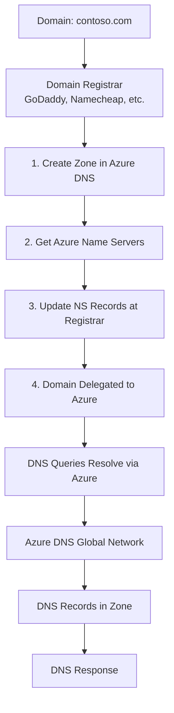

# DNS Domain Delegation

## Overview

Domain delegation is the process of pointing your domain's name servers to Azure DNS. After creating a DNS zone in Azure, you must delegate your domain from your domain registrar to Azure DNS for DNS queries to reach Azure.

**Important**: Azure DNS is not a domain registrar. You must register your domain with a third-party registrar (e.g., GoDaddy, Namecheap, Google Domains) and then delegate it to Azure DNS.

## Delegation Process

### Step 1: Create DNS Zone in Azure

```hcl
resource "azurerm_dns_zone" "public" {
  name                = "contoso.com"
  resource_group_name = azurerm_resource_group.main.name
}
```

### Step 2: Get Azure Name Servers

Azure automatically assigns 4 name servers when a DNS zone is created. These are available as an output.

```hcl
output "name_servers" {
  description = "Name servers for domain delegation"
  value       = azurerm_dns_zone.public.name_servers
}
```

**Example Output:**
```
name_servers = [
  "ns1-01.azure-dns.com",
  "ns2-01.azure-dns.net",
  "ns3-01.azure-dns.org",
  "ns4-01.azure-dns.info"
]
```

### Step 3: Update NS Records at Registrar

Update the NS records at your domain registrar to point to Azure's name servers.

**Important**: Always use all four name servers provided by Azure DNS, regardless of your domain name.

## Delegation Architecture



## Complete Delegation Example

### Terraform Configuration

```hcl
# Resource Group
resource "azurerm_resource_group" "dns" {
  name     = "rg-dns-contoso"
  location = "West Europe"
}

# DNS Zone
resource "azurerm_dns_zone" "public" {
  name                = "contoso.com"
  resource_group_name = azurerm_resource_group.dns.name

  tags = {
    Environment = "Production"
    Domain      = "contoso.com"
  }
}

# Output Name Servers for Manual Configuration at Registrar
output "name_servers" {
  description = <<-EOT
    Name servers to configure at domain registrar.
    Update NS records at your registrar to point to these name servers.
    Always use all four name servers.
  EOT
  value       = azurerm_dns_zone.public.name_servers
}

# Output Zone ID
output "zone_id" {
  description = "DNS zone resource ID"
  value       = azurerm_dns_zone.public.id
}
```

### Manual Steps at Registrar

After running Terraform, manually update NS records at your registrar:

1. Log in to your domain registrar (GoDaddy, Namecheap, etc.)
2. Navigate to DNS management for your domain
3. Find the NS (Name Server) records
4. Replace existing NS records with the four Azure name servers from the Terraform output
5. Save changes

**Example NS Records to Add:**
```
ns1-01.azure-dns.com
ns2-01.azure-dns.net
ns3-01.azure-dns.org
ns4-01.azure-dns.info
```

## Subdomain Delegation

You can delegate subdomains to separate Azure DNS zones. This is useful for managing different parts of your domain independently.

### Parent Zone Configuration

```hcl
# Parent Zone
resource "azurerm_dns_zone" "parent" {
  name                = "contoso.com"
  resource_group_name = azurerm_resource_group.main.name
}
```

### Subdomain Zone Configuration

```hcl
# Subdomain Zone
resource "azurerm_dns_zone" "subdomain" {
  name                = "partners.contoso.com"
  resource_group_name = azurerm_resource_group.main.name
}
```

### NS Record in Parent Zone

Create an NS record in the parent zone pointing to the subdomain's name servers.

```hcl
# Get subdomain name servers
data "azurerm_dns_zone" "subdomain" {
  name                = "partners.contoso.com"
  resource_group_name = azurerm_resource_group.main.name
}

# NS Record in parent zone for subdomain delegation
resource "azurerm_dns_ns_record" "subdomain" {
  name                = "partners"
  zone_name           = azurerm_dns_zone.parent.name
  resource_group_name = azurerm_resource_group.main.name
  ttl                 = 3600
  records             = data.azurerm_dns_zone.subdomain.name_servers
}
```

### Complete Subdomain Delegation Example

```hcl
# Parent Zone
resource "azurerm_dns_zone" "parent" {
  name                = "contoso.com"
  resource_group_name = azurerm_resource_group.main.name
}

# Subdomain Zone
resource "azurerm_dns_zone" "subdomain" {
  name                = "partners.contoso.com"
  resource_group_name = azurerm_resource_group.main.name
}

# NS Record for Subdomain Delegation
resource "azurerm_dns_ns_record" "subdomain" {
  name                = "partners"
  zone_name           = azurerm_dns_zone.parent.name
  resource_group_name = azurerm_resource_group.main.name
  ttl                 = 3600
  records             = azurerm_dns_zone.subdomain.name_servers
}
```

## Delegation Verification

### Check Delegation Status

After updating NS records at your registrar, verify delegation is working:

```bash
# Check NS records
dig NS contoso.com

# Check name server response
dig @ns1-01.azure-dns.com contoso.com

# Check specific record
dig www.contoso.com
```

### Using Azure CLI

```bash
# List DNS zones
az network dns zone list --resource-group rg-dns-contoso

# Show zone details including name servers
az network dns zone show \
  --resource-group rg-dns-contoso \
  --name contoso.com
```

## Delegation Considerations

### Zone Name Uniqueness

- The DNS zone name must be unique within the resource group
- The same zone name can exist in different resource groups or subscriptions
- When multiple zones share the same name, each gets different name server addresses

### Name Server Assignment

- Azure automatically assigns 4 name servers when a zone is created
- Name servers are assigned from Azure's global pool
- Name servers are stable and don't change unless the zone is deleted and recreated

### Propagation Time

- DNS changes can take up to 48 hours to propagate globally
- TTL values affect how quickly changes are seen
- Use shorter TTL values before making changes to speed up propagation

## Best Practices

1. **Use All Four Name Servers**: Always configure all four name servers at your registrar
2. **Document Delegation**: Document the delegation process for your team
3. **Verify Before Changes**: Verify current NS records before making changes
4. **Test After Delegation**: Test DNS resolution after delegation is complete
5. **Monitor DNS**: Monitor DNS resolution to catch issues early
6. **Backup NS Records**: Keep a record of name servers in case of issues

## Troubleshooting

### Domain Not Resolving

**Check:**
- NS records are correctly configured at registrar
- All four name servers are configured
- DNS propagation has completed (can take up to 48 hours)
- Zone exists in Azure and has records

### Wrong Name Servers

**Symptoms:**
- Domain resolves but not from Azure
- DNS queries go to wrong name servers

**Solution:**
- Verify NS records at registrar match Azure name servers
- Check for typos in name server addresses
- Wait for DNS propagation

### Subdomain Not Resolving

**Check:**
- NS record exists in parent zone
- NS record points to correct subdomain name servers
- Subdomain zone exists and has records
- TTL has expired for cached records

## Additional Resources

- [Delegate Domain to Azure DNS](https://learn.microsoft.com/en-us/azure/dns/dns-delegate-domain-azure-dns)
- [DNS Propagation](https://learn.microsoft.com/en-us/azure/dns/dns-faq)
- [Terraform DNS Zone](https://registry.terraform.io/providers/hashicorp/azurerm/latest/docs/resources/dns_zone)

