# EXPRESS ROUTE

**Overview**
Azure ExpressRoute provides private, dedicated connectivity between your on-premises infrastructure and Microsoft Azure datacenters. Unlike VPN connections over the public internet, ExpressRoute uses a direct link via a connectivity provider, ensuring:
- **Higher security**
- **Lower latency**
- **Greater reliability**
- **Higher bandwidth** (50 Mbps to 10 Gbps)

**Learn more:**
- [ExpressRoute Overview](https://learn.microsoft.com/en-us/azure/expressroute/expressroute-introduction)
- [ExpressRoute Documentation](https://learn.microsoft.com/en-us/azure/expressroute/)

An ExpressRoute circuit is the logical connection between your on-premises infrastructure and the Microsoft Cloud. A connectivity provider implements that connection, although some organizations use multiple connectivity providers for redundancy reasons. Each circuit has a fixed bandwidth of either 50, 100, 200 Mbps or 500 Mbps, or 1 Gbps or 10 Gbps, and each of those circuits map to a connectivity provider and a peering location. In addition, each ExpressRoute circuit has default quotas and limits.

An ExpressRoute circuit isn't equivalent to a network connection or a network device. Each circuit is defined by a GUID, called a service or s-key. This s-key provides the connectivity link between Microsoft, your connectivity provider, and your organization; it isn't a cryptographic secret. Each s-key has a one-to-one mapping to an Azure ExpressRoute circuit.

Each circuit can have up to two peerings, which are a pair of BGP sessions that are configured for redundancy.

ExpressRoute also supports connectivity to Microsoft cloud services like **Microsoft 365** and **Dynamics 365**.

## ExpressRoute Architecture

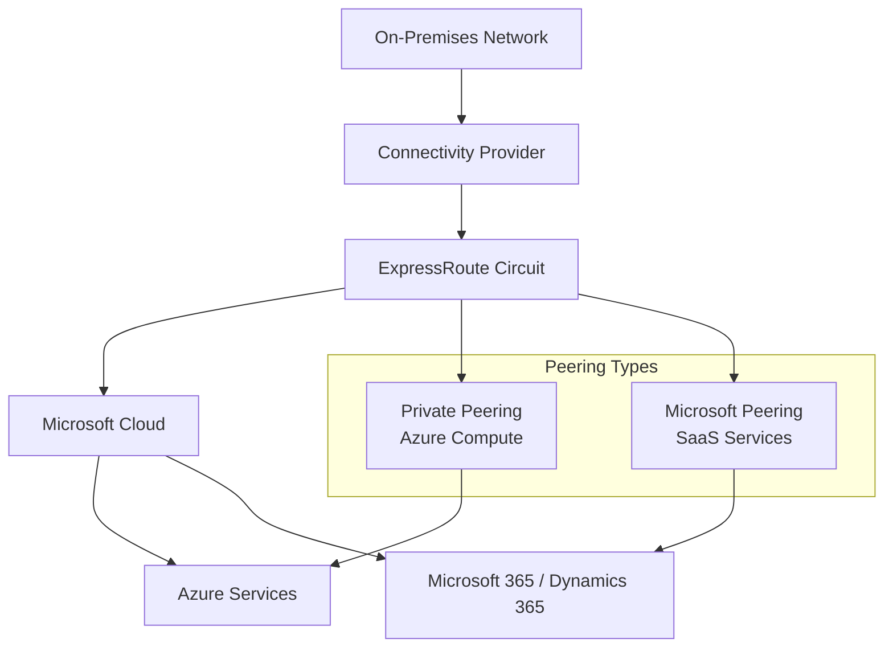

**Key Advantages**
- Speeds from **50 Mbps to 10 Gbps**, with dynamic bandwidth scaling.
- Lower latency and higher reliability through built-in peering.
- Connectivity to all supported Azure services.
- **Global connectivity** with premium add-on.
- Dynamic routing via **Border Gateway Protocol (BGP)**.
- SLAs for uptime and QoS for services like Skype for Business.

**Premium Add-On Features**
- Increased route limits.
- Global service connectivity.
- More virtual network links per circuit.

**Connectivity Models**
1. **IPVPN (Any-to-any)**: Managed Layer 3 connections via IPVPN providers.
2. **Virtual Cross-Connection**: Through an Ethernet exchange facility.
3. **Point-to-Point Ethernet**: Direct Layer 2 or managed Layer 3 link.

**Routing and Layer 3 Connectivity**
- ExpressRoute uses **BGP** for dynamic route exchange between:
  - On-premises network
  - Azure instances
  - Microsoft public addresses
- Multiple BGP sessions for redundancy and traffic profiles.

**ExpressRoute Circuits**
- Logical connection between on-premises and Microsoft Cloud.
- Implemented by a connectivity provider.
- Bandwidth options: 50 Mbps, 100 Mbps, 200 Mbps, 500 Mbps, 1 Gbps, 10 Gbps.
- Each circuit identified by a **service key (s-key)**.
- Supports up to two peerings:
  - **Azure Private Peering**: Connects to Azure compute services (VMs, VNets).
  - **Microsoft Peering**: Connects to SaaS services (Microsoft 365, Dynamics 365).

## ExpressRoute Resilience Models

ExpressRoute offers three levels of resilience to ensure high availability and reliability for your connectivity to Azure. Each model provides different levels of redundancy and fault tolerance.

### Standard Resilience

Standard resilience in ExpressRoute is a single circuit with two connections configured at a single site. Built-in redundancy (Active-Active) is configured to facilitate failover between the two connections of the circuit.

**Standard Resilience Architecture:**
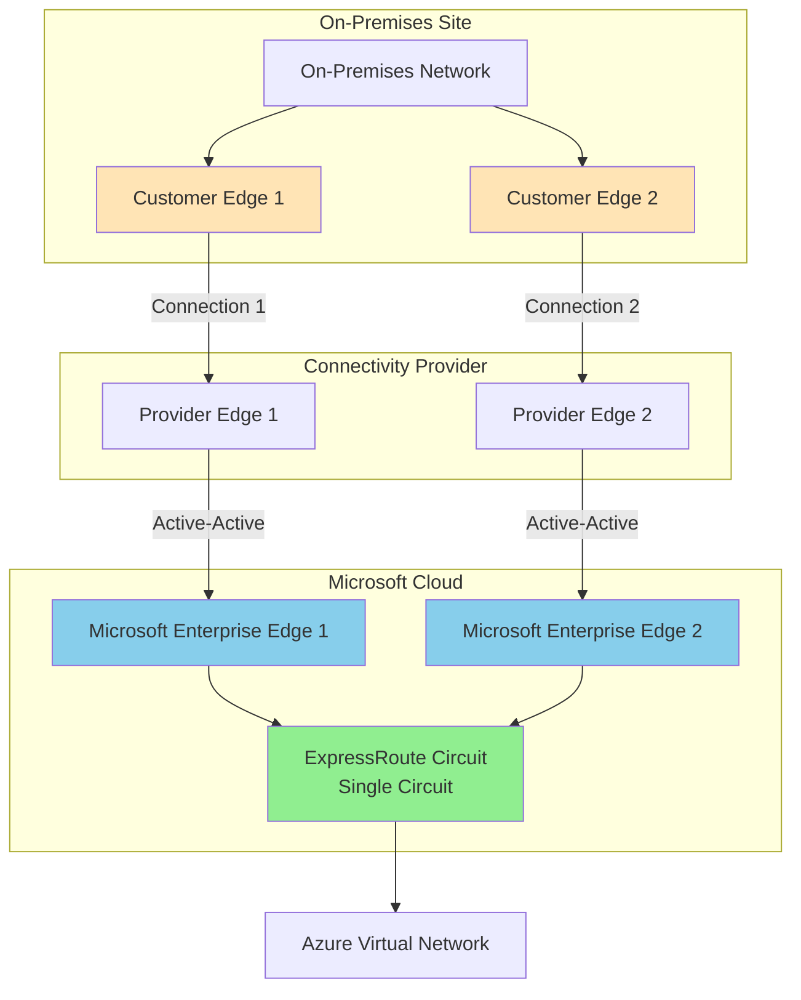

**Key Characteristics:**
- **Single Circuit**: One ExpressRoute circuit
- **Single Site**: Both connections at the same on-premises location
- **Dual Connections**: Two connections for redundancy within the circuit
- **Active-Active**: Both connections are active simultaneously
- **Automatic Failover**: Failover between the two connections

**Use Cases:**
- Standard enterprise connectivity requirements
- Cost-effective redundancy solution
- Single datacenter scenarios
- Non-critical workloads

**Limitations:**
- Single point of failure at the site level
- No geographic diversity
- Site-level outages affect both connections

### High Resilience

High resilience, also known as ExpressRoute Metro, enables the use of multiple sites within the same metropolitan area (Metro) to connect your on-premises network to Azure via ExpressRoute. High resilience provides site diversity by splitting a single circuit between two sites. The first connection is established at one site and the second connection at another.

**High Resilience Architecture:**
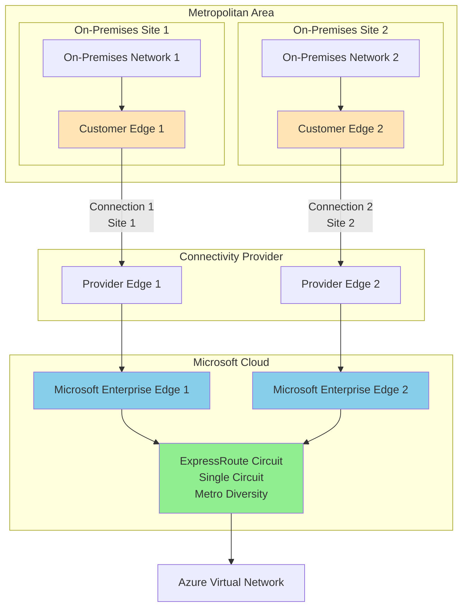

**Key Characteristics:**
- **Single Circuit**: One ExpressRoute circuit
- **Multiple Sites**: Connections at different sites within the same Metro
- **Site Diversity**: Geographic separation within metropolitan area
- **Metro Resilience**: Protection against single-site failures
- **Active-Active**: Both connections are active

**Use Cases:**
- Enterprise connectivity with multiple datacenters in same Metro
- Protection against single-site failures
- Higher availability requirements
- Metro-level redundancy

**Benefits:**
- Site-level redundancy
- Protection against single-site outages
- Better than standard resilience
- Cost-effective for Metro scenarios

**Limitations:**
- Still a single circuit (circuit-level failure affects both sites)
- Limited to same metropolitan area
- Not suitable for geographic diversity requirements

### Maximum Resilience

The maximum resilience architecture in ExpressRoute is structured to eliminate any single point of failure within Microsoft's network path. This configuration is achieved by setting up a pair of circuits at two distinct locations for site diversity with ExpressRoute. The goal of maximum resilience is to improve reliability, resilience, and availability and, as a result, ensure the highest level of resilience for enterprise or critical workloads. For these operations, maximum resilience configuration is recommended.

**Maximum Resilience Architecture:**
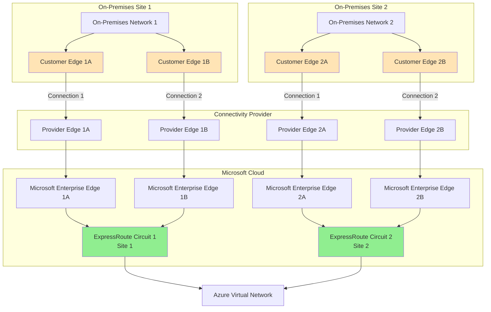

**Key Characteristics:**
- **Multiple Circuits**: Two separate ExpressRoute circuits
- **Geographic Diversity**: Circuits at different geographic locations
- **Site Diversity**: Each circuit can have multiple sites
- **No Single Point of Failure**: Eliminates all single points of failure
- **Highest Availability**: Maximum resilience for critical workloads
- **Circuit-Level Redundancy**: Protection against circuit failures

**Use Cases:**
- Enterprise-critical workloads
- Mission-critical applications
- Maximum availability requirements
- Geographic redundancy needs
- Compliance and SLA requirements

**Benefits:**
- Eliminates single points of failure
- Circuit-level redundancy
- Geographic diversity
- Highest availability SLA
- Protection against all failure scenarios

**Considerations:**
- Higher cost (two circuits)
- More complex configuration
- Requires multiple connectivity providers or locations
- Recommended for critical workloads

### Resilience Comparison

**Resilience Models Comparison:**
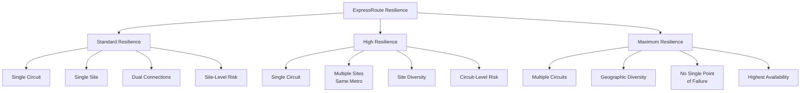

**Resilience Comparison Table:**

| Aspect | Standard Resilience | High Resilience | Maximum Resilience |
|--------|---------------------|-----------------|-------------------|
| **Circuits** | 1 | 1 | 2+ |
| **Sites** | 1 | 2+ (same Metro) | 2+ (different locations) |
| **Connections per Circuit** | 2 | 2 | 2 per circuit |
| **Site Diversity** | No | Yes (Metro) | Yes (Geographic) |
| **Circuit Redundancy** | No | No | Yes |
| **Single Point of Failure** | Site level | Circuit level | None |
| **Cost** | Lowest | Medium | Highest |
| **Complexity** | Low | Medium | High |
| **Use Case** | Standard workloads | Enterprise Metro | Mission-critical |
| **Availability** | High | Very High | Maximum |

### Choosing the Right Resilience Model

**Standard Resilience:**
- Choose when: Single datacenter, standard availability requirements
- Provides: Connection-level redundancy
- Risk: Site-level failures affect connectivity

**High Resilience:**
- Choose when: Multiple datacenters in same Metro, higher availability needs
- Provides: Site-level redundancy within Metro
- Risk: Circuit-level failures affect connectivity

**Maximum Resilience:**
- Choose when: Mission-critical workloads, maximum availability required
- Provides: Complete redundancy at all levels
- Risk: Minimal - eliminates single points of failure
- Recommended for: Enterprise-critical operations

**Routing Domains**
- Each ExpressRoute circuit maps to routing domains.
- Active-active configuration for high availability.

**Azure private peering**
Azure private peering connects to Azure compute services such as virtual machines and cloud services that are deployed with a virtual network. As far as security goes, the private peering domain is simply an extension of your on-premises network into Azure. You then enable bidirectional connectivity between that network and any Azure virtual networks, making the Azure VM IP addresses visible within your internal network.

You can connect only one virtual network to the private peering domain.

**Private Peering Architecture:**
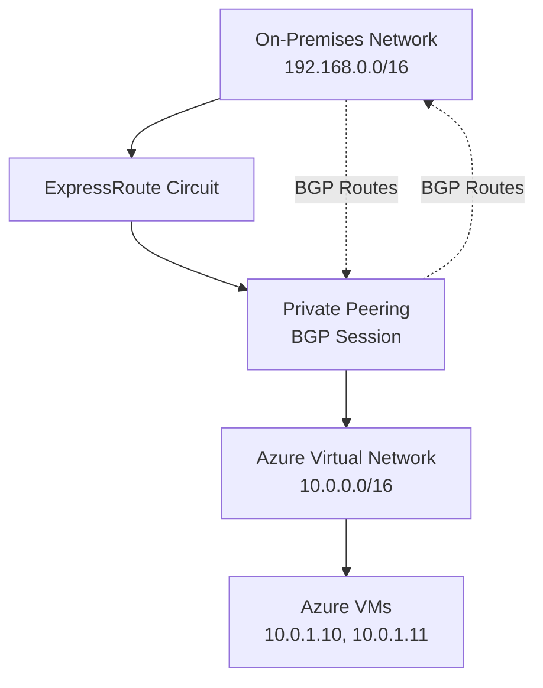

**Learn more:**
- [ExpressRoute Private Peering](https://learn.microsoft.com/en-us/azure/expressroute/expressroute-circuit-peerings)
- [Configure Private Peering](https://learn.microsoft.com/en-us/azure/expressroute/expressroute-howto-routing-portal-resource-manager)

## ExpressRoute FastPath

ExpressRoute Virtual Network Gateway facilitates network route exchange and directs network traffic. ExpressRoute FastPath improves the performance of the data path between your on-premises network and virtual networks. When enabled, ExpressRoute FastPath routes network traffic directly to virtual machines, bypassing the ExpressRoute Virtual Network Gateway.

**Key Points:**

- FastPath is available on all ExpressRoute circuits
- Routes traffic directly to VMs, bypassing the gateway
- Improves performance and reduces latency
- Useful for enterprises requiring consistent, high-performance connectivity to Azure for critical applications

**FastPath Architecture:**
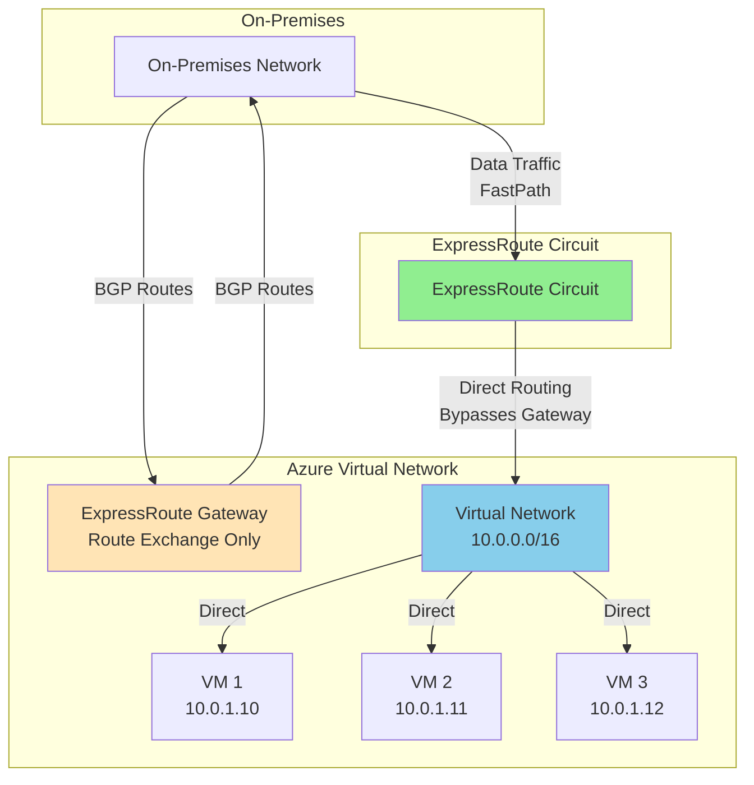

**FastPath vs Standard Routing:**
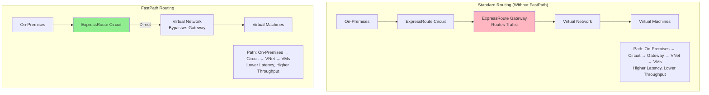

### FastPath Benefits

#### 1. Improved Performance

FastPath reduces latency and increases throughput by allowing data to bypass Azure WAN, providing a more direct path to the virtual network.

**Performance Comparison:**
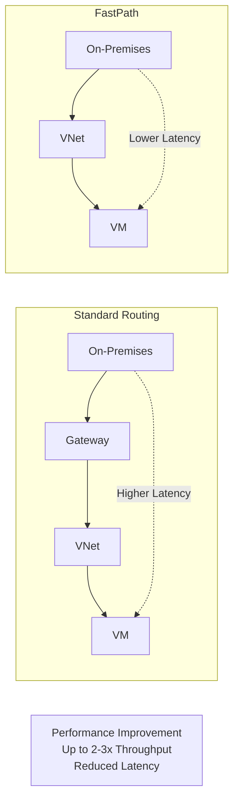

#### 2. Reduced Latency

FastPath reduces the number of hops and routes directly to the virtual network. The optimized routing can significantly reduce latency, which is critical for applications requiring real-time processing.

**Latency Reduction:**
- **Standard Routing**: On-Premises → ExpressRoute Circuit → Gateway → Virtual Network → VMs
- **FastPath**: On-Premises → ExpressRoute Circuit → Virtual Network → VMs
- **Result**: Fewer hops = lower latency

#### 3. Higher Throughput

FastPath supports higher data transfer speeds, making it suitable for bandwidth-intensive workloads and applications.

**Throughput Comparison:**
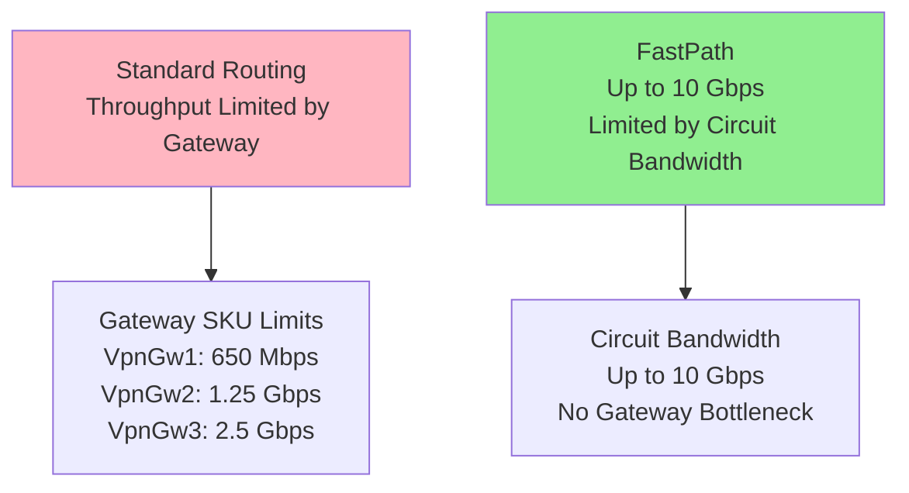

#### 4. Optimized Routing

FastPath provides optimized routing for data packets, which can improve the overall efficiency of network operations.

**Routing Optimization:**
- Direct path to virtual network
- No gateway processing overhead
- Optimized packet forwarding
- Better resource utilization

#### 5. Reliability

With a more direct connection, there are fewer chances of network congestion or packet loss, improving the reliability of data transfers.

**Reliability Benefits:**
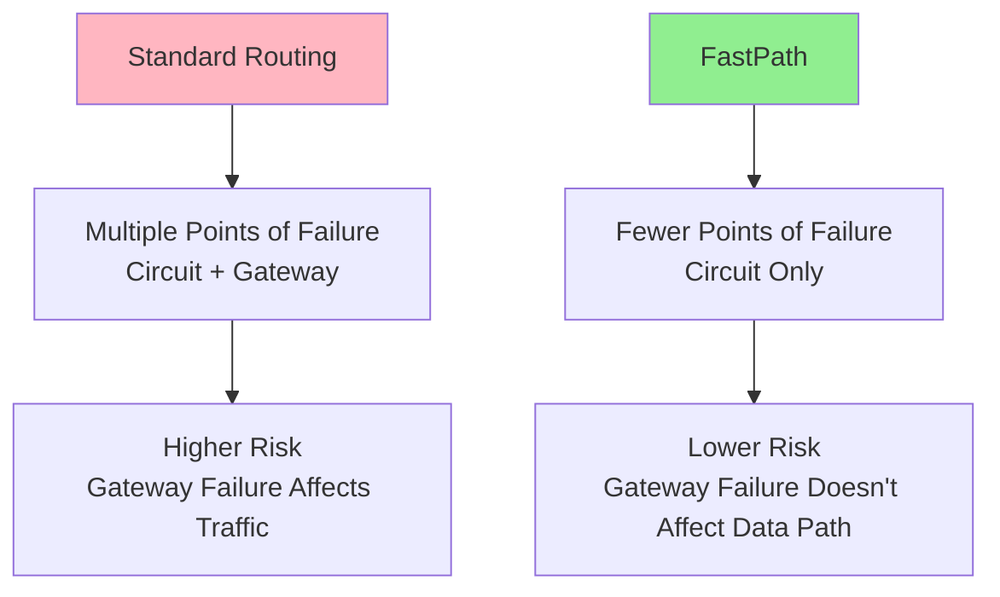

#### 6. Security

FastPath ensures that data travels through fewer intermediate points, which could reduce exposure to security risks.

**Security Benefits:**
- Fewer network hops
- Reduced attack surface
- Direct path reduces interception points
- Maintains ExpressRoute private connectivity

### FastPath Requirements

**Prerequisites:**
- ExpressRoute circuit must exist
- ExpressRoute Gateway must be deployed (for route exchange)
- Virtual network must be connected to ExpressRoute circuit
- FastPath can be enabled on the connection

**Important Notes:**
- FastPath bypasses the gateway for **data traffic only**
- The gateway is still required for **BGP route exchange**
- FastPath works with all ExpressRoute circuit bandwidths
- FastPath is available on all ExpressRoute circuits

### FastPath Use Cases

**Ideal for:**
- **High-Performance Applications**: Applications requiring low latency and high throughput
- **Bandwidth-Intensive Workloads**: Data migration, backup, disaster recovery
- **Real-Time Applications**: Applications sensitive to latency
- **Enterprise Critical Applications**: Mission-critical workloads requiring consistent performance
- **Large Data Transfers**: Bulk data transfers between on-premises and Azure

**FastPath Decision Matrix:**
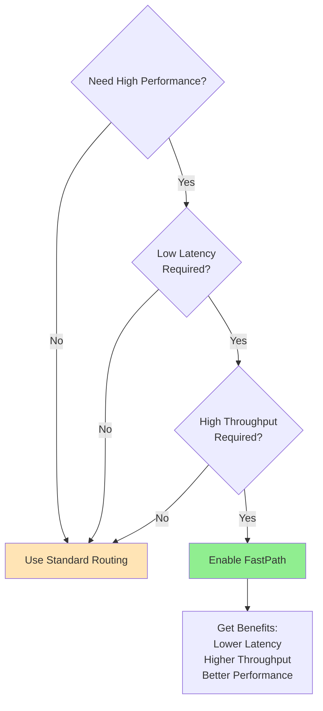

### FastPath Configuration

FastPath is enabled on the ExpressRoute connection between the virtual network and the ExpressRoute circuit.

**Configuration Steps:**
1. Create ExpressRoute Gateway (required for BGP)
2. Connect Virtual Network to ExpressRoute Circuit
3. Enable FastPath on the connection
4. Verify FastPath is active

**Configuration Architecture:**
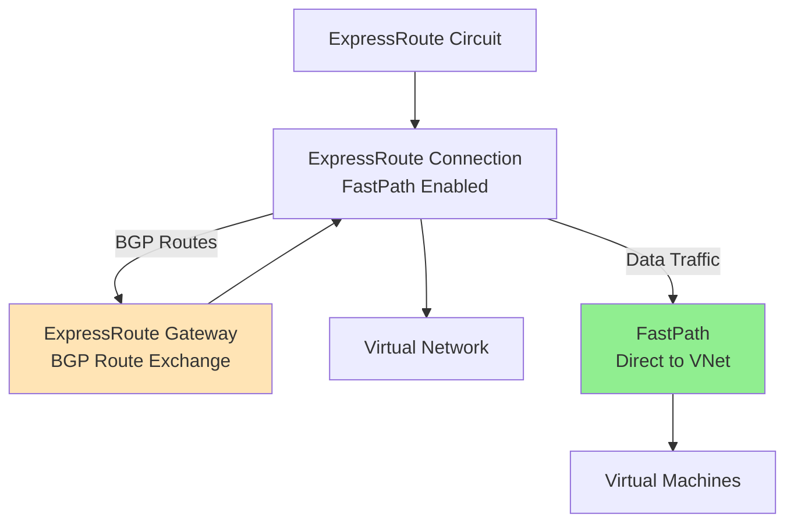

### FastPath Limitations

**What FastPath Does:**
- Routes data traffic directly to virtual network
- Bypasses ExpressRoute Gateway for data path
- Improves performance and reduces latency

**What FastPath Does NOT Do:**
- Does not bypass gateway for BGP route exchange (gateway still required)
- Does not work with VNet peering (only direct VNet connections)
- Does not support User-Defined Routes (UDR) that route through gateway
- Does not affect Microsoft Peering traffic (only Private Peering)

### Best Practices

1. **Enable FastPath for Performance**: Enable FastPath for all production ExpressRoute connections requiring high performance
2. **Gateway Still Required**: Keep ExpressRoute Gateway deployed for BGP route exchange
3. **Monitor Performance**: Monitor latency and throughput improvements after enabling FastPath
4. **Test Before Production**: Test FastPath in non-production environments first
5. **Combine with Resilience**: Use FastPath with maximum resilience architecture for best results

## ExpressRoute Global Reach vs FastPath

ExpressRoute Global Reach and ExpressRoute FastPath are two different features that serve distinct purposes in ExpressRoute connectivity. Understanding their differences is crucial for designing the right ExpressRoute architecture.

### What is ExpressRoute Global Reach?

ExpressRoute Global Reach is a connectivity service that enables you to connect your on-premises sites to each other through ExpressRoute circuits using Microsoft's global network as a bridge. It allows private connectivity between on-premises locations without routing traffic through Azure.

**Global Reach Architecture:**
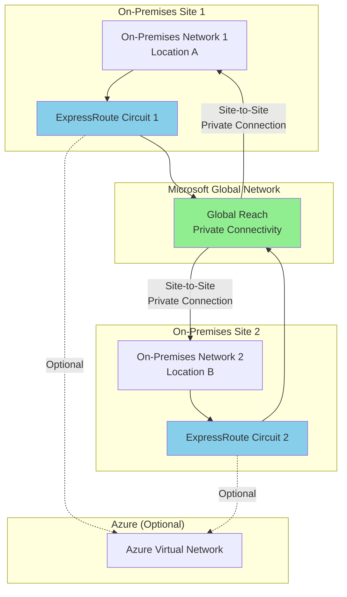

**Key Characteristics of Global Reach:**
- **Purpose**: Connects on-premises sites to each other
- **Traffic Flow**: On-Premises Site 1 ↔ Microsoft Network ↔ On-Premises Site 2
- **Azure Involvement**: Azure is optional; traffic doesn't need to go through Azure
- **Use Case**: Branch-to-branch connectivity via Microsoft's network
- **Requirement**: Requires two ExpressRoute circuits at different peering locations

### What is ExpressRoute FastPath?

ExpressRoute FastPath improves the performance of the data path between your on-premises network and Azure virtual networks by routing traffic directly to VMs, bypassing the ExpressRoute Gateway.

**FastPath Architecture:**
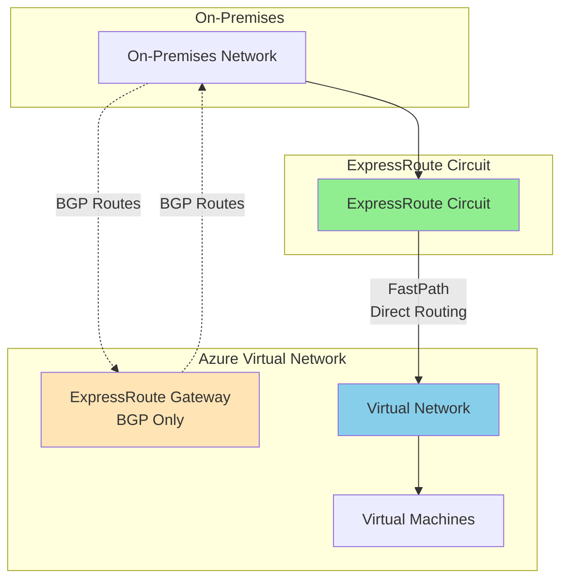

**Key Characteristics of FastPath:**
- **Purpose**: Optimizes on-premises to Azure connectivity
- **Traffic Flow**: On-Premises → ExpressRoute Circuit → Azure Virtual Network (bypasses gateway)
- **Azure Involvement**: Required; connects on-premises to Azure VNets
- **Use Case**: High-performance connectivity to Azure resources
- **Requirement**: Requires ExpressRoute Gateway (for BGP), but bypasses it for data traffic

### Comparison: Global Reach vs FastPath

**Comparison Table:**

| Aspect | ExpressRoute Global Reach | ExpressRoute FastPath |
|--------|---------------------------|----------------------|
| **Primary Purpose** | Connect on-premises sites to each other | Optimize on-premises to Azure connectivity |
| **Traffic Destination** | Other on-premises sites | Azure Virtual Networks |
| **Azure Requirement** | Optional | Required |
| **ExpressRoute Gateway** | Not required | Required (for BGP route exchange) |
| **Number of Circuits** | Requires 2+ circuits | Works with 1 circuit |
| **Traffic Path** | On-Premises → Microsoft Network → On-Premises | On-Premises → ExpressRoute → Azure VNet (bypasses gateway) |
| **Use Case** | Branch-to-branch connectivity | High-performance Azure connectivity |
| **Performance Benefit** | Private connectivity between sites | Lower latency, higher throughput to Azure |
| **Geographic Scope** | Global (any peering location) | Single circuit location |
| **Cost** | Additional cost per circuit | Included with ExpressRoute |

**Visual Comparison:**
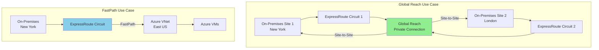

### When to Use Global Reach

**Use ExpressRoute Global Reach when:**
- You need to connect multiple on-premises sites to each other
- You want private connectivity between branches via Microsoft's network
- You have ExpressRoute circuits at different peering locations
- You need branch-to-branch connectivity without routing through Azure
- You want to leverage Microsoft's global network for site connectivity

**Example Scenarios:**
- **Multi-Region Enterprise**: Connect datacenters in New York and London via ExpressRoute
- **Branch Connectivity**: Connect branch offices across different regions
- **Disaster Recovery**: Private connectivity between primary and DR sites
- **Global Network**: Leverage Microsoft's network for inter-site connectivity

### When to Use FastPath

**Use ExpressRoute FastPath when:**
- You need high-performance connectivity to Azure Virtual Networks
- You want to reduce latency to Azure resources
- You need higher throughput to Azure VMs
- You have bandwidth-intensive workloads in Azure
- You want to optimize on-premises to Azure data path

**Example Scenarios:**
- **High-Performance Applications**: Applications requiring low latency to Azure VMs
- **Data Migration**: Large data transfers to Azure
- **Real-Time Processing**: Applications sensitive to latency
- **Bandwidth-Intensive Workloads**: Backup, disaster recovery, data replication

### Can You Use Both Together?

**Yes, you can use both Global Reach and FastPath together:**

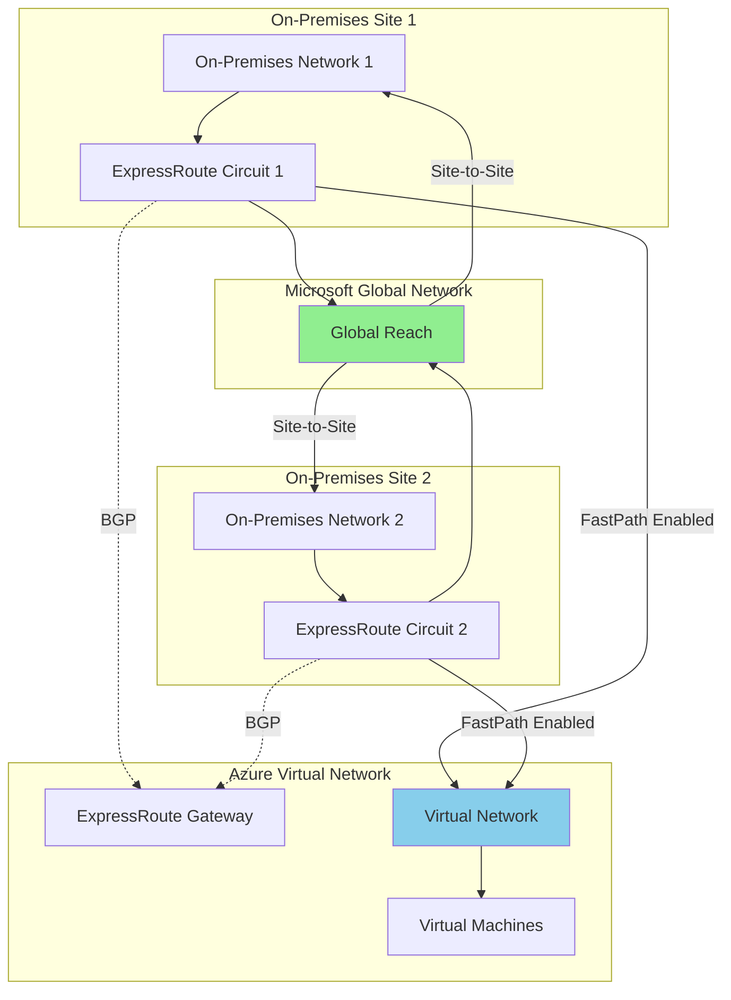

**Combined Use Case:**
- **Global Reach**: Connects Site 1 and Site 2 to each other
- **FastPath**: Optimizes connectivity from both sites to Azure VNets
- **Result**: Best of both worlds - site-to-site connectivity and optimized Azure connectivity

### Decision Matrix

**Choose Global Reach if:**
- ✅ You need to connect on-premises sites to each other
- ✅ You have multiple ExpressRoute circuits
- ✅ You want private connectivity between branches
- ✅ Azure connectivity is not the primary concern

**Choose FastPath if:**
- ✅ You need high-performance connectivity to Azure
- ✅ You want to optimize on-premises to Azure data path
- ✅ You have bandwidth-intensive workloads in Azure
- ✅ Site-to-site connectivity is not required

**Choose Both if:**
- ✅ You need site-to-site connectivity AND optimized Azure connectivity
- ✅ You have multiple ExpressRoute circuits
- ✅ You want the best performance for all connectivity scenarios

### Summary

**ExpressRoute Global Reach:**
- Connects on-premises sites to each other
- Uses Microsoft's network as a bridge
- Does not require Azure
- Requires multiple ExpressRoute circuits

**ExpressRoute FastPath:**
- Optimizes on-premises to Azure connectivity
- Bypasses ExpressRoute Gateway for data traffic
- Requires Azure Virtual Networks
- Works with a single ExpressRoute circuit

**Key Takeaway:** Global Reach is about **site-to-site connectivity**, while FastPath is about **optimizing Azure connectivity**. They solve different problems and can be used together for comprehensive connectivity solutions.

**Monitoring ExpressRoute**
- Use **Network Performance Monitor** for check the health for following areas:
  - Availability
  - Connectivity to VNets
  - Bandwidth utilization

**ExpressRoute Monitoring:**
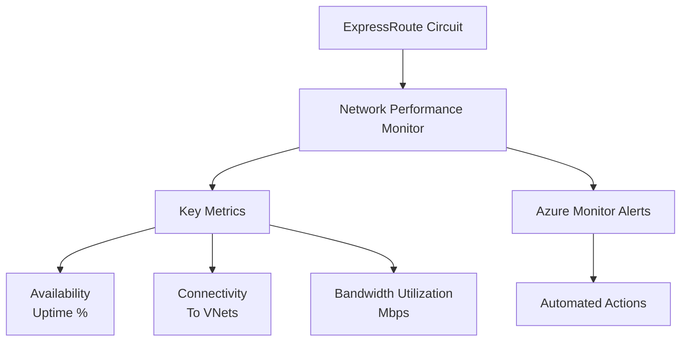

- Use ExpressRoute for sensitive data and high-volume workloads.
- Combine with VPN Gateway for hybrid scenarios.
- Plan redundancy with multiple circuits and providers.
- Monitor health and performance regularly.

**Learn more:**
- [Monitor ExpressRoute](https://learn.microsoft.com/en-us/azure/expressroute/expressroute-monitoring-metrics-alerts)
- [ExpressRoute Monitoring Best Practices](https://learn.microsoft.com/en-us/azure/expressroute/expressroute-monitoring-metrics-alerts)

 **Comparison: ExpressRoute vs VPN Gateway**
| Feature             | ExpressRoute                 | VPN Gateway                 |
| ------------------- | ---------------------------- | --------------------------- |
| **Connection Type** | Private dedicated link       | Over public internet        |
| **Security**        | Very high                    | High (encrypted)            |
| **Bandwidth**       | Up to 10 Gbps                | Limited by SKU              |
| **Latency**         | Low                          | Higher than ExpressRoute    |
| **Use Case**        | Enterprise, mission-critical | Dev/test, smaller workloads |

### Module assessment

1) You need to connect Azure resources like Azure virtual machines across geographical regions. Which Azure networking option should you use?
- ✅ Correct: Virtual network peering

Why:

- Virtual network (VNet) peering—specifically Global VNet Peering—links VNets across different Azure regions to enable private, low-latency connectivity between resources like VMs. It uses the Microsoft backbone (not the public Internet) and doesn't require gateways or tunnels. It's ideal for intra-Azure connectivity across regions.

- ❌ Not correct: Azure ExpressRoute
ExpressRoute is for private connectivity between on-premises environments and Azure, not for connecting VNets to each other. You can use ExpressRoute Global Reach between on-prem sites via Microsoft's network, but for connecting Azure resources across regions, VNet peering is the right choice.

- ❌ Not correct: VPN Gateway
VPN Gateway is used for encrypted tunnels (site-to-site or point-to-site) generally involving on-premises networks or users. You can connect VNets to each other with VNet-to-VNet VPN, but it's more complex, has throughput limits, and adds cost versus peering. For native, scalable, and simpler Azure-to-Azure connectivity, VNet peering is preferred.

2) For a point-to-site Azure VPN gateway, what are the key parameters that you must specify when you create it?
- ✅ Correct: Gateway type is Vpn, vpn type is RouteBased, and you need to specify a gateway sku.

Why:
- A Point-to-Site (P2S) configuration requires an Azure VPN gateway with:
  - *Gateway type*: Vpn (not ExpressRoute)
  - *VPN type*: RouteBased (required for P2S)
  - *Gateway SKU*: e.g., VpnGw1, VpnGw2, etc. (impacts performance/features)

You also need a *GatewaySubnet* in the VNet, but that's part of the network setup, not an attribute of the gateway resource itself.

- ❌ Partially correct but incomplete: "Gateway type is Vpn and vpn type is RouteBased."
This misses the SKU, which is required to create the gateway and determines scale/performance.

- ❌ Not correct / misleading: "Subnet is GatewaySubnet and gateway type is Vpn."
While having a GatewaySubnet is necessary in the VNet, the option omits the vpn type (RouteBased) and the SKU, both critical for P2S.

3) Which peering configuration would you use for your ExpressRoute circuit where you need to allow direct connections to Azure compute resources?

- ✅ Correct: Azure private peering

Why:

- Private peering on ExpressRoute gives a private, Layer-3 extension of your on-premises network into Azure VNets, enabling access to Azure compute resources (VMs, private IP addresses). Routes are exchanged via BGP on private address spaces.

- ❌ Not correct: Microsoft peering
  - Microsoft peering is for accessing public services (e.g., Microsoft 365, Dynamics 365, Azure public services via public IPs). It's not used to reach private VNet resources like VMs.
- ❌ Not correct: Azure Virtual Network peering
  - VNet peering is within Azure between VNets. It's not an ExpressRoute "peering" type and does not involve the ExpressRoute circuit configuration.

3) Which protocol provides dynamic routing for Azure ExpressRoute?
- ✅ Correct: Border Gateway Protocol (BGP)

Why:
- BGP is used for dynamic route exchange between your on-premises edge and Microsoft's edge for ExpressRoute. It supports route advertisement, failover, and scalable path selection.

- ❌ Not correct: IPVPN
  - IPVPN is a service type (often MPLS-based), not a routing protocol.
- ❌ Not correct: S-key
  - "S-key" is not a routing protocol in this context.

