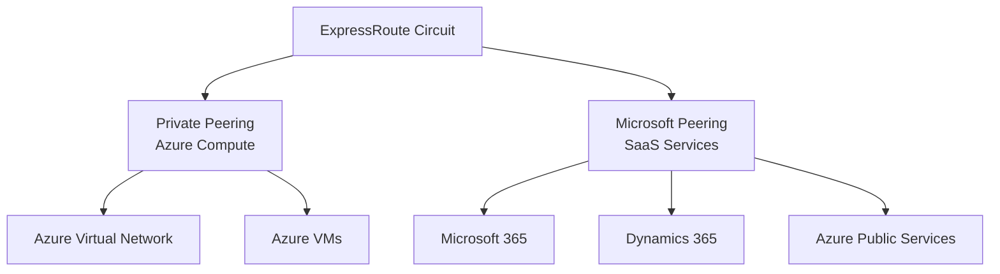

# Implementing ExpressRoute Peering with Terraform

## Overview

ExpressRoute supports two types of peering:
- **Azure Private Peering**: Connects to Azure compute services (VMs, VNets)
- **Microsoft Peering**: Connects to SaaS services (Microsoft 365, Dynamics 365)

## Architecture



## Terraform Implementation

### Private Peering Configuration

```hcl
resource "azurerm_express_route_circuit_peering" "private" {
  peering_type                  = "AzurePrivatePeering"
  express_route_circuit_name     = azurerm_express_route_circuit.main.name
  resource_group_name            = azurerm_resource_group.expressroute.name
  
  # BGP Configuration
  peer_asn                       = 65001
  primary_peer_address_prefix    = "192.168.1.0/30"
  secondary_peer_address_prefix  = "192.168.1.4/30"
  vlan_id                        = 100
  
  # Optional: Shared key for authentication
  shared_key                     = var.expressroute_shared_key
}
```

### Microsoft Peering Configuration

```hcl
resource "azurerm_express_route_circuit_peering" "microsoft" {
  peering_type                  = "MicrosoftPeering"
  express_route_circuit_name     = azurerm_express_route_circuit.main.name
  resource_group_name            = azurerm_resource_group.expressroute.name
  
  # BGP Configuration
  peer_asn                       = 65001
  primary_peer_address_prefix    = "203.0.113.0/30"
  secondary_peer_address_prefix  = "203.0.113.4/30"
  vlan_id                        = 200
  
  # Microsoft Peering specific
  advertised_public_prefixes = [
    "203.0.113.0/24"
  ]
}
```

### Complete Peering Example

```hcl
# Private Peering
resource "azurerm_express_route_circuit_peering" "private" {
  name                          = "AzurePrivatePeering"
  peering_type                  = "AzurePrivatePeering"
  express_route_circuit_name     = azurerm_express_route_circuit.main.name
  resource_group_name            = azurerm_resource_group.expressroute.name
  
  peer_asn                       = 65001
  primary_peer_address_prefix    = "192.168.1.0/30"
  secondary_peer_address_prefix  = "192.168.1.4/30"
  vlan_id                        = 100
  
  shared_key                     = var.expressroute_shared_key
  
  ipv4_enabled                   = true
}

# Microsoft Peering
resource "azurerm_express_route_circuit_peering" "microsoft" {
  name                          = "MicrosoftPeering"
  peering_type                  = "MicrosoftPeering"
  express_route_circuit_name     = azurerm_express_route_circuit.main.name
  resource_group_name            = azurerm_resource_group.expressroute.name
  
  peer_asn                       = 65001
  primary_peer_address_prefix    = "203.0.113.0/30"
  secondary_peer_address_prefix  = "203.0.113.4/30"
  vlan_id                        = 200
  
  advertised_public_prefixes = [
    "203.0.113.0/24"
  ]
  
  customer_asn                  = 65001
  routing_registry_name         = "ARIN"
}
```

### BGP Configuration Details

**Peer ASN:**
- Your on-premises BGP ASN
- Must be a valid private ASN (64512-65534) or public ASN

**Address Prefixes:**
- Use /30 subnets for peer addresses
- Primary and secondary must be in different subnets
- Cannot overlap with Azure or on-premises address spaces

**VLAN ID:**
- Unique VLAN ID for each peering
- Private peering: typically 100-199
- Microsoft peering: typically 200-299

```hcl
# Example BGP Configuration
resource "azurerm_express_route_circuit_peering" "private" {
  # ... other configuration ...
  
  peer_asn                       = 65001  # Your ASN
  primary_peer_address_prefix    = "192.168.1.0/30"   # Azure side: 192.168.1.1, Your side: 192.168.1.2
  secondary_peer_address_prefix  = "192.168.1.4/30"   # Azure side: 192.168.1.5, Your side: 192.168.1.6
  vlan_id                        = 100
}
```

## Key Configuration Parameters

| Parameter | Description | Required | Example |
|-----------|-------------|----------|---------|
| `peering_type` | Type of peering | Yes | `AzurePrivatePeering` or `MicrosoftPeering` |
| `peer_asn` | BGP ASN | Yes | `65001` |
| `primary_peer_address_prefix` | Primary /30 subnet | Yes | `192.168.1.0/30` |
| `secondary_peer_address_prefix` | Secondary /30 subnet | Yes | `192.168.1.4/30` |
| `vlan_id` | VLAN identifier | Yes | `100` |
| `shared_key` | BGP authentication key | No | `your-secret-key` |

## Best Practices

1. **Use Different VLAN IDs**: Private (100-199), Microsoft (200-299)
2. **Separate Address Spaces**: Ensure /30 subnets don't overlap
3. **BGP ASN**: Use private ASN range (64512-65534) if not using public
4. **Shared Key**: Use strong, unique keys for authentication
5. **Route Filters**: Configure route filters for Microsoft peering

## Outputs

```hcl
output "private_peering_id" {
  value       = azurerm_express_route_circuit_peering.private.id
  description = "Private peering resource ID"
}

output "microsoft_peering_id" {
  value       = azurerm_express_route_circuit_peering.microsoft.id
  description = "Microsoft peering resource ID"
}
```

## Next Steps

After configuring peering:
1. Create ExpressRoute gateway (see [03-expressroute-gateway.md](./03-expressroute-gateway.md))
2. Connect circuit to virtual network (see [04-expressroute-connection.md](./04-expressroute-connection.md))

## Additional Resources

- [ExpressRoute Peering Overview](https://learn.microsoft.com/en-us/azure/expressroute/expressroute-circuit-peerings)
- [Terraform azurerm_express_route_circuit_peering](https://registry.terraform.io/providers/hashicorp/azurerm/latest/docs/resources/express_route_circuit_peering)

