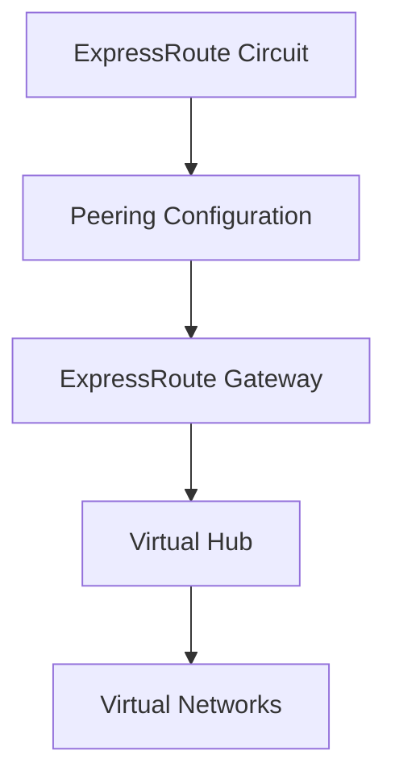

# Implementing ExpressRoute Gateway with Terraform

## Overview

ExpressRoute Gateway connects your ExpressRoute circuit to Azure virtual networks. It's deployed in a virtual hub or as a traditional gateway in a VNet.

## Architecture



## Terraform Implementation

### ExpressRoute Gateway in Virtual Hub (Recommended)

```hcl
# Virtual Hub
resource "azurerm_virtual_hub" "main" {
  name                = "vhub-main"
  resource_group_name = azurerm_resource_group.main.name
  location            = "eastus"
  address_prefix      = "10.0.0.0/24"
  sku                 = "Standard"
}

# ExpressRoute Gateway
resource "azurerm_express_route_gateway" "main" {
  name                = "erg-main"
  resource_group_name = azurerm_resource_group.main.name
  location            = "eastus"
  virtual_hub_id     = azurerm_virtual_hub.main.id
  scale_units        = 1
}
```

### Gateway Scale Units

Scale units determine throughput:
- **1 scale unit**: Up to 2 Gbps
- **2 scale units**: Up to 4 Gbps
- **3 scale units**: Up to 6 Gbps
- **4 scale units**: Up to 8 Gbps
- **5 scale units**: Up to 10 Gbps

```hcl
resource "azurerm_express_route_gateway" "high_throughput" {
  # ... other configuration ...
  scale_units = 5  # 10 Gbps throughput
}
```

### Complete Example

```hcl
# Resource Group
resource "azurerm_resource_group" "expressroute" {
  name     = "rg-expressroute"
  location = "eastus"
}

# Virtual Hub
resource "azurerm_virtual_hub" "main" {
  name                = "vhub-main"
  resource_group_name = azurerm_resource_group.expressroute.name
  location            = "eastus"
  address_prefix      = "10.0.0.0/24"
  sku                 = "Standard"
  
  tags = {
    Environment = "Production"
  }
}

# ExpressRoute Gateway
resource "azurerm_express_route_gateway" "main" {
  name                = "erg-main"
  resource_group_name = azurerm_resource_group.expressroute.name
  location            = "eastus"
  virtual_hub_id      = azurerm_virtual_hub.main.id
  scale_units         = 2
  
  tags = {
    Environment = "Production"
    ManagedBy   = "Terraform"
  }
}
```

## Key Configuration Parameters

| Parameter | Description | Required | Example |
|-----------|-------------|----------|---------|
| `name` | Gateway name | Yes | `erg-main` |
| `resource_group_name` | Resource group | Yes | `rg-expressroute` |
| `location` | Azure region | Yes | `eastus` |
| `virtual_hub_id` | Virtual hub ID | Yes | Virtual hub resource ID |
| `scale_units` | Throughput scale | Yes | `1-5` |

## Best Practices

1. **Scale Units**: Choose based on expected throughput
2. **Virtual Hub**: Use Virtual Hub for modern architecture
3. **Location**: Deploy gateway in same region as virtual hub
4. **Redundancy**: Consider multiple gateways for high availability

## Outputs

```hcl
output "expressroute_gateway_id" {
  value       = azurerm_express_route_gateway.main.id
  description = "ExpressRoute gateway resource ID"
}
```

## Next Steps

After creating the gateway:
1. Create connection to ExpressRoute circuit (see [04-expressroute-connection.md](./04-expressroute-connection.md))

## Additional Resources

- [ExpressRoute Gateway Overview](https://learn.microsoft.com/en-us/azure/expressroute/expressroute-about-virtual-network-gateways)
- [Terraform azurerm_express_route_gateway](https://registry.terraform.io/providers/hashicorp/azurerm/latest/docs/resources/express_route_gateway)

