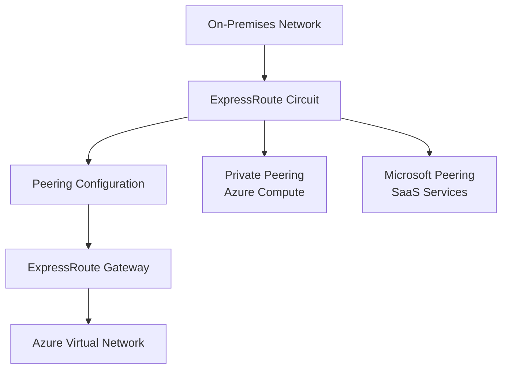

# Terraform Implementation Guides for Azure ExpressRoute

This directory contains comprehensive guides for implementing Azure ExpressRoute services using Terraform.

## Documentation Structure

1. **[01-expressroute-circuit.md](./01-expressroute-circuit.md)**
   - Creating ExpressRoute circuits
   - Circuit SKU and bandwidth selection
   - Service provider configuration

2. **[02-expressroute-peering.md](./02-expressroute-peering.md)**
   - Private peering configuration
   - Microsoft peering configuration
   - BGP session setup

3. **[03-expressroute-gateway.md](./03-expressroute-gateway.md)**
   - ExpressRoute gateway creation
   - Gateway SKU selection
   - Gateway subnet configuration

4. **[04-expressroute-connection.md](./04-expressroute-connection.md)**
   - Connecting circuits to virtual networks
   - Authorization keys
   - Connection configuration

## Quick Start

### Complete Example

```hcl
# 1. Create ExpressRoute Circuit
resource "azurerm_express_route_circuit" "main" {
  name                  = "erc-main"
  resource_group_name   = azurerm_resource_group.main.name
  location              = "eastus"
  service_provider_name = "Equinix"
  peering_location      = "Washington DC"
  bandwidth_in_mbps     = 1000

  sku {
    tier   = "Standard"
    family = "MeteredData"
  }
}

# 2. Configure Private Peering
resource "azurerm_express_route_circuit_peering" "private" {
  peering_type                  = "AzurePrivatePeering"
  express_route_circuit_name     = azurerm_express_route_circuit.main.name
  resource_group_name            = azurerm_resource_group.main.name
  shared_key                     = "your-shared-key"
  peer_asn                       = 65001
  primary_peer_address_prefix    = "192.168.1.0/30"
  secondary_peer_address_prefix   = "192.168.1.4/30"
  vlan_id                        = 100
}

# 3. Create ExpressRoute Gateway
resource "azurerm_express_route_gateway" "main" {
  name                = "erg-main"
  resource_group_name = azurerm_resource_group.main.name
  location            = "eastus"
  virtual_hub_id     = azurerm_virtual_hub.main.id
  scale_units         = 1
}

# 4. Create Connection
resource "azurerm_express_route_connection" "main" {
  name                  = "erc-connection"
  express_route_gateway_id = azurerm_express_route_gateway.main.id
  express_route_circuit_peering_id = azurerm_express_route_circuit_peering.private.id
}
```

## Architecture Overview



## Best Practices

1. **Circuit Planning**: Choose appropriate bandwidth and SKU based on requirements
2. **Redundancy**: Configure multiple circuits for high availability
3. **Peering**: Configure both private and Microsoft peering as needed
4. **BGP**: Use BGP for dynamic routing
5. **Monitoring**: Set up Network Performance Monitor for circuit health
6. **Security**: Use private peering for sensitive workloads

## Common Workflows

### Workflow 1: Basic ExpressRoute Setup

1. Create ExpressRoute circuit
2. Configure private peering
3. Create ExpressRoute gateway
4. Connect circuit to virtual network
5. Configure BGP routing

### Workflow 2: Multi-Peering Configuration

1. Create ExpressRoute circuit
2. Configure private peering
3. Configure Microsoft peering
4. Set up route filters for Microsoft peering
5. Connect to virtual networks

## Additional Resources

- [Azure ExpressRoute Documentation](https://learn.microsoft.com/en-us/azure/expressroute/)
- [Terraform Azure Provider - ExpressRoute](https://registry.terraform.io/providers/hashicorp/azurerm/latest/docs/resources/express_route_circuit)

