# Azure Front Door

## Overview

Azure Front Door is Microsoft's modern cloud Content Delivery Network (CDN) that provides fast, reliable, and secure access between your users and your applications. Azure Front Door delivers your content using Microsoft's global edge network with hundreds of global and local Points of Presence (POPs) distributed around the world close to both your enterprise and consumer end users.

**Key Characteristics:**
- **Global CDN**: Leverages Microsoft's worldwide edge network
- **Low Latency**: POPs located close to end users worldwide
- **High Performance**: Optimized for both static and dynamic content
- **Security**: Built-in WAF and DDoS protection
- **Scalability**: Automatically scales to handle traffic spikes

**Learn more:**
- [Azure Front Door Overview](https://learn.microsoft.com/en-us/azure/frontdoor/front-door-overview)
- [Front Door Documentation](https://learn.microsoft.com/en-us/azure/frontdoor/)

## How Azure Front Door Works

Azure Front Door operates at the edge of Microsoft's global network, providing a single entry point for your applications. When a user makes a request, Front Door routes it through the nearest edge location to the optimal backend based on routing rules, health probes, and performance metrics.

**Azure Front Door Request Flow:**
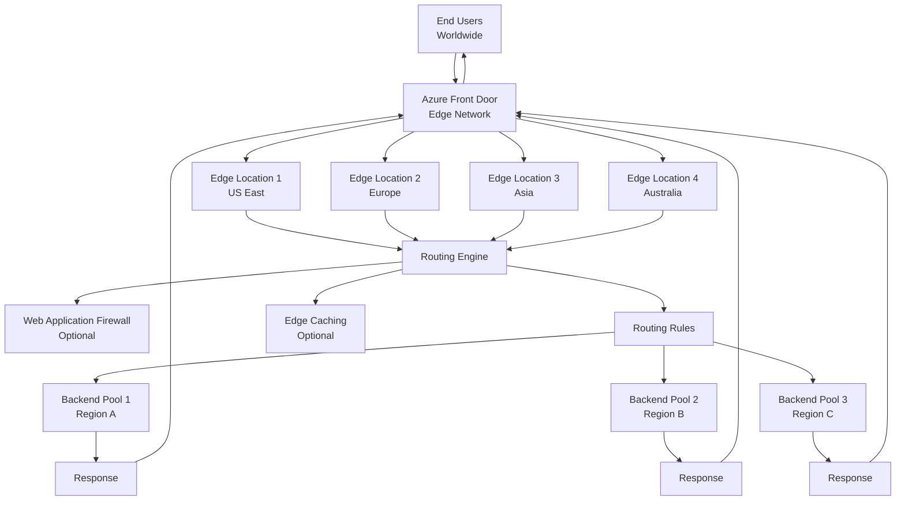

**Request Processing Steps:**
1. **User Request**: Client sends request to Front Door hostname
2. **Edge Routing**: Request routed to nearest edge location
3. **WAF Inspection**: Optional WAF checks for threats
4. **Routing Decision**: Routing rules determine backend destination
5. **Caching Check**: Edge cache checked for static content
6. **Backend Request**: Request forwarded to selected backend
7. **Response**: Response returned through edge network to user

## Azure Front Door Tiers

Azure Front Door provides two tiers optimized for different use cases: Standard and Premium. Each tier offers different capabilities and features.

**Front Door Tiers Comparison:**
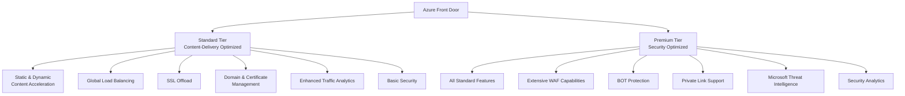

### Azure Front Door Standard

Azure Front Door Standard is content-delivery optimized, providing high-performance content delivery and global load balancing capabilities.

**Standard Tier Features:**

| Feature | Description |
|---------|-------------|
| **Static & Dynamic Content Acceleration** | Accelerates both static and dynamic content delivery |
| **Global Load Balancing** | Distributes traffic across multiple regions and backends |
| **SSL Offload** | Handles SSL/TLS termination at the edge |
| **Domain & Certificate Management** | Simplified domain and certificate management |
| **Enhanced Traffic Analytics** | Detailed analytics and monitoring capabilities |
| **Basic Security Capabilities** | Basic DDoS protection and security features |

**Use Cases:**
- Content delivery for websites and applications
- Global application distribution
- Static website hosting
- API acceleration
- Media streaming

### Azure Front Door Premium

Azure Front Door Premium is security optimized, providing all Standard features plus extensive security capabilities.

**Premium Tier Features:**

| Feature | Description |
|---------|-------------|
| **All Standard Features** | Complete Standard tier functionality |
| **Extensive WAF Capabilities** | Advanced Web Application Firewall protection |
| **BOT Protection** | Protection against malicious bots and crawlers |
| **Private Link Support** | Secure connectivity to Azure services via Private Link |
| **Microsoft Threat Intelligence** | Integration with Microsoft's threat intelligence |
| **Security Analytics** | Advanced security monitoring and analytics |

**Use Cases:**
- Enterprise applications requiring advanced security
- Applications handling sensitive data
- Compliance requirements (PCI DSS, HIPAA, etc.)
- High-security web applications
- Applications requiring bot protection

**Tier Comparison:**

| Feature | Standard | Premium |
|---------|----------|---------|
| **Content Delivery** | Yes | Yes |
| **Global Load Balancing** | Yes | Yes |
| **SSL/TLS Termination** | Yes | Yes |
| **Edge Caching** | Yes | Yes |
| **Basic WAF** | Limited | Yes |
| **Advanced WAF** | No | Yes |
| **BOT Protection** | No | Yes |
| **Private Link** | No | Yes |
| **Threat Intelligence** | No | Yes |
| **Security Analytics** | Basic | Advanced |

## Azure Front Door Architecture

Azure Front Door architecture consists of several key components that work together to deliver content and route traffic efficiently.

**Front Door Architecture Components:**
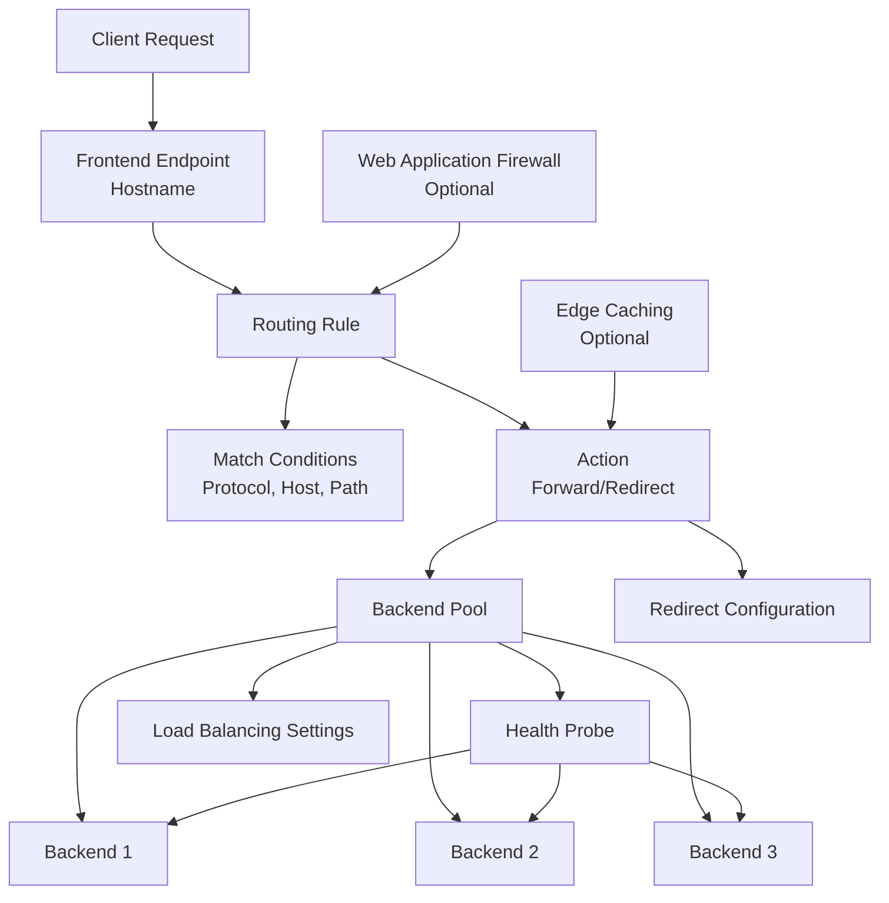

### Frontend Endpoints

Frontend endpoints are the entry points for client requests. They define the hostname and domain configuration for your Front Door.

**Frontend Endpoint Characteristics:**
- **Hostname**: Custom domain or Front Door default hostname
- **SSL/TLS**: Certificate management for HTTPS
- **Domain Validation**: Domain ownership verification
- **CNAME Configuration**: DNS configuration for custom domains

**Frontend Endpoint Configuration:**
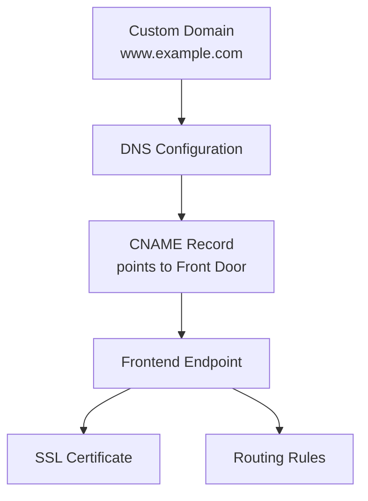

### Routing Rules

Routing rules determine how requests are processed and where they are routed. They match incoming requests based on protocol, hostname, and path, then perform actions like forwarding to backends or redirecting.

**Routing Rule Components:**
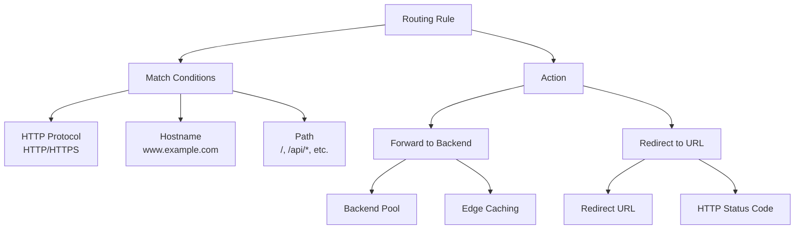

**Routing Algorithm:**

Azure Front Door routing algorithm matches requests in the following order:

1. **HTTP Protocol** (HTTP/HTTPS)
   - Matches the protocol used in the request
   - Determines if request is secure or insecure

2. **Frontend Host** (Hostname)
   - Matches the hostname in the request
   - Examples: `www.example.com`, `*.example.com`
   - Supports wildcard matching

3. **Path** (URL Path)
   - Matches the path in the request URL
   - Examples: `/`, `/users/`, `/file.gif`
   - Supports wildcard and prefix matching

**Routing Priority:**
- More specific matches take precedence
- Protocol → Host → Path matching order
- First matching rule is applied

### Backend Pools

Backend pools contain the origin servers that serve your application content. They can include Azure services, on-premises servers, or other cloud providers.

**Backend Pool Types:**
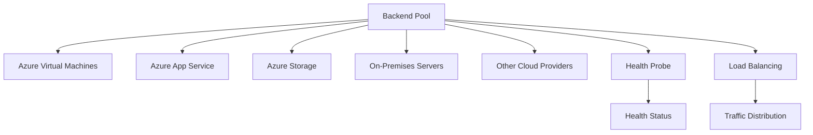

**Backend Pool Configuration:**
- **Backend Servers**: List of origin servers
- **Health Probes**: Health check configuration
- **Load Balancing**: Load balancing algorithm settings
- **Priority**: Backend priority for failover
- **Weight**: Weight for weighted distribution

### Health Probes

Health probes are essential for determining backend availability and routing traffic to healthy backends only.

**Health Probe Architecture:**
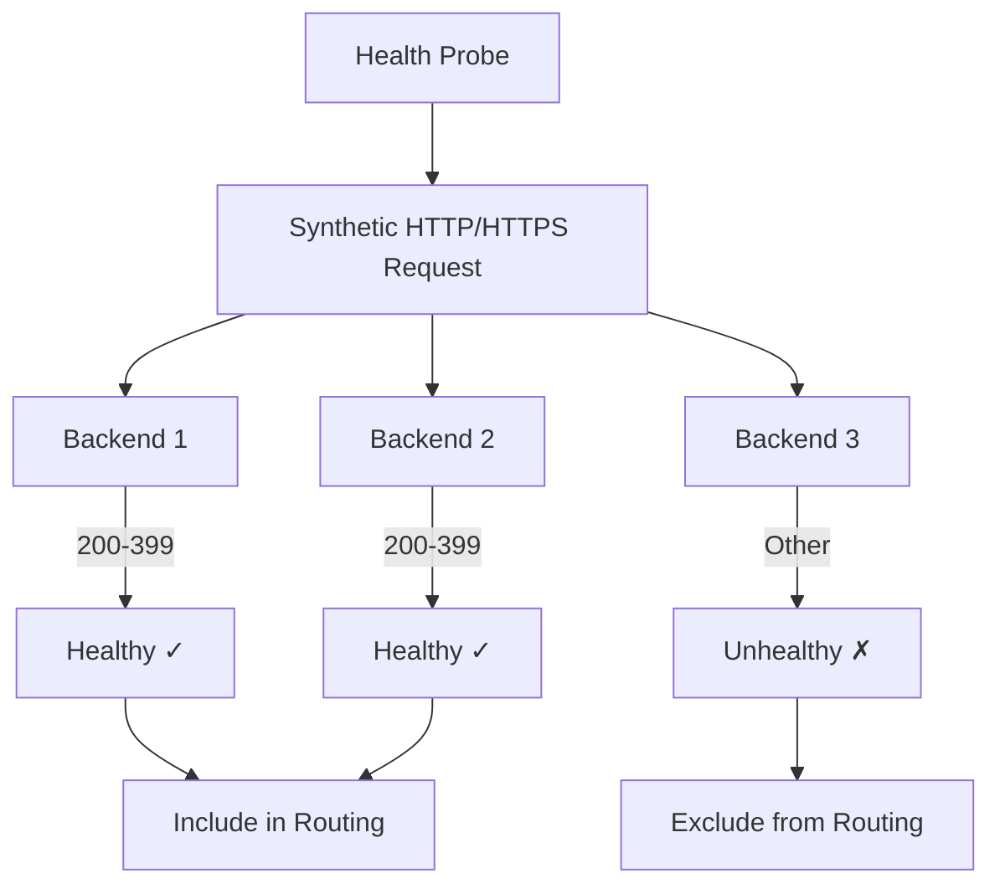

**Health Probe Configuration:**
- **Protocol**: HTTP or HTTPS
- **Path**: Health check endpoint (e.g., `/health`)
- **Interval**: Time between probe requests
- **Timeout**: Time to wait for response
- **Healthy Status Codes**: HTTP status codes indicating health (200-399)

**Health Probe Best Practices:**
- Use dedicated health check endpoints
- Keep health checks lightweight and fast
- Configure appropriate intervals (balance responsiveness and overhead)
- Set appropriate timeout values
- Use HTTPS for secure health checks

### Load Balancing

Azure Front Door uses intelligent load balancing to distribute traffic across healthy backends.

**Load Balancing Methods:**
- **Latency-Based**: Routes to backend with lowest latency
- **Priority-Based**: Routes to highest priority healthy backend
- **Weighted**: Distributes traffic based on configured weights

**Load Balancing Architecture:**
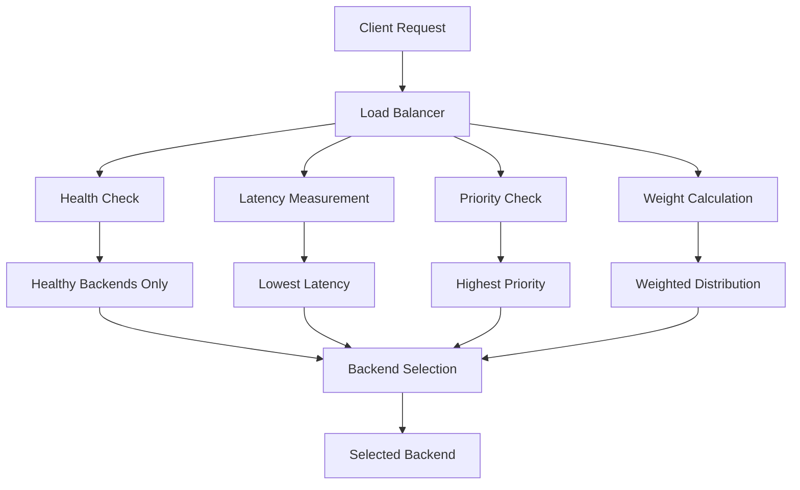

## Routing Methods

Azure Front Door supports multiple routing methods to optimize traffic distribution and application performance.

### Latency-Based Routing

Latency-based routing automatically routes requests to the backend with the lowest latency from the edge location.

**Latency-Based Routing Flow:**
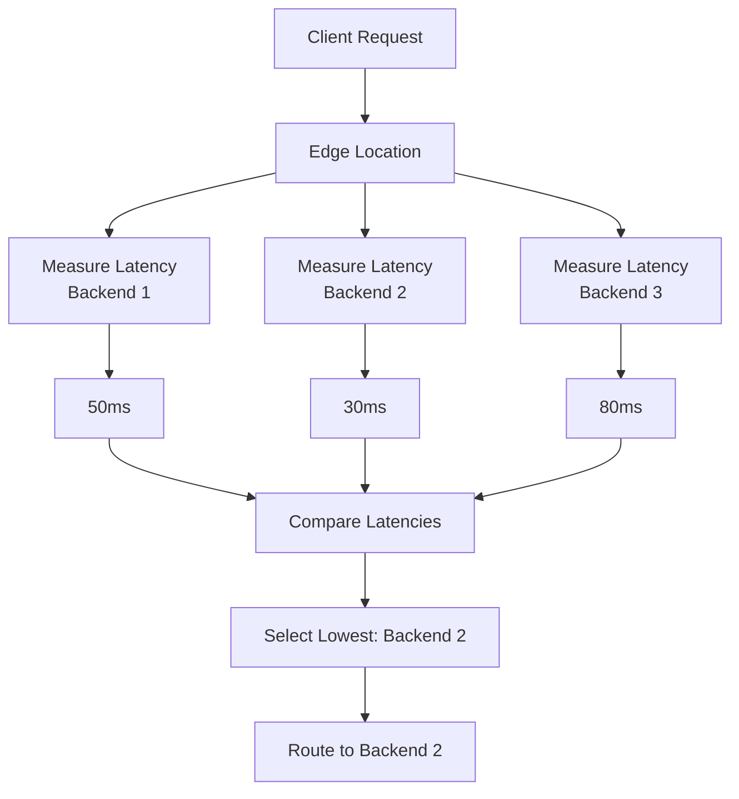

**Use Cases:**
- Global applications with multiple regions
- Performance-critical applications
- Real-time applications requiring low latency

### Priority-Based Routing

Priority-based routing routes traffic to the highest priority healthy backend, providing automatic failover.

**Priority-Based Routing Flow:**
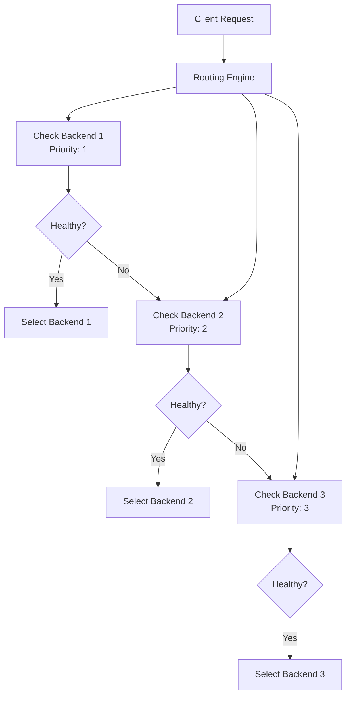

**Use Cases:**
- Disaster recovery scenarios
- Primary/backup backend configurations
- Failover requirements

### Weighted Routing

Weighted routing distributes traffic across backends based on configured weights, allowing proportional distribution.

**Weighted Routing Example:**
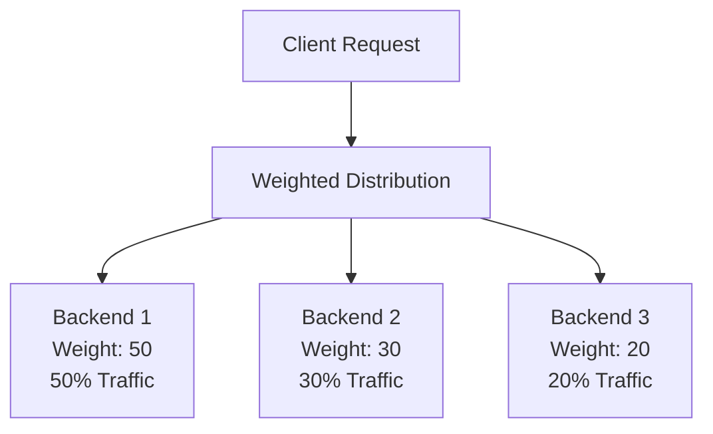

**Use Cases:**
- Gradual traffic migration
- A/B testing
- Canary deployments
- Capacity-based distribution

## Edge Caching

Azure Front Door provides edge caching capabilities to improve performance and reduce backend load by caching content at edge locations.

**Edge Caching Architecture:**
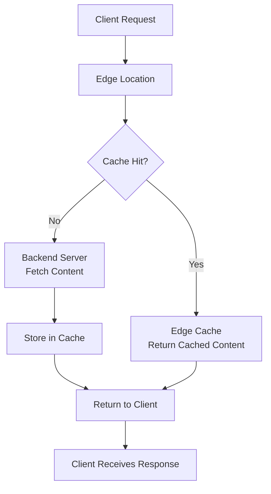

**Caching Configuration:**
- **Cacheable Content**: Static assets, images, CSS, JavaScript
- **Cache Duration**: Time-to-live (TTL) configuration
- **Cache Rules**: Rules engine for cache behavior
- **Cache Purging**: Manual cache invalidation

**Caching Benefits:**
- **Reduced Latency**: Content served from edge locations
- **Lower Backend Load**: Reduced requests to origin servers
- **Cost Savings**: Reduced bandwidth and compute costs
- **Better Performance**: Faster content delivery

## Web Application Firewall (WAF)

Azure Front Door Premium includes advanced Web Application Firewall capabilities to protect applications from common web vulnerabilities.

**WAF Protection:**
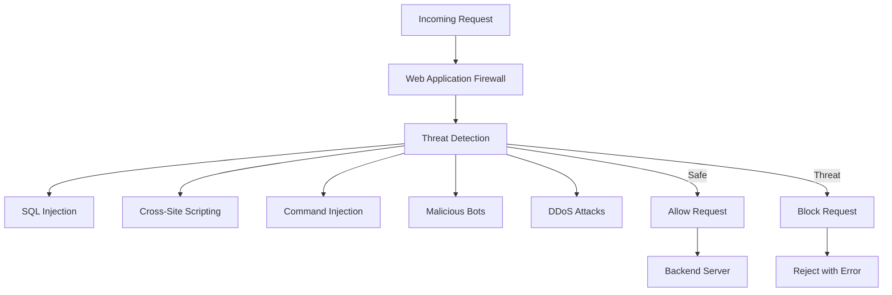

**WAF Features (Premium Tier):**
- **OWASP Core Rule Set**: Protection against OWASP Top 10 vulnerabilities
- **Custom Rules**: Define custom firewall rules
- **BOT Protection**: Advanced bot detection and mitigation
- **Rate Limiting**: Protection against rate-based attacks
- **Geo-filtering**: Block or allow traffic by geographic location

## Response Codes and Redirection

Azure Front Door supports HTTP response codes and redirection capabilities for traffic management.

### Response Codes

Azure Front Door response codes help clients understand the purpose of redirects and responses.

**Common Response Codes:**
- **200 OK**: Successful request
- **301 Moved Permanently**: Permanent redirect
- **302 Found**: Temporary redirect
- **307 Temporary Redirect**: Temporary redirect preserving method
- **308 Permanent Redirect**: Permanent redirect preserving method

**Response Code Configuration:**
- **Redirect Type**: Permanent or temporary
- **Protocol**: HTTP or HTTPS for redirect target
- **Status Code**: Specific HTTP status code to return

### HTTP to HTTPS Redirection

The most common use case of the redirect feature is to set HTTP to HTTPS redirection, ensuring all traffic uses secure connections.

**HTTP to HTTPS Redirection Flow:**
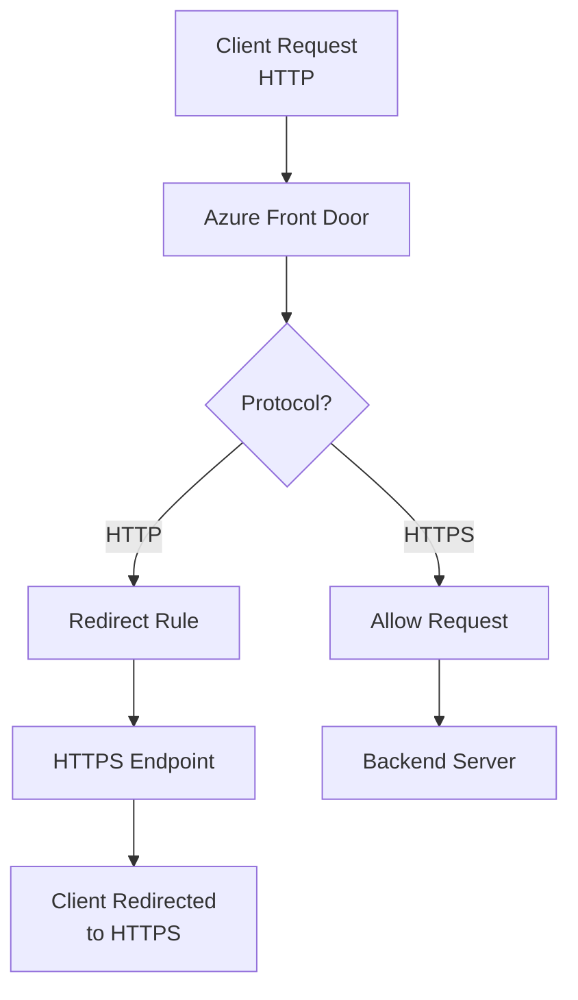

**Redirection Benefits:**
- **Security**: Forces secure connections
- **Compliance**: Meets security requirements
- **SEO**: Search engines prefer HTTPS
- **User Trust**: Secure connection indicators

## Azure Front Door Usage Cases

Azure Front Door is ideal for various scenarios requiring global content delivery, load balancing, and security.

### Global Application Delivery

Front Door provides a single entry point for globally distributed applications, routing users to the nearest healthy backend.

**Global Application Architecture:**
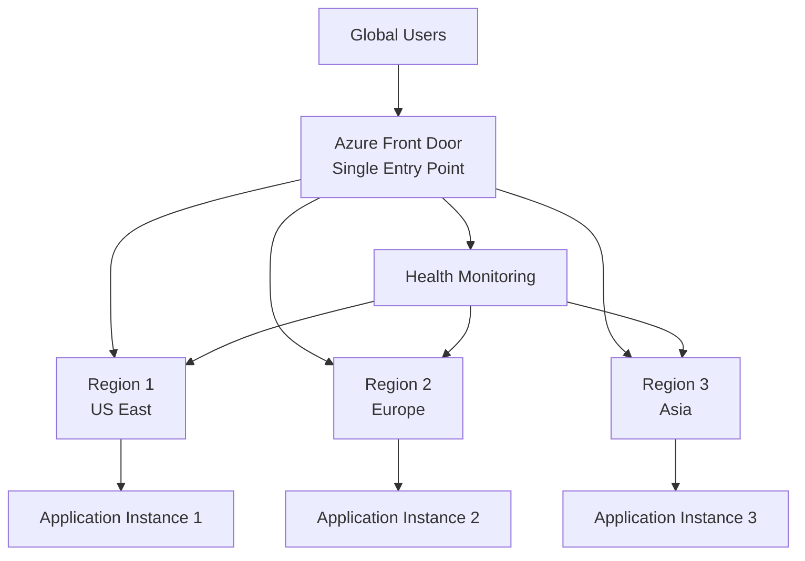

**Benefits:**
- **Low Latency**: Users connect to nearest backend
- **High Availability**: Automatic failover between regions
- **Global Scale**: Single configuration for worldwide deployment
- **Performance**: Optimized routing based on latency and health

### Content Delivery Network (CDN)

Front Door acts as a CDN, caching static and dynamic content at edge locations worldwide.

**CDN Architecture:**
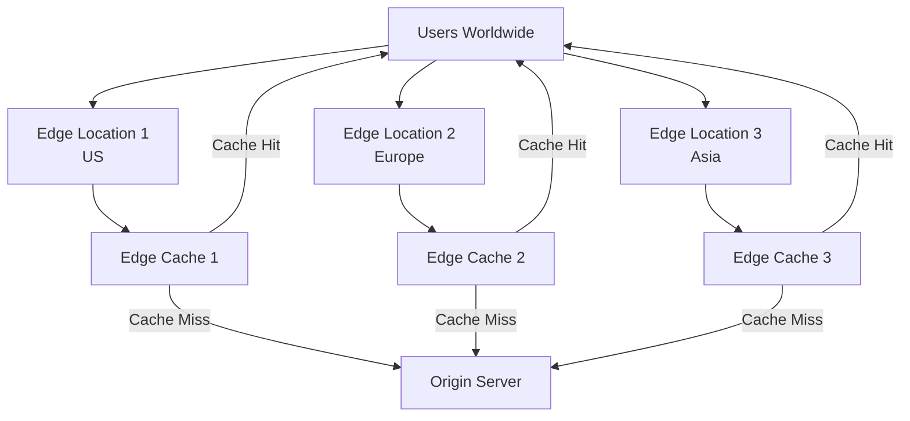

**CDN Benefits:**
- **Fast Delivery**: Content served from edge locations
- **Reduced Latency**: Lower latency for end users
- **Bandwidth Savings**: Reduced origin server load
- **Scalability**: Handles traffic spikes automatically

### Multi-Region High Availability

Front Door provides high availability by distributing traffic across multiple regions with automatic failover.

**High Availability Architecture:**
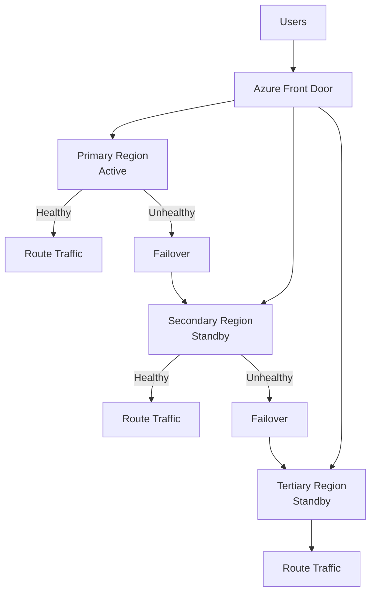

**High Availability Features:**
- **Automatic Failover**: Seamless failover between regions
- **Health Monitoring**: Continuous backend health checks
- **Zero Downtime**: Users experience no interruption
- **Multi-Region**: Distribute across multiple Azure regions

## Edge Locations and POPs

Azure Front Door leverages Microsoft's global edge network with hundreds of Points of Presence (POPs) distributed worldwide.

**Edge Network Architecture:**
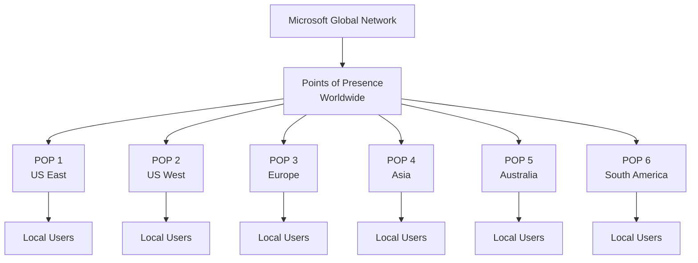

**Edge Location Benefits:**
- **Proximity**: Located close to end users
- **Low Latency**: Reduced round-trip time
- **High Performance**: Optimized network paths
- **Global Coverage**: Worldwide distribution

**Edge Location Characteristics:**
- **Geographic Distribution**: POPs in major cities worldwide
- **Network Optimization**: Optimized routes to backends
- **Caching**: Content cached at edge locations
- **DDoS Protection**: Built-in DDoS protection at edge

## Security Features

Azure Front Door provides comprehensive security features to protect applications and data.

### Web Application Firewall (WAF)

Front Door Premium includes advanced WAF capabilities to protect against web vulnerabilities.

**WAF Protection:**
- **OWASP Top 10**: Protection against common vulnerabilities
- **Custom Rules**: Define application-specific rules
- **Rate Limiting**: Protection against rate-based attacks
- **Geo-filtering**: Block or allow by geographic location
- **IP Filtering**: Allow or block specific IP addresses

### DDoS Protection

Built-in DDoS protection at the edge network level.

**DDoS Protection:**
- **Automatic Mitigation**: Automatic attack detection and mitigation
- **Edge-Level Protection**: Protection at edge locations
- **Always-On**: Continuous protection without configuration
- **Scalability**: Handles large-scale attacks

### SSL/TLS Termination

Front Door handles SSL/TLS termination at the edge, reducing backend load.

**SSL/TLS Features:**
- **Certificate Management**: Simplified certificate management
- **Automatic Renewal**: Automatic certificate renewal
- **Multiple Certificates**: Support for multiple domains
- **TLS Versions**: Support for modern TLS versions

## Performance Optimization

Azure Front Door optimizes performance through various mechanisms.

### Content Acceleration

**Static Content Acceleration:**
- Edge caching for static assets
- Reduced latency for cached content
- Bandwidth savings

**Dynamic Content Acceleration:**
- Optimized routing to backends
- Connection optimization
- Protocol optimization (HTTP/2, HTTP/3)

### Compression

Front Door can compress responses to reduce bandwidth usage.

**Compression Benefits:**
- **Reduced Bandwidth**: Smaller response sizes
- **Faster Delivery**: Less data to transfer
- **Cost Savings**: Reduced data transfer costs

## Monitoring and Analytics

Azure Front Door provides comprehensive monitoring and analytics capabilities.

### Traffic Analytics

**Analytics Features:**
- **Request Metrics**: Request count, latency, errors
- **Geographic Distribution**: Traffic by location
- **Backend Performance**: Backend health and performance
- **Cache Performance**: Cache hit/miss ratios

### Health Monitoring

**Health Monitoring:**
- **Backend Health**: Real-time backend health status
- **Probe Results**: Health probe success/failure rates
- **Alerting**: Configurable alerts for health issues

## Check Your Knowledge

### Question 1: Primary Function of Azure Front Door

**What is the primary function of Azure Front Door?**

- ✅ **Correct**: Azure Front Door is primarily used as a load balancer and web traffic manager with global CDN capabilities.

**Why:**
- Azure Front Door provides global load balancing across multiple regions
- Acts as a Content Delivery Network (CDN) for content acceleration
- Manages web traffic routing based on performance and health
- Provides a single entry point for globally distributed applications
- Optimizes traffic delivery using Microsoft's global edge network

**Key Functions:**
- **Global Load Balancing**: Distributes traffic across multiple backends
- **Content Delivery**: CDN capabilities for static and dynamic content
- **Traffic Management**: Intelligent routing based on latency and health
- **Security**: WAF and DDoS protection
- **Performance**: Edge caching and content acceleration

### Question 2: Azure Front Door Routing Type

**Which type of routing does Azure Front Door provide?**

- ✅ **Correct**: Application, layer 7.

**Why:**
- Azure Front Door operates at OSI Layer 7 (Application Layer)
- Routes traffic based on HTTP/HTTPS protocol, hostname, and path
- Provides content-aware routing, not just IP-based routing
- Supports advanced routing features like path-based and hostname-based routing
- Enables intelligent routing decisions based on application-level information

**Layer 7 Characteristics:**
- **Content-Aware**: Makes routing decisions based on URL content
- **Protocol Support**: HTTP, HTTPS, HTTP/2, HTTP/3
- **Intelligent Routing**: Different paths can route to different backends
- **Application Features**: SSL termination, header rewriting, URL rewriting

### Question 3: What is a Frontend Endpoint?

**What is a frontend endpoint in Azure Front Door?**

- ✅ **Correct**: A frontend endpoint is the entry point for client requests, defining the hostname and domain configuration.

**Why:**
- Frontend endpoints are the public-facing entry points for Front Door
- Define the hostname (custom domain or Front Door default)
- Handle SSL/TLS certificate management
- Configure domain validation and CNAME records
- Act as the first point of contact for client requests

**Frontend Endpoint Functions:**
- **Request Reception**: Receives all incoming client requests
- **Domain Configuration**: Manages custom domain and DNS settings
- **SSL/TLS**: Handles certificate management for HTTPS
- **Routing**: Passes requests to routing rules for processing

### Question 4: Routing Algorithm

**How does Azure Front Door routing algorithm work?**

- ✅ **Correct**: The routing algorithm matches requests based on HTTP protocol first, then frontend host, then the path.

**Why:**
- Routing follows a specific matching order: Protocol → Host → Path
- More specific matches take precedence over general matches
- First matching rule is applied to the request
- Enables precise routing control based on request characteristics

**Routing Algorithm Steps:**
1. **HTTP Protocol Matching**: Matches HTTP or HTTPS protocol
2. **Frontend Host Matching**: Matches hostname (e.g., `www.example.com`, `*.example.com`)
3. **Path Matching**: Matches URL path (e.g., `/`, `/users/`, `/file.gif`)
4. **Rule Application**: First matching rule is applied

**Example:**
```
Request: https://www.example.com/api/users
→ Protocol: HTTPS ✓
→ Host: www.example.com ✓
→ Path: /api/users ✓
→ Matches routing rule
```

### Question 5: Health Probes

**What is the purpose of health probes in Azure Front Door?**

- ✅ **Correct**: Health probes periodically send synthetic HTTP/HTTPS requests to configured backends to determine the "best" backend resources for routing client requests.

**Why:**
- Health probes continuously monitor backend availability
- Determine which backends are healthy and available
- Enable intelligent routing to healthy backends only
- Provide automatic failover when backends become unhealthy
- Optimize routing based on backend health status

**Health Probe Functions:**
- **Availability Check**: Verifies backend server availability
- **Performance Measurement**: Measures response times
- **Health Status**: Determines healthy vs unhealthy backends
- **Routing Optimization**: Routes only to healthy backends
- **Automatic Failover**: Removes unhealthy backends from routing

## Key Features Summary

**Azure Front Door provides:**
- **Global CDN**: Content delivery using Microsoft's global edge network
- **Global Load Balancing**: Distributes traffic across multiple regions
- **Layer 7 Routing**: Content-aware routing based on URL
- **Edge Caching**: Caching at edge locations for performance
- **Security**: WAF, DDoS protection, SSL/TLS termination
- **Performance**: Content acceleration and optimization
- **Scalability**: Automatic scaling to handle traffic spikes
- **High Availability**: Multi-region failover capabilities

**Comparison: Azure Front Door vs Application Gateway**

| Feature | Azure Front Door | Application Gateway |
|---------|-----------------|---------------------|
| **Scope** | Global | Regional |
| **CDN Capabilities** | Yes | No |
| **Edge Locations** | Hundreds of POPs | Regional only |
| **WAF** | Premium tier | WAF tier |
| **Private Link** | Premium tier | No |
| **BOT Protection** | Premium tier | No |
| **Use Case** | Global applications | Regional applications |

**Additional Resources:**
- [Azure Front Door Quickstart](https://learn.microsoft.com/en-us/azure/frontdoor/quickstart-create-front-door)
- [Front Door Tutorials](https://learn.microsoft.com/en-us/azure/frontdoor/front-door-rules-engine)
- [Front Door Best Practices](https://learn.microsoft.com/en-us/azure/frontdoor/front-door-best-practices)
- [Front Door FAQ](https://learn.microsoft.com/en-us/azure/frontdoor/front-door-faq)

