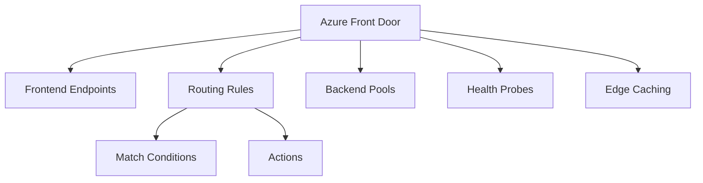

# Terraform Implementation Guides for Azure Front Door

This directory contains comprehensive guides for implementing Azure Front Door services using Terraform.

## Documentation Structure

1. **[01-front-door-profile.md](./01-front-door-profile.md)**
   - Creating Front Door profiles
   - SKU selection (Standard vs Premium)
   - Basic configuration

2. **[02-frontend-endpoints.md](./02-frontend-endpoints.md)**
   - Frontend endpoint configuration
   - Custom domain setup
   - SSL/TLS certificate management

3. **[03-backend-pools.md](./03-backend-pools.md)**
   - Backend pool configuration
   - Azure and on-premises backends
   - Health probe configuration

4. **[04-routing-rules.md](./04-routing-rules.md)**
   - Routing rule configuration
   - Match conditions
   - Forward and redirect actions
   - Path-based routing

5. **[05-edge-caching.md](./05-edge-caching.md)**
   - Edge caching configuration
   - Cache rules
   - Cache purging

6. **[06-web-application-firewall.md](./06-web-application-firewall.md)**
   - WAF configuration (Premium tier)
   - Custom rules
   - BOT protection

7. **[07-front-door-module.md](./07-front-door-module.md)**
   - Using the Front Door module
   - Module configuration examples
   - Best practices

## Quick Start

### Basic Front Door Profile

```hcl
# Resource Group
resource "azurerm_resource_group" "fd" {
  name     = "rg-front-door"
  location = "global"
}

# Front Door
resource "azurerm_frontdoor" "main" {
  name                = "fd-global-app"
  location            = "global"
  resource_group_name = azurerm_resource_group.fd.name
  friendly_name       = "Global Application Front Door"
  load_balancer_enabled = true

  # Backend Pool
  backend_pool {
    name                = "web-backend"
    health_probe_name   = "http-probe"
    load_balancing_name = "lb-settings"

    backend {
      host_header = "www.example.com"
      address     = "10.0.1.10"
      http_port   = 80
      https_port  = 443
      priority    = 1
      weight      = 50
      enabled     = true
    }
  }

  # Health Probe
  backend_pool_health_probe {
    name                = "http-probe"
    protocol            = "Http"
    path                = "/health"
    interval_in_seconds = 30
    enabled             = true
  }

  # Load Balancing Settings
  backend_pool_load_balancing {
    name                            = "lb-settings"
    sample_size                     = 4
    successful_samples_required     = 2
    additional_latency_milliseconds = 0
  }

  # Frontend Endpoint
  frontend_endpoint {
    name      = "www-endpoint"
    host_name = "www.example.com"
  }

  # Routing Rule
  routing_rule {
    name               = "http-rule"
    frontend_endpoints = ["www-endpoint"]
    accepted_protocols = ["Http", "Https"]
    patterns_to_match  = ["/*"]

    forwarding_configuration {
      forwarding_protocol = "MatchRequest"
      backend_pool_name   = "web-backend"
      cache_enabled       = false
    }
  }
}
```

### Front Door with Custom Domain

```hcl
resource "azurerm_frontdoor" "custom_domain" {
  name                = "fd-custom-app"
  location            = "global"
  resource_group_name = azurerm_resource_group.fd.name
  friendly_name       = "Custom Domain Front Door"

  # Frontend Endpoint with Custom Domain
  frontend_endpoint {
    name      = "custom-endpoint"
    host_name = "www.example.com"
  }

  # SSL Certificate (managed by Front Door)
  frontend_endpoint {
    name                                    = "custom-endpoint"
    host_name                               = "www.example.com"
    custom_https_provisioning_enabled       = true
    custom_https_configuration {
      certificate_source = "FrontDoor"
    }
  }

  # ... other configuration ...
}
```

## Module Usage

```hcl
module "front_door" {
  source = "../../modules/front-door"

  resource_group_name = azurerm_resource_group.main.name
  location            = "global"
  front_door_name     = "fd-global-app"
  friendly_name       = "Global Application Front Door"

  backend_pools = [
    {
      name                = "web-backend"
      health_probe_name   = "http-probe"
      load_balancing_name = "lb-settings"
      backends = [
        {
          host_header = "www.example.com"
          address     = "10.0.1.10"
          http_port   = 80
          https_port  = 443
          priority    = 1
          weight      = 50
          enabled     = true
        }
      ]
    }
  ]

  backend_pool_health_probes = [
    {
      name                = "http-probe"
      protocol            = "Http"
      path                = "/health"
      interval_in_seconds = 30
      enabled             = true
    }
  ]

  frontend_endpoints = [
    {
      name      = "www-endpoint"
      host_name = "www.example.com"
    }
  ]

  routing_rules = [
    {
      name               = "http-rule"
      frontend_endpoints  = ["www-endpoint"]
      accepted_protocols  = ["Http", "Https"]
      patterns_to_match   = ["/*"]
      route_configuration = {
        forwarding_protocol = "MatchRequest"
        backend_pool_name   = "web-backend"
        cache_enabled       = false
      }
    }
  ]

  tags = {
    ManagedBy = "Terraform"
  }
}
```

## Architecture Overview



## Best Practices

1. **Use Premium Tier**: For production applications requiring advanced security
2. **HTTPS**: Enable HTTPS for all frontend endpoints
3. **Health Probes**: Configure appropriate health probe intervals and paths
4. **Edge Caching**: Enable caching for static content
5. **WAF**: Enable WAF for Premium tier applications
6. **Custom Domains**: Use custom domains with proper SSL certificates
7. **Routing Rules**: Use specific match conditions for better control

## Additional Resources

- [Azure Front Door Documentation](https://learn.microsoft.com/en-us/azure/frontdoor/)
- [Terraform Azure Provider - Front Door](https://registry.terraform.io/providers/hashicorp/azurerm/latest/docs/resources/frontdoor)

