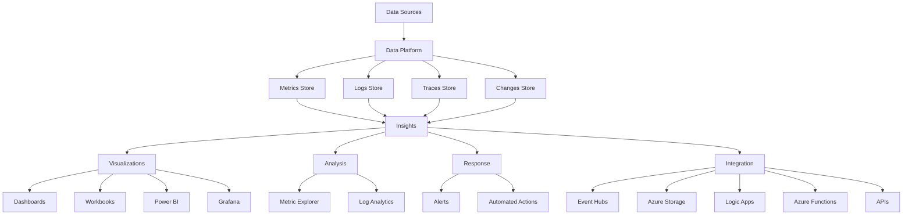
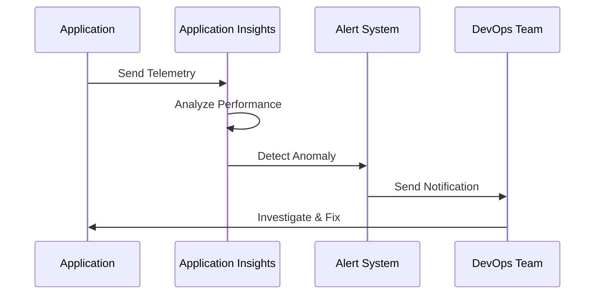
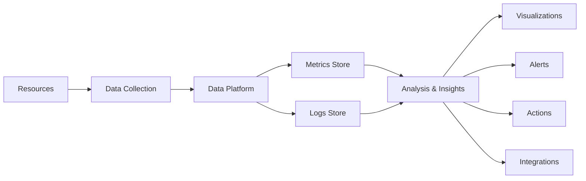

# Monitor your networks using Azure Monitor

## Overview

Azure Monitor is a comprehensive monitoring solution for collecting, analyzing, and responding to monitoring data from your cloud and on-premises environments. You can use Azure Monitor to maximize the availability and performance of your applications and services. Azure Monitor helps you understand how your applications are performing and allows you to manually and programmatically respond to system events.

**Key Characteristics:**
- **Unified Monitoring**: Single platform for all monitoring needs
- **Multi-Environment**: Supports Azure, on-premises, and hybrid environments
- **Comprehensive Data Collection**: Metrics, logs, traces, and changes
- **Intelligent Insights**: Pre-built insights for applications, containers, networks, and VMs
- **Automated Response**: Smart alerts and automated actions
- **Rich Visualizations**: Dashboards, workbooks, and integrations

**Learn more:**
- [Azure Monitor Overview](https://learn.microsoft.com/en-us/azure/azure-monitor/overview)
- [Azure Monitor Documentation](https://learn.microsoft.com/en-us/azure/azure-monitor/)

## What is Azure Monitor?

Azure Monitor is Microsoft's comprehensive monitoring solution that provides full-stack observability across your entire environment. It collects telemetry from multiple sources and provides tools to analyze and respond to that data.

**Azure Monitor Architecture:**


## Azure Monitor Components

Azure Monitor consists of several key components that work together to provide comprehensive monitoring:

### 1. Data Sources

Data sources are the types of resources being monitored. They include:

**Application/Workloads:**
- Application Insights data
- Custom application metrics
- Application logs
- Performance counters

**Infrastructure:**
- Virtual machines
- Virtual machine scale sets
- Containers
- Network resources

**Azure Platform:**
- Azure service metrics
- Azure activity logs
- Azure resource logs
- Azure service health

**Custom Sources:**
- Custom metrics API
- Custom logs API
- REST API integrations

### 2. Data Platform

The data platform stores the collected data. Azure Monitor's core data platform has stores for:

**Metrics:**
- Numerical values that describe an aspect of a system at a particular point in time
- Lightweight and capable of supporting near real-time scenarios
- Stored for 93 days by default
- Examples: CPU percentage, request count, error rate

**Logs:**
- Recorded system events
- Stored in Log Analytics workspaces
- Can be queried using KQL (Kusto Query Language)
- Examples: Application logs, security events, performance logs

**Traces:**
- Distributed tracing data
- Application performance monitoring
- Dependency tracking
- Request flow visualization

**Changes:**
- Configuration changes
- Resource lifecycle events
- Compliance tracking
- Change history

### 3. Insights

Insights are large, scalable, curated visualizations that provide specialized monitoring experiences:

**Application Insights:**
- Application performance monitoring (APM)
- Application dependency mapping
- Real-time application metrics
- Smart detection of anomalies

**Container Insights:**
- Kubernetes cluster monitoring
- Container performance metrics
- Pod and node health
- Resource utilization

**Network Insights:**
- Network topology visualization
- Network performance metrics
- Connection monitoring
- Traffic analysis

**VM Insights:**
- Virtual machine performance
- Process-level monitoring
- Dependency mapping
- Health status

### 4. Visualizations

Visualizations are effective tools for summarizing monitoring data and presenting it to different audiences:

**Dashboards:**
- Customizable visualizations
- Real-time data display
- Shared across teams
- Multiple data source integration

**Workbooks:**
- Interactive reports
- Rich visualizations
- Parameterized queries
- Template-based creation

**Power BI:**
- Business intelligence integration
- Advanced analytics
- Custom reports
- Data export capabilities

**Grafana:**
- Open platform for operational dashboards
- Rich visualization options
- Plugin ecosystem
- Community templates

### 5. Analysis

Analysis tools help you explore and understand your monitoring data:

**Metric Explorer:**
- Visualize metrics over time
- Compare multiple metrics
- Create custom charts
- Export visualizations

**Log Analytics:**
- Query logs using KQL
- Create custom queries
- Save queries for reuse
- Schedule query execution

### 6. Response

Respond proactively addresses critical events before they become issues:

**Alerts:**
- Metric alerts
- Log alerts
- Activity log alerts
- Smart detection alerts

**Automated Actions:**
- Runbooks (Azure Automation)
- Logic Apps workflows
- Azure Functions
- Webhooks

### 7. Integration

Integration allows other systems or custom solutions to use your monitoring data:

**Event Hubs:**
- Stream data to external systems
- Real-time data processing
- Integration with third-party tools

**Azure Storage:**
- Long-term data retention
- Compliance requirements
- Custom analytics

**Logic Apps:**
- Workflow automation
- Integration with external services
- Custom business logic

**Azure Functions:**
- Serverless processing
- Custom data transformation
- Event-driven actions

**APIs:**
- REST API access
- Programmatic data retrieval
- Custom integrations

## Azure Monitor Use Cases

Here are some common usage cases for Azure Monitor:

### 1. Application Performance Monitoring

**Use Application Insights to detect and diagnose issues across applications:**
- Track application performance metrics
- Monitor request rates and response times
- Identify slow dependencies
- Detect exceptions and errors
- Analyze user behavior

**Example Scenario:**


### 2. Infrastructure Monitoring

**Correlate infrastructure issues with VM insights and Container insights:**
- Monitor VM performance and health
- Track container resource usage
- Identify resource bottlenecks
- Correlate infrastructure and application issues

### 3. Log Analysis and Troubleshooting

**Use Log Analytics to explore troubleshooting and diagnostics your monitoring data:**
- Query logs from multiple sources
- Correlate events across systems
- Create custom dashboards
- Export data for analysis

**Example KQL Query:**
```kql
// Find all failed login attempts in the last hour
SigninLogs
| where TimeGenerated > ago(1h)
| where ResultType != "0"
| project TimeGenerated, UserPrincipalName, IPAddress, ResultType
| order by TimeGenerated desc
```

### 4. Smart Alerts and Automated Actions

**Support operations at scale with smart alerts and automated actions:**
- Create alert rules based on metrics or logs
- Configure automated remediation
- Integrate with ticketing systems
- Scale resources automatically

**Alert Types:**
- **Metric Alerts**: Triggered when a metric crosses a threshold
- **Log Alerts**: Triggered based on log query results
- **Activity Log Alerts**: Triggered by Azure resource events
- **Smart Detection**: Automatically detects anomalies

### 5. Visualizations

**Create visualizations with Azure dashboards and workbooks:**
- Build custom dashboards for different audiences
- Create interactive workbooks
- Share insights across teams
- Export to Power BI or Grafana

### 6. Metrics Collection

**Collect data from monitored resources using Azure Monitor Metrics:**
- Platform metrics from Azure services
- Custom metrics from applications
- Guest OS metrics from VMs
- Application metrics from Application Insights

## Azure Monitor Data Flow

**How Azure Monitor Collects and Processes Data:**


## Key Features

### Metrics

**What are Metrics?**
- Numerical values that describe an aspect of a system at a particular point in time
- Collected at regular intervals
- Stored as time-series data
- Lightweight and efficient

**Metric Types:**
- **Platform Metrics**: Automatically collected from Azure resources
- **Custom Metrics**: Sent from your applications using the Metrics API
- **Guest OS Metrics**: Collected from VMs using agents

**Metric Characteristics:**
- Low latency (near real-time)
- High frequency collection
- 93-day retention by default
- Aggregated automatically

### Logs

**What are Logs?**
- Recorded system events with detailed information
- Stored in Log Analytics workspaces
- Queryable using KQL
- Flexible retention policies

**Log Types:**
- **Activity Logs**: Azure resource operations
- **Resource Logs**: Diagnostic logs from Azure resources
- **Application Logs**: Custom application logging
- **Security Logs**: Security-related events

**Log Characteristics:**
- Rich query capabilities
- Flexible retention (up to 2 years)
- Integration with multiple sources
- Export capabilities

### Alerts

**Alert Types:**

1. **Metric Alerts:**
   - Monitor metric values
   - Threshold-based
   - Near real-time evaluation
   - Multiple conditions supported

2. **Log Alerts:**
   - Based on log query results
   - Scheduled evaluation
   - Complex conditions
   - Cost-effective for large volumes

3. **Activity Log Alerts:**
   - Monitor Azure resource operations
   - Track configuration changes
   - Compliance monitoring
   - Security event detection

4. **Smart Detection:**
   - Automatic anomaly detection
   - Machine learning-based
   - Proactive notifications
   - No configuration required

### Insights

**Pre-built Insights:**

1. **Application Insights:**
   - Application performance monitoring
   - Dependency tracking
   - User analytics
   - Availability testing

2. **Container Insights:**
   - Kubernetes monitoring
   - Container performance
   - Resource utilization
   - Health status

3. **VM Insights:**
   - VM performance monitoring
   - Process-level insights
   - Dependency mapping
   - Health status

4. **Network Insights:**
   - Network topology
   - Performance metrics
   - Connection monitoring
   - Traffic analysis

## Azure Monitor for Networking

Azure Monitor provides specific capabilities for monitoring network resources:

### Network Metrics

**Available Network Metrics:**
- **Virtual Network**: Bytes in/out, packet count
- **Load Balancer**: Data path availability, health probe status
- **Application Gateway**: Throughput, latency, request count
- **VPN Gateway**: Tunnel bandwidth, packet count
- **ExpressRoute**: Circuit bandwidth, availability

### Network Logs

**Network Log Types:**
- **NSG Flow Logs**: IP traffic flow information
- **Application Gateway Logs**: Access and performance logs
- **Load Balancer Logs**: Health probe and flow logs
- **VPN Gateway Logs**: Connection and tunnel logs

### Network Insights

**Network Monitoring Features:**
- Topology visualization
- Performance monitoring
- Connection monitoring
- Traffic analysis
- Dependency mapping

## Best Practices

### 1. Data Collection Strategy

- **Enable diagnostic settings** for all critical resources
- **Use appropriate log levels** to balance detail and cost
- **Configure retention policies** based on compliance requirements
- **Collect metrics and logs** for comprehensive monitoring

### 2. Alert Configuration

- **Set appropriate thresholds** to avoid alert fatigue
- **Use action groups** for consistent notification handling
- **Implement alert rules hierarchy** (critical, warning, informational)
- **Test alert rules** before production deployment

### 3. Cost Optimization

- **Review log data ingestion** regularly
- **Use log query optimization** to reduce query costs
- **Configure appropriate retention periods**
- **Archive old data** to cheaper storage tiers

### 4. Security and Compliance

- **Enable audit logging** for security events
- **Configure log retention** to meet compliance requirements
- **Use role-based access control** for monitoring data
- **Encrypt sensitive data** in logs

### 5. Integration

- **Integrate with ITSM tools** for incident management
- **Use webhooks** for custom integrations
- **Export data** to external systems when needed
- **Leverage APIs** for programmatic access

## Check Your Knowledge

### Question 1: Primary Function of Azure Monitor

**What is the primary function of Azure Monitor?**

- ✅ **Correct**: Azure Monitor is a comprehensive monitoring solution for collecting, analyzing, and responding to monitoring data from cloud and on-premises environments.

**Why:**
- Azure Monitor provides unified monitoring across Azure, on-premises, and hybrid environments
- It collects metrics, logs, traces, and change data from multiple sources
- Provides tools for analysis, visualization, alerting, and automated response
- Helps maximize availability and performance of applications and services

**Key Functions:**
- **Data Collection**: Metrics, logs, traces, and changes
- **Analysis**: Query and analyze monitoring data
- **Visualization**: Dashboards, workbooks, and reports
- **Alerting**: Smart alerts and automated actions
- **Integration**: Connect with external systems

### Question 2: Azure Monitor Data Types

**What are the two fundamental types of data stores in Azure Monitor?**

- ✅ **Correct**: Metrics and Logs

**Why:**
- Metrics are numerical values describing system aspects at a point in time
- Logs are recorded system events with detailed information
- These are the core data types that Azure Monitor uses for all monitoring scenarios
- Both are essential for comprehensive monitoring and troubleshooting

**Metrics Characteristics:**
- Numerical time-series data
- Low latency and high frequency
- 93-day retention by default
- Efficient for real-time monitoring

**Logs Characteristics:**
- Rich event data with details
- Queryable using KQL
- Flexible retention (up to 2 years)
- Ideal for troubleshooting and analysis

### Question 3: Azure Monitor Insights

**What are Insights in Azure Monitor?**

- ✅ **Correct**: Large, scalable, curated visualizations that provide specialized monitoring experiences

**Why:**
- Insights provide pre-built monitoring experiences for specific scenarios
- They combine metrics, logs, and visualizations in a unified view
- Available for applications, containers, networks, and virtual machines
- Reduce the need for custom dashboard creation

**Available Insights:**
- **Application Insights**: Application performance monitoring
- **Container Insights**: Kubernetes and container monitoring
- **VM Insights**: Virtual machine performance monitoring
- **Network Insights**: Network topology and performance

### Question 4: Azure Monitor Alerts

**What types of alerts does Azure Monitor support?**

- ✅ **Correct**: Metric alerts, Log alerts, Activity log alerts, and Smart detection alerts

**Why:**
- Different alert types serve different monitoring scenarios
- Metric alerts are for real-time threshold monitoring
- Log alerts are for complex log-based conditions
- Activity log alerts monitor Azure resource operations
- Smart detection provides automatic anomaly detection

**Alert Use Cases:**
- **Metric Alerts**: CPU usage, memory consumption, request rates
- **Log Alerts**: Error patterns, security events, custom conditions
- **Activity Log Alerts**: Resource creation, deletion, configuration changes
- **Smart Detection**: Automatic anomaly detection without configuration

## Key Features Summary

**Azure Monitor provides:**
- **Unified Monitoring**: Single platform for all monitoring needs
- **Multi-Environment Support**: Azure, on-premises, and hybrid
- **Comprehensive Data Collection**: Metrics, logs, traces, and changes
- **Intelligent Insights**: Pre-built experiences for common scenarios
- **Rich Visualizations**: Dashboards, workbooks, and integrations
- **Smart Alerting**: Automated detection and response
- **Extensive Integration**: APIs, webhooks, and external systems

**Additional Resources:**
- [Azure Monitor Quickstart](https://learn.microsoft.com/en-us/azure/azure-monitor/overview)
- [Azure Monitor Tutorials](https://learn.microsoft.com/en-us/azure/azure-monitor/essentials/monitor-azure-resource)
- [Azure Monitor Best Practices](https://learn.microsoft.com/en-us/azure/azure-monitor/best-practices)

