# Azure Virtual NAT (NAT Gateway)

## Overview

Globally, IPv4 address ranges are scarce and can be an expensive way to grant access to Internet resources. Azure Network Address Translation (NAT) allows internal resources in a private network to share routable IPv4 addresses. Instead of purchasing an IPv4 address for each resource that requires Internet access, you can use a NAT service to assign outbound requests from internal resources to an external IP address.

**Key Benefits:**
- **Cost Effective**: Share public IP addresses across multiple resources
- **Simplified Management**: No need to assign public IPs to each resource
- **High Performance**: Up to 50 Gbps throughput
- **Automatic Scaling**: Scales automatically to support dynamic workloads
- **Fully Managed**: No VMs or infrastructure to manage

**Learn more:**
- [Azure NAT Gateway Overview](https://learn.microsoft.com/en-us/azure/virtual-network/nat-gateway/nat-overview)
- [NAT Gateway Documentation](https://learn.microsoft.com/en-us/azure/virtual-network/nat-gateway/)
- [NAT Gateway Best Practices](https://learn.microsoft.com/en-us/azure/virtual-network/nat-gateway/nat-gateway-resource)

**NAT Gateway Architecture:**
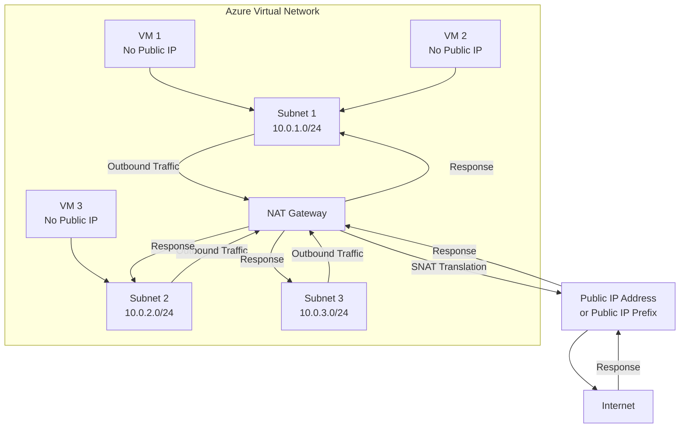

## How NAT Gateway Works

### Traffic Flow

The following diagram shows the outbound traffic flow from Subnet 1 to the NAT Gateway assigned to a public IP address or public IP prefix.

**Outbound Traffic Flow:**
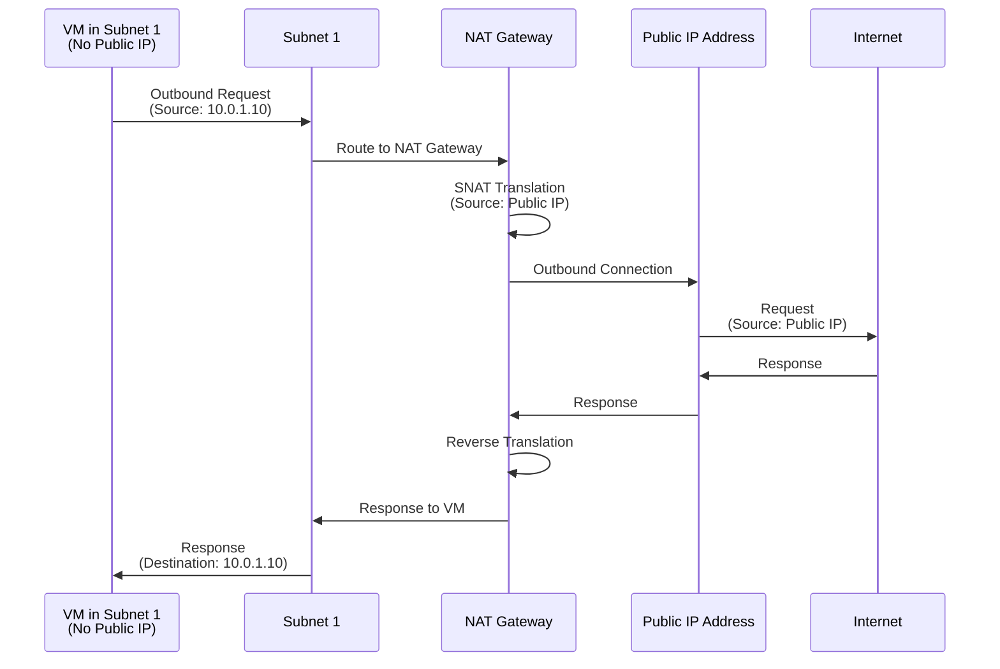

### Automatic Configuration

Once NAT Gateway is configured, all outbound UDP and TCP flows from any virtual machine instance use NAT for Internet connectivity. **No additional configuration is needed, and you don't need to create a user-defined route.**

**Key Points:**
- NAT has priority over other outbound scenarios
- NAT replaces the default Internet destination of a subnet
- All outbound traffic automatically uses NAT Gateway
- No route tables or user-defined routes required

**Traffic Priority:**
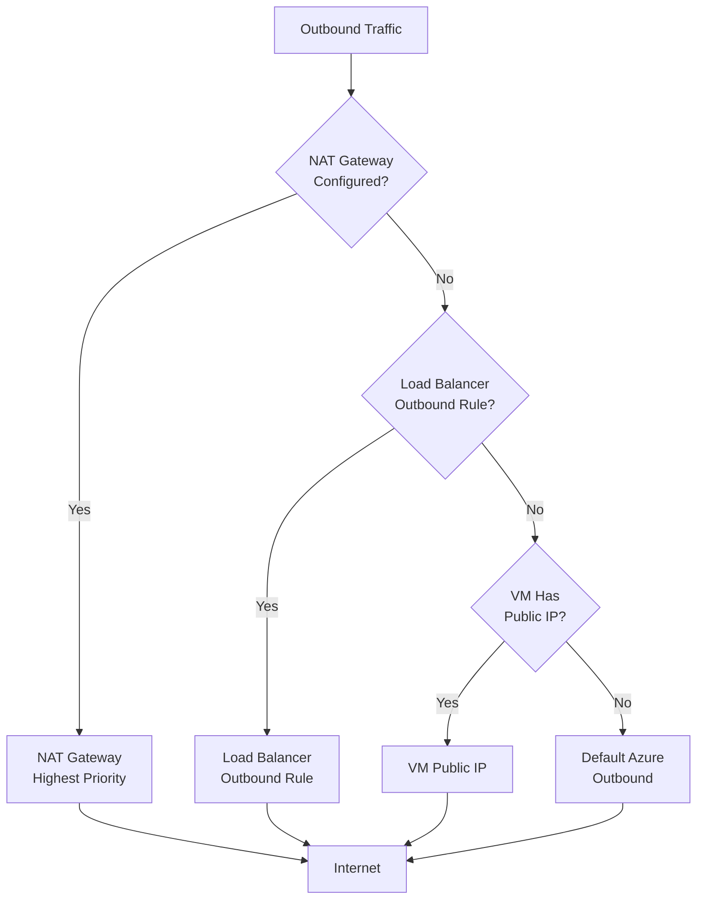

## NAT Gateway Features

### Automatic Scaling

NAT Gateway scales automatically to support dynamic workloads. It can handle:
- **Up to 16 public IP addresses** or public IP prefixes
- **Up to 64,000 concurrent flows** per public IP address
- **Up to 50 Gbps throughput** per NAT Gateway
- **Automatic scaling** based on traffic demand

**Scaling Architecture:**
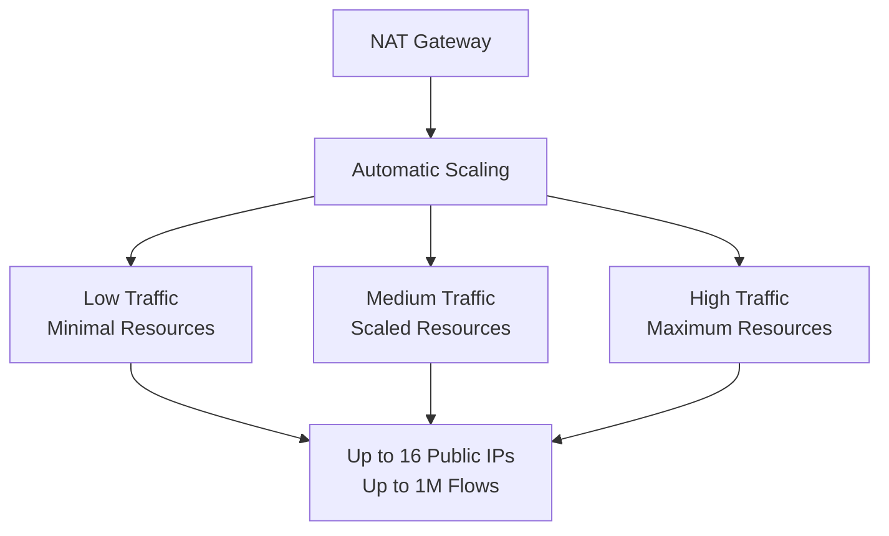

### Port Address Translation (PAT)

Through Port Network Address Translation (PNAT or PAT), NAT provides up to 64,000 simultaneous flows for UDP and TCP per public IP address.

**PAT Process:**
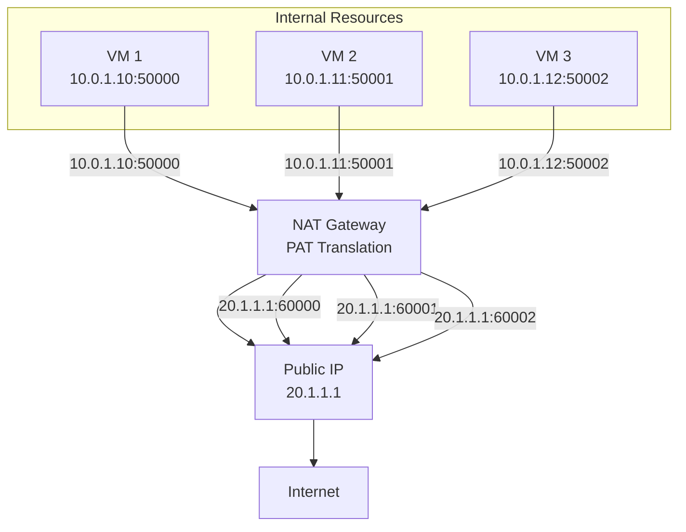

**PAT Benefits:**
- Multiple internal IPs share one public IP
- Each connection gets unique source port
- Up to 64,000 concurrent flows per public IP
- Efficient use of public IP addresses

### Supported Resources

NAT Gateway is compatible with the following Standard SKU resources:

**Supported Resources:**
- **Load Balancer**: Standard SKU load balancers
- **Public IP Address**: Standard SKU public IP addresses
- **Public IP Prefix**: Standard SKU public IP prefixes

**Resource Compatibility:**
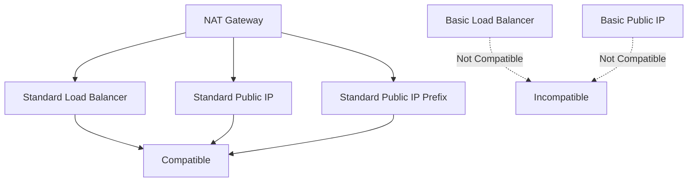

## NAT Gateway Limitations

### IPv4 Only

**Only IPv4 address family is supported.** NAT Gateway does not interact with the IPv6 address family.

**IPv4 vs IPv6:**
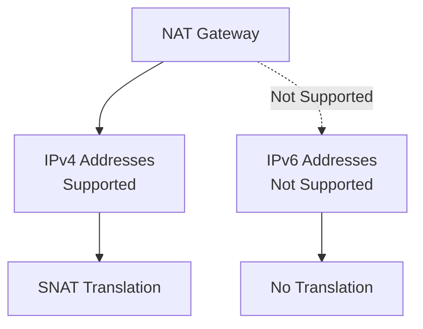

### Single Virtual Network

**NAT Gateway cannot span multiple virtual networks.** Each NAT Gateway is associated with a single virtual network.

**VNet Scope:**
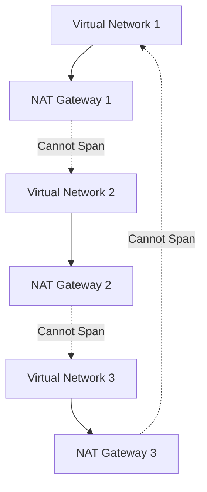

**Note:** If you need NAT for multiple VNets, you must create a separate NAT Gateway for each VNet.

### IP Fragmentation Not Supported

**IP fragmentation is not supported.** NAT Gateway does not support fragmented IP packets.

**Fragmentation Limitation:**
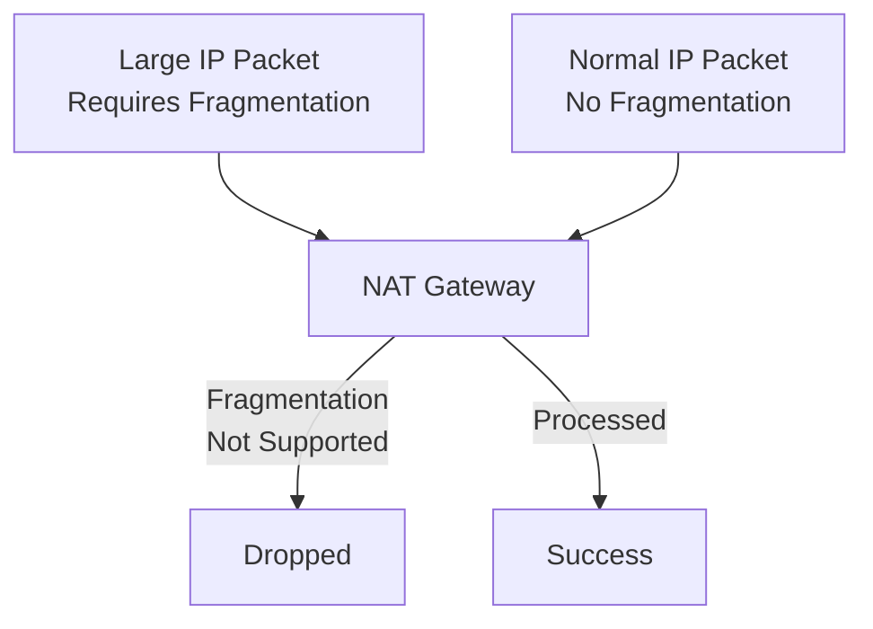

**Workarounds:**
- Ensure packets don't exceed MTU size
- Use Path MTU Discovery (PMTUD)
- Configure appropriate MTU sizes

## NAT Gateway Configuration

### Public IP Addresses

NAT Gateway can use up to 16 public IP addresses or public IP prefixes.

**Single Public IP:**
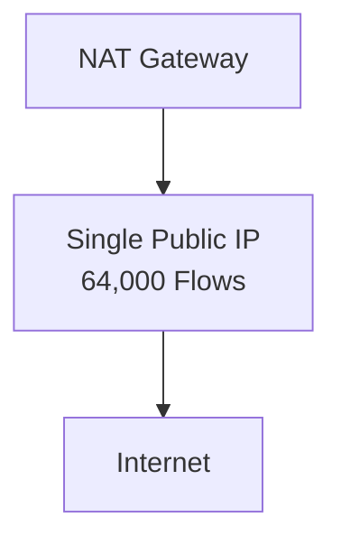

**Multiple Public IPs:**
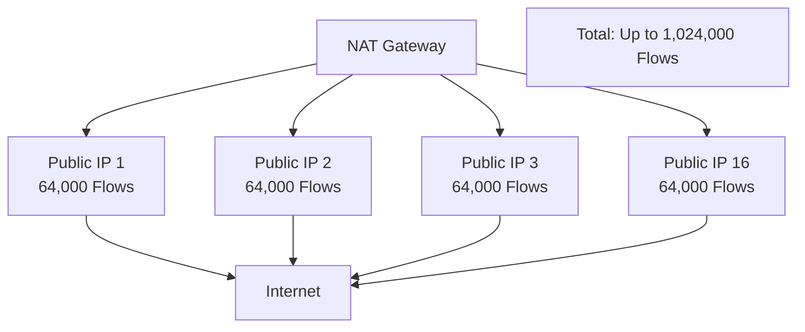

### Public IP Prefix

Public IP Prefix provides a contiguous range of public IP addresses, useful for predictable outbound IP addresses.

**Public IP Prefix Benefits:**
- Contiguous IP address range
- Predictable outbound IPs
- Easier firewall rule management
- Better for IP allowlisting

**Prefix Architecture:**
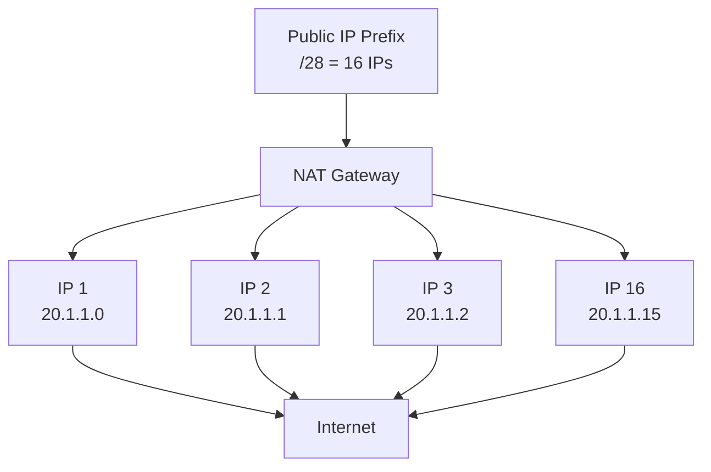

## Use Cases

### 1. Cost Optimization

Share public IP addresses across multiple resources instead of assigning individual public IPs.

**Cost Savings:**
- One public IP for multiple VMs
- Reduced public IP costs
- Simplified IP management

### 2. Security

Keep VMs private (no public IPs) while allowing outbound Internet access.

**Security Benefits:**
- VMs not directly accessible from Internet
- Outbound-only connectivity
- Reduced attack surface

### 3. High-Volume Outbound Traffic

Handle high volumes of outbound traffic with automatic scaling.

**Performance:**
- Up to 50 Gbps throughput
- Up to 1M concurrent flows (with 16 IPs)
- Automatic scaling

### 4. SNAT Port Exhaustion Prevention

Avoid SNAT port exhaustion issues common with Load Balancer outbound rules.

**Comparison:**
- Load Balancer: Limited SNAT ports per backend
- NAT Gateway: 64,000 flows per public IP
- Better for high-connection scenarios

## Best Practices

### 1. Public IP Planning

- Use Public IP Prefix for predictable IPs
- Plan for capacity (up to 16 IPs)
- Monitor flow counts

### 2. Subnet Association

- Associate NAT Gateway with subnets that need outbound access
- One NAT Gateway can serve multiple subnets
- NAT Gateway replaces default Internet routing

### 3. Idle Timeout

- Default: 4 minutes
- Range: 4-120 minutes
- Longer timeout = fewer connection resets
- Shorter timeout = faster resource cleanup

### 4. High Availability

- Use zone-redundant configuration
- Deploy NAT Gateway in multiple zones
- Use multiple public IPs for redundancy

### 5. Monitoring

- Monitor flow counts
- Monitor throughput
- Set up alerts for capacity limits

## Troubleshooting

### Outbound Connectivity Issues

**Check:**
- NAT Gateway is associated with subnet
- Public IP is Standard SKU
- No conflicting outbound rules
- NSG rules allow outbound traffic

### Flow Exhaustion

**Symptoms:**
- Connections fail
- Timeout errors

**Solutions:**
- Add more public IP addresses
- Increase idle timeout
- Review connection patterns

### IP Fragmentation

**Symptoms:**
- Large packets dropped
- Connection failures

**Solutions:**
- Ensure MTU size is appropriate
- Use Path MTU Discovery
- Configure proper MTU sizes

## Summary

Azure Virtual NAT (NAT Gateway) provides:
- **Cost-Effective**: Share public IPs across resources
- **Automatic Configuration**: No manual routes needed
- **High Performance**: Up to 50 Gbps, 64,000 flows per IP
- **Automatic Scaling**: Scales with workload
- **Fully Managed**: No infrastructure to manage

**Key Takeaways:**
- NAT Gateway replaces default Internet routing for subnets
- Supports up to 16 public IPs or prefixes
- Provides up to 64,000 concurrent flows per public IP
- Only supports IPv4 (not IPv6)
- Cannot span multiple virtual networks
- IP fragmentation is not supported

**Additional Resources:**
- [NAT Gateway Quickstart](https://learn.microsoft.com/en-us/azure/virtual-network/nat-gateway/quickstart-create-nat-gateway-portal)
- [NAT Gateway FAQ](https://learn.microsoft.com/en-us/azure/virtual-network/nat-gateway/nat-faq)
- [NAT Gateway Pricing](https://azure.microsoft.com/pricing/details/nat/)

